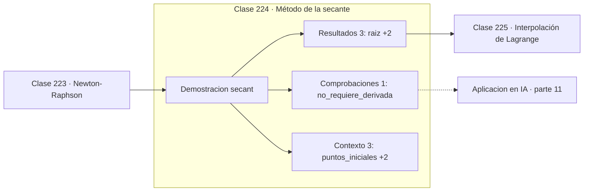

# 224 — Método de la secante

> [⬅️ 223 Newton-Raphson](../223-newton-raphson/README.md) · [📚 Parte 11](../README.md) · [🏠 Programa](../../../README.md) · [225 Interpolación de Lagrange ➡️](../225-interpolacion-de-lagrange/README.md)

**Parte:** 11 — Métodos numéricos y computación científica · **Nivel:** `cientifico` · **Horas estimadas:** 4
**Motor:** `engines.part11` · **Demostración:** `secant` · **Clase 4 de 20** de la parte

---

## 🎯 Propósito

**La secante alcanza orden 1,618 sin necesitar la derivada.**

Raíces, interpolación, splines, diferenciación y cuadratura numérica, sistemas lineales iterativos, mínimos cuadrados y ecuaciones diferenciales.

## ✅ Resultados de aprendizaje

Al terminar podrás:

1. Explicar **Método de la secante** con lenguaje cotidiano y con notación matemática.
2. Resolver un caso pequeño a mano y anticipar el orden de magnitud del resultado.
3. Ejecutar y modificar `lab.py`, que corre la demostración `secant`.
4. Interpretar las 7 salidas del laboratorio y decir qué comprueba cada una.
5. Detectar el error típico de esta parte: usar tolerancia absoluta cuando la escala del problema es grande.

## 🧩 Fórmulas de la clase

```text
xₙ₊₁ = xₙ − f(xₙ)·(xₙ − xₙ₋₁) / (f(xₙ) − f(xₙ₋₁))
orden de convergencia φ = (1+√5)/2 ≈ 1,618
una sola evaluación de f por iteración
```

## 🗺️ Ubicación en el programa



## 📖 Fundamentos

La secante sustituye la derivada de Newton por su aproximación mediante los dos últimos
iterados. Geométricamente, en vez de la tangente usa la recta que pasa por los dos últimos
puntos, y toma su corte con el eje. La fórmula es la de Newton con `f'` reemplazado por un
cociente de diferencias.

El precio es un orden de convergencia menor, exactamente el **número áureo** `φ ≈ 1,618`.
Que aparezca φ no es casualidad decorativa: la recurrencia que gobierna los exponentes del
error es la de Fibonacci, y su razón límite es φ. Es uno de los sitios donde ese número
surge por necesidad matemática y no por misticismo.

A cambio, cada iteración cuesta **una sola evaluación** de `f`, frente a las dos de Newton
—función y derivada—. Cuando evaluar la derivada cuesta lo mismo que evaluar la función,
la secante es más eficiente por unidad de trabajo: `φ² ≈ 2,6 > 2`. Y cuando la derivada no
existe en forma cerrada, es directamente la única opción de las dos.

Sus debilidades son parientes de las de Newton: puede diverger desde puntos malos, y falla
si los dos últimos valores de la función son casi iguales, porque el denominador se anula.
La familia de los métodos **cuasi-Newton** —BFGS y L-BFGS en optimización— es esta misma
idea llevada a varias dimensiones: aproximar la información de segundo orden a partir de
la historia de evaluaciones.

## 🧮 Ejemplo trabajado

Misma raíz que Newton, ahora sin derivada.

```text
f(x) = x³ − 2x − 4       puntos iniciales: 1,0 y 3,0

iter        x            error
  1     1,454545      5,45e-01
  3     1,876254      1,24e-01
  5     1,996327      3,67e-03
  7     1,999999      6,32e-07
  9     2,000000      0,00e+00

9 iteraciones frente a las 6 de Newton
pero sin necesitar f' y con una evaluación por paso.

Eficiencia por evaluación:
  Newton:  orden 2 con 2 evaluaciones  →  √2 ≈ 1,414
  Secante: orden 1,618 con 1 evaluación →  1,618        mejor
```

## 🔬 Qué ejecuta el laboratorio

`secant` — Secante: casi tan rápida como Newton sin necesitar la derivada.

| Grupo | Salidas |
|---|---|
| 🔢 Resultados numéricos (3) | `raiz`, `iteraciones`, `orden_de_convergencia` |
| ✅ Comprobaciones de invariante (1) | `no_requiere_derivada` |

Las claves booleanas no son adorno: si alguna fuera `False`, el resultado numérico
no sería fiable aunque el programa terminase sin error.

```bash
python classes/part-11-metodos-numericos-y-computacion-cientifica/224-metodo-de-la-secante/lab.py
compmath run 224
```

> [!TIP]
> Antes de ejecutar, **escribe tu predicción**. Un laboratorio que confirma lo que
> esperabas enseña tanto como uno que te contradice, pero solo si la predicción
> existía antes del resultado.

## ⚠️ Errores conceptuales frecuentes

1. Elegir dos puntos iniciales donde f toma valores casi idénticos.
2. Usarla sin control del denominador y provocar división por casi cero.
3. Suponer que hereda la garantía de convergencia de la bisección.

## 🚀 Dónde se usa de verdad

Búsqueda de raíces sin derivada analítica, métodos cuasi-Newton, calibración de parámetros
y ajuste de umbrales en funciones costosas de evaluar.

## 🤖 Conexión con IA

Los Neural ODE, los samplers de difusión y los optimizadores de segundo orden son métodos numéricos con parámetros aprendidos.

## 📓 Notebooks

| Archivo | Para qué |
|---|---|
| [`notebook.ipynb`](notebook.ipynb) | recorrido guiado con la demostración ejecutada |
| [`notebook_student.ipynb`](notebook_student.ipynb) | versión con `TODO` para resolver |
| [`notebook_solution.ipynb`](notebook_solution.ipynb) | solución de referencia verificada |

## 📝 Evaluación

| Criterio | Peso |
|---|---:|
| Comprensión conceptual | 25 % |
| Resolución manual | 25 % |
| Implementación y verificación | 25 % |
| Interpretación y comunicación | 15 % |
| Conexión con aplicación real | 10 % |

Detalle y criterios de error crítico en [`assessment.md`](assessment.md).

## ❓ Preguntas de comprobación

1. ¿Cuál es la entrada, cuál la salida y qué unidades tienen?
2. ¿Qué operación domina el comportamiento del resultado?
3. ¿Qué caso extremo revelaría un error conceptual?
4. ¿Cómo verificarías el resultado por un método independiente?
5. ¿Dónde aparece esto en simulación física?

Si necesitas releer el código para responderlas, la clase todavía no está superada.

## 📥 Entregable

`notebook_student.ipynb` resuelto más un párrafo que explique el resultado **sin citar
código**: qué entra, qué sale, qué invariante se comprueba y qué pasaría en un caso límite.

## 🔗 Referencias

- [Burden, R.; Faires, J. *Numerical Analysis*, 10ª ed., Cengage, 2015, cap. 2](https://www.cengage.com/)
- [Press, W. et al. *Numerical Recipes*, 3ª ed., Cambridge, 2007, cap. 9](http://numerical.recipes/)

Bibliografía completa de la parte en [`../../../docs/BIBLIOGRAPHY.md`](../../../docs/BIBLIOGRAPHY.md).

## 📂 Material de la clase

[`intuition.md`](intuition.md) · [`theory.md`](theory.md) · [`derivation.md`](derivation.md) · [`exercises.md`](exercises.md) · [`assessment.md`](assessment.md) · [`where-is-this-used.md`](where-is-this-used.md) · [`lesson.yaml`](lesson.yaml)

---

> [⬅️ 223 Newton-Raphson](../223-newton-raphson/README.md) · [📚 Parte 11](../README.md) · [🏠 Programa](../../../README.md) · [225 Interpolación de Lagrange ➡️](../225-interpolacion-de-lagrange/README.md)
