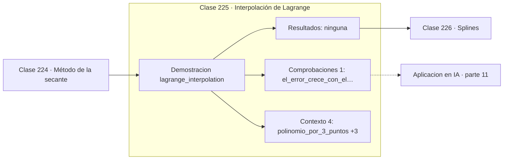

# 225 — Interpolación de Lagrange

> [⬅️ 224 Método de la secante](../224-metodo-de-la-secante/README.md) · [📚 Parte 11](../README.md) · [🏠 Programa](../../../README.md) · [226 Splines ➡️](../226-splines/README.md)

**Parte:** 11 — Métodos numéricos y computación científica · **Nivel:** `cientifico` · **Horas estimadas:** 4
**Motor:** `engines.part11` · **Demostración:** `lagrange_interpolation` · **Clase 5 de 20** de la parte

---

## 🎯 Propósito

**Subir el grado del polinomio interpolador empeora la aproximación en vez de mejorarla.**

Raíces, interpolación, splines, diferenciación y cuadratura numérica, sistemas lineales iterativos, mínimos cuadrados y ecuaciones diferenciales.

## ✅ Resultados de aprendizaje

Al terminar podrás:

1. Explicar **Interpolación de Lagrange** con lenguaje cotidiano y con notación matemática.
2. Resolver un caso pequeño a mano y anticipar el orden de magnitud del resultado.
3. Ejecutar y modificar `lab.py`, que corre la demostración `lagrange_interpolation`.
4. Interpretar las 5 salidas del laboratorio y decir qué comprueba cada una.
5. Detectar el error típico de esta parte: iterar sin límite máximo y colgar el proceso.

## 🧩 Fórmulas de la clase

```text
P(x) = Σ yᵢ · Πⱼ≠ᵢ (x − xⱼ)/(xᵢ − xⱼ)
n puntos determinan un único polinomio de grado ≤ n−1
nodos de Chebyshev: xₖ = cos((2k+1)π / 2n)
```

## 🗺️ Ubicación en el programa



## 📖 Fundamentos

Por `n` puntos con abscisas distintas pasa un **único** polinomio de grado a lo sumo `n−1`.
La forma de Lagrange lo construye explícitamente como combinación de bases que valen 1 en
su nodo y 0 en los demás. Es elegante para demostrar la existencia y unicidad, y mala para
calcular: las formas de Newton o baricéntrica son numéricamente preferibles.

El resultado que hay que retener es negativo y contraintuitivo. Al aumentar el número de
nodos **equiespaciados**, el polinomio no converge a la función: oscila cada vez más
violentamente cerca de los extremos del intervalo. Es el **fenómeno de Runge**, y su
ejemplo canónico es `1/(1+25x²)`, donde el error máximo crece con el grado.

La causa no es el redondeo sino la propia teoría: el término de error de interpolación
contiene el producto de las distancias a todos los nodos, y con nodos equiespaciados ese
producto se dispara cerca de los bordes. La consecuencia práctica es que **interpolación
de grado alto y nodos uniformes no se deben combinar nunca**.

Hay dos salidas. La primera es cambiar los nodos: los de **Chebyshev** se concentran cerca
de los extremos y controlan el producto, haciendo que el error sí decrezca con el grado. La
segunda, más usada en la práctica, es renunciar al grado alto y usar trozos de grado bajo,
que es exactamente lo que hacen los splines de la clase siguiente.

## 🧮 Ejemplo trabajado

Runge sobre 1/(1+25x²): el error crece con el grado.

```text
Interpolación por 3 puntos (1,1), (2,3), (4,7):
  el polinomio evaluado da [1,75 ; 4,75] en x = 1,5 y 3
  pasa exactamente por los nodos: 1, 3, 7                ✓

Función de Runge con nodos equiespaciados:

  grado    error máximo
    5        0,438177
    9        1,045174
   13        3,656710

El error se multiplica por 8 al pasar de grado 5 a 13.
Más grado, peor aproximación.

Con nodos de Chebyshev el error sí decrece con el grado.
```

## 🔬 Qué ejecuta el laboratorio

`lagrange_interpolation` — Interpolación de Lagrange y el fenómeno de Runge.

| Grupo | Salidas |
|---|---|
| 🔢 Resultados numéricos (0) | — |
| ✅ Comprobaciones de invariante (1) | `el_error_crece_con_el_grado` |

Las claves booleanas no son adorno: si alguna fuera `False`, el resultado numérico
no sería fiable aunque el programa terminase sin error.

```bash
python classes/part-11-metodos-numericos-y-computacion-cientifica/225-interpolacion-de-lagrange/lab.py
compmath run 225
```

> [!TIP]
> Antes de ejecutar, **escribe tu predicción**. Un laboratorio que confirma lo que
> esperabas enseña tanto como uno que te contradice, pero solo si la predicción
> existía antes del resultado.

## ⚠️ Errores conceptuales frecuentes

1. Interpolar muchos puntos con un solo polinomio de grado alto.
2. Usar la forma de Lagrange para evaluar en vez de la baricéntrica.
3. Extrapolar fuera del intervalo de los nodos.

## 🚀 Dónde se usa de verdad

Reconstrucción de curvas a partir de muestras, diseño de esquemas de cuadratura,
aproximación de funciones costosas y remuestreo de señales.

## 🤖 Conexión con IA

Los Neural ODE, los samplers de difusión y los optimizadores de segundo orden son métodos numéricos con parámetros aprendidos.

## 📓 Notebooks

| Archivo | Para qué |
|---|---|
| [`notebook.ipynb`](notebook.ipynb) | recorrido guiado con la demostración ejecutada |
| [`notebook_student.ipynb`](notebook_student.ipynb) | versión con `TODO` para resolver |
| [`notebook_solution.ipynb`](notebook_solution.ipynb) | solución de referencia verificada |

## 📝 Evaluación

| Criterio | Peso |
|---|---:|
| Comprensión conceptual | 25 % |
| Resolución manual | 25 % |
| Implementación y verificación | 25 % |
| Interpretación y comunicación | 15 % |
| Conexión con aplicación real | 10 % |

Detalle y criterios de error crítico en [`assessment.md`](assessment.md).

## ❓ Preguntas de comprobación

1. ¿Cuál es la entrada, cuál la salida y qué unidades tienen?
2. ¿Qué operación domina el comportamiento del resultado?
3. ¿Qué caso extremo revelaría un error conceptual?
4. ¿Cómo verificarías el resultado por un método independiente?
5. ¿Dónde aparece esto en simulación física?

Si necesitas releer el código para responderlas, la clase todavía no está superada.

## 📥 Entregable

`notebook_student.ipynb` resuelto más un párrafo que explique el resultado **sin citar
código**: qué entra, qué sale, qué invariante se comprueba y qué pasaría en un caso límite.

## 📚 Bibliografía de la clase

Esta clase enseña **Métodos numéricos · Computación científica · Ecuaciones diferenciales · Teoría de la aproximación · Álgebra lineal numérica**. Cada obra dice qué aporta aquí y cómo se comprobó su localizador:

- [Trefethen, L. N. *Approximation Theory and Approximation Practice*, SIAM, 2019](https://doi.org/10.1137/1.9781611975949) — Métodos numéricos y Teoría de la aproximación: el tema de esta clase · ISBN-13 `9781611975949` verificado en International ISBN Agency (2026-08-19).
- [Burden, R.; Faires, J. *Numerical Analysis*, 10ª ed., Cengage, 2015, cap. 3](https://openlibrary.org/isbn/9781305253667) — Métodos numéricos: el tema de esta clase · ISBN-13 `9781305253667` verificado en International ISBN Agency (2026-08-20).

Bibliografía de todas las clases, con el porqué de cada obra, en [`docs/BIBLIOGRAPHY.md`](../../../docs/BIBLIOGRAPHY.md) · localizador y estado de cada obra en [`sources/bibliography.json`](../../../sources/bibliography.json).

## 📂 Material de la clase

[`intuition.md`](intuition.md) · [`theory.md`](theory.md) · [`derivation.md`](derivation.md) · [`exercises.md`](exercises.md) · [`assessment.md`](assessment.md) · [`where-is-this-used.md`](where-is-this-used.md) · [`lesson.yaml`](lesson.yaml)

---

> [⬅️ 224 Método de la secante](../224-metodo-de-la-secante/README.md) · [📚 Parte 11](../README.md) · [🏠 Programa](../../../README.md) · [226 Splines ➡️](../226-splines/README.md)
