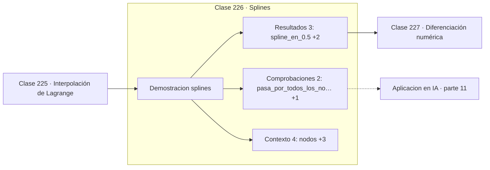

# 226 — Splines

> [⬅️ 225 Interpolación de Lagrange](../225-interpolacion-de-lagrange/README.md) · [📚 Parte 11](../README.md) · [🏠 Programa](../../../README.md) · [227 Diferenciación numérica ➡️](../227-diferenciacion-numerica/README.md)

**Parte:** 11 — Métodos numéricos y computación científica · **Nivel:** `cientifico` · **Horas estimadas:** 4
**Motor:** `engines.part11` · **Demostración:** `splines` · **Clase 6 de 20** de la parte

---

## 🎯 Propósito

**Muchos trozos de grado bajo baten a un único polinomio de grado alto.**

Raíces, interpolación, splines, diferenciación y cuadratura numérica, sistemas lineales iterativos, mínimos cuadrados y ecuaciones diferenciales.

## ✅ Resultados de aprendizaje

Al terminar podrás:

1. Explicar **Splines** con lenguaje cotidiano y con notación matemática.
2. Resolver un caso pequeño a mano y anticipar el orden de magnitud del resultado.
3. Ejecutar y modificar `lab.py`, que corre la demostración `splines`.
4. Interpretar las 9 salidas del laboratorio y decir qué comprueba cada una.
5. Detectar el error típico de esta parte: aplicar runge-kutta con paso fijo a un sistema rígido.

## 🧩 Fórmulas de la clase

```text
spline lineal: recta entre cada par de nodos consecutivos
spline cúbico: continuidad de valor, primera y segunda derivada
n nodos ⟹ n−1 tramos
```

## 🗺️ Ubicación en el programa



## 📖 Fundamentos

Un spline es una función definida a trozos, con un polinomio de grado bajo en cada
intervalo entre nodos consecutivos, empalmados con condiciones de continuidad. La idea
resuelve el problema de Runge por la vía directa: si el grado alto oscila, no se usa grado
alto.

El **spline lineal** simplemente une los puntos con segmentos. Es continuo, no oscila
nunca, y su error es `O(h²)` en cada tramo. Su defecto es visible: tiene esquinas en los
nodos, la derivada salta, y para animación o diseño gráfico eso se nota.

El **spline cúbico** usa polinomios de grado 3 e impone continuidad del valor, de la
primera derivada y de la segunda. El resultado es visualmente suave y matemáticamente
notable: entre todas las funciones que pasan por los puntos, el spline cúbico natural es
**la que minimiza la curvatura total**, que es la formalización de «la curva más suave
posible». El nombre viene de las varillas flexibles que usaban los constructores navales.

Los splines están en todas partes: en las curvas de las herramientas de diseño gráfico, en
la interpolación de datos científicos, en las trayectorias de robots y en los modelos
aditivos generalizados. Su ventaja decisiva es la **localidad**: mover un punto solo
afecta a los tramos vecinos, mientras que en un polinomio global un cambio en un extremo
altera toda la curva.

## 🧮 Ejemplo trabajado

Spline lineal sobre datos que oscilan entre 0 y 1.

```text
nodos:   0    1    2    3    4
valores: 0    1    0    1    0

Evaluaciones del spline lineal:
  s(0,50) = 0,50      dentro del tramo [0,1]
  s(1,50) = 0,50      dentro del tramo [1,2]
  s(2,25) = 0,25      dentro del tramo [2,3]

Pasa por todos los nodos                                 ✓
Nunca sale del rango [0,1] de los datos                  ✓

Un polinomio único de grado 4 por estos 5 puntos
llega a valores por debajo de −0,3 entre los nodos.

Localidad: cambiar el valor en x = 4 no altera
el spline en el tramo [0,1].
```

## 🔬 Qué ejecuta el laboratorio

`splines` — Spline lineal por tramos frente a un polinomio único.

| Grupo | Salidas |
|---|---|
| 🔢 Resultados numéricos (3) | `spline_en_0.5`, `spline_en_1.5`, `spline_en_2.25` |
| ✅ Comprobaciones de invariante (2) | `pasa_por_todos_los_nodos`, `acotado_entre_min_y_max` |

Las claves booleanas no son adorno: si alguna fuera `False`, el resultado numérico
no sería fiable aunque el programa terminase sin error.

```bash
python classes/part-11-metodos-numericos-y-computacion-cientifica/226-splines/lab.py
compmath run 226
```

> [!TIP]
> Antes de ejecutar, **escribe tu predicción**. Un laboratorio que confirma lo que
> esperabas enseña tanto como uno que te contradice, pero solo si la predicción
> existía antes del resultado.

## ⚠️ Errores conceptuales frecuentes

1. Esperar derivada continua de un spline lineal.
2. Usar splines para extrapolar más allá del último nodo.
3. Olvidar declarar las condiciones de contorno del spline cúbico.

## 🚀 Dónde se usa de verdad

Curvas en diseño gráfico y CAD, interpolación de series temporales, trayectorias suaves en
robótica y modelos aditivos generalizados.

## 🤖 Conexión con IA

Los Neural ODE, los samplers de difusión y los optimizadores de segundo orden son métodos numéricos con parámetros aprendidos.

## 📓 Notebooks

| Archivo | Para qué |
|---|---|
| [`notebook.ipynb`](notebook.ipynb) | recorrido guiado con la demostración ejecutada |
| [`notebook_student.ipynb`](notebook_student.ipynb) | versión con `TODO` para resolver |
| [`notebook_solution.ipynb`](notebook_solution.ipynb) | solución de referencia verificada |

## 📝 Evaluación

| Criterio | Peso |
|---|---:|
| Comprensión conceptual | 25 % |
| Resolución manual | 25 % |
| Implementación y verificación | 25 % |
| Interpretación y comunicación | 15 % |
| Conexión con aplicación real | 10 % |

Detalle y criterios de error crítico en [`assessment.md`](assessment.md).

## ❓ Preguntas de comprobación

1. ¿Cuál es la entrada, cuál la salida y qué unidades tienen?
2. ¿Qué operación domina el comportamiento del resultado?
3. ¿Qué caso extremo revelaría un error conceptual?
4. ¿Cómo verificarías el resultado por un método independiente?
5. ¿Dónde aparece esto en simulación física?

Si necesitas releer el código para responderlas, la clase todavía no está superada.

## 📥 Entregable

`notebook_student.ipynb` resuelto más un párrafo que explique el resultado **sin citar
código**: qué entra, qué sale, qué invariante se comprueba y qué pasaría en un caso límite.

## 🔗 Referencias

- [de Boor, C. *A Practical Guide to Splines*, ed. rev., Springer, 2001](https://doi.org/10.1007/978-1-4612-6333-3)
- [Burden, R.; Faires, J. *Numerical Analysis*, 10ª ed., Cengage, 2015, cap. 3](https://www.cengage.com/)

Bibliografía completa de la parte en [`../../../docs/BIBLIOGRAPHY.md`](../../../docs/BIBLIOGRAPHY.md).

## 📂 Material de la clase

[`intuition.md`](intuition.md) · [`theory.md`](theory.md) · [`derivation.md`](derivation.md) · [`exercises.md`](exercises.md) · [`assessment.md`](assessment.md) · [`where-is-this-used.md`](where-is-this-used.md) · [`lesson.yaml`](lesson.yaml)

---

> [⬅️ 225 Interpolación de Lagrange](../225-interpolacion-de-lagrange/README.md) · [📚 Parte 11](../README.md) · [🏠 Programa](../../../README.md) · [227 Diferenciación numérica ➡️](../227-diferenciacion-numerica/README.md)
