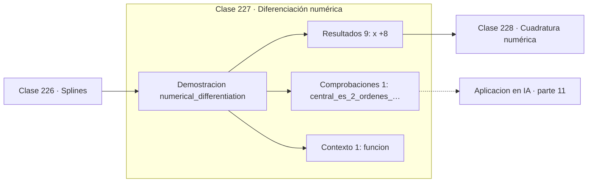

# 227 — Diferenciación numérica

> [⬅️ 226 Splines](../226-splines/README.md) · [📚 Parte 11](../README.md) · [🏠 Programa](../../../README.md) · [228 Cuadratura numérica ➡️](../228-cuadratura-numerica/README.md)

**Parte:** 11 — Métodos numéricos y computación científica · **Nivel:** `cientifico` · **Horas estimadas:** 4
**Motor:** `engines.part11` · **Demostración:** `numerical_differentiation` · **Clase 7 de 20** de la parte

---

## 🎯 Propósito

**La diferencia central cuesta lo mismo que la adelantada y tiene un orden más.**

Raíces, interpolación, splines, diferenciación y cuadratura numérica, sistemas lineales iterativos, mínimos cuadrados y ecuaciones diferenciales.

## ✅ Resultados de aprendizaje

Al terminar podrás:

1. Explicar **Diferenciación numérica** con lenguaje cotidiano y con notación matemática.
2. Resolver un caso pequeño a mano y anticipar el orden de magnitud del resultado.
3. Ejecutar y modificar `lab.py`, que corre la demostración `numerical_differentiation`.
4. Interpretar las 11 salidas del laboratorio y decir qué comprueba cada una.
5. Detectar el error típico de esta parte: usar tolerancia absoluta cuando la escala del problema es grande.

## 🧩 Fórmulas de la clase

```text
adelantada: (f(x+h) − f(x)) / h,  error O(h)
central: (f(x+h) − f(x−h)) / 2h,  error O(h²)
segunda derivada: (f(x+h) − 2f(x) + f(x−h)) / h²
```

## 🗺️ Ubicación en el programa



## 📖 Fundamentos

Aproximar derivadas por cocientes de diferencias es la traducción literal de la definición
de derivada a aritmética finita. Las tres fórmulas básicas se obtienen combinando
desarrollos de Taylor y eligiendo los coeficientes que cancelan los términos de orden bajo.

La **diferencia central** es estrictamente mejor que la adelantada: mismo número de
evaluaciones, un orden más de precisión. La razón es la simetría, que hace que el término
de orden `h` se cancele entre los desarrollos de `f(x+h)` y `f(x−h)`. Cuando se puede
evaluar a ambos lados, no hay motivo para usar la adelantada.

La **segunda derivada** por diferencias es la fórmula que discretiza el laplaciano y está
en el corazón de casi todo esquema para ecuaciones en derivadas parciales. Su error también
es `O(h²)`, pero su sensibilidad al redondeo es peor porque divide entre `h²`: el paso
óptimo es mayor que para la primera derivada.

La aplicación más útil en aprendizaje automático es la **verificación de gradientes**:
comparar el gradiente calculado por autodiferenciación con el obtenido por diferencia
central detecta errores de implementación en las derivadas manuales. Es lento y no sirve
para entrenar, pero como prueba unitaria es insustituible.

## 🧮 Ejemplo trabajado

Derivada de e^x en x = 0,5 con h = 1e-4.

```text
valor exacto: e^0,5 = 1,6487212707001282

adelantada: (f(x+h) − f(x))/h     = 1,6488037095
  error = 8,24e-05

atrás:      (f(x) − f(x−h))/h     = 1,6486388374
  error = 8,24e-05

central:    (f(x+h) − f(x−h))/2h  = 1,6487212735
  error = 2,75e-09          30 000 veces menor

Mismo coste en evaluaciones, tres órdenes de magnitud de ganancia.

Segunda derivada: (f(x+h) − 2f(x) + f(x−h))/h² = 1,64872132
  error = 5,4e-08, mayor por dividir entre h².
```

## 🔬 Qué ejecuta el laboratorio

`numerical_differentiation` — Fórmulas de diferencias y su orden de error.

| Grupo | Salidas |
|---|---|
| 🔢 Resultados numéricos (9) | `x`, `h`, `exacta`, `adelante`, `atras`, `central`, `error_adelante`, `error_central`, `segunda_derivada` |
| ✅ Comprobaciones de invariante (1) | `central_es_2_ordenes_mejor` |

Las claves booleanas no son adorno: si alguna fuera `False`, el resultado numérico
no sería fiable aunque el programa terminase sin error.

```bash
python classes/part-11-metodos-numericos-y-computacion-cientifica/227-diferenciacion-numerica/lab.py
compmath run 227
```

> [!TIP]
> Antes de ejecutar, **escribe tu predicción**. Un laboratorio que confirma lo que
> esperabas enseña tanto como uno que te contradice, pero solo si la predicción
> existía antes del resultado.

## ⚠️ Errores conceptuales frecuentes

1. Usar la diferencia adelantada cuando se puede evaluar a ambos lados.
2. Elegir h demasiado pequeño y caer en la zona dominada por el redondeo.
3. Usar diferencias finitas para entrenar en vez de autodiferenciación.

## 🚀 Dónde se usa de verdad

Verificación de gradientes, discretización de PDE, sensibilidad de modelos y optimización
sin derivadas analíticas.

## 🤖 Conexión con IA

Los Neural ODE, los samplers de difusión y los optimizadores de segundo orden son métodos numéricos con parámetros aprendidos.

## 📓 Notebooks

| Archivo | Para qué |
|---|---|
| [`notebook.ipynb`](notebook.ipynb) | recorrido guiado con la demostración ejecutada |
| [`notebook_student.ipynb`](notebook_student.ipynb) | versión con `TODO` para resolver |
| [`notebook_solution.ipynb`](notebook_solution.ipynb) | solución de referencia verificada |

## 📝 Evaluación

| Criterio | Peso |
|---|---:|
| Comprensión conceptual | 25 % |
| Resolución manual | 25 % |
| Implementación y verificación | 25 % |
| Interpretación y comunicación | 15 % |
| Conexión con aplicación real | 10 % |

Detalle y criterios de error crítico en [`assessment.md`](assessment.md).

## ❓ Preguntas de comprobación

1. ¿Cuál es la entrada, cuál la salida y qué unidades tienen?
2. ¿Qué operación domina el comportamiento del resultado?
3. ¿Qué caso extremo revelaría un error conceptual?
4. ¿Cómo verificarías el resultado por un método independiente?
5. ¿Dónde aparece esto en simulación física?

Si necesitas releer el código para responderlas, la clase todavía no está superada.

## 📥 Entregable

`notebook_student.ipynb` resuelto más un párrafo que explique el resultado **sin citar
código**: qué entra, qué sale, qué invariante se comprueba y qué pasaría en un caso límite.

## 🔗 Referencias

- [Heath, M. *Scientific Computing: An Introductory Survey*, 2ª ed., SIAM, 2018, cap. 8](https://doi.org/10.1137/1.9781611975581) — *uso:* desarrollo formal del tema en «Diferenciación numérica».
- [Nocedal, J.; Wright, S. *Numerical Optimization*, 2ª ed., Springer, 2006, cap. 8](https://doi.org/10.1007/978-0-387-40065-5) — *uso:* desarrollo formal del tema en «Diferenciación numérica».

Bibliografía completa de la parte en [`../../../docs/BIBLIOGRAPHY.md`](../../../docs/BIBLIOGRAPHY.md) · localizador verificable de cada obra en [`sources/bibliography.json`](../../../sources/bibliography.json).

## 📂 Material de la clase

[`intuition.md`](intuition.md) · [`theory.md`](theory.md) · [`derivation.md`](derivation.md) · [`exercises.md`](exercises.md) · [`assessment.md`](assessment.md) · [`where-is-this-used.md`](where-is-this-used.md) · [`lesson.yaml`](lesson.yaml)

---

> [⬅️ 226 Splines](../226-splines/README.md) · [📚 Parte 11](../README.md) · [🏠 Programa](../../../README.md) · [228 Cuadratura numérica ➡️](../228-cuadratura-numerica/README.md)
