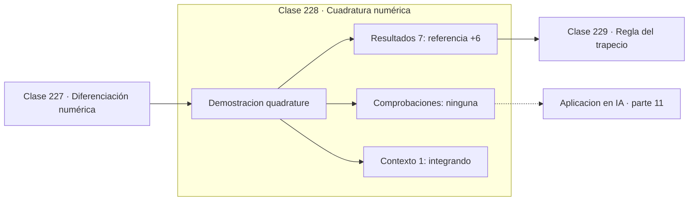

# 228 — Cuadratura numérica

> [⬅️ 227 Diferenciación numérica](../227-diferenciacion-numerica/README.md) · [📚 Parte 11](../README.md) · [🏠 Programa](../../../README.md) · [229 Regla del trapecio ➡️](../229-regla-del-trapecio/README.md)

**Parte:** 11 — Métodos numéricos y computación científica · **Nivel:** `cientifico` · **Horas estimadas:** 4
**Motor:** `engines.part11` · **Demostración:** `quadrature` · **Clase 8 de 20** de la parte

---

## 🎯 Propósito

**Elegir bien los nodos vale más que multiplicarlos: Gauss lo demuestra con tres.**

Raíces, interpolación, splines, diferenciación y cuadratura numérica, sistemas lineales iterativos, mínimos cuadrados y ecuaciones diferenciales.

## ✅ Resultados de aprendizaje

Al terminar podrás:

1. Explicar **Cuadratura numérica** con lenguaje cotidiano y con notación matemática.
2. Resolver un caso pequeño a mano y anticipar el orden de magnitud del resultado.
3. Ejecutar y modificar `lab.py`, que corre la demostración `quadrature`.
4. Interpretar las 8 salidas del laboratorio y decir qué comprueba cada una.
5. Detectar el error típico de esta parte: iterar sin límite máximo y colgar el proceso.

## 🧩 Fórmulas de la clase

```text
∫f ≈ Σ wᵢ·f(xᵢ)
Gauss con n nodos: exacta para polinomios de grado 2n−1
cambio de variable de [a,b] a [−1,1]
```

## 🗺️ Ubicación en el programa



## 📖 Fundamentos

Toda regla de cuadratura tiene la misma forma: una suma ponderada de valores de la
función. Lo que distingue a unas de otras es dónde se colocan los nodos y qué pesos se
les asigna. Las reglas de Newton-Cotes —trapecio, Simpson— fijan nodos equiespaciados y
calculan los pesos.

La **cuadratura gaussiana** hace algo más ambicioso: trata también las posiciones de los
nodos como incógnitas. Con `n` nodos hay `2n` grados de libertad, y se eligen para que la
regla sea exacta con polinomios de grado hasta `2n−1`. Con tres nodos se integra
exactamente cualquier polinomio de grado 5, lo cual es notable.

Los nodos resultantes son las raíces de los polinomios de Legendre y no son
equiespaciados: se concentran hacia el centro y evitan los extremos. Los pesos se calculan
una vez y se tabulan. El cambio de variable lleva cualquier intervalo `[a,b]` al `[−1,1]`
donde están tabulados.

La comparación con el trapecio es demoledora y explica por qué las bibliotecas serias usan
variantes de Gauss: con el mismo número de evaluaciones, el error es varios órdenes de
magnitud menor. Su límite es que necesita evaluar en puntos concretos, así que no sirve
cuando solo se dispone de datos tabulados en una malla fija.

## 🧮 Ejemplo trabajado

Integral de e^(−x²) entre 0 y 1, sin primitiva elemental.

```text
valor de referencia: 0,746824132812

Gauss con 3 nodos:
  estimación = 0,746814584191
  error      = 9,55e-06

Trapecio con 3 subintervalos (4 evaluaciones):
  estimación = 0,739986475277
  error      = 6,84e-03

Gauss es 716 veces más preciso con menos evaluaciones.

Para igualar a Gauss-3, el trapecio necesitaría
unos 27 subintervalos.
```

## 🔬 Qué ejecuta el laboratorio

`quadrature` — Cuadratura gaussiana: máxima exactitud con mínimos nodos.

| Grupo | Salidas |
|---|---|
| 🔢 Resultados numéricos (7) | `referencia`, `gauss_3_nodos`, `error_gauss`, `trapecio_3_subintervalos`, `error_trapecio`, `gauss_n_puntos_es_exacta_hasta_grado`, `evaluaciones_usadas` |
| ✅ Comprobaciones de invariante (0) | — |

Las claves booleanas no son adorno: si alguna fuera `False`, el resultado numérico
no sería fiable aunque el programa terminase sin error.

```bash
python classes/part-11-metodos-numericos-y-computacion-cientifica/228-cuadratura-numerica/lab.py
compmath run 228
```

> [!TIP]
> Antes de ejecutar, **escribe tu predicción**. Un laboratorio que confirma lo que
> esperabas enseña tanto como uno que te contradice, pero solo si la predicción
> existía antes del resultado.

## ⚠️ Errores conceptuales frecuentes

1. Aplicar los nodos tabulados sin el cambio de variable al intervalo real.
2. Usar cuadratura gaussiana con datos tabulados en una malla fija.
3. Aplicarla a integrandos con singularidades sin transformación previa.

## 🚀 Dónde se usa de verdad

Integración en métodos de elementos finitos, cálculo de esperanzas en modelos
probabilísticos, evaluación de funciones especiales y física computacional.

## 🤖 Conexión con IA

Los Neural ODE, los samplers de difusión y los optimizadores de segundo orden son métodos numéricos con parámetros aprendidos.

## 📓 Notebooks

| Archivo | Para qué |
|---|---|
| [`notebook.ipynb`](notebook.ipynb) | recorrido guiado con la demostración ejecutada |
| [`notebook_student.ipynb`](notebook_student.ipynb) | versión con `TODO` para resolver |
| [`notebook_solution.ipynb`](notebook_solution.ipynb) | solución de referencia verificada |

## 📝 Evaluación

| Criterio | Peso |
|---|---:|
| Comprensión conceptual | 25 % |
| Resolución manual | 25 % |
| Implementación y verificación | 25 % |
| Interpretación y comunicación | 15 % |
| Conexión con aplicación real | 10 % |

Detalle y criterios de error crítico en [`assessment.md`](assessment.md).

## ❓ Preguntas de comprobación

1. ¿Cuál es la entrada, cuál la salida y qué unidades tienen?
2. ¿Qué operación domina el comportamiento del resultado?
3. ¿Qué caso extremo revelaría un error conceptual?
4. ¿Cómo verificarías el resultado por un método independiente?
5. ¿Dónde aparece esto en simulación física?

Si necesitas releer el código para responderlas, la clase todavía no está superada.

## 📥 Entregable

`notebook_student.ipynb` resuelto más un párrafo que explique el resultado **sin citar
código**: qué entra, qué sale, qué invariante se comprueba y qué pasaría en un caso límite.

## 🔗 Referencias

- [Press, W. et al. *Numerical Recipes*, 3ª ed., Cambridge, 2007, cap. 4](https://numerical.recipes/) — *uso:* obra de referencia consultada en «Cuadratura numérica».
- [Burden, R.; Faires, J. *Numerical Analysis*, 10ª ed., Cengage, 2015, cap. 4](https://www.cengage.com/) — *uso:* obra de referencia consultada en «Cuadratura numérica».

Bibliografía completa de la parte en [`../../../docs/BIBLIOGRAPHY.md`](../../../docs/BIBLIOGRAPHY.md) · localizador verificable de cada obra en [`sources/bibliography.json`](../../../sources/bibliography.json).

## 📂 Material de la clase

[`intuition.md`](intuition.md) · [`theory.md`](theory.md) · [`derivation.md`](derivation.md) · [`exercises.md`](exercises.md) · [`assessment.md`](assessment.md) · [`where-is-this-used.md`](where-is-this-used.md) · [`lesson.yaml`](lesson.yaml)

---

> [⬅️ 227 Diferenciación numérica](../227-diferenciacion-numerica/README.md) · [📚 Parte 11](../README.md) · [🏠 Programa](../../../README.md) · [229 Regla del trapecio ➡️](../229-regla-del-trapecio/README.md)
