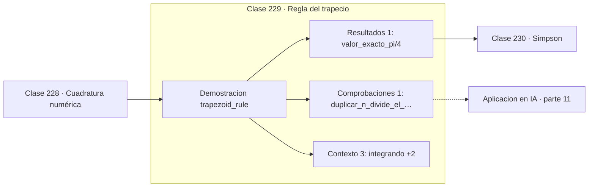

# 229 — Regla del trapecio

> [⬅️ 228 Cuadratura numérica](../228-cuadratura-numerica/README.md) · [📚 Parte 11](../README.md) · [🏠 Programa](../../../README.md) · [230 Simpson ➡️](../230-simpson/README.md)

**Parte:** 11 — Métodos numéricos y computación científica · **Nivel:** `cientifico` · **Horas estimadas:** 4
**Motor:** `engines.part11` · **Demostración:** `trapezoid_rule` · **Clase 9 de 20** de la parte

---

## 🎯 Propósito

**El trapecio es de orden 2: duplicar los subintervalos divide el error por cuatro.**

Raíces, interpolación, splines, diferenciación y cuadratura numérica, sistemas lineales iterativos, mínimos cuadrados y ecuaciones diferenciales.

## ✅ Resultados de aprendizaje

Al terminar podrás:

1. Explicar **Regla del trapecio** con lenguaje cotidiano y con notación matemática.
2. Resolver un caso pequeño a mano y anticipar el orden de magnitud del resultado.
3. Ejecutar y modificar `lab.py`, que corre la demostración `trapezoid_rule`.
4. Interpretar las 5 salidas del laboratorio y decir qué comprueba cada una.
5. Detectar el error típico de esta parte: aplicar runge-kutta con paso fijo a un sistema rígido.

## 🧩 Fórmulas de la clase

```text
∫ₐᵇ f ≈ (h/2)·[f(x₀) + 2f(x₁) + … + 2f(xₙ₋₁) + f(xₙ)]
error total O(h²)
n × 2  ⟹  error / 4
```

## 🗺️ Ubicación en el programa



## 📖 Fundamentos

La regla del trapecio aproxima la función por segmentos rectos entre nodos consecutivos y
suma las áreas de los trapecios resultantes. Es la regla más simple que va más allá de los
rectángulos, y su fórmula compuesta tiene la estructura característica: los extremos pesan
la mitad que los puntos interiores.

Su error es `O(h²)`, lo que da la regla práctica más útil para verificar una
implementación: **duplicar el número de subintervalos divide el error por cuatro**. Si al
duplicar `n` el error solo se divide por dos, hay un error de programación o la función no
es suficientemente suave.

El signo del error es predecible: el trapecio **sobreestima** para funciones convexas y
subestima para cóncavas, porque la cuerda queda por encima o por debajo de la curva. Esa
previsibilidad permite corregir, y de ahí sale la extrapolación de Richardson y el método
de Romberg, que combinan estimaciones con distintos `h` para cancelar términos de error.

Tiene además una propiedad que lo hace insustituible en un caso concreto: para funciones
**periódicas** integradas sobre un periodo completo, el trapecio converge
exponencialmente, mucho más rápido que Simpson. Es el fundamento de los métodos
espectrales y de la precisión de la transformada discreta de Fourier.

## 🧮 Ejemplo trabajado

Integral de 1/(1+x²) entre 0 y 1, que vale exactamente π/4.

```text
valor exacto: 0,785398163397

   n      valor            error       razón
   2   0,775000000    1,0398e-02        —
   4   0,782794010    2,6042e-03      3,993
   8   0,784747124    6,5104e-04      4,000
  16   0,785235400    1,6276e-04      4,000
  32   0,785357472    4,0690e-05      4,000

La razón se estabiliza en 4 → orden 2 confirmado    ✓

El trapecio subestima aquí porque el integrando es cóncavo
en la mayor parte del intervalo.
```

## 🔬 Qué ejecuta el laboratorio

`trapezoid_rule` — Regla del trapecio y su convergencia O(h²).

| Grupo | Salidas |
|---|---|
| 🔢 Resultados numéricos (1) | `valor_exacto_pi/4` |
| ✅ Comprobaciones de invariante (1) | `duplicar_n_divide_el_error_por_4` |

Las claves booleanas no son adorno: si alguna fuera `False`, el resultado numérico
no sería fiable aunque el programa terminase sin error.

```bash
python classes/part-11-metodos-numericos-y-computacion-cientifica/229-regla-del-trapecio/lab.py
compmath run 229
```

> [!TIP]
> Antes de ejecutar, **escribe tu predicción**. Un laboratorio que confirma lo que
> esperabas enseña tanto como uno que te contradice, pero solo si la predicción
> existía antes del resultado.

## ⚠️ Errores conceptuales frecuentes

1. No verificar el orden empírico al implementarlo.
2. Aplicarlo a integrandos con discontinuidades sin partir el intervalo.
3. Olvidar que los extremos llevan peso mitad en la fórmula compuesta.

## 🚀 Dónde se usa de verdad

Integración de datos experimentales muestreados, cálculo de áreas bajo curvas ROC,
métodos espectrales con funciones periódicas y base del método de Romberg.

## 🤖 Conexión con IA

Los Neural ODE, los samplers de difusión y los optimizadores de segundo orden son métodos numéricos con parámetros aprendidos.

## 📓 Notebooks

| Archivo | Para qué |
|---|---|
| [`notebook.ipynb`](notebook.ipynb) | recorrido guiado con la demostración ejecutada |
| [`notebook_student.ipynb`](notebook_student.ipynb) | versión con `TODO` para resolver |
| [`notebook_solution.ipynb`](notebook_solution.ipynb) | solución de referencia verificada |

## 📝 Evaluación

| Criterio | Peso |
|---|---:|
| Comprensión conceptual | 25 % |
| Resolución manual | 25 % |
| Implementación y verificación | 25 % |
| Interpretación y comunicación | 15 % |
| Conexión con aplicación real | 10 % |

Detalle y criterios de error crítico en [`assessment.md`](assessment.md).

## ❓ Preguntas de comprobación

1. ¿Cuál es la entrada, cuál la salida y qué unidades tienen?
2. ¿Qué operación domina el comportamiento del resultado?
3. ¿Qué caso extremo revelaría un error conceptual?
4. ¿Cómo verificarías el resultado por un método independiente?
5. ¿Dónde aparece esto en simulación física?

Si necesitas releer el código para responderlas, la clase todavía no está superada.

## 📥 Entregable

`notebook_student.ipynb` resuelto más un párrafo que explique el resultado **sin citar
código**: qué entra, qué sale, qué invariante se comprueba y qué pasaría en un caso límite.

## 🔗 Referencias

- [Burden, R.; Faires, J. *Numerical Analysis*, 10ª ed., Cengage, 2015, cap. 4](https://www.cengage.com/)
- [Trefethen, L. N.; Weideman, J. *The exponentially convergent trapezoidal rule*, SIAM Review, 2014](https://doi.org/10.1137/130932132)

Bibliografía completa de la parte en [`../../../docs/BIBLIOGRAPHY.md`](../../../docs/BIBLIOGRAPHY.md).

## 📂 Material de la clase

[`intuition.md`](intuition.md) · [`theory.md`](theory.md) · [`derivation.md`](derivation.md) · [`exercises.md`](exercises.md) · [`assessment.md`](assessment.md) · [`where-is-this-used.md`](where-is-this-used.md) · [`lesson.yaml`](lesson.yaml)

---

> [⬅️ 228 Cuadratura numérica](../228-cuadratura-numerica/README.md) · [📚 Parte 11](../README.md) · [🏠 Programa](../../../README.md) · [230 Simpson ➡️](../230-simpson/README.md)
