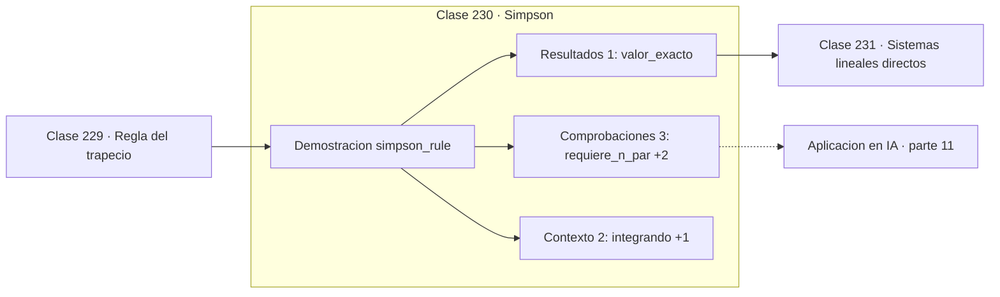

# 230 — Simpson

> [⬅️ 229 Regla del trapecio](../229-regla-del-trapecio/README.md) · [📚 Parte 11](../README.md) · [🏠 Programa](../../../README.md) · [231 Sistemas lineales directos ➡️](../231-sistemas-lineales-directos/README.md)

**Parte:** 11 — Métodos numéricos y computación científica · **Nivel:** `cientifico` · **Horas estimadas:** 4
**Motor:** `engines.part11` · **Demostración:** `simpson_rule` · **Clase 10 de 20** de la parte

---

## 🎯 Propósito

**Simpson usa parábolas y gana dos órdenes por el mismo precio.**

Raíces, interpolación, splines, diferenciación y cuadratura numérica, sistemas lineales iterativos, mínimos cuadrados y ecuaciones diferenciales.

## ✅ Resultados de aprendizaje

Al terminar podrás:

1. Explicar **Simpson** con lenguaje cotidiano y con notación matemática.
2. Resolver un caso pequeño a mano y anticipar el orden de magnitud del resultado.
3. Ejecutar y modificar `lab.py`, que corre la demostración `simpson_rule`.
4. Interpretar las 6 salidas del laboratorio y decir qué comprueba cada una.
5. Detectar el error típico de esta parte: usar tolerancia absoluta cuando la escala del problema es grande.

## 🧩 Fórmulas de la clase

```text
∫ ≈ (h/3)·[f₀ + 4f₁ + 2f₂ + 4f₃ + … + fₙ]
error O(h⁴):  n × 2 ⟹ error / 16
requiere n par; exacta hasta grado 3
```

## 🗺️ Ubicación en el programa



## 📖 Fundamentos

Simpson ajusta una parábola por cada par de subintervalos en vez de una recta por cada
uno. El patrón de pesos `1, 4, 2, 4, …, 4, 1` sale de integrar exactamente esas parábolas,
y exige que el número de subintervalos sea **par**.

Su error es `O(h⁴)`, dos órdenes por encima del trapecio con esencialmente el mismo coste
de evaluaciones. La regla de verificación correspondiente es que duplicar `n` divide el
error por 16, y comprobarla es la forma estándar de validar la implementación.

Hay una sorpresa agradable: aunque se construye con parábolas, Simpson es **exacto para
polinomios de grado 3**. El término cúbico se cancela por simetría, y ese grado extra
gratuito es la razón de su excelente relación precisión-coste. Es el método por defecto
cuando hay que integrar a mano y con pocos recursos.

El orden alto tiene una condición que se olvida: exige que la función tenga cuarta derivada
acotada. Con integrandos poco suaves, con esquinas o con oscilaciones rápidas, Simpson
pierde su ventaja y puede comportarse peor que el trapecio. Con funciones de suavidad
dudosa conviene un método adaptativo que subdivida donde haga falta.

## 🧮 Ejemplo trabajado

Misma integral que el trapecio, para comparar órdenes.

```text
valor exacto: 0,785398163397

   n      valor            error        razón
   2   0,783333333    2,0648e-03         —
   4   0,785259259    1,3890e-04      14,87
   8   0,785388765    9,3984e-06      14,78
  16   0,785397555    6,0812e-07      15,46

La razón tiende a 16 → orden 4 confirmado           ✓

Comparación con n = 16:
  trapecio: error 1,63e-04
  Simpson:  error 6,08e-07        268 veces mejor

Verificación del grado 3: sobre x³ en [0,1]
  Simpson con n = 2 da exactamente 0,25             ✓
```

## 🔬 Qué ejecuta el laboratorio

`simpson_rule` — Simpson y su convergencia O(h⁴).

| Grupo | Salidas |
|---|---|
| 🔢 Resultados numéricos (1) | `valor_exacto` |
| ✅ Comprobaciones de invariante (3) | `requiere_n_par`, `duplicar_n_divide_el_error_por_16`, `exacta_para_polinomios_de_grado_3` |

Las claves booleanas no son adorno: si alguna fuera `False`, el resultado numérico
no sería fiable aunque el programa terminase sin error.

```bash
python classes/part-11-metodos-numericos-y-computacion-cientifica/230-simpson/lab.py
compmath run 230
```

> [!TIP]
> Antes de ejecutar, **escribe tu predicción**. Un laboratorio que confirma lo que
> esperabas enseña tanto como uno que te contradice, pero solo si la predicción
> existía antes del resultado.

## ⚠️ Errores conceptuales frecuentes

1. Usar un número impar de subintervalos.
2. Aplicarlo a funciones con esquinas o discontinuidades.
3. Confundir el patrón de pesos y usar 1,4,4,1 en vez de 1,4,2,4,1.

## 🚀 Dónde se usa de verdad

Integración numérica de propósito general, cálculo de momentos de distribuciones,
procesamiento de señales muestreadas y base de los métodos adaptativos.

## 🤖 Conexión con IA

Los Neural ODE, los samplers de difusión y los optimizadores de segundo orden son métodos numéricos con parámetros aprendidos.

## 📓 Notebooks

| Archivo | Para qué |
|---|---|
| [`notebook.ipynb`](notebook.ipynb) | recorrido guiado con la demostración ejecutada |
| [`notebook_student.ipynb`](notebook_student.ipynb) | versión con `TODO` para resolver |
| [`notebook_solution.ipynb`](notebook_solution.ipynb) | solución de referencia verificada |

## 📝 Evaluación

| Criterio | Peso |
|---|---:|
| Comprensión conceptual | 25 % |
| Resolución manual | 25 % |
| Implementación y verificación | 25 % |
| Interpretación y comunicación | 15 % |
| Conexión con aplicación real | 10 % |

Detalle y criterios de error crítico en [`assessment.md`](assessment.md).

## ❓ Preguntas de comprobación

1. ¿Cuál es la entrada, cuál la salida y qué unidades tienen?
2. ¿Qué operación domina el comportamiento del resultado?
3. ¿Qué caso extremo revelaría un error conceptual?
4. ¿Cómo verificarías el resultado por un método independiente?
5. ¿Dónde aparece esto en simulación física?

Si necesitas releer el código para responderlas, la clase todavía no está superada.

## 📥 Entregable

`notebook_student.ipynb` resuelto más un párrafo que explique el resultado **sin citar
código**: qué entra, qué sale, qué invariante se comprueba y qué pasaría en un caso límite.

## 📚 Bibliografía de la clase

Esta clase enseña **Métodos numéricos · Computación científica · Ecuaciones diferenciales · Teoría de la aproximación · Álgebra lineal numérica**. Cada obra dice qué aporta aquí y cómo se comprobó su localizador:

- [Burden, R.; Faires, J. *Numerical Analysis*, 10ª ed., Cengage, 2015, cap. 4](https://openlibrary.org/isbn/9781305253667) — Métodos numéricos: el tema de esta clase · ISBN-13 `9781305253667` verificado en International ISBN Agency (2026-08-20).
- [Press, W. et al. *Numerical Recipes*, 3ª ed., Cambridge, 2007, cap. 4](https://numerical.recipes/) — Computación científica y Métodos numéricos: el tema de esta clase · URL de la fuente primaria comprobada en sitio de la obra o de su editorial (2026-08-19).

Bibliografía de todas las clases, con el porqué de cada obra, en [`docs/BIBLIOGRAPHY.md`](../../../docs/BIBLIOGRAPHY.md) · localizador y estado de cada obra en [`sources/bibliography.json`](../../../sources/bibliography.json).

## 📂 Material de la clase

[`intuition.md`](intuition.md) · [`theory.md`](theory.md) · [`derivation.md`](derivation.md) · [`exercises.md`](exercises.md) · [`assessment.md`](assessment.md) · [`where-is-this-used.md`](where-is-this-used.md) · [`lesson.yaml`](lesson.yaml)

---

> [⬅️ 229 Regla del trapecio](../229-regla-del-trapecio/README.md) · [📚 Parte 11](../README.md) · [🏠 Programa](../../../README.md) · [231 Sistemas lineales directos ➡️](../231-sistemas-lineales-directos/README.md)
