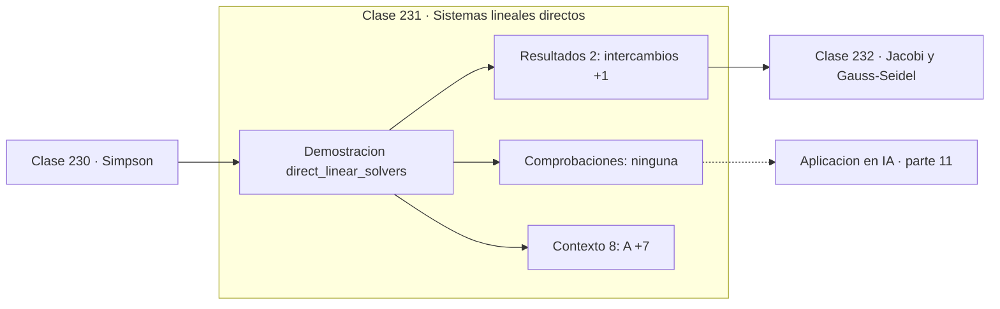

# 231 — Sistemas lineales directos

> [⬅️ 230 Simpson](../230-simpson/README.md) · [📚 Parte 11](../README.md) · [🏠 Programa](../../../README.md) · [232 Jacobi y Gauss-Seidel ➡️](../232-jacobi-y-gauss-seidel/README.md)

**Parte:** 11 — Métodos numéricos y computación científica · **Nivel:** `cientifico` · **Horas estimadas:** 4
**Motor:** `engines.part11` · **Demostración:** `direct_linear_solvers` · **Clase 11 de 20** de la parte

---

## 🎯 Propósito

**Factorizar una vez y sustituir muchas: LU convierte O(n³) en O(n²) por sistema.**

Raíces, interpolación, splines, diferenciación y cuadratura numérica, sistemas lineales iterativos, mínimos cuadrados y ecuaciones diferenciales.

## ✅ Resultados de aprendizaje

Al terminar podrás:

1. Explicar **Sistemas lineales directos** con lenguaje cotidiano y con notación matemática.
2. Resolver un caso pequeño a mano y anticipar el orden de magnitud del resultado.
3. Ejecutar y modificar `lab.py`, que corre la demostración `direct_linear_solvers`.
4. Interpretar las 10 salidas del laboratorio y decir qué comprueba cada una.
5. Detectar el error típico de esta parte: iterar sin límite máximo y colgar el proceso.

## 🧩 Fórmulas de la clase

```text
A = LU  con pivoteo parcial:  PA = LU
resolver Ly = Pb, luego Ux = y
coste: LU ≈ (2/3)n³;  cada sustitución ≈ n²
```

## 🗺️ Ubicación en el programa



## 📖 Fundamentos

Un método directo resuelve el sistema en un número predeterminado de operaciones, sin
iterar. La eliminación gaussiana es el prototipo, y su versión organizada como
factorización **LU** separa el trabajo en dos fases: descomponer la matriz, que cuesta
`O(n³)`, y resolver por sustitución, que cuesta `O(n²)`.

Esa separación es lo que hace valiosa la factorización. Si hay que resolver el mismo
sistema con veinte lados derechos distintos —algo habitual en simulación, en control y en
métodos implícitos para EDO— se factoriza una vez y se sustituye veinte, en vez de repetir
la eliminación completa veinte veces.

El **pivoteo parcial** es obligatorio, no opcional. Intercambiar filas para que el pivote
sea el elemento de mayor módulo evita dividir por números diminutos, y con ello evita la
amplificación de errores que puede destruir la solución. Sin pivoteo, sistemas
perfectamente resolubles dan resultados sin ningún dígito correcto.

Verificar la solución es barato y obligatorio: calcular el **residuo** `Ax − b`. Un residuo
pequeño no garantiza que la solución sea precisa —en sistemas mal condicionados puede ser
minúsculo con una solución muy alejada de la real— pero un residuo grande sí garantiza que
algo va mal. Combinar residuo y número de condición da el diagnóstico completo.

## 🧮 Ejemplo trabajado

Sistema 3×3 simétrico definido positivo, resuelto por LU.

```text
A = [[ 4  −2   1]        b = [ 11]
     [−2   4  −2]            [−16]
     [ 1  −2   4]]           [ 17]

L = [[ 1,00   0,00   0,00]
     [−0,50   1,00   0,00]
     [ 0,25  −0,50   1,00]]

intercambios de fila: 0     (ya es dominante)

solución x = [1, −2, 3]
residuo Ax − b = [0, 0, 0]                          ✓

Coste con n = 3:  LU ≈ 18 operaciones
Cada nuevo lado derecho: ≈ 9 operaciones, sin refactorizar.
```

## 🔬 Qué ejecuta el laboratorio

`direct_linear_solvers` — Solvers directos: LU y sustitución, con conteo de operaciones.

| Grupo | Salidas |
|---|---|
| 🔢 Resultados numéricos (2) | `intercambios`, `determinante` |
| ✅ Comprobaciones de invariante (0) | — |

Las claves booleanas no son adorno: si alguna fuera `False`, el resultado numérico
no sería fiable aunque el programa terminase sin error.

```bash
python classes/part-11-metodos-numericos-y-computacion-cientifica/231-sistemas-lineales-directos/lab.py
compmath run 231
```

> [!TIP]
> Antes de ejecutar, **escribe tu predicción**. Un laboratorio que confirma lo que
> esperabas enseña tanto como uno que te contradice, pero solo si la predicción
> existía antes del resultado.

## ⚠️ Errores conceptuales frecuentes

1. Implementar eliminación sin pivoteo parcial.
2. Calcular la inversa explícita para resolver un sistema.
3. Aceptar la solución sin comprobar el residuo.

## 🚀 Dónde se usa de verdad

Resolución de sistemas en simulación, mínimos cuadrados, métodos implícitos para EDO y
cualquier problema con múltiples lados derechos.

## 🤖 Conexión con IA

Los Neural ODE, los samplers de difusión y los optimizadores de segundo orden son métodos numéricos con parámetros aprendidos.

## 📓 Notebooks

| Archivo | Para qué |
|---|---|
| [`notebook.ipynb`](notebook.ipynb) | recorrido guiado con la demostración ejecutada |
| [`notebook_student.ipynb`](notebook_student.ipynb) | versión con `TODO` para resolver |
| [`notebook_solution.ipynb`](notebook_solution.ipynb) | solución de referencia verificada |

## 📝 Evaluación

| Criterio | Peso |
|---|---:|
| Comprensión conceptual | 25 % |
| Resolución manual | 25 % |
| Implementación y verificación | 25 % |
| Interpretación y comunicación | 15 % |
| Conexión con aplicación real | 10 % |

Detalle y criterios de error crítico en [`assessment.md`](assessment.md).

## ❓ Preguntas de comprobación

1. ¿Cuál es la entrada, cuál la salida y qué unidades tienen?
2. ¿Qué operación domina el comportamiento del resultado?
3. ¿Qué caso extremo revelaría un error conceptual?
4. ¿Cómo verificarías el resultado por un método independiente?
5. ¿Dónde aparece esto en simulación física?

Si necesitas releer el código para responderlas, la clase todavía no está superada.

## 📥 Entregable

`notebook_student.ipynb` resuelto más un párrafo que explique el resultado **sin citar
código**: qué entra, qué sale, qué invariante se comprueba y qué pasaría en un caso límite.

## 📚 Bibliografía de la clase

Esta clase enseña **Métodos numéricos · Computación científica · Ecuaciones diferenciales · Teoría de la aproximación · Álgebra lineal numérica**. Cada obra dice qué aporta aquí y cómo se comprobó su localizador:

- [Trefethen, L. N.; Bau, D. *Numerical Linear Algebra*, SIAM, 1997](https://doi.org/10.1137/1.9780898719574) — Álgebra lineal numérica: el tema de esta clase · ISBN-13 `9780898719574` verificado en International ISBN Agency (2026-08-19).
- [Golub, G.; Van Loan, C. *Matrix Computations*, 4ª ed., JHU Press, 2013](https://jhupbooks.press.jhu.edu/title/matrix-computations) — Álgebra lineal numérica: el tema de esta clase · ISBN-13 `9781421407944` verificado en International ISBN Agency (2026-08-19).

Bibliografía de todas las clases, con el porqué de cada obra, en [`docs/BIBLIOGRAPHY.md`](../../../docs/BIBLIOGRAPHY.md) · localizador y estado de cada obra en [`sources/bibliography.json`](../../../sources/bibliography.json).

## 📂 Material de la clase

[`intuition.md`](intuition.md) · [`theory.md`](theory.md) · [`derivation.md`](derivation.md) · [`exercises.md`](exercises.md) · [`assessment.md`](assessment.md) · [`where-is-this-used.md`](where-is-this-used.md) · [`lesson.yaml`](lesson.yaml)

---

> [⬅️ 230 Simpson](../230-simpson/README.md) · [📚 Parte 11](../README.md) · [🏠 Programa](../../../README.md) · [232 Jacobi y Gauss-Seidel ➡️](../232-jacobi-y-gauss-seidel/README.md)
