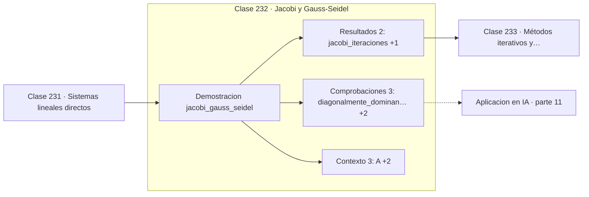

# 232 — Jacobi y Gauss-Seidel

> [⬅️ 231 Sistemas lineales directos](../231-sistemas-lineales-directos/README.md) · [📚 Parte 11](../README.md) · [🏠 Programa](../../../README.md) · [233 Métodos iterativos y tolerancias ➡️](../233-metodos-iterativos-y-tolerancias/README.md)

**Parte:** 11 — Métodos numéricos y computación científica · **Nivel:** `cientifico` · **Horas estimadas:** 4
**Motor:** `engines.part11` · **Demostración:** `jacobi_gauss_seidel` · **Clase 12 de 20** de la parte

---

## 🎯 Propósito

**Gauss-Seidel usa los valores recién calculados y converge en la mitad de iteraciones.**

Raíces, interpolación, splines, diferenciación y cuadratura numérica, sistemas lineales iterativos, mínimos cuadrados y ecuaciones diferenciales.

## ✅ Resultados de aprendizaje

Al terminar podrás:

1. Explicar **Jacobi y Gauss-Seidel** con lenguaje cotidiano y con notación matemática.
2. Resolver un caso pequeño a mano y anticipar el orden de magnitud del resultado.
3. Ejecutar y modificar `lab.py`, que corre la demostración `jacobi_gauss_seidel`.
4. Interpretar las 8 salidas del laboratorio y decir qué comprueba cada una.
5. Detectar el error típico de esta parte: aplicar runge-kutta con paso fijo a un sistema rígido.

## 🧩 Fórmulas de la clase

```text
Jacobi: xᵢ⁽ᵏ⁺¹⁾ = (bᵢ − Σⱼ≠ᵢ aᵢⱼ·xⱼ⁽ᵏ⁾) / aᵢᵢ
Gauss-Seidel: usa xⱼ⁽ᵏ⁺¹⁾ para j < i
convergencia garantizada si A es diagonalmente dominante
```

## 🗺️ Ubicación en el programa



## 📖 Fundamentos

Los métodos iterativos parten de una solución aproximada y la refinan hasta que deja de
cambiar. Su interés no es competir con LU en sistemas pequeños, sino resolver los que LU no
puede: matrices de millones de incógnitas y muy dispersas, donde una factorización
llenaría de ceros la memoria disponible.

**Jacobi** despeja cada incógnita de su ecuación usando exclusivamente los valores de la
iteración anterior. Eso lo hace trivialmente paralelizable, porque todas las componentes se
actualizan de forma independiente. **Gauss-Seidel** usa los valores ya actualizados dentro
de la misma pasada, lo que suele reducir a la mitad el número de iteraciones a costa de
volverse secuencial.

La condición suficiente clásica de convergencia es la **dominancia diagonal**: que cada
elemento de la diagonal supere en módulo a la suma de los demás de su fila. Es suficiente,
no necesaria, y hay sistemas no dominantes donde ambos métodos convergen igualmente. Sin
alguna condición de este tipo, la iteración puede divergir.

Estos dos métodos son el punto de entrada a una familia mucho mayor —SOR, gradiente
conjugado, GMRES, multigrid— que es la que realmente se usa en producción. Conviene
entenderlos porque la estructura es la misma: una iteración barata, un criterio de parada
y un análisis de convergencia.

## 🧮 Ejemplo trabajado

Sistema 3×3 diagonalmente dominante, ambos métodos.

```text
A = [[10  −1   2]      diagonalmente dominante:
     [−1  11  −1]        10 > 3,  11 > 2,  10 > 3      ✓
     [ 2  −1  10]]

solución:  [1,04327 ; 2,26923 ; −1,08173]

Jacobi:        22 iteraciones hasta tolerancia 1e-10
Gauss-Seidel:  11 iteraciones hasta la misma tolerancia

Gauss-Seidel converge en la mitad de pasos.

Contrapartida: Jacobi actualiza las tres componentes
en paralelo; Gauss-Seidel debe hacerlo en orden.
```

## 🔬 Qué ejecuta el laboratorio

`jacobi_gauss_seidel` — Métodos iterativos sobre una matriz diagonalmente dominante.

| Grupo | Salidas |
|---|---|
| 🔢 Resultados numéricos (2) | `jacobi_iteraciones`, `gauss_seidel_iteraciones` |
| ✅ Comprobaciones de invariante (3) | `diagonalmente_dominante`, `gauss_seidel_es_mas_rapido`, `jacobi_es_paralelizable` |

Las claves booleanas no son adorno: si alguna fuera `False`, el resultado numérico
no sería fiable aunque el programa terminase sin error.

```bash
python classes/part-11-metodos-numericos-y-computacion-cientifica/232-jacobi-y-gauss-seidel/lab.py
compmath run 232
```

> [!TIP]
> Antes de ejecutar, **escribe tu predicción**. Un laboratorio que confirma lo que
> esperabas enseña tanto como uno que te contradice, pero solo si la predicción
> existía antes del resultado.

## ⚠️ Errores conceptuales frecuentes

1. Aplicarlos sin comprobar dominancia diagonal ni otra condición de convergencia.
2. Iterar sin tope máximo y bloquear el proceso.
3. Usar iterativos en sistemas pequeños y densos donde LU es más rápido.

## 🚀 Dónde se usa de verdad

Resolución de sistemas dispersos enormes, discretización de PDE, PageRank y precondicionado
dentro de métodos de Krylov.

## 🤖 Conexión con IA

Los Neural ODE, los samplers de difusión y los optimizadores de segundo orden son métodos numéricos con parámetros aprendidos.

## 📓 Notebooks

| Archivo | Para qué |
|---|---|
| [`notebook.ipynb`](notebook.ipynb) | recorrido guiado con la demostración ejecutada |
| [`notebook_student.ipynb`](notebook_student.ipynb) | versión con `TODO` para resolver |
| [`notebook_solution.ipynb`](notebook_solution.ipynb) | solución de referencia verificada |

## 📝 Evaluación

| Criterio | Peso |
|---|---:|
| Comprensión conceptual | 25 % |
| Resolución manual | 25 % |
| Implementación y verificación | 25 % |
| Interpretación y comunicación | 15 % |
| Conexión con aplicación real | 10 % |

Detalle y criterios de error crítico en [`assessment.md`](assessment.md).

## ❓ Preguntas de comprobación

1. ¿Cuál es la entrada, cuál la salida y qué unidades tienen?
2. ¿Qué operación domina el comportamiento del resultado?
3. ¿Qué caso extremo revelaría un error conceptual?
4. ¿Cómo verificarías el resultado por un método independiente?
5. ¿Dónde aparece esto en simulación física?

Si necesitas releer el código para responderlas, la clase todavía no está superada.

## 📥 Entregable

`notebook_student.ipynb` resuelto más un párrafo que explique el resultado **sin citar
código**: qué entra, qué sale, qué invariante se comprueba y qué pasaría en un caso límite.

## 🔗 Referencias

- [Saad, Y. *Iterative Methods for Sparse Linear Systems*, 2ª ed., SIAM, 2003](https://doi.org/10.1137/1.9780898718003) — *uso:* desarrollo formal del tema en «Jacobi y Gauss-Seidel».
- [Heath, M. *Scientific Computing: An Introductory Survey*, 2ª ed., SIAM, 2018, cap. 11](https://doi.org/10.1137/1.9781611975581) — *uso:* desarrollo formal del tema en «Jacobi y Gauss-Seidel».

Bibliografía completa de la parte en [`../../../docs/BIBLIOGRAPHY.md`](../../../docs/BIBLIOGRAPHY.md) · localizador verificable de cada obra en [`sources/bibliography.json`](../../../sources/bibliography.json).

## 📂 Material de la clase

[`intuition.md`](intuition.md) · [`theory.md`](theory.md) · [`derivation.md`](derivation.md) · [`exercises.md`](exercises.md) · [`assessment.md`](assessment.md) · [`where-is-this-used.md`](where-is-this-used.md) · [`lesson.yaml`](lesson.yaml)

---

> [⬅️ 231 Sistemas lineales directos](../231-sistemas-lineales-directos/README.md) · [📚 Parte 11](../README.md) · [🏠 Programa](../../../README.md) · [233 Métodos iterativos y tolerancias ➡️](../233-metodos-iterativos-y-tolerancias/README.md)
