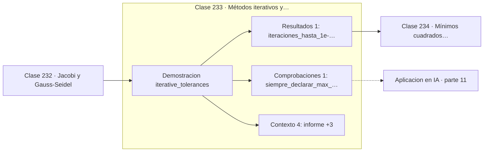

# 233 — Métodos iterativos y tolerancias

> [⬅️ 232 Jacobi y Gauss-Seidel](../232-jacobi-y-gauss-seidel/README.md) · [📚 Parte 11](../README.md) · [🏠 Programa](../../../README.md) · [234 Mínimos cuadrados numéricos ➡️](../234-minimos-cuadrados-numericos/README.md)

**Parte:** 11 — Métodos numéricos y computación científica · **Nivel:** `cientifico` · **Horas estimadas:** 4
**Motor:** `engines.part11` · **Demostración:** `iterative_tolerances` · **Clase 13 de 20** de la parte

---

## 🎯 Propósito

**Todo bucle iterativo necesita tres frenos: tolerancia relativa, residuo y tope de pasos.**

Raíces, interpolación, splines, diferenciación y cuadratura numérica, sistemas lineales iterativos, mínimos cuadrados y ecuaciones diferenciales.

## ✅ Resultados de aprendizaje

Al terminar podrás:

1. Explicar **Métodos iterativos y tolerancias** con lenguaje cotidiano y con notación matemática.
2. Resolver un caso pequeño a mano y anticipar el orden de magnitud del resultado.
3. Ejecutar y modificar `lab.py`, que corre la demostración `iterative_tolerances`.
4. Interpretar las 6 salidas del laboratorio y decir qué comprueba cada una.
5. Detectar el error típico de esta parte: usar tolerancia absoluta cuando la escala del problema es grande.

## 🧩 Fórmulas de la clase

```text
criterio absoluto: ‖xₖ₊₁ − xₖ‖ < tol
criterio relativo: ‖xₖ₊₁ − xₖ‖ / ‖xₖ₊₁‖ < tol
criterio de residuo: ‖Axₖ − b‖ / ‖b‖ < tol
```

## 🗺️ Ubicación en el programa



## 📖 Fundamentos

El criterio de parada no es un detalle de implementación: determina qué significa el
resultado. Un método iterativo sin criterio declarado devuelve un número cuyo error nadie
conoce, y eso lo invalida como resultado científico.

El criterio **absoluto** falla al cambiar de escala. Una tolerancia de `10⁻⁶` es exigente
si la solución vale 1 y absurda si vale `10¹²`, donde ni siquiera es representable en doble
precisión. El criterio **relativo** escala con la magnitud de la solución y es el que hay
que usar por defecto, con la precaución de manejar el caso de solución próxima a cero.

El criterio de **residuo** mide algo distinto: cuánto incumple la ecuación la solución
actual. Es complementario, no equivalente. En un sistema mal condicionado el cambio entre
iterados puede ser minúsculo mientras el residuo sigue siendo grande, y al revés. Por eso
lo prudente es combinar ambos.

Y siempre, sin excepción, un **tope de iteraciones**. No es una tolerancia sino una
salvaguarda: si el método no converge —porque el problema es singular, porque la condición
falla o porque hay un error de programación— el bucle debe terminar e informar de que no
convergió, en vez de girar indefinidamente. Un solver que devuelve «no convergí» es
infinitamente más útil que uno que se cuelga.

## 🧮 Ejemplo trabajado

Evolución de los tres criterios en una iteración convergente.

```text
iter   cambio abs.   cambio rel.   norma residuo
  1     0,990000      1,000000       1,40e+00
  3     0,090000      0,090909       1,27e-01
  5     0,009000      0,009009       1,27e-02
  7     0,000900      0,000900       1,27e-03
  9     1,00e-14      1,00e-14       1,41e-14

solución = [1, 1]      9 iteraciones hasta 1e-14

Criterio recomendado:
  parar si (cambio relativo < tol) Y (residuo relativo < tol)
  o si iter alcanza max_iter, informando de no convergencia.

Peligro del criterio solo absoluto: si la solución fuera
del orden de 1e12, tol = 1e-6 nunca se alcanzaría.
```

## 🔬 Qué ejecuta el laboratorio

`iterative_tolerances` — Criterio de parada: absoluto, relativo y residuo.

| Grupo | Salidas |
|---|---|
| 🔢 Resultados numéricos (1) | `iteraciones_hasta_1e-14` |
| ✅ Comprobaciones de invariante (1) | `siempre_declarar_max_iter` |

Las claves booleanas no son adorno: si alguna fuera `False`, el resultado numérico
no sería fiable aunque el programa terminase sin error.

```bash
python classes/part-11-metodos-numericos-y-computacion-cientifica/233-metodos-iterativos-y-tolerancias/lab.py
compmath run 233
```

> [!TIP]
> Antes de ejecutar, **escribe tu predicción**. Un laboratorio que confirma lo que
> esperabas enseña tanto como uno que te contradice, pero solo si la predicción
> existía antes del resultado.

## ⚠️ Errores conceptuales frecuentes

1. Usar tolerancia absoluta con soluciones de magnitud desconocida.
2. Omitir el tope de iteraciones.
3. Dar por convergido por cambio pequeño sin mirar el residuo.

## 🚀 Dónde se usa de verdad

Cualquier solver iterativo, criterios de parada en entrenamiento de modelos, bucles de
punto fijo y control de convergencia en simulación.

## 🤖 Conexión con IA

Los Neural ODE, los samplers de difusión y los optimizadores de segundo orden son métodos numéricos con parámetros aprendidos.

## 📓 Notebooks

| Archivo | Para qué |
|---|---|
| [`notebook.ipynb`](notebook.ipynb) | recorrido guiado con la demostración ejecutada |
| [`notebook_student.ipynb`](notebook_student.ipynb) | versión con `TODO` para resolver |
| [`notebook_solution.ipynb`](notebook_solution.ipynb) | solución de referencia verificada |

## 📝 Evaluación

| Criterio | Peso |
|---|---:|
| Comprensión conceptual | 25 % |
| Resolución manual | 25 % |
| Implementación y verificación | 25 % |
| Interpretación y comunicación | 15 % |
| Conexión con aplicación real | 10 % |

Detalle y criterios de error crítico en [`assessment.md`](assessment.md).

## ❓ Preguntas de comprobación

1. ¿Cuál es la entrada, cuál la salida y qué unidades tienen?
2. ¿Qué operación domina el comportamiento del resultado?
3. ¿Qué caso extremo revelaría un error conceptual?
4. ¿Cómo verificarías el resultado por un método independiente?
5. ¿Dónde aparece esto en simulación física?

Si necesitas releer el código para responderlas, la clase todavía no está superada.

## 📥 Entregable

`notebook_student.ipynb` resuelto más un párrafo que explique el resultado **sin citar
código**: qué entra, qué sale, qué invariante se comprueba y qué pasaría en un caso límite.

## 🔗 Referencias

- [Higham, N. *Accuracy and Stability of Numerical Algorithms*, 2ª ed., SIAM, 2002](https://doi.org/10.1137/1.9780898718027)
- [Press, W. et al. *Numerical Recipes*, 3ª ed., Cambridge, 2007, cap. 2](http://numerical.recipes/)

Bibliografía completa de la parte en [`../../../docs/BIBLIOGRAPHY.md`](../../../docs/BIBLIOGRAPHY.md).

## 📂 Material de la clase

[`intuition.md`](intuition.md) · [`theory.md`](theory.md) · [`derivation.md`](derivation.md) · [`exercises.md`](exercises.md) · [`assessment.md`](assessment.md) · [`where-is-this-used.md`](where-is-this-used.md) · [`lesson.yaml`](lesson.yaml)

---

> [⬅️ 232 Jacobi y Gauss-Seidel](../232-jacobi-y-gauss-seidel/README.md) · [📚 Parte 11](../README.md) · [🏠 Programa](../../../README.md) · [234 Mínimos cuadrados numéricos ➡️](../234-minimos-cuadrados-numericos/README.md)
