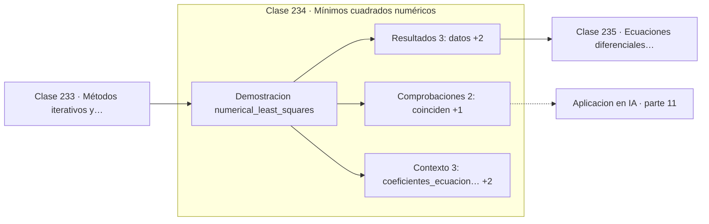

# 234 — Mínimos cuadrados numéricos

> [⬅️ 233 Métodos iterativos y tolerancias](../233-metodos-iterativos-y-tolerancias/README.md) · [📚 Parte 11](../README.md) · [🏠 Programa](../../../README.md) · [235 Ecuaciones diferenciales ordinarias ➡️](../235-ecuaciones-diferenciales-ordinarias/README.md)

**Parte:** 11 — Métodos numéricos y computación científica · **Nivel:** `cientifico` · **Horas estimadas:** 4
**Motor:** `engines.part11` · **Demostración:** `numerical_least_squares` · **Clase 14 de 20** de la parte

---

## 🎯 Propósito

**Las ecuaciones normales elevan al cuadrado el número de condición; QR no.**

Raíces, interpolación, splines, diferenciación y cuadratura numérica, sistemas lineales iterativos, mínimos cuadrados y ecuaciones diferenciales.

## ✅ Resultados de aprendizaje

Al terminar podrás:

1. Explicar **Mínimos cuadrados numéricos** con lenguaje cotidiano y con notación matemática.
2. Resolver un caso pequeño a mano y anticipar el orden de magnitud del resultado.
3. Ejecutar y modificar `lab.py`, que corre la demostración `numerical_least_squares`.
4. Interpretar las 8 salidas del laboratorio y decir qué comprueba cada una.
5. Detectar el error típico de esta parte: iterar sin límite máximo y colgar el proceso.

## 🧩 Fórmulas de la clase

```text
ecuaciones normales: AᵀAx = Aᵀb
cond(AᵀA) = cond(A)²
vía QR: A = QR ⟹ Rx = Qᵀb
```

## 🗺️ Ubicación en el programa



## 📖 Fundamentos

El problema de mínimos cuadrados busca el `x` que minimiza `‖Ax − b‖` cuando el sistema
tiene más ecuaciones que incógnitas. Geométricamente es la proyección de `b` sobre el
espacio columna de `A`, y anular la derivada conduce a las **ecuaciones normales**
`AᵀAx = Aᵀb`.

Esas ecuaciones son correctas en teoría y peligrosas en práctica. Formar `AᵀA` **eleva al
cuadrado el número de condición**: una matriz con condición `10⁶`, que en doble precisión
es manejable, produce una `AᵀA` con condición `10¹²`, que se lleva por delante la mitad de
los dígitos disponibles. El daño se hace al construir la matriz, antes de resolver nada.

La vía **QR** evita el problema. Descomponiendo `A = QR` con `Q` ortogonal, el sistema se
reduce a `Rx = Qᵀb`, triangular y con la condición original de `A` sin elevar. Cuesta
aproximadamente el doble de operaciones, y ese factor 2 es un precio muy pequeño por
conservar la mitad de los dígitos.

Cuando `A` es además deficiente de rango o casi singular, ni siquiera QR basta y hay que
recurrir a la **SVD** con truncamiento de valores singulares pequeños, que es la
pseudoinversa de la parte 06. La regla práctica: ecuaciones normales solo para problemas
pequeños y bien condicionados; QR por defecto; SVD cuando hay dudas sobre el rango.

## 🧮 Ejemplo trabajado

Ajuste lineal por dos vías sobre los mismos seis puntos.

```text
6 observaciones, modelo de 2 parámetros

ecuaciones normales: [1,03809524 ; 0,99142857]
vía QR:              [1,03809524 ; 0,99142857]
coinciden a 8 dígitos                                    ✓

cond(AᵀA) = 33,41        cond(A) = 5,78
relación: 5,78² = 33,41                                  ✓

Aquí el problema está bien condicionado y ambas sirven.

Si cond(A) fuera 1e6:
  cond(AᵀA) = 1e12  →  se pierden 12 de los 16 dígitos
  QR mantendría la pérdida en 6.
```

## 🔬 Qué ejecuta el laboratorio

`numerical_least_squares` — Mínimos cuadrados: ecuaciones normales frente a QR.

| Grupo | Salidas |
|---|---|
| 🔢 Resultados numéricos (3) | `datos`, `condicion_de_AᵀA`, `SSE` |
| ✅ Comprobaciones de invariante (2) | `coinciden`, `las_normales_elevan_al_cuadrado_la_condicion` |

Las claves booleanas no son adorno: si alguna fuera `False`, el resultado numérico
no sería fiable aunque el programa terminase sin error.

```bash
python classes/part-11-metodos-numericos-y-computacion-cientifica/234-minimos-cuadrados-numericos/lab.py
compmath run 234
```

> [!TIP]
> Antes de ejecutar, **escribe tu predicción**. Un laboratorio que confirma lo que
> esperabas enseña tanto como uno que te contradice, pero solo si la predicción
> existía antes del resultado.

## ⚠️ Errores conceptuales frecuentes

1. Formar AᵀA sin mirar el condicionamiento de A.
2. Invertir AᵀA explícitamente en vez de resolver el sistema.
3. Ignorar la deficiencia de rango en vez de usar SVD.

## 🚀 Dónde se usa de verdad

Regresión lineal, ajuste de curvas, calibración de sensores y capas lineales resueltas en
forma cerrada.

## 🤖 Conexión con IA

Los Neural ODE, los samplers de difusión y los optimizadores de segundo orden son métodos numéricos con parámetros aprendidos.

## 📓 Notebooks

| Archivo | Para qué |
|---|---|
| [`notebook.ipynb`](notebook.ipynb) | recorrido guiado con la demostración ejecutada |
| [`notebook_student.ipynb`](notebook_student.ipynb) | versión con `TODO` para resolver |
| [`notebook_solution.ipynb`](notebook_solution.ipynb) | solución de referencia verificada |

## 📝 Evaluación

| Criterio | Peso |
|---|---:|
| Comprensión conceptual | 25 % |
| Resolución manual | 25 % |
| Implementación y verificación | 25 % |
| Interpretación y comunicación | 15 % |
| Conexión con aplicación real | 10 % |

Detalle y criterios de error crítico en [`assessment.md`](assessment.md).

## ❓ Preguntas de comprobación

1. ¿Cuál es la entrada, cuál la salida y qué unidades tienen?
2. ¿Qué operación domina el comportamiento del resultado?
3. ¿Qué caso extremo revelaría un error conceptual?
4. ¿Cómo verificarías el resultado por un método independiente?
5. ¿Dónde aparece esto en simulación física?

Si necesitas releer el código para responderlas, la clase todavía no está superada.

## 📥 Entregable

`notebook_student.ipynb` resuelto más un párrafo que explique el resultado **sin citar
código**: qué entra, qué sale, qué invariante se comprueba y qué pasaría en un caso límite.

## 📚 Bibliografía de la clase

Esta clase enseña **Métodos numéricos · Computación científica · Ecuaciones diferenciales · Teoría de la aproximación · Álgebra lineal numérica**. Cada obra dice qué aporta aquí y cómo se comprobó su localizador:

- [Trefethen, L. N.; Bau, D. *Numerical Linear Algebra*, SIAM, 1997, cap. 11](https://doi.org/10.1137/1.9780898719574) — Álgebra lineal numérica: el tema de esta clase · ISBN-13 `9780898719574` verificado en International ISBN Agency (2026-08-19).
- [Golub, G.; Van Loan, C. *Matrix Computations*, 4ª ed., JHU Press, 2013](https://jhupbooks.press.jhu.edu/title/matrix-computations) — Álgebra lineal numérica: el tema de esta clase · ISBN-13 `9781421407944` verificado en International ISBN Agency (2026-08-19).

Bibliografía de todas las clases, con el porqué de cada obra, en [`docs/BIBLIOGRAPHY.md`](../../../docs/BIBLIOGRAPHY.md) · localizador y estado de cada obra en [`sources/bibliography.json`](../../../sources/bibliography.json).

## 📂 Material de la clase

[`intuition.md`](intuition.md) · [`theory.md`](theory.md) · [`derivation.md`](derivation.md) · [`exercises.md`](exercises.md) · [`assessment.md`](assessment.md) · [`where-is-this-used.md`](where-is-this-used.md) · [`lesson.yaml`](lesson.yaml)

---

> [⬅️ 233 Métodos iterativos y tolerancias](../233-metodos-iterativos-y-tolerancias/README.md) · [📚 Parte 11](../README.md) · [🏠 Programa](../../../README.md) · [235 Ecuaciones diferenciales ordinarias ➡️](../235-ecuaciones-diferenciales-ordinarias/README.md)
