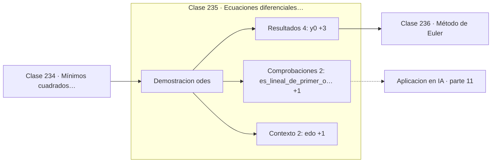

# 235 — Ecuaciones diferenciales ordinarias

> [⬅️ 234 Mínimos cuadrados numéricos](../234-minimos-cuadrados-numericos/README.md) · [📚 Parte 11](../README.md) · [🏠 Programa](../../../README.md) · [236 Método de Euler ➡️](../236-metodo-de-euler/README.md)

**Parte:** 11 — Métodos numéricos y computación científica · **Nivel:** `cientifico` · **Horas estimadas:** 4
**Motor:** `engines.part11` · **Demostración:** `odes` · **Clase 15 de 20** de la parte

---

## 🎯 Propósito

**Un problema de valor inicial fija una única trayectoria, y conocerla permite medir el error.**

Raíces, interpolación, splines, diferenciación y cuadratura numérica, sistemas lineales iterativos, mínimos cuadrados y ecuaciones diferenciales.

## ✅ Resultados de aprendizaje

Al terminar podrás:

1. Explicar **Ecuaciones diferenciales ordinarias** con lenguaje cotidiano y con notación matemática.
2. Resolver un caso pequeño a mano y anticipar el orden de magnitud del resultado.
3. Ejecutar y modificar `lab.py`, que corre la demostración `odes`.
4. Interpretar las 8 salidas del laboratorio y decir qué comprueba cada una.
5. Detectar el error típico de esta parte: aplicar runge-kutta con paso fijo a un sistema rígido.

## 🧩 Fórmulas de la clase

```text
y' = f(t, y),   y(t₀) = y₀
ejemplo: y' = −2y + t,  y(0) = 1
solución: y(t) = 0,25(2t − 1) + 1,25·e^(−2t)
```

## 🗺️ Ubicación en el programa



## 📖 Fundamentos

Una ecuación diferencial ordinaria relaciona una función desconocida con sus derivadas. El
**problema de valor inicial** añade el valor en un punto, y bajo condiciones suaves de `f`
eso determina una única trayectoria: el teorema de Picard-Lindelöf garantiza existencia y
unicidad local.

Las EDO son el lenguaje de casi toda la modelización dinámica: mecánica, circuitos,
cinética química, poblaciones, epidemias y control. Que la mayoría no tenga solución
analítica es lo que motiva las clases siguientes, y es la norma más que la excepción.

Para desarrollar y validar métodos numéricos conviene partir de un problema **con solución
conocida**. El ejemplo de esta parte, `y' = −2y + t`, es lineal de primer orden y se
resuelve con factor integrante. Tener la solución exacta permite medir el error real de
cada método y verificar empíricamente su orden.

La estructura de la ecuación anticipa un problema que aparecerá luego. El coeficiente −2
del término lineal determina la escala de tiempo del decaimiento, y con ella el paso
máximo que un método explícito puede dar sin volverse inestable. Cuando en un sistema
conviven coeficientes muy dispares —−2 y −2000— aparece la **rigidez**, y los métodos
explícitos dejan de ser viables.

## 🧮 Ejemplo trabajado

El problema de referencia de esta parte.

```text
EDO:  y' = −2y + t          y(0) = 1

Solución analítica por factor integrante:
  y(t) = 0,25·(2t − 1) + 1,25·e^(−2t)

Comprobación en t = 0:
  0,25·(−1) + 1,25·1 = −0,25 + 1,25 = 1,0             ✓

Valores de referencia:
  y(0)   = 1,000000000000
  y(0,5) = 0,459849979076
  y(1)   = 0,419169104046

Pendiente inicial: f(0, 1) = −2·1 + 0 = −2,0

Toda la parte mide los métodos contra y(1) = 0,419169104046.
```

## 🔬 Qué ejecuta el laboratorio

`odes` — EDO con solución analítica para medir el error de cada método.

| Grupo | Salidas |
|---|---|
| 🔢 Resultados numéricos (4) | `y(0)`, `y(1)_exacta`, `condicion_inicial`, `f(0,1)` |
| ✅ Comprobaciones de invariante (2) | `es_lineal_de_primer_orden`, `estable` |

Las claves booleanas no son adorno: si alguna fuera `False`, el resultado numérico
no sería fiable aunque el programa terminase sin error.

```bash
python classes/part-11-metodos-numericos-y-computacion-cientifica/235-ecuaciones-diferenciales-ordinarias/lab.py
compmath run 235
```

> [!TIP]
> Antes de ejecutar, **escribe tu predicción**. Un laboratorio que confirma lo que
> esperabas enseña tanto como uno que te contradice, pero solo si la predicción
> existía antes del resultado.

## ⚠️ Errores conceptuales frecuentes

1. Resolver numéricamente sin comprobar antes si hay solución analítica.
2. Olvidar la condición inicial y quedarse con una familia de soluciones.
3. Ignorar la escala de tiempo del problema al elegir el paso.

## 🚀 Dónde se usa de verdad

Modelos dinámicos en física e ingeniería, farmacocinética, modelos epidemiológicos,
sistemas de control y Neural ODE.

## 🤖 Conexión con IA

Los Neural ODE, los samplers de difusión y los optimizadores de segundo orden son métodos numéricos con parámetros aprendidos.

## 📓 Notebooks

| Archivo | Para qué |
|---|---|
| [`notebook.ipynb`](notebook.ipynb) | recorrido guiado con la demostración ejecutada |
| [`notebook_student.ipynb`](notebook_student.ipynb) | versión con `TODO` para resolver |
| [`notebook_solution.ipynb`](notebook_solution.ipynb) | solución de referencia verificada |

## 📝 Evaluación

| Criterio | Peso |
|---|---:|
| Comprensión conceptual | 25 % |
| Resolución manual | 25 % |
| Implementación y verificación | 25 % |
| Interpretación y comunicación | 15 % |
| Conexión con aplicación real | 10 % |

Detalle y criterios de error crítico en [`assessment.md`](assessment.md).

## ❓ Preguntas de comprobación

1. ¿Cuál es la entrada, cuál la salida y qué unidades tienen?
2. ¿Qué operación domina el comportamiento del resultado?
3. ¿Qué caso extremo revelaría un error conceptual?
4. ¿Cómo verificarías el resultado por un método independiente?
5. ¿Dónde aparece esto en simulación física?

Si necesitas releer el código para responderlas, la clase todavía no está superada.

## 📥 Entregable

`notebook_student.ipynb` resuelto más un párrafo que explique el resultado **sin citar
código**: qué entra, qué sale, qué invariante se comprueba y qué pasaría en un caso límite.

## 📚 Bibliografía de la clase

Esta clase enseña **Métodos numéricos · Computación científica · Ecuaciones diferenciales · Teoría de la aproximación · Álgebra lineal numérica**. Cada obra dice qué aporta aquí y cómo se comprobó su localizador:

- [Burden, R.; Faires, J. *Numerical Analysis*, 10ª ed., Cengage, 2015, cap. 5](https://openlibrary.org/isbn/9781305253667) — Métodos numéricos: el tema de esta clase · ISBN-13 `9781305253667` verificado en International ISBN Agency (2026-08-20).
- [Hairer, E.; Nørsett, S.; Wanner, G. *Solving Ordinary Differential Equations I*, 2ª ed., Springer, 1993](https://doi.org/10.1007/978-3-540-78862-1) — Ecuaciones diferenciales y Métodos numéricos: el tema de esta clase · ISBN-13 `9783540788621` verificado en International ISBN Agency (2026-08-19).

Bibliografía de todas las clases, con el porqué de cada obra, en [`docs/BIBLIOGRAPHY.md`](../../../docs/BIBLIOGRAPHY.md) · localizador y estado de cada obra en [`sources/bibliography.json`](../../../sources/bibliography.json).

## 📂 Material de la clase

[`intuition.md`](intuition.md) · [`theory.md`](theory.md) · [`derivation.md`](derivation.md) · [`exercises.md`](exercises.md) · [`assessment.md`](assessment.md) · [`where-is-this-used.md`](where-is-this-used.md) · [`lesson.yaml`](lesson.yaml)

---

> [⬅️ 234 Mínimos cuadrados numéricos](../234-minimos-cuadrados-numericos/README.md) · [📚 Parte 11](../README.md) · [🏠 Programa](../../../README.md) · [236 Método de Euler ➡️](../236-metodo-de-euler/README.md)
