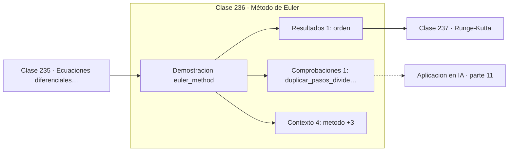

# 236 — Método de Euler

> [⬅️ 235 Ecuaciones diferenciales ordinarias](../235-ecuaciones-diferenciales-ordinarias/README.md) · [📚 Parte 11](../README.md) · [🏠 Programa](../../../README.md) · [237 Runge-Kutta ➡️](../237-runge-kutta/README.md)

**Parte:** 11 — Métodos numéricos y computación científica · **Nivel:** `cientifico` · **Horas estimadas:** 4
**Motor:** `engines.part11` · **Demostración:** `euler_method` · **Clase 16 de 20** de la parte

---

## 🎯 Propósito

**Euler es el método más barato por paso y el más caro por dígito de precisión.**

Raíces, interpolación, splines, diferenciación y cuadratura numérica, sistemas lineales iterativos, mínimos cuadrados y ecuaciones diferenciales.

## ✅ Resultados de aprendizaje

Al terminar podrás:

1. Explicar **Método de Euler** con lenguaje cotidiano y con notación matemática.
2. Resolver un caso pequeño a mano y anticipar el orden de magnitud del resultado.
3. Ejecutar y modificar `lab.py`, que corre la demostración `euler_method`.
4. Interpretar las 6 salidas del laboratorio y decir qué comprueba cada una.
5. Detectar el error típico de esta parte: usar tolerancia absoluta cuando la escala del problema es grande.

## 🧩 Fórmulas de la clase

```text
yₙ₊₁ = yₙ + h·f(tₙ, yₙ)
error global O(h): duplicar pasos divide el error por 2
estabilidad para y' = λy:  h < 2/|λ|
```

## 🗺️ Ubicación en el programa



## 📖 Fundamentos

El método de Euler avanza siguiendo la tangente: evalúa la pendiente en el punto actual y
da un paso recto en esa dirección. Es la traducción directa de la definición de derivada, y
su valor es pedagógico: todo método más sofisticado se entiende como una mejora sobre esta
idea.

Su error local por paso es `O(h²)`, pero al acumularse sobre `1/h` pasos el error global
resulta `O(h)`. Eso significa que **duplicar el trabajo solo divide el error por dos**, una
relación pésima. Para diez veces más precisión hacen falta diez veces más pasos, y para
precisión de ingeniería el coste se vuelve prohibitivo.

La **estabilidad** es un problema distinto y suele confundirse con la precisión. Para
`y' = λy` con `λ` negativo, la solución decae, pero Euler solo reproduce ese decaimiento si
`h < 2/|λ|`. Con un paso mayor, la solución numérica **oscila y crece sin límite** aunque
la real tienda a cero. No es imprecisión: es divergencia.

Existe la variante **implícita**, `yₙ₊₁ = yₙ + h·f(tₙ₊₁, yₙ₊₁)`, que exige resolver una
ecuación en cada paso pero es incondicionalmente estable. Ese intercambio —más trabajo por
paso a cambio de pasos mucho mayores— es exactamente la razón de ser de los métodos
implícitos en problemas rígidos.

## 🧮 Ejemplo trabajado

Euler sobre el problema de referencia, hacia y(1) = 0,419169.

```text
pasos     h        y(1)         error      razón
   5    0,200    0,347200     7,197e-02      —
  10    0,100    0,384218     3,495e-02     2,06
  20    0,050    0,401953     1,722e-02     2,03
  40    0,025    0,410620     8,549e-03     2,01
  80    0,0125   0,414909     4,260e-03     2,01

La razón se estabiliza en 2 → orden 1 confirmado     ✓

Con 80 pasos el error sigue siendo 4,3e-03.
RK4 con 5 pasos alcanza 1,0e-04: 40 veces mejor
con 16 veces menos trabajo.

Estabilidad: para λ = −2 se exige h < 1,0.
Con h = 1,1 la solución numérica oscila y diverge.
```

## 🔬 Qué ejecuta el laboratorio

`euler_method` — Euler explícito: orden 1 y coste mínimo.

| Grupo | Salidas |
|---|---|
| 🔢 Resultados numéricos (1) | `orden` |
| ✅ Comprobaciones de invariante (1) | `duplicar_pasos_divide_el_error_por_2` |

Las claves booleanas no son adorno: si alguna fuera `False`, el resultado numérico
no sería fiable aunque el programa terminase sin error.

```bash
python classes/part-11-metodos-numericos-y-computacion-cientifica/236-metodo-de-euler/lab.py
compmath run 236
```

> [!TIP]
> Antes de ejecutar, **escribe tu predicción**. Un laboratorio que confirma lo que
> esperabas enseña tanto como uno que te contradice, pero solo si la predicción
> existía antes del resultado.

## ⚠️ Errores conceptuales frecuentes

1. Usar Euler explícito en problemas rígidos.
2. Confundir inestabilidad con falta de precisión.
3. Reducir h para ganar precisión sin comprobar el coste acumulado.

## 🚀 Dónde se usa de verdad

Prototipado rápido de simulaciones, comprensión conceptual de integradores, esquemas de
difusión discretizados y base del descenso por gradiente visto como flujo.

## 🤖 Conexión con IA

Los Neural ODE, los samplers de difusión y los optimizadores de segundo orden son métodos numéricos con parámetros aprendidos.

## 📓 Notebooks

| Archivo | Para qué |
|---|---|
| [`notebook.ipynb`](notebook.ipynb) | recorrido guiado con la demostración ejecutada |
| [`notebook_student.ipynb`](notebook_student.ipynb) | versión con `TODO` para resolver |
| [`notebook_solution.ipynb`](notebook_solution.ipynb) | solución de referencia verificada |

## 📝 Evaluación

| Criterio | Peso |
|---|---:|
| Comprensión conceptual | 25 % |
| Resolución manual | 25 % |
| Implementación y verificación | 25 % |
| Interpretación y comunicación | 15 % |
| Conexión con aplicación real | 10 % |

Detalle y criterios de error crítico en [`assessment.md`](assessment.md).

## ❓ Preguntas de comprobación

1. ¿Cuál es la entrada, cuál la salida y qué unidades tienen?
2. ¿Qué operación domina el comportamiento del resultado?
3. ¿Qué caso extremo revelaría un error conceptual?
4. ¿Cómo verificarías el resultado por un método independiente?
5. ¿Dónde aparece esto en simulación física?

Si necesitas releer el código para responderlas, la clase todavía no está superada.

## 📥 Entregable

`notebook_student.ipynb` resuelto más un párrafo que explique el resultado **sin citar
código**: qué entra, qué sale, qué invariante se comprueba y qué pasaría en un caso límite.

## 🔗 Referencias

- [Burden, R.; Faires, J. *Numerical Analysis*, 10ª ed., Cengage, 2015, cap. 5](https://www.cengage.com/)
- [Hairer, E.; Wanner, G. *Solving Ordinary Differential Equations II*, 2ª ed., Springer, 1996](https://doi.org/10.1007/978-3-642-05221-7)

Bibliografía completa de la parte en [`../../../docs/BIBLIOGRAPHY.md`](../../../docs/BIBLIOGRAPHY.md).

## 📂 Material de la clase

[`intuition.md`](intuition.md) · [`theory.md`](theory.md) · [`derivation.md`](derivation.md) · [`exercises.md`](exercises.md) · [`assessment.md`](assessment.md) · [`where-is-this-used.md`](where-is-this-used.md) · [`lesson.yaml`](lesson.yaml)

---

> [⬅️ 235 Ecuaciones diferenciales ordinarias](../235-ecuaciones-diferenciales-ordinarias/README.md) · [📚 Parte 11](../README.md) · [🏠 Programa](../../../README.md) · [237 Runge-Kutta ➡️](../237-runge-kutta/README.md)
