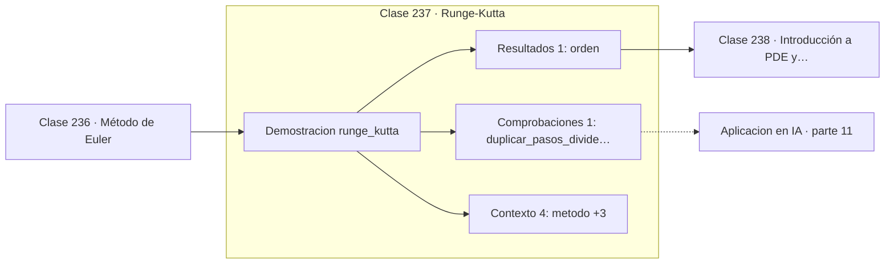

# 237 — Runge-Kutta

> [⬅️ 236 Método de Euler](../236-metodo-de-euler/README.md) · [📚 Parte 11](../README.md) · [🏠 Programa](../../../README.md) · [238 Introducción a PDE y discretización ➡️](../238-introduccion-a-pde-y-discretizacion/README.md)

**Parte:** 11 — Métodos numéricos y computación científica · **Nivel:** `cientifico` · **Horas estimadas:** 4
**Motor:** `engines.part11` · **Demostración:** `runge_kutta` · **Clase 17 de 20** de la parte

---

## 🎯 Propósito

**RK4 cuesta cuatro evaluaciones por paso y las devuelve multiplicadas.**

Raíces, interpolación, splines, diferenciación y cuadratura numérica, sistemas lineales iterativos, mínimos cuadrados y ecuaciones diferenciales.

## ✅ Resultados de aprendizaje

Al terminar podrás:

1. Explicar **Runge-Kutta** con lenguaje cotidiano y con notación matemática.
2. Resolver un caso pequeño a mano y anticipar el orden de magnitud del resultado.
3. Ejecutar y modificar `lab.py`, que corre la demostración `runge_kutta`.
4. Interpretar las 6 salidas del laboratorio y decir qué comprueba cada una.
5. Detectar el error típico de esta parte: iterar sin límite máximo y colgar el proceso.

## 🧩 Fórmulas de la clase

```text
k₁ = f(tₙ, yₙ);  k₂ = f(tₙ+h/2, yₙ+h·k₁/2)
k₃ = f(tₙ+h/2, yₙ+h·k₂/2);  k₄ = f(tₙ+h, yₙ+h·k₃)
yₙ₊₁ = yₙ + (h/6)(k₁ + 2k₂ + 2k₃ + k₄)
```

## 🗺️ Ubicación en el programa



## 📖 Fundamentos

Runge-Kutta de cuarto orden promedia cuatro estimaciones de la pendiente dentro del
intervalo: una al inicio, dos en el punto medio y una al final, con pesos `1, 2, 2, 1`. Ese
promedio ponderado cancela los términos de error hasta orden 4 del desarrollo de Taylor.

El resultado es una relación coste-beneficio excelente. Cuatro evaluaciones por paso, pero
error `O(h⁴)`: duplicar los pasos divide el error por 16. La comparación con Euler es
contundente y merece verse en números: **RK4 con 5 pasos —20 evaluaciones— supera a Euler
con 80 pasos —80 evaluaciones—** por un factor de 40 en precisión.

RK4 es el estándar de facto para problemas no rígidos, y su variante adaptativa
—Dormand-Prince, el `RK45` de las bibliotecas— añade una estimación del error por paso que
permite ajustar `h` automáticamente: pasos grandes donde la solución es suave y pequeños
donde cambia rápido. Es lo que se usa en producción.

Su límite es el mismo que el de Euler, solo que desplazado: sigue siendo explícito y su
región de estabilidad, aunque mayor, es finita. Con **problemas rígidos** —donde conviven
escalas de tiempo que difieren en órdenes de magnitud— el paso queda limitado por la escala
más rápida aunque la solución de interés sea lenta, y hay que pasar a métodos implícitos
como BDF.

## 🧮 Ejemplo trabajado

RK4 sobre el mismo problema de referencia.

```text
pasos     y(1)              error        razón
   5   0,419270018     1,0091e-04         —
  10   0,419175447     6,3430e-06       15,91
  20   0,419169501     3,9700e-07       15,98
  40   0,419169129     2,4820e-08       16,00

La razón tiende a 16 → orden 4 confirmado            ✓

Comparación por evaluaciones de f:
  Euler,  80 pasos =  80 evaluaciones → error 4,26e-03
  RK4,     5 pasos =  20 evaluaciones → error 1,01e-04

RK4 gana por 42 veces con la cuarta parte del trabajo.
```

## 🔬 Qué ejecuta el laboratorio

`runge_kutta` — RK4: cuatro evaluaciones por paso, error O(h⁴).

| Grupo | Salidas |
|---|---|
| 🔢 Resultados numéricos (1) | `orden` |
| ✅ Comprobaciones de invariante (1) | `duplicar_pasos_divide_el_error_por_16` |

Las claves booleanas no son adorno: si alguna fuera `False`, el resultado numérico
no sería fiable aunque el programa terminase sin error.

```bash
python classes/part-11-metodos-numericos-y-computacion-cientifica/237-runge-kutta/lab.py
compmath run 237
```

> [!TIP]
> Antes de ejecutar, **escribe tu predicción**. Un laboratorio que confirma lo que
> esperabas enseña tanto como uno que te contradice, pero solo si la predicción
> existía antes del resultado.

## ⚠️ Errores conceptuales frecuentes

1. Aplicar RK4 con paso fijo a un sistema rígido.
2. Comparar métodos por número de pasos en vez de por evaluaciones de f.
3. Usar paso fijo cuando la solución tiene regiones de cambio rápido.

## 🚀 Dónde se usa de verdad

Simulación de sistemas dinámicos, mecánica orbital, Neural ODE, samplers de modelos de
difusión y motores físicos.

## 🤖 Conexión con IA

Los Neural ODE, los samplers de difusión y los optimizadores de segundo orden son métodos numéricos con parámetros aprendidos.

## 📓 Notebooks

| Archivo | Para qué |
|---|---|
| [`notebook.ipynb`](notebook.ipynb) | recorrido guiado con la demostración ejecutada |
| [`notebook_student.ipynb`](notebook_student.ipynb) | versión con `TODO` para resolver |
| [`notebook_solution.ipynb`](notebook_solution.ipynb) | solución de referencia verificada |

## 📝 Evaluación

| Criterio | Peso |
|---|---:|
| Comprensión conceptual | 25 % |
| Resolución manual | 25 % |
| Implementación y verificación | 25 % |
| Interpretación y comunicación | 15 % |
| Conexión con aplicación real | 10 % |

Detalle y criterios de error crítico en [`assessment.md`](assessment.md).

## ❓ Preguntas de comprobación

1. ¿Cuál es la entrada, cuál la salida y qué unidades tienen?
2. ¿Qué operación domina el comportamiento del resultado?
3. ¿Qué caso extremo revelaría un error conceptual?
4. ¿Cómo verificarías el resultado por un método independiente?
5. ¿Dónde aparece esto en simulación física?

Si necesitas releer el código para responderlas, la clase todavía no está superada.

## 📥 Entregable

`notebook_student.ipynb` resuelto más un párrafo que explique el resultado **sin citar
código**: qué entra, qué sale, qué invariante se comprueba y qué pasaría en un caso límite.

## 🔗 Referencias

- [Hairer, E.; Nørsett, S.; Wanner, G. *Solving Ordinary Differential Equations I*, 2ª ed., Springer, 1993](https://doi.org/10.1007/978-3-540-78862-1)
- [Press, W. et al. *Numerical Recipes*, 3ª ed., Cambridge, 2007, cap. 17](http://numerical.recipes/)

Bibliografía completa de la parte en [`../../../docs/BIBLIOGRAPHY.md`](../../../docs/BIBLIOGRAPHY.md).

## 📂 Material de la clase

[`intuition.md`](intuition.md) · [`theory.md`](theory.md) · [`derivation.md`](derivation.md) · [`exercises.md`](exercises.md) · [`assessment.md`](assessment.md) · [`where-is-this-used.md`](where-is-this-used.md) · [`lesson.yaml`](lesson.yaml)

---

> [⬅️ 236 Método de Euler](../236-metodo-de-euler/README.md) · [📚 Parte 11](../README.md) · [🏠 Programa](../../../README.md) · [238 Introducción a PDE y discretización ➡️](../238-introduccion-a-pde-y-discretizacion/README.md)
