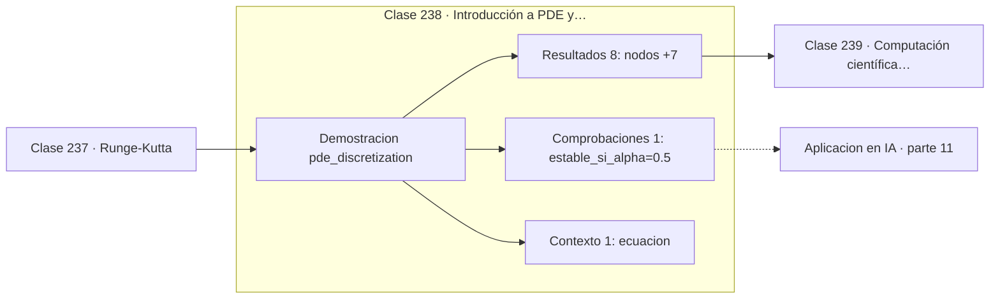

# 238 — Introducción a PDE y discretización

> [⬅️ 237 Runge-Kutta](../237-runge-kutta/README.md) · [📚 Parte 11](../README.md) · [🏠 Programa](../../../README.md) · [239 Computación científica con SciPy ➡️](../239-computacion-cientifica-con-scipy/README.md)

**Parte:** 11 — Métodos numéricos y computación científica · **Nivel:** `cientifico` · **Horas estimadas:** 4
**Motor:** `engines.part11` · **Demostración:** `pde_discretization` · **Clase 18 de 20** de la parte

---

## 🎯 Propósito

**La condición de estabilidad no es una recomendación: violarla hace explotar la simulación.**

Raíces, interpolación, splines, diferenciación y cuadratura numérica, sistemas lineales iterativos, mínimos cuadrados y ecuaciones diferenciales.

## ✅ Resultados de aprendizaje

Al terminar podrás:

1. Explicar **Introducción a PDE y discretización** con lenguaje cotidiano y con notación matemática.
2. Resolver un caso pequeño a mano y anticipar el orden de magnitud del resultado.
3. Ejecutar y modificar `lab.py`, que corre la demostración `pde_discretization`.
4. Interpretar las 10 salidas del laboratorio y decir qué comprueba cada una.
5. Detectar el error típico de esta parte: aplicar runge-kutta con paso fijo a un sistema rígido.

## 🧩 Fórmulas de la clase

```text
ecuación del calor: u_t = u_xx
esquema explícito: u_i^(n+1) = u_i^n + α(u_{i+1}^n − 2u_i^n + u_{i−1}^n)
α = Δt/Δx² ≤ 0,5 para estabilidad
```

## 🗺️ Ubicación en el programa



## 📖 Fundamentos

Una ecuación en derivadas parciales involucra derivadas respecto de varias variables, y
describe fenómenos distribuidos en espacio y tiempo: calor, ondas, fluidos, difusión. El
método de **diferencias finitas** las discretiza sustituyendo cada derivada por un cociente
de diferencias sobre una malla.

Para la ecuación del calor en una dimensión, la derivada temporal se aproxima con
diferencia adelantada y la espacial de segundo orden con la fórmula central de la clase
227. El resultado es un esquema explícito donde cada valor nuevo se calcula directamente a
partir de tres valores viejos, sin resolver ningún sistema.

La sorpresa está en la restricción. El parámetro `α = Δt/Δx²` debe cumplir `α ≤ 0,5`, y esa
condición de tipo **Courant** tiene una consecuencia brutal: refinar la malla espacial a la
mitad obliga a dividir el paso temporal por **cuatro**. El coste total se multiplica por
ocho, y por eso las simulaciones explícitas de difusión se vuelven caras muy deprisa.

Violar la condición no produce imprecisión sino **divergencia**: la solución numérica
oscila con amplitud creciente hasta desbordar, y lo hace en pocos pasos. Los esquemas
implícitos como Crank-Nicolson son incondicionalmente estables y permiten pasos temporales
mucho mayores a cambio de resolver un sistema tridiagonal en cada paso, que es barato.

## 🧮 Ejemplo trabajado

Calor en una barra con extremos fríos, esquema explícito.

```text
u_t = u_xx      u(0,t) = u(1,t) = 0

nodos = 21      Δx = 0,05      Δt = 0,001
α = Δt / Δx² = 0,001 / 0,0025 = 0,4

α = 0,4 ≤ 0,5   →   esquema estable                  ✓
La solución decae suavemente hacia cero, como debe.

Si se subiera a Δt = 0,002:
  α = 0,8 > 0,5  →  oscilaciones que crecen
  en 20 pasos los valores desbordan.

Coste de refinar: Δx a la mitad (41 nodos)
  exige Δt / 4  →  4× más pasos × 2× más nodos = 8× coste.
```

## 🔬 Qué ejecuta el laboratorio

`pde_discretization` — Discretización de la ecuación del calor en 1D (esquema explícito).

| Grupo | Salidas |
|---|---|
| 🔢 Resultados numéricos (8) | `nodos`, `dx`, `dt`, `numero_de_courant_alpha`, `pico_inicial`, `pico_final_numerico`, `pico_final_analitico`, `error_maximo` |
| ✅ Comprobaciones de invariante (1) | `estable_si_alpha<=0.5` |

Las claves booleanas no son adorno: si alguna fuera `False`, el resultado numérico
no sería fiable aunque el programa terminase sin error.

```bash
python classes/part-11-metodos-numericos-y-computacion-cientifica/238-introduccion-a-pde-y-discretizacion/lab.py
compmath run 238
```

> [!TIP]
> Antes de ejecutar, **escribe tu predicción**. Un laboratorio que confirma lo que
> esperabas enseña tanto como uno que te contradice, pero solo si la predicción
> existía antes del resultado.

## ⚠️ Errores conceptuales frecuentes

1. Refinar la malla espacial sin ajustar el paso temporal.
2. Interpretar las oscilaciones crecientes como un fenómeno físico.
3. Usar esquemas explícitos donde el implícito sería mucho más barato.

## 🚀 Dónde se usa de verdad

Simulación térmica, dinámica de fluidos, propagación de ondas, modelos financieros de tipo
Black-Scholes y difusión en visión por computador.

## 🤖 Conexión con IA

Los Neural ODE, los samplers de difusión y los optimizadores de segundo orden son métodos numéricos con parámetros aprendidos.

## 📓 Notebooks

| Archivo | Para qué |
|---|---|
| [`notebook.ipynb`](notebook.ipynb) | recorrido guiado con la demostración ejecutada |
| [`notebook_student.ipynb`](notebook_student.ipynb) | versión con `TODO` para resolver |
| [`notebook_solution.ipynb`](notebook_solution.ipynb) | solución de referencia verificada |

## 📝 Evaluación

| Criterio | Peso |
|---|---:|
| Comprensión conceptual | 25 % |
| Resolución manual | 25 % |
| Implementación y verificación | 25 % |
| Interpretación y comunicación | 15 % |
| Conexión con aplicación real | 10 % |

Detalle y criterios de error crítico en [`assessment.md`](assessment.md).

## ❓ Preguntas de comprobación

1. ¿Cuál es la entrada, cuál la salida y qué unidades tienen?
2. ¿Qué operación domina el comportamiento del resultado?
3. ¿Qué caso extremo revelaría un error conceptual?
4. ¿Cómo verificarías el resultado por un método independiente?
5. ¿Dónde aparece esto en simulación física?

Si necesitas releer el código para responderlas, la clase todavía no está superada.

## 📥 Entregable

`notebook_student.ipynb` resuelto más un párrafo que explique el resultado **sin citar
código**: qué entra, qué sale, qué invariante se comprueba y qué pasaría en un caso límite.

## 🔗 Referencias

- [LeVeque, R. *Finite Difference Methods for Ordinary and Partial Differential Equations*, SIAM, 2007](https://doi.org/10.1137/1.9780898717839) — *uso:* desarrollo formal del tema en «Introducción a PDE y discretización».
- [Courant, R.; Friedrichs, K.; Lewy, H. *Über die partiellen Differenzengleichungen der mathematischen Physik*, 1928](https://doi.org/10.1007/BF01448839) — *uso:* artículo de origen consultado en «Introducción a PDE y discretización».

Bibliografía completa de la parte en [`../../../docs/BIBLIOGRAPHY.md`](../../../docs/BIBLIOGRAPHY.md) · localizador verificable de cada obra en [`sources/bibliography.json`](../../../sources/bibliography.json).

## 📂 Material de la clase

[`intuition.md`](intuition.md) · [`theory.md`](theory.md) · [`derivation.md`](derivation.md) · [`exercises.md`](exercises.md) · [`assessment.md`](assessment.md) · [`where-is-this-used.md`](where-is-this-used.md) · [`lesson.yaml`](lesson.yaml)

---

> [⬅️ 237 Runge-Kutta](../237-runge-kutta/README.md) · [📚 Parte 11](../README.md) · [🏠 Programa](../../../README.md) · [239 Computación científica con SciPy ➡️](../239-computacion-cientifica-con-scipy/README.md)
