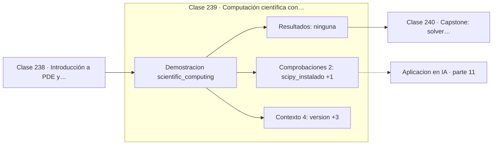

# 239 — Computación científica con SciPy

> [⬅️ 238 Introducción a PDE y discretización](../238-introduccion-a-pde-y-discretizacion/README.md) · [📚 Parte 11](../README.md) · [🏠 Programa](../../../README.md) · [240 Capstone: solver numérico con informe de error ➡️](../240-capstone-solver-numerico-con-informe-de-error/README.md)

**Parte:** 11 — Métodos numéricos y computación científica · **Nivel:** `cientifico` · **Horas estimadas:** 4
**Motor:** `engines.part11` · **Demostración:** `scientific_computing` · **Clase 19 de 20** de la parte

---

## 🎯 Propósito

**Se implementa a mano para saber cuándo la biblioteca falla, y se usa la biblioteca para producción.**

Raíces, interpolación, splines, diferenciación y cuadratura numérica, sistemas lineales iterativos, mínimos cuadrados y ecuaciones diferenciales.

## ✅ Resultados de aprendizaje

Al terminar podrás:

1. Explicar **Computación científica con SciPy** con lenguaje cotidiano y con notación matemática.
2. Resolver un caso pequeño a mano y anticipar el orden de magnitud del resultado.
3. Ejecutar y modificar `lab.py`, que corre la demostración `scientific_computing`.
4. Interpretar las 6 salidas del laboratorio y decir qué comprueba cada una.
5. Detectar el error típico de esta parte: usar tolerancia absoluta cuando la escala del problema es grande.

## 🧩 Fórmulas de la clase

```text
bisección → scipy.optimize.brentq
RK4 → scipy.integrate.solve_ivp
cuadratura → scipy.integrate.quad
```

## 🗺️ Ubicación en el programa



## 📖 Fundamentos

SciPy implementa versiones de todos los métodos de esta parte, y con mejor calidad de la
que se puede alcanzar en un curso: control adaptativo del paso, detección de rigidez,
selección automática de algoritmo, estimación de error y décadas de código Fortran probado
debajo.

La pregunta legítima es entonces por qué implementarlos a mano. La respuesta es que **usar
un método sin entenderlo impide saber cuándo falla**. `solve_ivp` con opciones por defecto
puede devolver resultados sin sentido en un problema rígido, y solo quien sabe qué es la
rigidez interpretará el aviso y cambiará a `method='BDF'`. La biblioteca no protege de la
ignorancia del usuario.

Hay además una razón de diagnóstico. Cuando un cálculo produce números extraños, saber
distinguir entre un error de modelado, un problema mal condicionado, una tolerancia mal
puesta y un fallo real de la biblioteca exige entender el algoritmo. Sin ese conocimiento,
el único recurso es probar opciones al azar.

La regla práctica es clara: **implementar para aprender, usar la biblioteca para
producir**. Reescribir un integrador en código de producción es reintroducir errores que
SciPy resolvió hace veinte años. El motor de esta parte no depende de SciPy precisamente
para que las implementaciones didácticas sean legibles y ejecutables en cualquier entorno.

## 🧮 Ejemplo trabajado

Correspondencia entre lo implementado y su equivalente en SciPy.

```text
SciPy 1.17.1 disponible en este entorno

implementación propia        equivalente en SciPy
---------------------------------------------------------
bisection                    scipy.optimize.brentq
newton_raphson               scipy.optimize.newton
lagrange_interpolation       scipy.interpolate.lagrange
splines                      scipy.interpolate.CubicSpline
trapezoid_rule               scipy.integrate.trapezoid
simpson_rule                 scipy.integrate.simpson
quadrature                   scipy.integrate.quad
direct_linear_solvers        scipy.linalg.lu_solve
jacobi_gauss_seidel          scipy.sparse.linalg.cg
numerical_least_squares      scipy.linalg.lstsq
euler_method / runge_kutta   scipy.integrate.solve_ivp

Este motor no requiere SciPy: todas las implementaciones
son de biblioteca estándar y ejecutables sin dependencias.
```

## 🔬 Qué ejecuta el laboratorio

`scientific_computing` — Qué aporta SciPy sobre una implementación propia.

| Grupo | Salidas |
|---|---|
| 🔢 Resultados numéricos (0) | — |
| ✅ Comprobaciones de invariante (2) | `scipy_instalado`, `este_motor_no_requiere_scipy` |

Las claves booleanas no son adorno: si alguna fuera `False`, el resultado numérico
no sería fiable aunque el programa terminase sin error.

```bash
python classes/part-11-metodos-numericos-y-computacion-cientifica/239-computacion-cientifica-con-scipy/lab.py
compmath run 239
```

> [!TIP]
> Antes de ejecutar, **escribe tu predicción**. Un laboratorio que confirma lo que
> esperabas enseña tanto como uno que te contradice, pero solo si la predicción
> existía antes del resultado.

## ⚠️ Errores conceptuales frecuentes

1. Reescribir integradores propios en código de producción.
2. Usar solve_ivp con opciones por defecto en problemas rígidos.
3. Confiar en la salida de una biblioteca sin comprobar su diagnóstico de convergencia.

## 🚀 Dónde se usa de verdad

Elección de herramientas en proyectos científicos, depuración de cálculos numéricos,
validación cruzada entre implementaciones y decisiones de rendimiento.

## 🤖 Conexión con IA

Los Neural ODE, los samplers de difusión y los optimizadores de segundo orden son métodos numéricos con parámetros aprendidos.

## 📓 Notebooks

| Archivo | Para qué |
|---|---|
| [`notebook.ipynb`](notebook.ipynb) | recorrido guiado con la demostración ejecutada |
| [`notebook_student.ipynb`](notebook_student.ipynb) | versión con `TODO` para resolver |
| [`notebook_solution.ipynb`](notebook_solution.ipynb) | solución de referencia verificada |

## 📝 Evaluación

| Criterio | Peso |
|---|---:|
| Comprensión conceptual | 25 % |
| Resolución manual | 25 % |
| Implementación y verificación | 25 % |
| Interpretación y comunicación | 15 % |
| Conexión con aplicación real | 10 % |

Detalle y criterios de error crítico en [`assessment.md`](assessment.md).

## ❓ Preguntas de comprobación

1. ¿Cuál es la entrada, cuál la salida y qué unidades tienen?
2. ¿Qué operación domina el comportamiento del resultado?
3. ¿Qué caso extremo revelaría un error conceptual?
4. ¿Cómo verificarías el resultado por un método independiente?
5. ¿Dónde aparece esto en simulación física?

Si necesitas releer el código para responderlas, la clase todavía no está superada.

## 📥 Entregable

`notebook_student.ipynb` resuelto más un párrafo que explique el resultado **sin citar
código**: qué entra, qué sale, qué invariante se comprueba y qué pasaría en un caso límite.

## 🔗 Referencias

- [Virtanen, P. et al. *SciPy 1.0: fundamental algorithms for scientific computing*, Nature Methods, 2020](https://doi.org/10.1038/s41592-019-0686-2)
- [Documentación de SciPy](https://docs.scipy.org/doc/scipy/)

Bibliografía completa de la parte en [`../../../docs/BIBLIOGRAPHY.md`](../../../docs/BIBLIOGRAPHY.md).

## 📂 Material de la clase

[`intuition.md`](intuition.md) · [`theory.md`](theory.md) · [`derivation.md`](derivation.md) · [`exercises.md`](exercises.md) · [`assessment.md`](assessment.md) · [`where-is-this-used.md`](where-is-this-used.md) · [`lesson.yaml`](lesson.yaml)

---

> [⬅️ 238 Introducción a PDE y discretización](../238-introduccion-a-pde-y-discretizacion/README.md) · [📚 Parte 11](../README.md) · [🏠 Programa](../../../README.md) · [240 Capstone: solver numérico con informe de error ➡️](../240-capstone-solver-numerico-con-informe-de-error/README.md)
