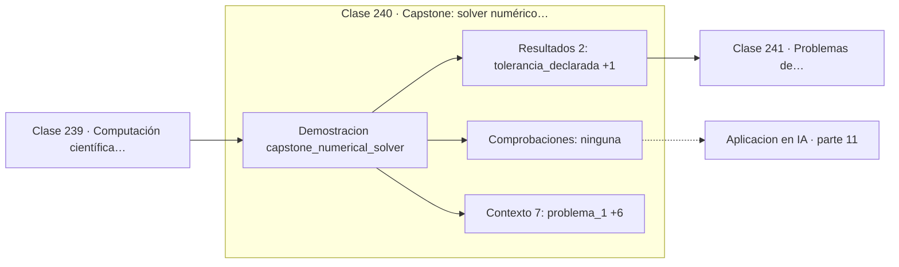

# 240 — Capstone: solver numérico con informe de error

> [⬅️ 239 Computación científica con SciPy](../239-computacion-cientifica-con-scipy/README.md) · [📚 Parte 11](../README.md) · [🏠 Programa](../../../README.md) · [241 Problemas de optimización y función objetivo ➡️](../../part-12-optimizacion-matematica-y-computacional/241-problemas-de-optimizacion-y-funcion-objetivo/README.md)

**Parte:** 11 — Métodos numéricos y computación científica · **Nivel:** `cientifico` · **Horas estimadas:** 4
**Motor:** `engines.part11` · **Demostración:** `capstone_numerical_solver` · **Clase 20 de 20** de la parte

---

## 🎯 Propósito

**Un solver serio reporta su método, su tolerancia, su coste y su error estimado.**

Raíces, interpolación, splines, diferenciación y cuadratura numérica, sistemas lineales iterativos, mínimos cuadrados y ecuaciones diferenciales.

## ✅ Resultados de aprendizaje

Al terminar podrás:

1. Explicar **Capstone: solver numérico con informe de error** con lenguaje cotidiano y con notación matemática.
2. Resolver un caso pequeño a mano y anticipar el orden de magnitud del resultado.
3. Ejecutar y modificar `lab.py`, que corre la demostración `capstone_numerical_solver`.
4. Interpretar las 9 salidas del laboratorio y decir qué comprueba cada una.
5. Detectar el error típico de esta parte: iterar sin límite máximo y colgar el proceso.

## 🧩 Fórmulas de la clase

```text
comparar métodos por evaluaciones de f, no por número de pasos
orden empírico: log₂(errorₕ / error_{h/2})
reportar: método, tolerancia, iteraciones, residuo
```

## 🗺️ Ubicación en el programa



## 📖 Fundamentos

El capstone integra la parte entera resolviendo dos problemas —una EDO y una raíz— con
varios métodos, y produciendo un informe comparativo. El objetivo no es encontrar el
resultado sino **justificarlo**: qué método, con qué tolerancia, a qué coste y con qué
error estimado.

La métrica de comparación correcta es el **número de evaluaciones de la función**, no el
número de pasos. RK4 da un paso por cada cuatro evaluaciones, y comparar «5 pasos de RK4»
con «5 pasos de Euler» es comparar cuatro unidades de trabajo con una. Con la métrica
correcta, RK4 sigue ganando por un margen enorme, y esa es la conclusión defendible.

El **orden empírico** se mide ejecutando con `h` y `h/2` y tomando el logaritmo en base 2
del cociente de errores. Si sale 1 para Euler y 4 para RK4, la implementación es correcta;
si sale otra cosa, hay un error o el problema no cumple las hipótesis de suavidad. Es la
prueba unitaria natural de un integrador.

El informe final debe declarar lo mismo que declararía un artículo: método usado,
tolerancia, número de iteraciones o pasos, residuo o error estimado, y las limitaciones
conocidas. Un solver que devuelve un número desnudo obliga al lector a confiar; uno que
devuelve el número con su diagnóstico permite verificar. Esa es toda la diferencia.

## 🧮 Ejemplo trabajado

Informe comparativo de los dos problemas del capstone.

```text
Problema 1:  y' = −2y + t,  y(0) = 1,  objetivo y(1)
exacto: 0,419169104046

método   pasos  evaluaciones    y(1)          error
euler      10        10       0,384218      3,49e-02
euler      40        40       0,410620      8,55e-03
rk4         5        20       0,419270      1,01e-04
rk4        10        40       0,419175      6,34e-06

Con 40 evaluaciones:
  euler → 8,55e-03        rk4 → 6,34e-06
  rk4 es 1 349 veces más preciso al mismo coste.

Problema 2:  raíz de x³ − 2x − 4
  bisección: raíz 1,999999999999   41 iteraciones
  newton:    raíz 2,000000000000    6 iteraciones

Recomendación: rk4 para la EDO, newton con respaldo
de bisección para la raíz, tolerancia relativa 1e-10
y tope de 100 iteraciones.
```

## 🔬 Qué ejecuta el laboratorio

`capstone_numerical_solver` — Capstone: solver con informe de error y criterio de parada declarado.

| Grupo | Salidas |
|---|---|
| 🔢 Resultados numéricos (2) | `tolerancia_declarada`, `max_iteraciones_declarado` |
| ✅ Comprobaciones de invariante (0) | — |

Las claves booleanas no son adorno: si alguna fuera `False`, el resultado numérico
no sería fiable aunque el programa terminase sin error.

```bash
python classes/part-11-metodos-numericos-y-computacion-cientifica/240-capstone-solver-numerico-con-informe-de-error/lab.py
compmath run 240
```

> [!TIP]
> Antes de ejecutar, **escribe tu predicción**. Un laboratorio que confirma lo que
> esperabas enseña tanto como uno que te contradice, pero solo si la predicción
> existía antes del resultado.

## ⚠️ Errores conceptuales frecuentes

1. Comparar métodos por pasos en vez de por evaluaciones.
2. Reportar un resultado sin la tolerancia ni el método usado.
3. Omitir el orden empírico como verificación de la implementación.

## 🚀 Dónde se usa de verdad

Informes de simulación, selección de solvers en proyectos científicos, benchmarking de
integradores y documentación de resultados numéricos.

## 🤖 Conexión con IA

Los Neural ODE, los samplers de difusión y los optimizadores de segundo orden son métodos numéricos con parámetros aprendidos.

## 📓 Notebooks

| Archivo | Para qué |
|---|---|
| [`notebook.ipynb`](notebook.ipynb) | recorrido guiado con la demostración ejecutada |
| [`notebook_student.ipynb`](notebook_student.ipynb) | versión con `TODO` para resolver |
| [`notebook_solution.ipynb`](notebook_solution.ipynb) | solución de referencia verificada |

## 📝 Evaluación

| Criterio | Peso |
|---|---:|
| Comprensión conceptual | 25 % |
| Resolución manual | 25 % |
| Implementación y verificación | 25 % |
| Interpretación y comunicación | 15 % |
| Conexión con aplicación real | 10 % |

Detalle y criterios de error crítico en [`assessment.md`](assessment.md).

## ❓ Preguntas de comprobación

1. ¿Cuál es la entrada, cuál la salida y qué unidades tienen?
2. ¿Qué operación domina el comportamiento del resultado?
3. ¿Qué caso extremo revelaría un error conceptual?
4. ¿Cómo verificarías el resultado por un método independiente?
5. ¿Dónde aparece esto en simulación física?

Si necesitas releer el código para responderlas, la clase todavía no está superada.

## 📥 Entregable

`notebook_student.ipynb` resuelto más un párrafo que explique el resultado **sin citar
código**: qué entra, qué sale, qué invariante se comprueba y qué pasaría en un caso límite.

## 🔗 Referencias

- [Heath, M. *Scientific Computing: An Introductory Survey*, 2ª ed., SIAM, 2018](https://doi.org/10.1137/1.9781611975581) — *uso:* desarrollo formal del tema en «Capstone: solver numérico con informe de error».
- [Press, W. et al. *Numerical Recipes*, 3ª ed., Cambridge, 2007](https://numerical.recipes/) — *uso:* obra de referencia consultada en «Capstone: solver numérico con informe de error».

Bibliografía completa de la parte en [`../../../docs/BIBLIOGRAPHY.md`](../../../docs/BIBLIOGRAPHY.md) · localizador verificable de cada obra en [`sources/bibliography.json`](../../../sources/bibliography.json).

## 📂 Material de la clase

[`intuition.md`](intuition.md) · [`theory.md`](theory.md) · [`derivation.md`](derivation.md) · [`exercises.md`](exercises.md) · [`assessment.md`](assessment.md) · [`where-is-this-used.md`](where-is-this-used.md) · [`lesson.yaml`](lesson.yaml)

---

> [⬅️ 239 Computación científica con SciPy](../239-computacion-cientifica-con-scipy/README.md) · [📚 Parte 11](../README.md) · [🏠 Programa](../../../README.md) · [241 Problemas de optimización y función objetivo ➡️](../../part-12-optimizacion-matematica-y-computacional/241-problemas-de-optimizacion-y-funcion-objetivo/README.md)
