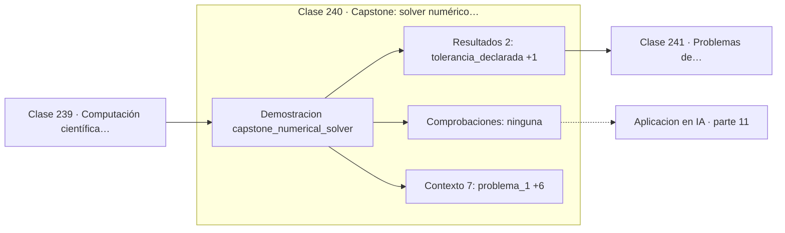

# 240 — Capstone: solver numérico con informe de error

> [⬅️ 239 Computación científica con SciPy](../239-computacion-cientifica-con-scipy/README.md) · [📚 Parte 11](../README.md) · [🏠 Programa](../../../README.md) · [241 Problemas de optimización y función objetivo ➡️](../../part-12-optimizacion-matematica-y-computacional/241-problemas-de-optimizacion-y-funcion-objetivo/README.md)

**Parte:** 11 — Métodos numéricos y computación científica · **Nivel:** `cientifico` · **Horas estimadas:** 4
**Motor:** `engines.part11` · **Demostración:** `capstone_numerical_solver` · **Clase 20 de 20** de la parte

---

## 🎯 Propósito

Raíces, interpolación, splines, diferenciación y cuadratura numérica, sistemas lineales iterativos, mínimos cuadrados y ecuaciones diferenciales.

Esta clase concreta ese objetivo sobre **Capstone: solver numérico con informe de error**: qué es, cómo se
calcula a mano, cómo se implementa sin ocultar el procedimiento y cómo se verifica
que el resultado es correcto y no solo plausible.

## ✅ Resultados de aprendizaje

Al terminar podrás:

1. Explicar **Capstone: solver numérico con informe de error** con lenguaje cotidiano y con notación matemática.
2. Resolver un caso pequeño a mano y anticipar el orden de magnitud del resultado.
3. Ejecutar y modificar `lab.py`, que corre la demostración `capstone_numerical_solver`.
4. Interpretar las 9 salidas del laboratorio y decir qué comprueba cada una.
5. Detectar el error típico de esta parte: iterar sin límite máximo y colgar el proceso.

## 🗺️ Ubicación en el programa



## 🧠 Idea rectora de la parte 11

> Un solver sin estimación de error es un generador de números plausibles.

## 🔬 Qué ejecuta el laboratorio

`capstone_numerical_solver` — Capstone: solver con informe de error y criterio de parada declarado.

| Grupo | Salidas |
|---|---|
| 🔢 Resultados numéricos (2) | `tolerancia_declarada`, `max_iteraciones_declarado` |
| ✅ Comprobaciones de invariante (0) | — |

Las claves booleanas no son adorno: si alguna fuera `False`, el resultado numérico
no sería fiable aunque el programa terminase sin error.

```bash
python classes/part-11-metodos-numericos-y-computacion-cientifica/240-capstone-solver-numerico-con-informe-de-error/lab.py
compmath run 240
```

> [!TIP]
> Antes de ejecutar, **escribe tu predicción**. Un laboratorio que confirma lo que
> esperabas enseña tanto como uno que te contradice, pero solo si la predicción
> existía antes del resultado.

## ⚠️ Errores frecuentes en esta parte

- Usar tolerancia absoluta cuando la escala del problema es grande.
- Iterar sin límite máximo y colgar el proceso.
- Aplicar Runge-Kutta con paso fijo a un sistema rígido.

## 🤖 Conexión con IA

Los Neural ODE, los samplers de difusión y los optimizadores de segundo orden son métodos numéricos con parámetros aprendidos.

## 📓 Notebooks

| Archivo | Para qué |
|---|---|
| [`notebook.ipynb`](notebook.ipynb) | recorrido guiado con la demostración ejecutada |
| [`notebook_student.ipynb`](notebook_student.ipynb) | versión con `TODO` para resolver |
| [`notebook_solution.ipynb`](notebook_solution.ipynb) | solución de referencia verificada |

## 📝 Evaluación

| Criterio | Peso |
|---|---:|
| Comprensión conceptual | 25 % |
| Resolución manual | 25 % |
| Implementación y verificación | 25 % |
| Interpretación y comunicación | 15 % |
| Conexión con aplicación real | 10 % |

Detalle y criterios de error crítico en [`assessment.md`](assessment.md).

## ❓ Preguntas de comprobación

1. ¿Cuál es la entrada, cuál la salida y qué unidades tienen?
2. ¿Qué operación domina el comportamiento del resultado?
3. ¿Qué caso extremo revelaría un error conceptual?
4. ¿Cómo verificarías el resultado por un método independiente?
5. ¿Dónde aparece esto en simulación física?

Si necesitas releer el código para responderlas, la clase todavía no está superada.

## 📥 Entregable

`notebook_student.ipynb` resuelto más un párrafo que explique el resultado **sin citar
código**: qué entra, qué sale, qué invariante se comprueba y qué pasaría en un caso límite.

## 🔗 Referencias

- Burden, R.; Faires, J. *Numerical Analysis*. 10ª ed., Cengage, 2015.
- Press, W. et al. *Numerical Recipes*. 3ª ed., Cambridge, 2007.
- Heath, M. *Scientific Computing: An Introductory Survey*. 2ª ed., SIAM, 2018.

## 📂 Material de la clase

[`intuition.md`](intuition.md) · [`theory.md`](theory.md) · [`derivation.md`](derivation.md) · [`exercises.md`](exercises.md) · [`assessment.md`](assessment.md) · [`where-is-this-used.md`](where-is-this-used.md) · [`lesson.yaml`](lesson.yaml)

---

> [⬅️ 239 Computación científica con SciPy](../239-computacion-cientifica-con-scipy/README.md) · [📚 Parte 11](../README.md) · [🏠 Programa](../../../README.md) · [241 Problemas de optimización y función objetivo ➡️](../../part-12-optimizacion-matematica-y-computacional/241-problemas-de-optimizacion-y-funcion-objetivo/README.md)
