# 🧮 Parte 11 — Métodos numéricos y computación científica

> [⬅️ Parte 10 — Estadística e inferencia](../part-10-estadistica-e-inferencia/README.md) · [🏠 Programa](../../README.md) · [📇 Catálogo](../README.md) · [Parte 12 — Optimización matemática y computacional ➡️](../part-12-optimizacion-matematica-y-computacional/README.md)

**Nivel:** `cientifico` · **Clases:** 20 · **Horas estimadas:** 80 · **Motor:** [`part11.py`](../../src/computational_math/engines/part11.py)

---

## 🎯 De qué trata esta parte

Raíces, interpolación, splines, diferenciación y cuadratura numérica, sistemas lineales iterativos, mínimos cuadrados y ecuaciones diferenciales.

## 🧠 Ideas centrales

- Todo método iterativo necesita criterio de parada y tolerancia declarada.
- Newton converge cuadráticamente, pero solo cerca de la raíz.
- Interpolar de grado alto oscila (fenómeno de Runge): por eso existen los splines.
- El orden de un método de integración predice cómo cae el error con el paso.
- Un solver sin estimación de error es un generador de números plausibles.

## 🤖 Por qué importa en IA

> [!IMPORTANT]
> Los Neural ODE, los samplers de difusión y los optimizadores de segundo orden son métodos numéricos con parámetros aprendidos.

## ⚠️ Errores frecuentes de esta parte

- Usar tolerancia absoluta cuando la escala del problema es grande.
- Iterar sin límite máximo y colgar el proceso.
- Aplicar Runge-Kutta con paso fijo a un sistema rígido.

## 🧭 Secuencia de la parte

```mermaid
flowchart LR
    subgraph B1["Bloque 1"]
        direction TB
        L221["221<br/>Errores numéricos y<br/>convergencia"]
        L222["222<br/>Bisección"]
        L223["223<br/>Newton-Raphson"]
        L224["224<br/>Método de la secante"]
        L225["225<br/>Interpolación de<br/>Lagrange"]
        L221 --> L222
        L222 --> L223
        L223 --> L224
        L224 --> L225
    end
    subgraph B2["Bloque 2"]
        direction TB
        L226["226<br/>Splines"]
        L227["227<br/>Diferenciación numérica"]
        L228["228<br/>Cuadratura numérica"]
        L229["229<br/>Regla del trapecio"]
        L230["230<br/>Simpson"]
        L226 --> L227
        L227 --> L228
        L228 --> L229
        L229 --> L230
    end
    subgraph B3["Bloque 3"]
        direction TB
        L231["231<br/>Sistemas lineales<br/>directos"]
        L232["232<br/>Jacobi y Gauss-Seidel"]
        L233["233<br/>Métodos iterativos y<br/>tolerancias"]
        L234["234<br/>Mínimos cuadrados<br/>numéricos"]
        L235["235<br/>Ecuaciones diferenciales<br/>ordinarias"]
        L231 --> L232
        L232 --> L233
        L233 --> L234
        L234 --> L235
    end
    subgraph B4["Bloque 4"]
        direction TB
        L236["236<br/>Método de Euler"]
        L237["237<br/>Runge-Kutta"]
        L238["238<br/>Introducción a PDE y<br/>discretización"]
        L239["239<br/>Computación científica<br/>con SciPy"]
        L240["240<br/>Capstone: solver<br/>numérico con informe de<br/>error"]
        L236 --> L237
        L237 --> L238
        L238 --> L239
        L239 --> L240
    end
    L225 --> L226
    L230 --> L231
    L235 --> L236
```



## 📚 Las clases

| # | Clase | Demostración | Idea central |
|---|---|---|---|
| `221` | [Errores numéricos y convergencia](221-errores-numericos-y-convergencia/README.md) | `numerical_errors` | Error de truncamiento frente a error de redondeo. |
| `222` | [Bisección](222-biseccion/README.md) | `bisection` | Bisección: lenta pero garantizada si hay cambio de signo. |
| `223` | [Newton-Raphson](223-newton-raphson/README.md) | `newton_raphson` | Newton: convergencia cuadrática cerca de la raíz. |
| `224` | [Método de la secante](224-metodo-de-la-secante/README.md) | `secant` | Secante: casi tan rápida como Newton sin necesitar la derivada. |
| `225` | [Interpolación de Lagrange](225-interpolacion-de-lagrange/README.md) | `lagrange_interpolation` | Interpolación de Lagrange y el fenómeno de Runge. |
| `226` | [Splines](226-splines/README.md) | `splines` | Spline lineal por tramos frente a un polinomio único. |
| `227` | [Diferenciación numérica](227-diferenciacion-numerica/README.md) | `numerical_differentiation` | Fórmulas de diferencias y su orden de error. |
| `228` | [Cuadratura numérica](228-cuadratura-numerica/README.md) | `quadrature` | Cuadratura gaussiana: máxima exactitud con mínimos nodos. |
| `229` | [Regla del trapecio](229-regla-del-trapecio/README.md) | `trapezoid_rule` | Regla del trapecio y su convergencia O(h²). |
| `230` | [Simpson](230-simpson/README.md) | `simpson_rule` | Simpson y su convergencia O(h⁴). |
| `231` | [Sistemas lineales directos](231-sistemas-lineales-directos/README.md) | `direct_linear_solvers` | Solvers directos: LU y sustitución, con conteo de operaciones. |
| `232` | [Jacobi y Gauss-Seidel](232-jacobi-y-gauss-seidel/README.md) | `jacobi_gauss_seidel` | Métodos iterativos sobre una matriz diagonalmente dominante. |
| `233` | [Métodos iterativos y tolerancias](233-metodos-iterativos-y-tolerancias/README.md) | `iterative_tolerances` | Criterio de parada: absoluto, relativo y residuo. |
| `234` | [Mínimos cuadrados numéricos](234-minimos-cuadrados-numericos/README.md) | `numerical_least_squares` | Mínimos cuadrados: ecuaciones normales frente a QR. |
| `235` | [Ecuaciones diferenciales ordinarias](235-ecuaciones-diferenciales-ordinarias/README.md) | `odes` | EDO con solución analítica para medir el error de cada método. |
| `236` | [Método de Euler](236-metodo-de-euler/README.md) | `euler_method` | Euler explícito: orden 1 y coste mínimo. |
| `237` | [Runge-Kutta](237-runge-kutta/README.md) | `runge_kutta` | RK4: cuatro evaluaciones por paso, error O(h⁴). |
| `238` | [Introducción a PDE y discretización](238-introduccion-a-pde-y-discretizacion/README.md) | `pde_discretization` | Discretización de la ecuación del calor en 1D (esquema explícito). |
| `239` | [Computación científica con SciPy](239-computacion-cientifica-con-scipy/README.md) | `scientific_computing` | Qué aporta SciPy sobre una implementación propia. |
| `240` | [Capstone: solver numérico con informe de error](240-capstone-solver-numerico-con-informe-de-error/README.md) | `capstone_numerical_solver` | Capstone: solver con informe de error y criterio de parada declarado. |

## 🧰 Stack de referencia

`math`, `numpy (opcional)`, `scipy (opcional)`

Los laboratorios se ejecutan con biblioteca estándar; estas herramientas aparecen
como contraste profesional, no como requisito.

## 🧪 Ejecutar toda la parte

```bash
compmath run --part 11
compmath catalog --part 11
```

## 📊 Evaluación de la parte

| Componente | Peso |
|---|---:|
| Clases y ejercicios | 40 % |
| Laboratorios y notebooks | 25 % |
| Explicación oral o escrita | 15 % |
| Capstone ([240](240-capstone-solver-numerico-con-informe-de-error/README.md)) | 20 % |

## 📖 Bibliografía

- Burden, R.; Faires, J. *Numerical Analysis*. 10ª ed., Cengage, 2015.
- Press, W. et al. *Numerical Recipes*. 3ª ed., Cambridge, 2007.
- Heath, M. *Scientific Computing: An Introductory Survey*. 2ª ed., SIAM, 2018.

---

> [⬅️ Parte 10 — Estadística e inferencia](../part-10-estadistica-e-inferencia/README.md) · [🏠 Programa](../../README.md) · [📇 Catálogo](../README.md) · [Parte 12 — Optimización matemática y computacional ➡️](../part-12-optimizacion-matematica-y-computacional/README.md)
