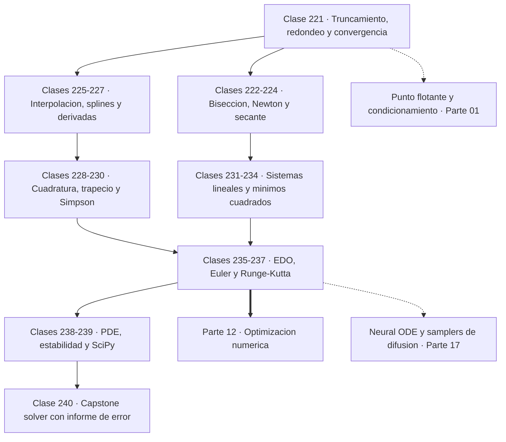

# 🧮 Parte 11 — Métodos numéricos y computación científica

> [⬅️ Parte 10 — Estadística e inferencia](../part-10-estadistica-e-inferencia/README.md) · [🏠 Programa](../../README.md) · [📇 Catálogo](../README.md) · [Parte 12 — Optimización matemática y computacional ➡️](../part-12-optimizacion-matematica-y-computacional/README.md)

**Nivel:** `cientifico` · **Clases:** 20 · **Horas estimadas:** 80 · **Motor:** [`part11.py`](../../src/computational_math/engines/part11.py)

---

## 🎯 De qué trata esta parte

Raíces, interpolación, splines, diferenciación y cuadratura numérica, sistemas lineales iterativos, mínimos cuadrados y ecuaciones diferenciales.

Casi ninguna ecuación interesante tiene solución en forma cerrada. No hay fórmula para las
raíces de un polinomio de grado cinco, ni para la integral de `e^(−x²)`, ni para la mayoría
de las ecuaciones diferenciales que describen el mundo físico. Los métodos numéricos son la
respuesta a ese hecho: **aproximar con error controlado** en vez de resolver exactamente.

La palabra clave es controlado. Un método numérico sin estimación de error es un generador de
números plausibles, y la diferencia entre un resultado y un número plausible es exactamente
lo que esta parte enseña a establecer. Por eso la clase 221 abre con la tensión que gobierna
todo lo demás: el **error de truncamiento** baja al reducir el paso `h`, pero el **error de
redondeo** sube, y existe un `h` óptimo por debajo del cual afinar más empeora el resultado.
Es la parte 01 reapareciendo con consecuencias prácticas.

Las clases 222 a 224 buscan raíces. Bisección es lenta pero **garantizada**: si hay cambio de
signo, converge siempre. Newton es cuadrático —duplica los dígitos correctos en cada paso—
pero solo cerca de la raíz, necesita la derivada y puede divergir espectacularmente desde un
mal punto inicial. La secante renuncia a la derivada a cambio de un orden 1,618, el número
áureo, y suele ser el mejor compromiso práctico.

Las clases 225 a 230 tratan de reconstruir funciones y de integrarlas. El **fenómeno de
Runge** es la lección central: subir el grado del polinomio interpolador no mejora la
aproximación, la empeora, con oscilaciones cada vez más violentas cerca de los extremos. La
solución no es más grado sino trozos pequeños, y de ahí salen los splines. En integración
aparece el concepto de **orden**: el trapecio es `O(h²)` y duplicar los subintervalos divide
el error por 4; Simpson es `O(h⁴)` y lo divide por 16; la cuadratura gaussiana consigue con
tres nodos lo que al trapecio le cuesta cientos.

Las clases 231 a 234 vuelven al álgebra lineal, ahora desde el punto de vista computacional.
Los métodos directos como LU resuelven en un número fijo de operaciones; los iterativos como
Jacobi y Gauss-Seidel se acercan progresivamente y son los únicos viables en sistemas
enormes y dispersos. Aquí aparece la disciplina de los **criterios de parada**: tolerancia
relativa, residuo y tope de iteraciones, los tres a la vez, siempre declarados.

Las clases 235 a 238 resuelven ecuaciones diferenciales. Euler es el método más simple y el
peor: orden 1, error que solo se reduce a la mitad al duplicar el trabajo. RK4 cuesta cuatro
evaluaciones por paso y es de orden 4, lo que en la práctica significa que **RK4 con 5 pasos
supera a Euler con 80**. La estabilidad aparece como restricción independiente de la
precisión, y con problemas rígidos o con ecuaciones en derivadas parciales se vuelve el
factor decisivo: la condición de Courant no es una recomendación, es la frontera entre una
simulación y una explosión numérica.

El cierre conecta con la práctica: qué aporta SciPy sobre una implementación propia, y por
qué merece la pena haber escrito ambas. Se implementa a mano para saber cuándo la biblioteca
falla o miente; se usa la biblioteca porque su estabilidad, su control de error y su
rendimiento están probados. En inteligencia artificial estos métodos no son historia: los
Neural ODE integran con RK4, los samplers de difusión son integradores de ecuaciones
estocásticas, y los optimizadores de segundo orden son Newton con la derivada aproximada.

## 🗺️ Mapa conceptual



## 🧠 Ideas centrales

- Todo método iterativo necesita criterio de parada y tolerancia declarada.
- Newton converge cuadráticamente, pero solo cerca de la raíz.
- Interpolar de grado alto oscila (fenómeno de Runge): por eso existen los splines.
- El orden de un método de integración predice cómo cae el error con el paso.
- Un solver sin estimación de error es un generador de números plausibles.

## 🤖 Por qué importa en IA

> [!IMPORTANT]
> Los Neural ODE, los samplers de difusión y los optimizadores de segundo orden son métodos numéricos con parámetros aprendidos.

## ⚠️ Errores frecuentes de esta parte

- Usar tolerancia absoluta cuando la escala del problema es grande.
- Iterar sin límite máximo y colgar el proceso.
- Aplicar Runge-Kutta con paso fijo a un sistema rígido.

## 🧭 Secuencia de la parte


## 📚 Las clases

| # | Clase | Demostración | Idea central |
|---|---|---|---|
| `221` | [Errores numéricos y convergencia](221-errores-numericos-y-convergencia/README.md) | `numerical_errors` | Reducir el paso mejora hasta que el redondeo toma el control y empeora. |
| `222` | [Bisección](222-biseccion/README.md) | `bisection` | Bisección es la única que nunca falla si hay cambio de signo, y por eso es la red de seguridad. |
| `223` | [Newton-Raphson](223-newton-raphson/README.md) | `newton_raphson` | Newton duplica los dígitos correctos en cada paso, pero solo si empieza cerca. |
| `224` | [Método de la secante](224-metodo-de-la-secante/README.md) | `secant` | La secante alcanza orden 1,618 sin necesitar la derivada. |
| `225` | [Interpolación de Lagrange](225-interpolacion-de-lagrange/README.md) | `lagrange_interpolation` | Subir el grado del polinomio interpolador empeora la aproximación en vez de mejorarla. |
| `226` | [Splines](226-splines/README.md) | `splines` | Muchos trozos de grado bajo baten a un único polinomio de grado alto. |
| `227` | [Diferenciación numérica](227-diferenciacion-numerica/README.md) | `numerical_differentiation` | La diferencia central cuesta lo mismo que la adelantada y tiene un orden más. |
| `228` | [Cuadratura numérica](228-cuadratura-numerica/README.md) | `quadrature` | Elegir bien los nodos vale más que multiplicarlos: Gauss lo demuestra con tres. |
| `229` | [Regla del trapecio](229-regla-del-trapecio/README.md) | `trapezoid_rule` | El trapecio es de orden 2: duplicar los subintervalos divide el error por cuatro. |
| `230` | [Simpson](230-simpson/README.md) | `simpson_rule` | Simpson usa parábolas y gana dos órdenes por el mismo precio. |
| `231` | [Sistemas lineales directos](231-sistemas-lineales-directos/README.md) | `direct_linear_solvers` | Factorizar una vez y sustituir muchas: LU convierte O(n³) en O(n²) por sistema. |
| `232` | [Jacobi y Gauss-Seidel](232-jacobi-y-gauss-seidel/README.md) | `jacobi_gauss_seidel` | Gauss-Seidel usa los valores recién calculados y converge en la mitad de iteraciones. |
| `233` | [Métodos iterativos y tolerancias](233-metodos-iterativos-y-tolerancias/README.md) | `iterative_tolerances` | Todo bucle iterativo necesita tres frenos: tolerancia relativa, residuo y tope de pasos. |
| `234` | [Mínimos cuadrados numéricos](234-minimos-cuadrados-numericos/README.md) | `numerical_least_squares` | Las ecuaciones normales elevan al cuadrado el número de condición; QR no. |
| `235` | [Ecuaciones diferenciales ordinarias](235-ecuaciones-diferenciales-ordinarias/README.md) | `odes` | Un problema de valor inicial fija una única trayectoria, y conocerla permite medir el error. |
| `236` | [Método de Euler](236-metodo-de-euler/README.md) | `euler_method` | Euler es el método más barato por paso y el más caro por dígito de precisión. |
| `237` | [Runge-Kutta](237-runge-kutta/README.md) | `runge_kutta` | RK4 cuesta cuatro evaluaciones por paso y las devuelve multiplicadas. |
| `238` | [Introducción a PDE y discretización](238-introduccion-a-pde-y-discretizacion/README.md) | `pde_discretization` | La condición de estabilidad no es una recomendación: violarla hace explotar la simulación. |
| `239` | [Computación científica con SciPy](239-computacion-cientifica-con-scipy/README.md) | `scientific_computing` | Se implementa a mano para saber cuándo la biblioteca falla, y se usa la biblioteca para producción. |
| `240` | [Capstone: solver numérico con informe de error](240-capstone-solver-numerico-con-informe-de-error/README.md) | `capstone_numerical_solver` | Un solver serio reporta su método, su tolerancia, su coste y su error estimado. |

## 📖 Glosario de la parte (32 términos)

Definiciones precisas en [`GLOSARIO.md`](GLOSARIO.md).

## 🧰 Stack de referencia

`math`, `numpy (opcional)`, `scipy (opcional)`

Los laboratorios se ejecutan con biblioteca estándar; estas herramientas aparecen
como contraste profesional, no como requisito.

## 🧪 Ejecutar toda la parte

```bash
compmath run --part 11
compmath catalog --part 11
```

## 📊 Evaluación de la parte

| Componente | Peso |
|---|---:|
| Clases y ejercicios | 40 % |
| Laboratorios y notebooks | 25 % |
| Explicación oral o escrita | 15 % |
| Capstone ([240](240-capstone-solver-numerico-con-informe-de-error/README.md)) | 20 % |

## 📖 Bibliografía

- Burden, R.; Faires, J. *Numerical Analysis*. 10ª ed., Cengage, 2015.
- Press, W. et al. *Numerical Recipes*. 3ª ed., Cambridge, 2007.
- Heath, M. *Scientific Computing: An Introductory Survey*. 2ª ed., SIAM, 2018.

---

> [⬅️ Parte 10 — Estadística e inferencia](../part-10-estadistica-e-inferencia/README.md) · [🏠 Programa](../../README.md) · [📇 Catálogo](../README.md) · [Parte 12 — Optimización matemática y computacional ➡️](../part-12-optimizacion-matematica-y-computacional/README.md)
