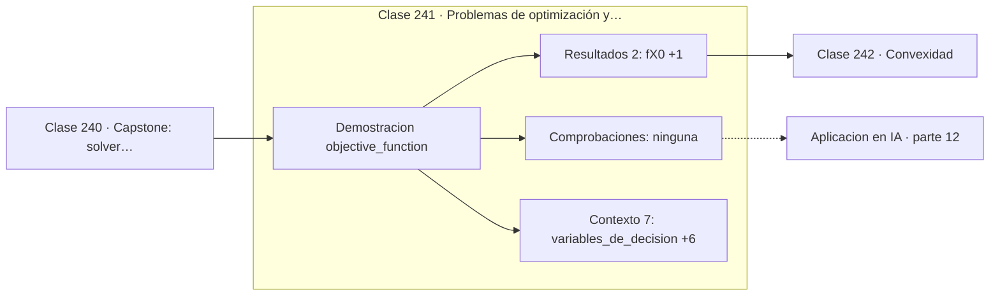

# 241 — Problemas de optimización y función objetivo

> [⬅️ 240 Capstone: solver numérico con informe de error](../../part-11-metodos-numericos-y-computacion-cientifica/240-capstone-solver-numerico-con-informe-de-error/README.md) · [📚 Parte 12](../README.md) · [🏠 Programa](../../../README.md) · [242 Convexidad ➡️](../242-convexidad/README.md)

**Parte:** 12 — Optimización matemática y computacional · **Nivel:** `avanzado` · **Horas estimadas:** 4
**Motor:** `engines.part12` · **Demostración:** `objective_function` · **Clase 1 de 20** de la parte

---

## 🎯 Propósito

**Un problema de optimización se define por variables, objetivo, sentido y restricciones.**

Función objetivo, convexidad, descenso de gradiente y su familia completa de optimizadores, métodos de segundo orden, restricciones, KKT y optimización evolutiva.

## ✅ Resultados de aprendizaje

Al terminar podrás:

1. Explicar **Problemas de optimización y función objetivo** con lenguaje cotidiano y con notación matemática.
2. Resolver un caso pequeño a mano y anticipar el orden de magnitud del resultado.
3. Ejecutar y modificar `lab.py`, que corre la demostración `objective_function`.
4. Interpretar las 9 salidas del laboratorio y decir qué comprueba cada una.
5. Detectar el error típico de esta parte: comparar optimizadores sin fijar semilla ni presupuesto de iteraciones.

## 🧩 Fórmulas de la clase

```text
min f(x)  sujeto a  gᵢ(x) ≤ 0,  hⱼ(x) = 0
maximizar f  ⟺  minimizar −f
óptimo local: f(x*) ≤ f(x) en un entorno
```

## 🗺️ Ubicación en el programa



## 📖 Fundamentos

Todo problema de optimización tiene cuatro componentes que conviene nombrar antes de tocar
nada: las **variables de decisión** sobre las que se puede actuar, la **función objetivo**
que se quiere mejorar, el **sentido** —minimizar o maximizar— y las **restricciones** que
delimitan qué soluciones son admisibles.

Maximizar y minimizar son el mismo problema: maximizar `f` es minimizar `−f`. Por convenio
la literatura se escribe siempre en forma de minimización, y por eso en aprendizaje
automático se habla de minimizar la pérdida en vez de maximizar la verosimilitud, aunque
sean lo mismo con signo cambiado.

Un problema sin restricciones se llama **irrestricto**, y es el caso de casi todo el
entrenamiento de redes neuronales: los pesos pueden tomar cualquier valor real. Cuando hay
restricciones el problema se complica sustancialmente, y las clases 256 a 258 desarrollan
la maquinaria correspondiente.

La distinción entre óptimo **local** y **global** es la que decide la dificultad. Un
óptimo local es mejor que todos sus vecinos; uno global es mejor que todos los puntos. Sin
convexidad, ningún algoritmo basado en información local puede distinguir uno del otro, y
esa es la razón de que la clase siguiente sea la más importante de la parte.

## 🧮 Ejemplo trabajado

Anatomía de un problema irrestricto de dos variables.

```text
variables de decisión: x, y
función objetivo:      f(x,y) = x² + 20y²
sentido:               minimizar
restricciones:         ninguna

punto inicial X₀ = (−2, 3)
  f(X₀) = 4 + 180 = 184,0
  ∇f(X₀) = (2x, 40y) = (−4, 120)

El gradiente es 30 veces mayor en y que en x:
la función es muchísimo más sensible en esa dirección.

Óptimo: (0, 0) con f = 0.
Al ser convexo, ese mínimo local es también global.
```

## 🔬 Qué ejecuta el laboratorio

`objective_function` — Anatomía de un problema de optimización.

| Grupo | Salidas |
|---|---|
| 🔢 Resultados numéricos (2) | `f(X0)`, `valor_minimo` |
| ✅ Comprobaciones de invariante (0) | — |

Las claves booleanas no son adorno: si alguna fuera `False`, el resultado numérico
no sería fiable aunque el programa terminase sin error.

```bash
python classes/part-12-optimizacion-matematica-y-computacional/241-problemas-de-optimizacion-y-funcion-objetivo/lab.py
compmath run 241
```

> [!TIP]
> Antes de ejecutar, **escribe tu predicción**. Un laboratorio que confirma lo que
> esperabas enseña tanto como uno que te contradice, pero solo si la predicción
> existía antes del resultado.

## ⚠️ Errores conceptuales frecuentes

1. Optimizar sin haber escrito explícitamente la función objetivo.
2. Olvidar las restricciones implícitas del dominio del problema.
3. Confundir un óptimo local con la solución del problema.

## 🚀 Dónde se usa de verdad

Formulación de problemas de entrenamiento, diseño de ingeniería, asignación de recursos y
planificación logística.

## 🤖 Conexión con IA

AdamW es el optimizador por defecto del entrenamiento moderno; entender su actualización explica el weight decay, el warmup y el gradient clipping.

## 📓 Notebooks

| Archivo | Para qué |
|---|---|
| [`notebook.ipynb`](notebook.ipynb) | recorrido guiado con la demostración ejecutada |
| [`notebook_student.ipynb`](notebook_student.ipynb) | versión con `TODO` para resolver |
| [`notebook_solution.ipynb`](notebook_solution.ipynb) | solución de referencia verificada |

## 📝 Evaluación

| Criterio | Peso |
|---|---:|
| Comprensión conceptual | 25 % |
| Resolución manual | 25 % |
| Implementación y verificación | 25 % |
| Interpretación y comunicación | 15 % |
| Conexión con aplicación real | 10 % |

Detalle y criterios de error crítico en [`assessment.md`](assessment.md).

## ❓ Preguntas de comprobación

1. ¿Cuál es la entrada, cuál la salida y qué unidades tienen?
2. ¿Qué operación domina el comportamiento del resultado?
3. ¿Qué caso extremo revelaría un error conceptual?
4. ¿Cómo verificarías el resultado por un método independiente?
5. ¿Dónde aparece esto en logística?

Si necesitas releer el código para responderlas, la clase todavía no está superada.

## 📥 Entregable

`notebook_student.ipynb` resuelto más un párrafo que explique el resultado **sin citar
código**: qué entra, qué sale, qué invariante se comprueba y qué pasaría en un caso límite.

## 🔗 Referencias

- [Boyd, S.; Vandenberghe, L. *Convex Optimization*, Cambridge, 2004, cap. 1](https://web.stanford.edu/~boyd/cvxbook/) — *uso:* obra de referencia consultada en «Problemas de optimización y función objetivo».
- [Nocedal, J.; Wright, S. *Numerical Optimization*, 2ª ed., Springer, 2006](https://doi.org/10.1007/978-0-387-40065-5) — *uso:* desarrollo formal del tema en «Problemas de optimización y función objetivo».

Bibliografía completa de la parte en [`../../../docs/BIBLIOGRAPHY.md`](../../../docs/BIBLIOGRAPHY.md) · localizador verificable de cada obra en [`sources/bibliography.json`](../../../sources/bibliography.json).

## 📂 Material de la clase

[`intuition.md`](intuition.md) · [`theory.md`](theory.md) · [`derivation.md`](derivation.md) · [`exercises.md`](exercises.md) · [`assessment.md`](assessment.md) · [`where-is-this-used.md`](where-is-this-used.md) · [`lesson.yaml`](lesson.yaml)

---

> [⬅️ 240 Capstone: solver numérico con informe de error](../../part-11-metodos-numericos-y-computacion-cientifica/240-capstone-solver-numerico-con-informe-de-error/README.md) · [📚 Parte 12](../README.md) · [🏠 Programa](../../../README.md) · [242 Convexidad ➡️](../242-convexidad/README.md)
