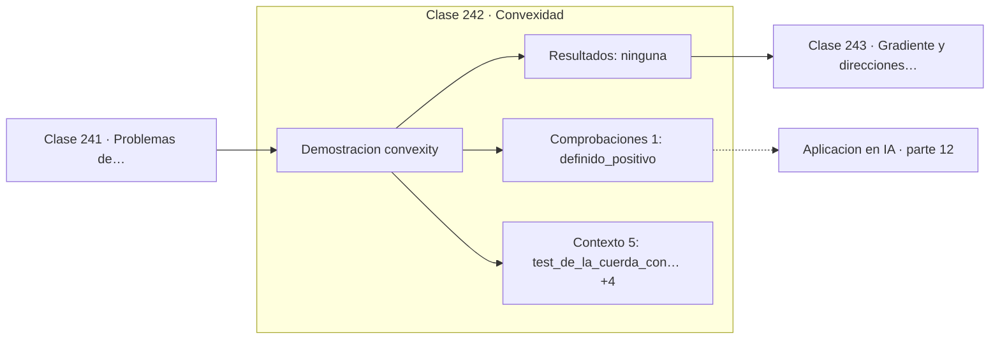

# 242 — Convexidad

> [⬅️ 241 Problemas de optimización y función objetivo](../241-problemas-de-optimizacion-y-funcion-objetivo/README.md) · [📚 Parte 12](../README.md) · [🏠 Programa](../../../README.md) · [243 Gradiente y direcciones de descenso ➡️](../243-gradiente-y-direcciones-de-descenso/README.md)

**Parte:** 12 — Optimización matemática y computacional · **Nivel:** `avanzado` · **Horas estimadas:** 4
**Motor:** `engines.part12` · **Demostración:** `convexity` · **Clase 2 de 20** de la parte

---

## 🎯 Propósito

**La convexidad es la frontera entre optimizar con garantías y optimizar con esperanza.**

Función objetivo, convexidad, descenso de gradiente y su familia completa de optimizadores, métodos de segundo orden, restricciones, KKT y optimización evolutiva.

## ✅ Resultados de aprendizaje

Al terminar podrás:

1. Explicar **Convexidad** con lenguaje cotidiano y con notación matemática.
2. Resolver un caso pequeño a mano y anticipar el orden de magnitud del resultado.
3. Ejecutar y modificar `lab.py`, que corre la demostración `convexity`.
4. Interpretar las 6 salidas del laboratorio y decir qué comprueba cada una.
5. Detectar el error típico de esta parte: aplicar weight decay dentro del gradiente en adam (y no como adamw).

## 🧩 Fórmulas de la clase

```text
f(λa + (1−λ)b) ≤ λf(a) + (1−λ)f(b)
convexa ⟺ Hessiano semidefinido positivo
convexa ⟹ todo mínimo local es global
```

## 🗺️ Ubicación en el programa



## 📖 Fundamentos

Una función es convexa si el segmento que une dos puntos cualesquiera de su gráfica queda
**por encima** de la curva. Esa definición geométrica se traduce en la desigualdad de la
cuerda, y en el caso diferenciable equivale a que el Hessiano sea semidefinido positivo:
curvatura no negativa en todas las direcciones.

La consecuencia es la que justifica toda la atención al concepto: **en un problema convexo
todo mínimo local es global**. Un algoritmo que solo mira información local —que es lo
único que hace el descenso de gradiente— tiene garantía de encontrar la solución óptima.
Sin convexidad esa garantía desaparece por completo.

Hay una jerarquía útil de problemas por dificultad, y no es lineal-versus-no-lineal como
suele creerse, sino **convexo-versus-no-convexo**. Un problema convexo de un millón de
variables es tratable; uno no convexo de veinte puede ser imposible de resolver con
garantías. Programación lineal, mínimos cuadrados, regresión logística y SVM son convexos,
y por eso se resuelven de forma fiable.

Las redes neuronales no son convexas, y masivamente. Sin embargo se entrenan bien, y la
explicación que va emergiendo es que en dimensión muy alta los mínimos locales malos son
raros: lo abundante son puntos de silla, de los que el ruido de SGD escapa con facilidad.
No es un teorema cerrado, y conviene decirlo así.

## 🧮 Ejemplo trabajado

Test de la cuerda y criterio del Hessiano.

```text
f(x) = x²  con a = 0,5,  b = 2,0,  λ = 0,7

  f(λa + (1−λ)b) = f(0,95)  = 0,9025
  λf(a) + (1−λ)f(b)         = 2,9500
  0,9025 ≤ 2,9500   →   convexa                       ✓

f(x,y) = x² + 20y²

  Hessiano = [[2,  0],
              [0, 40]]
  autovalores: 40 y 2, ambos positivos
  → definido positivo → estrictamente convexa         ✓

Consecuencia: el mínimo (0,0) es global.
Cualquier método de descenso lo encontrará.
```

## 🔬 Qué ejecuta el laboratorio

`convexity` — Convexidad: la propiedad que convierte un mínimo local en global.

| Grupo | Salidas |
|---|---|
| 🔢 Resultados numéricos (0) | — |
| ✅ Comprobaciones de invariante (1) | `definido_positivo` |

Las claves booleanas no son adorno: si alguna fuera `False`, el resultado numérico
no sería fiable aunque el programa terminase sin error.

```bash
python classes/part-12-optimizacion-matematica-y-computacional/242-convexidad/lab.py
compmath run 242
```

> [!TIP]
> Antes de ejecutar, **escribe tu predicción**. Un laboratorio que confirma lo que
> esperabas enseña tanto como uno que te contradice, pero solo si la predicción
> existía antes del resultado.

## ⚠️ Errores conceptuales frecuentes

1. Suponer convexidad sin comprobar el Hessiano.
2. Aplicar garantías de la teoría convexa a redes neuronales.
3. Confundir función convexa con función con forma de cuenco en una sola dirección.

## 🚀 Dónde se usa de verdad

Diseño de funciones de pérdida, elección de algoritmos con garantías, SVM y regresión
regularizada, y análisis de por qué el entrenamiento profundo es difícil.

## 🤖 Conexión con IA

AdamW es el optimizador por defecto del entrenamiento moderno; entender su actualización explica el weight decay, el warmup y el gradient clipping.

## 📓 Notebooks

| Archivo | Para qué |
|---|---|
| [`notebook.ipynb`](notebook.ipynb) | recorrido guiado con la demostración ejecutada |
| [`notebook_student.ipynb`](notebook_student.ipynb) | versión con `TODO` para resolver |
| [`notebook_solution.ipynb`](notebook_solution.ipynb) | solución de referencia verificada |

## 📝 Evaluación

| Criterio | Peso |
|---|---:|
| Comprensión conceptual | 25 % |
| Resolución manual | 25 % |
| Implementación y verificación | 25 % |
| Interpretación y comunicación | 15 % |
| Conexión con aplicación real | 10 % |

Detalle y criterios de error crítico en [`assessment.md`](assessment.md).

## ❓ Preguntas de comprobación

1. ¿Cuál es la entrada, cuál la salida y qué unidades tienen?
2. ¿Qué operación domina el comportamiento del resultado?
3. ¿Qué caso extremo revelaría un error conceptual?
4. ¿Cómo verificarías el resultado por un método independiente?
5. ¿Dónde aparece esto en logística?

Si necesitas releer el código para responderlas, la clase todavía no está superada.

## 📥 Entregable

`notebook_student.ipynb` resuelto más un párrafo que explique el resultado **sin citar
código**: qué entra, qué sale, qué invariante se comprueba y qué pasaría en un caso límite.

## 🔗 Referencias

- [Boyd, S.; Vandenberghe, L. *Convex Optimization*, Cambridge, 2004, cap. 3](https://web.stanford.edu/~boyd/cvxbook/) — *uso:* obra de referencia consultada en «Convexidad».
- [Dauphin, Y. et al. *Identifying and attacking the saddle point problem*, NeurIPS, 2014](https://arxiv.org/abs/1406.2572) — *uso:* artículo de origen consultado en «Convexidad».

Bibliografía completa de la parte en [`../../../docs/BIBLIOGRAPHY.md`](../../../docs/BIBLIOGRAPHY.md) · localizador verificable de cada obra en [`sources/bibliography.json`](../../../sources/bibliography.json).

## 📂 Material de la clase

[`intuition.md`](intuition.md) · [`theory.md`](theory.md) · [`derivation.md`](derivation.md) · [`exercises.md`](exercises.md) · [`assessment.md`](assessment.md) · [`where-is-this-used.md`](where-is-this-used.md) · [`lesson.yaml`](lesson.yaml)

---

> [⬅️ 241 Problemas de optimización y función objetivo](../241-problemas-de-optimizacion-y-funcion-objetivo/README.md) · [📚 Parte 12](../README.md) · [🏠 Programa](../../../README.md) · [243 Gradiente y direcciones de descenso ➡️](../243-gradiente-y-direcciones-de-descenso/README.md)
