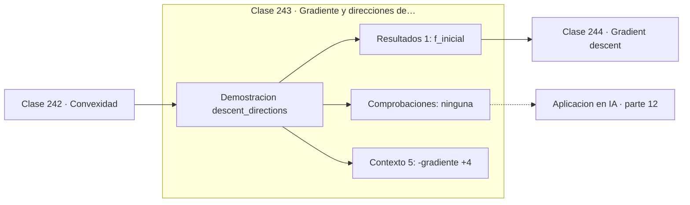

# 243 — Gradiente y direcciones de descenso

> [⬅️ 242 Convexidad](../242-convexidad/README.md) · [📚 Parte 12](../README.md) · [🏠 Programa](../../../README.md) · [244 Gradient descent ➡️](../244-gradient-descent/README.md)

**Parte:** 12 — Optimización matemática y computacional · **Nivel:** `avanzado` · **Horas estimadas:** 4
**Motor:** `engines.part12` · **Demostración:** `descent_directions` · **Clase 3 de 20** de la parte

---

## 🎯 Propósito

**El gradiente negativo es la dirección más empinada, pero no la única que sirve.**

Función objetivo, convexidad, descenso de gradiente y su familia completa de optimizadores, métodos de segundo orden, restricciones, KKT y optimización evolutiva.

## ✅ Resultados de aprendizaje

Al terminar podrás:

1. Explicar **Gradiente y direcciones de descenso** con lenguaje cotidiano y con notación matemática.
2. Resolver un caso pequeño a mano y anticipar el orden de magnitud del resultado.
3. Ejecutar y modificar `lab.py`, que corre la demostración `descent_directions`.
4. Interpretar las 6 salidas del laboratorio y decir qué comprueba cada una.
5. Detectar el error típico de esta parte: declarar convergencia por número de épocas y no por criterio numérico.

## 🧩 Fórmulas de la clase

```text
d es de descenso ⟺ dᵀ∇f < 0
la más empinada: d = −∇f
Newton: d = −H⁻¹∇f  (también de descenso si H es definida positiva)
```

## 🗺️ Ubicación en el programa



## 📖 Fundamentos

El criterio para que una dirección sirva es sencillo: su producto escalar con el gradiente
debe ser negativo. Eso significa que forma un ángulo mayor de 90 grados con el gradiente,
y que moverse un poco en esa dirección **reduce** la función. Hay infinitas direcciones que
lo cumplen, no solo una.

El gradiente negativo es la de **máximo descenso local**, en el sentido de que maximiza la
reducción por unidad de longitud del paso. Pero «localmente óptima» no significa
«globalmente eficiente»: en un valle alargado el gradiente apunta hacia las paredes en vez
de a lo largo del valle, y el descenso zigzaguea desperdiciando la mayor parte del
movimiento.

Ese defecto es exactamente lo que corrigen los métodos posteriores. Momentum promedia
gradientes sucesivos y el zigzag se cancela. Newton usa la curvatura para reescalar cada
dirección y apunta directamente al mínimo de la aproximación cuadrática. Los métodos
adaptativos escalan por coordenada. Todos siguen siendo direcciones de descenso, solo que
mejor elegidas.

Conviene retener que **cualquier** dirección con producto escalar negativo funciona,
incluso una aleatoria. Los métodos de optimización sin gradiente explotan esa libertad
probando direcciones al azar y quedándose con las que reducen el objetivo. Son lentos pero
aplicables donde no hay derivada, y la clase 259 los desarrolla.

## 🧮 Ejemplo trabajado

Cuatro direcciones evaluadas desde el mismo punto.

```text
f(x,y) = x² + 20y²      punto (−2, 3)      f = 184,0
∇f = (−4, 120)

dirección           dᵀ∇f      ¿descenso?   f tras un paso
−gradiente        −14 416         sí         183,8800
aleatoria válida     −116         sí         183,9180
eje x                 + 4         no         184,0040
+gradiente        +14 416         no         184,1201

La más empinada es −∇f, pero la aleatoria también sirve.

Nota: el gradiente vale 120 en y y −4 en x. El descenso
corregirá sobre todo y, y avanzará muy poco en x: ese
desequilibrio es el que produce el zigzag.
```

## 🔬 Qué ejecuta el laboratorio

`descent_directions` — Cualquier dirección con dᵀ∇f < 0 hace descender la función.

| Grupo | Salidas |
|---|---|
| 🔢 Resultados numéricos (1) | `f_inicial` |
| ✅ Comprobaciones de invariante (0) | — |

Las claves booleanas no son adorno: si alguna fuera `False`, el resultado numérico
no sería fiable aunque el programa terminase sin error.

```bash
python classes/part-12-optimizacion-matematica-y-computacional/243-gradiente-y-direcciones-de-descenso/lab.py
compmath run 243
```

> [!TIP]
> Antes de ejecutar, **escribe tu predicción**. Un laboratorio que confirma lo que
> esperabas enseña tanto como uno que te contradice, pero solo si la predicción
> existía antes del resultado.

## ⚠️ Errores conceptuales frecuentes

1. Creer que solo el gradiente negativo es dirección válida.
2. Usar la dirección más empinada en problemas mal escalados sin corregir.
3. Olvidar normalizar la dirección al comparar tamaños de paso.

## 🚀 Dónde se usa de verdad

Diseño de optimizadores, métodos de región de confianza, optimización sin derivadas y
análisis de convergencia.

## 🤖 Conexión con IA

AdamW es el optimizador por defecto del entrenamiento moderno; entender su actualización explica el weight decay, el warmup y el gradient clipping.

## 📓 Notebooks

| Archivo | Para qué |
|---|---|
| [`notebook.ipynb`](notebook.ipynb) | recorrido guiado con la demostración ejecutada |
| [`notebook_student.ipynb`](notebook_student.ipynb) | versión con `TODO` para resolver |
| [`notebook_solution.ipynb`](notebook_solution.ipynb) | solución de referencia verificada |

## 📝 Evaluación

| Criterio | Peso |
|---|---:|
| Comprensión conceptual | 25 % |
| Resolución manual | 25 % |
| Implementación y verificación | 25 % |
| Interpretación y comunicación | 15 % |
| Conexión con aplicación real | 10 % |

Detalle y criterios de error crítico en [`assessment.md`](assessment.md).

## ❓ Preguntas de comprobación

1. ¿Cuál es la entrada, cuál la salida y qué unidades tienen?
2. ¿Qué operación domina el comportamiento del resultado?
3. ¿Qué caso extremo revelaría un error conceptual?
4. ¿Cómo verificarías el resultado por un método independiente?
5. ¿Dónde aparece esto en logística?

Si necesitas releer el código para responderlas, la clase todavía no está superada.

## 📥 Entregable

`notebook_student.ipynb` resuelto más un párrafo que explique el resultado **sin citar
código**: qué entra, qué sale, qué invariante se comprueba y qué pasaría en un caso límite.

## 📚 Bibliografía de la clase

Esta clase enseña **Optimización**. Cada obra dice qué aporta aquí y cómo se comprobó su localizador:

- [Nocedal, J.; Wright, S. *Numerical Optimization*, 2ª ed., Springer, 2006, cap. 2](https://doi.org/10.1007/978-0-387-40065-5) — Optimización: el tema de esta clase · ISBN-13 `9780387400655` verificado en International ISBN Agency (2026-08-19).
- [Boyd, S.; Vandenberghe, L. *Convex Optimization*, Cambridge, 2004, cap. 9](https://web.stanford.edu/~boyd/cvxbook/) — Optimización: el tema de esta clase · ISBN-13 `9780511804441` verificado en International ISBN Agency (2026-08-19).

Bibliografía de todas las clases, con el porqué de cada obra, en [`docs/BIBLIOGRAPHY.md`](../../../docs/BIBLIOGRAPHY.md) · localizador y estado de cada obra en [`sources/bibliography.json`](../../../sources/bibliography.json).

## 📂 Material de la clase

[`intuition.md`](intuition.md) · [`theory.md`](theory.md) · [`derivation.md`](derivation.md) · [`exercises.md`](exercises.md) · [`assessment.md`](assessment.md) · [`where-is-this-used.md`](where-is-this-used.md) · [`lesson.yaml`](lesson.yaml)

---

> [⬅️ 242 Convexidad](../242-convexidad/README.md) · [📚 Parte 12](../README.md) · [🏠 Programa](../../../README.md) · [244 Gradient descent ➡️](../244-gradient-descent/README.md)
