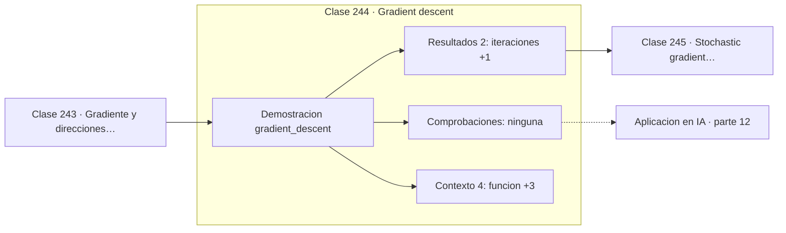

# 244 — Gradient descent

> [⬅️ 243 Gradiente y direcciones de descenso](../243-gradiente-y-direcciones-de-descenso/README.md) · [📚 Parte 12](../README.md) · [🏠 Programa](../../../README.md) · [245 Stochastic gradient descent ➡️](../245-stochastic-gradient-descent/README.md)

**Parte:** 12 — Optimización matemática y computacional · **Nivel:** `avanzado` · **Horas estimadas:** 4
**Motor:** `engines.part12` · **Demostración:** `gradient_descent` · **Clase 4 de 20** de la parte

---

## 🎯 Propósito

**El learning rate tiene un umbral duro: por encima de 2/L el descenso diverge.**

Función objetivo, convexidad, descenso de gradiente y su familia completa de optimizadores, métodos de segundo orden, restricciones, KKT y optimización evolutiva.

## ✅ Resultados de aprendizaje

Al terminar podrás:

1. Explicar **Gradient descent** con lenguaje cotidiano y con notación matemática.
2. Resolver un caso pequeño a mano y anticipar el orden de magnitud del resultado.
3. Ejecutar y modificar `lab.py`, que corre la demostración `gradient_descent`.
4. Interpretar las 6 salidas del laboratorio y decir qué comprueba cada una.
5. Detectar el error típico de esta parte: comparar optimizadores sin fijar semilla ni presupuesto de iteraciones.

## 🧩 Fórmulas de la clase

```text
xₖ₊₁ = xₖ − lr·∇f(xₖ)
estabilidad: lr < 2/L,  L = mayor autovalor del Hessiano
velocidad limitada por el número de condición L/μ
```

## 🗺️ Ubicación en el programa



## 📖 Fundamentos

El descenso de gradiente repite un paso elemental: calcular el gradiente y moverse en
dirección contraria una cantidad proporcional al learning rate. Es el algoritmo más simple
de la optimización continua y la base de todo el entrenamiento moderno.

Su comportamiento está enteramente gobernado por el **learning rate**, y el umbral no es
difuso. Para una función cuadrática con mayor autovalor `L`, el descenso converge si y solo
si `lr < 2/L`. Por debajo converge, por encima **diverge** con oscilaciones que crecen
geométricamente. No hay zona gris: es una frontera exacta.

Dentro de la zona estable hay un segundo compromiso. Un `lr` demasiado pequeño converge
con seguridad pero necesita un número de iteraciones prohibitivo; uno cercano al umbral es
rápido pero frágil. Y la velocidad máxima alcanzable está limitada por el **número de
condición** `L/μ`: cuanto más alargado sea el valle, más lento el descenso, por bien
elegido que esté el paso.

En la práctica del aprendizaje profundo, `L` no se conoce y además cambia durante el
entrenamiento. De ahí las técnicas habituales: **warmup** para no divergir al principio,
planificadores que reducen el `lr` progresivamente, y **gradient clipping** como
salvaguarda ante gradientes anómalos. Todas son maneras de mantenerse del lado bueno de
un umbral que no se puede calcular.

## 🧮 Ejemplo trabajado

Doscientas iteraciones sobre x² + 20y² desde (−2, 3).

```text
Hessiano = diag(2, 40)   →  L = 40  →  lr máximo = 2/40 = 0,05

     lr        f final        comportamiento
  0,001     1,795891        demasiado lento, no llega
  0,010     1,7e-09         converge bien
  0,040     3,4e-31         muy rápido, cerca del umbral
  0,050        —            oscila sin converger
  0,060        —            diverge, desborda

Con lr = 0,001 y 200 iteraciones, x sigue en −1,34:
la coordenada lenta apenas se ha movido.

Número de condición: 40/2 = 20. Ese 20 es el que
obliga al zigzag y motiva momentum.
```

## 🔬 Qué ejecuta el laboratorio

`gradient_descent` — Descenso de gradiente y el efecto del learning rate.

| Grupo | Salidas |
|---|---|
| 🔢 Resultados numéricos (2) | `iteraciones`, `lr_maximo_estable` |
| ✅ Comprobaciones de invariante (0) | — |

Las claves booleanas no son adorno: si alguna fuera `False`, el resultado numérico
no sería fiable aunque el programa terminase sin error.

```bash
python classes/part-12-optimizacion-matematica-y-computacional/244-gradient-descent/lab.py
compmath run 244
```

> [!TIP]
> Antes de ejecutar, **escribe tu predicción**. Un laboratorio que confirma lo que
> esperabas enseña tanto como uno que te contradice, pero solo si la predicción
> existía antes del resultado.

## ⚠️ Errores conceptuales frecuentes

1. Elegir el learning rate por prueba y error sin entender el umbral.
2. Atribuir a la arquitectura una divergencia causada por el paso.
3. Usar un learning rate fijo durante todo el entrenamiento.

## 🚀 Dónde se usa de verdad

Entrenamiento de cualquier modelo, ajuste de hiperparámetros, planificadores de learning
rate y diagnóstico de divergencias.

## 🤖 Conexión con IA

AdamW es el optimizador por defecto del entrenamiento moderno; entender su actualización explica el weight decay, el warmup y el gradient clipping.

## 📓 Notebooks

| Archivo | Para qué |
|---|---|
| [`notebook.ipynb`](notebook.ipynb) | recorrido guiado con la demostración ejecutada |
| [`notebook_student.ipynb`](notebook_student.ipynb) | versión con `TODO` para resolver |
| [`notebook_solution.ipynb`](notebook_solution.ipynb) | solución de referencia verificada |

## 📝 Evaluación

| Criterio | Peso |
|---|---:|
| Comprensión conceptual | 25 % |
| Resolución manual | 25 % |
| Implementación y verificación | 25 % |
| Interpretación y comunicación | 15 % |
| Conexión con aplicación real | 10 % |

Detalle y criterios de error crítico en [`assessment.md`](assessment.md).

## ❓ Preguntas de comprobación

1. ¿Cuál es la entrada, cuál la salida y qué unidades tienen?
2. ¿Qué operación domina el comportamiento del resultado?
3. ¿Qué caso extremo revelaría un error conceptual?
4. ¿Cómo verificarías el resultado por un método independiente?
5. ¿Dónde aparece esto en logística?

Si necesitas releer el código para responderlas, la clase todavía no está superada.

## 📥 Entregable

`notebook_student.ipynb` resuelto más un párrafo que explique el resultado **sin citar
código**: qué entra, qué sale, qué invariante se comprueba y qué pasaría en un caso límite.

## 📚 Bibliografía de la clase

Esta clase enseña **Optimización**. Cada obra dice qué aporta aquí y cómo se comprobó su localizador:

- [Nocedal, J.; Wright, S. *Numerical Optimization*, 2ª ed., Springer, 2006, cap. 3](https://doi.org/10.1007/978-0-387-40065-5) — Optimización: el tema de esta clase · ISBN-13 `9780387400655` verificado en International ISBN Agency (2026-08-19).
- [Goodfellow, I.; Bengio, Y.; Courville, A. *Deep Learning*, MIT Press, 2016, cap. 8](https://www.deeplearningbook.org/) — Deep learning y Machine learning: conexión declarada de esta parte · ISBN-13 `9780262337373` verificado en International ISBN Agency (2026-08-19).

Bibliografía de todas las clases, con el porqué de cada obra, en [`docs/BIBLIOGRAPHY.md`](../../../docs/BIBLIOGRAPHY.md) · localizador y estado de cada obra en [`sources/bibliography.json`](../../../sources/bibliography.json).

## 📂 Material de la clase

[`intuition.md`](intuition.md) · [`theory.md`](theory.md) · [`derivation.md`](derivation.md) · [`exercises.md`](exercises.md) · [`assessment.md`](assessment.md) · [`where-is-this-used.md`](where-is-this-used.md) · [`lesson.yaml`](lesson.yaml)

---

> [⬅️ 243 Gradiente y direcciones de descenso](../243-gradiente-y-direcciones-de-descenso/README.md) · [📚 Parte 12](../README.md) · [🏠 Programa](../../../README.md) · [245 Stochastic gradient descent ➡️](../245-stochastic-gradient-descent/README.md)
