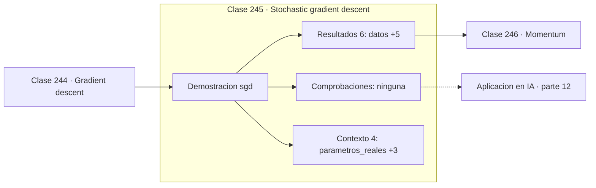

# 245 — Stochastic gradient descent

> [⬅️ 244 Gradient descent](../244-gradient-descent/README.md) · [📚 Parte 12](../README.md) · [🏠 Programa](../../../README.md) · [246 Momentum ➡️](../246-momentum/README.md)

**Parte:** 12 — Optimización matemática y computacional · **Nivel:** `avanzado` · **Horas estimadas:** 4
**Motor:** `engines.part12` · **Demostración:** `sgd` · **Clase 5 de 20** de la parte

---

## 🎯 Propósito

**SGD cambia exactitud del gradiente por número de actualizaciones, y suele salir ganando.**

Función objetivo, convexidad, descenso de gradiente y su familia completa de optimizadores, métodos de segundo orden, restricciones, KKT y optimización evolutiva.

## ✅ Resultados de aprendizaje

Al terminar podrás:

1. Explicar **Stochastic gradient descent** con lenguaje cotidiano y con notación matemática.
2. Resolver un caso pequeño a mano y anticipar el orden de magnitud del resultado.
3. Ejecutar y modificar `lab.py`, que corre la demostración `sgd`.
4. Interpretar las 10 salidas del laboratorio y decir qué comprueba cada una.
5. Detectar el error típico de esta parte: aplicar weight decay dentro del gradiente en adam (y no como adamw).

## 🧩 Fórmulas de la clase

```text
∇f ≈ (1/|B|)·Σ_{i∈B} ∇fᵢ
E[gradiente de lote] = gradiente completo
varianza del estimador ∝ 1/|B|
```

## 🗺️ Ubicación en el programa



## 📖 Fundamentos

El gradiente exacto de una función de pérdida sobre un millón de ejemplos requiere recorrer
el millón. El descenso estocástico observa que un subconjunto pequeño ya da una estimación
**insesgada** del gradiente, y que con el mismo presupuesto de cómputo se pueden dar
muchísimas más actualizaciones aunque cada una sea ruidosa.

El intercambio es favorable en la práctica. Mil actualizaciones aproximadas avanzan más
que una exacta, porque el error de la estimación se promedia a lo largo de las iteraciones
mientras que el progreso se acumula. Ese es el resultado empírico que hizo viable el
aprendizaje profundo a escala.

El **ruido tiene además un efecto beneficioso** que no es un accidente. Las fluctuaciones
del gradiente estocástico permiten escapar de puntos de silla y de mínimos locales
estrechos, y hay evidencia de que sesgan la solución hacia mínimos anchos, que generalizan
mejor. Un gradiente perfecto no siempre es lo deseable.

El **tamaño de lote** es el mando que regula el compromiso. Lotes grandes dan gradientes
precisos, aprovechan mejor la GPU y permiten más paralelismo, pero pierden el efecto
regularizador del ruido y suelen necesitar ajustar el learning rate al alza. Lotes
pequeños son ruidosos y lentos por muestra, pero exploran más. No hay valor universal.

## 🧮 Ejemplo trabajado

Ajuste de dos parámetros con 100 datos, mismo presupuesto.

```text
parámetros reales: [2,0 ; 3,0]

lote completo (200 épocas):
  estimación = [2,038924 ; 2,996817]
  MSE = 0,094537
  gradientes evaluados: 20 000

SGD con 1 muestra (200 épocas):
  estimación = [2,142997 ; 2,967811]
  gradientes evaluados: 20 000

Con el mismo número de evaluaciones, el lote completo
da 200 actualizaciones y SGD da 20 000.

SGD llega a una solución comparable con actualizaciones
mucho más baratas, y su trayectoria es visiblemente ruidosa.
```

## 🔬 Qué ejecuta el laboratorio

`sgd` — SGD: gradiente ruidoso, progreso más barato.

| Grupo | Salidas |
|---|---|
| 🔢 Resultados numéricos (6) | `datos`, `MSE_batch`, `gradientes_evaluados_batch`, `MSE_sgd`, `gradientes_evaluados_sgd`, `ahorro_de_computo` |
| ✅ Comprobaciones de invariante (0) | — |

Las claves booleanas no son adorno: si alguna fuera `False`, el resultado numérico
no sería fiable aunque el programa terminase sin error.

```bash
python classes/part-12-optimizacion-matematica-y-computacional/245-stochastic-gradient-descent/lab.py
compmath run 245
```

> [!TIP]
> Antes de ejecutar, **escribe tu predicción**. Un laboratorio que confirma lo que
> esperabas enseña tanto como uno que te contradice, pero solo si la predicción
> existía antes del resultado.

## ⚠️ Errores conceptuales frecuentes

1. Comparar SGD y lote completo por épocas en vez de por coste de cómputo.
2. Subir el tamaño de lote sin reajustar el learning rate.
3. Interpretar el ruido de la curva de pérdida como fallo del entrenamiento.

## 🚀 Dónde se usa de verdad

Entrenamiento de redes profundas, aprendizaje en línea, sistemas de recomendación y
cualquier ajuste con conjuntos de datos grandes.

## 🤖 Conexión con IA

AdamW es el optimizador por defecto del entrenamiento moderno; entender su actualización explica el weight decay, el warmup y el gradient clipping.

## 📓 Notebooks

| Archivo | Para qué |
|---|---|
| [`notebook.ipynb`](notebook.ipynb) | recorrido guiado con la demostración ejecutada |
| [`notebook_student.ipynb`](notebook_student.ipynb) | versión con `TODO` para resolver |
| [`notebook_solution.ipynb`](notebook_solution.ipynb) | solución de referencia verificada |

## 📝 Evaluación

| Criterio | Peso |
|---|---:|
| Comprensión conceptual | 25 % |
| Resolución manual | 25 % |
| Implementación y verificación | 25 % |
| Interpretación y comunicación | 15 % |
| Conexión con aplicación real | 10 % |

Detalle y criterios de error crítico en [`assessment.md`](assessment.md).

## ❓ Preguntas de comprobación

1. ¿Cuál es la entrada, cuál la salida y qué unidades tienen?
2. ¿Qué operación domina el comportamiento del resultado?
3. ¿Qué caso extremo revelaría un error conceptual?
4. ¿Cómo verificarías el resultado por un método independiente?
5. ¿Dónde aparece esto en logística?

Si necesitas releer el código para responderlas, la clase todavía no está superada.

## 📥 Entregable

`notebook_student.ipynb` resuelto más un párrafo que explique el resultado **sin citar
código**: qué entra, qué sale, qué invariante se comprueba y qué pasaría en un caso límite.

## 📚 Bibliografía de la clase

Esta clase enseña **Optimización**. Cada obra dice qué aporta aquí y cómo se comprobó su localizador:

- [Bottou, L.; Curtis, F.; Nocedal, J. *Optimization methods for large-scale machine learning*, SIAM Review, 2018](https://doi.org/10.1137/16M1080173) — Optimización: el tema de esta clase · DOI `10.1137/16m1080173` verificado en Crossref (2026-08-19).
- [Robbins, H.; Monro, S. *A stochastic approximation method*, Annals of Mathematical Statistics, 1951](https://doi.org/10.1214/aoms/1177729586) — Optimización: el tema de esta clase · DOI `10.1214/aoms/1177729586` verificado en Crossref (2026-08-19).

Bibliografía de todas las clases, con el porqué de cada obra, en [`docs/BIBLIOGRAPHY.md`](../../../docs/BIBLIOGRAPHY.md) · localizador y estado de cada obra en [`sources/bibliography.json`](../../../sources/bibliography.json).

## 📂 Material de la clase

[`intuition.md`](intuition.md) · [`theory.md`](theory.md) · [`derivation.md`](derivation.md) · [`exercises.md`](exercises.md) · [`assessment.md`](assessment.md) · [`where-is-this-used.md`](where-is-this-used.md) · [`lesson.yaml`](lesson.yaml)

---

> [⬅️ 244 Gradient descent](../244-gradient-descent/README.md) · [📚 Parte 12](../README.md) · [🏠 Programa](../../../README.md) · [246 Momentum ➡️](../246-momentum/README.md)
