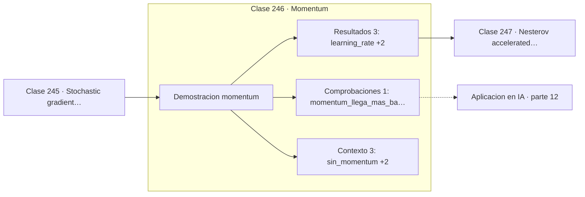

# 246 — Momentum

> [⬅️ 245 Stochastic gradient descent](../245-stochastic-gradient-descent/README.md) · [📚 Parte 12](../README.md) · [🏠 Programa](../../../README.md) · [247 Nesterov accelerated gradient ➡️](../247-nesterov-accelerated-gradient/README.md)

**Parte:** 12 — Optimización matemática y computacional · **Nivel:** `avanzado` · **Horas estimadas:** 4
**Motor:** `engines.part12` · **Demostración:** `momentum` · **Clase 6 de 20** de la parte

---

## 🎯 Propósito

**Momentum promedia gradientes: el zigzag se cancela y la componente útil se acumula.**

Función objetivo, convexidad, descenso de gradiente y su familia completa de optimizadores, métodos de segundo orden, restricciones, KKT y optimización evolutiva.

## ✅ Resultados de aprendizaje

Al terminar podrás:

1. Explicar **Momentum** con lenguaje cotidiano y con notación matemática.
2. Resolver un caso pequeño a mano y anticipar el orden de magnitud del resultado.
3. Ejecutar y modificar `lab.py`, que corre la demostración `momentum`.
4. Interpretar las 7 salidas del laboratorio y decir qué comprueba cada una.
5. Detectar el error típico de esta parte: declarar convergencia por número de épocas y no por criterio numérico.

## 🧩 Fórmulas de la clase

```text
vₖ₊₁ = β·vₖ − lr·∇f(xₖ)
xₖ₊₁ = xₖ + vₖ₊₁
paso efectivo ≈ lr/(1−β):  β = 0,9 multiplica por 10
```

## 🗺️ Ubicación en el programa



## 📖 Fundamentos

Momentum añade memoria al descenso. En vez de moverse según el gradiente actual, mantiene
una **velocidad** que es una media móvil exponencial de los gradientes pasados. La analogía
física es exacta: una bola que rueda por la superficie acumula inercia en vez de reaccionar
solo a la pendiente instantánea.

El efecto en valles alargados es el que justifica el método. Las componentes del gradiente
que apuntan a las paredes cambian de signo en cada iteración y **se cancelan** al
promediarse; las que apuntan a lo largo del valle son consistentes y **se acumulan**. El
zigzag desaparece y el avance en la dirección útil se multiplica.

El paso efectivo en una dirección de gradiente constante es `lr/(1−β)`, de modo que `β=0,9`
equivale a multiplicar el learning rate por 10 en esas direcciones. Ese factor explica por
qué al activar momentum suele haber que **bajar** el learning rate: si no, se cruza el
umbral de estabilidad.

El coste es mínimo: un vector de estado del tamaño de los parámetros y una operación por
paso. Con esa inversión, momentum acelera prácticamente siempre en problemas mal
condicionados, que son la norma. Por eso el SGD con momentum siguió siendo competitivo con
Adam en visión por computador durante años.

## 🧮 Ejemplo trabajado

Mismo problema y mismo learning rate, con y sin momentum.

```text
f(x,y) = x² + 20y²      lr = 0,02      β = 0,9

sin momentum:
  x final = (−0,00056922 ; 0,0)
  f final = 3,24e-07

con momentum:
  x final = (1,741e-05 ; −6,475e-05)
  f final = 8,42e-08

factor de mejora en f: 3,85×

La diferencia crece con el número de condición:
con condición 20 la mejora es de 4×; con condición 1000
momentum es la diferencia entre converger y no converger.

Paso efectivo: lr/(1−β) = 0,02/0,1 = 0,2, diez veces mayor.
```

## 🔬 Qué ejecuta el laboratorio

`momentum` — Momentum acumula velocidad y amortigua la oscilación.

| Grupo | Salidas |
|---|---|
| 🔢 Resultados numéricos (3) | `learning_rate`, `beta`, `factor_de_mejora` |
| ✅ Comprobaciones de invariante (1) | `momentum_llega_mas_bajo` |

Las claves booleanas no son adorno: si alguna fuera `False`, el resultado numérico
no sería fiable aunque el programa terminase sin error.

```bash
python classes/part-12-optimizacion-matematica-y-computacional/246-momentum/lab.py
compmath run 246
```

> [!TIP]
> Antes de ejecutar, **escribe tu predicción**. Un laboratorio que confirma lo que
> esperabas enseña tanto como uno que te contradice, pero solo si la predicción
> existía antes del resultado.

## ⚠️ Errores conceptuales frecuentes

1. Mantener el mismo learning rate al activar momentum.
2. Usar β muy cercano a 1 sin controlar la estabilidad.
3. Olvidar reiniciar la velocidad al cambiar de fase de entrenamiento.

## 🚀 Dónde se usa de verdad

SGD con momentum en visión, aceleración de convergencia en problemas mal condicionados y
base de Adam y sus variantes.

## 🤖 Conexión con IA

AdamW es el optimizador por defecto del entrenamiento moderno; entender su actualización explica el weight decay, el warmup y el gradient clipping.

## 📓 Notebooks

| Archivo | Para qué |
|---|---|
| [`notebook.ipynb`](notebook.ipynb) | recorrido guiado con la demostración ejecutada |
| [`notebook_student.ipynb`](notebook_student.ipynb) | versión con `TODO` para resolver |
| [`notebook_solution.ipynb`](notebook_solution.ipynb) | solución de referencia verificada |

## 📝 Evaluación

| Criterio | Peso |
|---|---:|
| Comprensión conceptual | 25 % |
| Resolución manual | 25 % |
| Implementación y verificación | 25 % |
| Interpretación y comunicación | 15 % |
| Conexión con aplicación real | 10 % |

Detalle y criterios de error crítico en [`assessment.md`](assessment.md).

## ❓ Preguntas de comprobación

1. ¿Cuál es la entrada, cuál la salida y qué unidades tienen?
2. ¿Qué operación domina el comportamiento del resultado?
3. ¿Qué caso extremo revelaría un error conceptual?
4. ¿Cómo verificarías el resultado por un método independiente?
5. ¿Dónde aparece esto en logística?

Si necesitas releer el código para responderlas, la clase todavía no está superada.

## 📥 Entregable

`notebook_student.ipynb` resuelto más un párrafo que explique el resultado **sin citar
código**: qué entra, qué sale, qué invariante se comprueba y qué pasaría en un caso límite.

## 📚 Bibliografía de la clase

Esta clase enseña **Optimización**. Cada obra dice qué aporta aquí y cómo se comprobó su localizador:

- [Polyak, B. *Some methods of speeding up the convergence of iteration methods*, 1964](https://doi.org/10.1016/0041-5553(64)90137-5) — Optimización: el tema de esta clase · DOI `10.1016/0041-5553(64)90137-5` verificado en Crossref (2026-08-19).
- [Goh, G. *Why momentum really works*, Distill, 2017](https://distill.pub/2017/momentum/) — Optimización: el tema de esta clase · URL de la fuente primaria comprobada en distill.pub (2026-08-19).

Bibliografía de todas las clases, con el porqué de cada obra, en [`docs/BIBLIOGRAPHY.md`](../../../docs/BIBLIOGRAPHY.md) · localizador y estado de cada obra en [`sources/bibliography.json`](../../../sources/bibliography.json).

## 📂 Material de la clase

[`intuition.md`](intuition.md) · [`theory.md`](theory.md) · [`derivation.md`](derivation.md) · [`exercises.md`](exercises.md) · [`assessment.md`](assessment.md) · [`where-is-this-used.md`](where-is-this-used.md) · [`lesson.yaml`](lesson.yaml)

---

> [⬅️ 245 Stochastic gradient descent](../245-stochastic-gradient-descent/README.md) · [📚 Parte 12](../README.md) · [🏠 Programa](../../../README.md) · [247 Nesterov accelerated gradient ➡️](../247-nesterov-accelerated-gradient/README.md)
