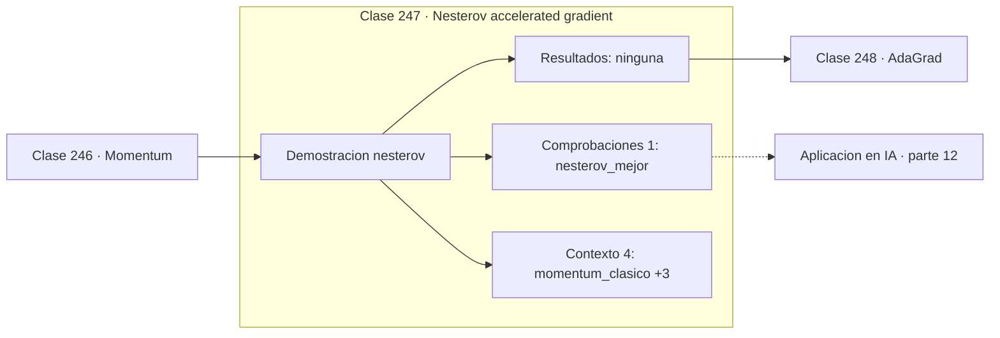

# 247 — Nesterov accelerated gradient

> [⬅️ 246 Momentum](../246-momentum/README.md) · [📚 Parte 12](../README.md) · [🏠 Programa](../../../README.md) · [248 AdaGrad ➡️](../248-adagrad/README.md)

**Parte:** 12 — Optimización matemática y computacional · **Nivel:** `avanzado` · **Horas estimadas:** 4
**Motor:** `engines.part12` · **Demostración:** `nesterov` · **Clase 7 de 20** de la parte

---

## 🎯 Propósito

**Nesterov calcula el gradiente donde va a estar, no donde está.**

Función objetivo, convexidad, descenso de gradiente y su familia completa de optimizadores, métodos de segundo orden, restricciones, KKT y optimización evolutiva.

## ✅ Resultados de aprendizaje

Al terminar podrás:

1. Explicar **Nesterov accelerated gradient** con lenguaje cotidiano y con notación matemática.
2. Resolver un caso pequeño a mano y anticipar el orden de magnitud del resultado.
3. Ejecutar y modificar `lab.py`, que corre la demostración `nesterov`.
4. Interpretar las 5 salidas del laboratorio y decir qué comprueba cada una.
5. Detectar el error típico de esta parte: comparar optimizadores sin fijar semilla ni presupuesto de iteraciones.

## 🧩 Fórmulas de la clase

```text
punto adelantado: x̃ = xₖ + β·vₖ
vₖ₊₁ = β·vₖ − lr·∇f(x̃)
cota O(1/k²) frente a O(1/k) del descenso simple
```

## 🗺️ Ubicación en el programa



## 📖 Fundamentos

El gradiente acelerado de Nesterov introduce un cambio que parece menor y no lo es: evalúa
el gradiente en el punto al que el momentum va a llevar, no en el punto actual. Primero se
mira hacia dónde empuja la inercia, y allí se calcula la corrección.

La intuición es la de un conductor que frena antes de la curva en vez de al llegar a ella.
Si el punto adelantado ya ha pasado el mínimo, el gradiente en él apunta hacia atrás y
**frena** la velocidad antes de que el sobrepaso ocurra. Momentum clásico solo se entera
del sobrepaso después de haberlo cometido.

El resultado no es solo empírico. Para funciones convexas suaves, Nesterov alcanza una tasa
de convergencia `O(1/k²)` frente al `O(1/k)` del descenso simple, y esa tasa es
**óptima**: ningún método de primer orden puede hacerlo mejor en esa clase de problemas.
Es uno de los resultados más elegantes de la optimización convexa.

En aprendizaje profundo la ventaja es más modesta que en el caso convexo, pero real y
gratuita: el coste computacional es idéntico al de momentum. Está disponible como opción
en prácticamente todas las bibliotecas —`nesterov=True`— y activarla rara vez perjudica.

## 🧮 Ejemplo trabajado

Momentum clásico frente a Nesterov, condiciones idénticas.

```text
f(x,y) = x² + 20y²      lr = 0,02      β = 0,9

momentum clásico:
  x final = (1,741e-05 ; −6,475e-05)
  f final = 8,4165e-08

Nesterov:
  x final = (−5,6e-07 ; 0,0)
  f final = 0,0            (por debajo de la precisión)

Diferencia de implementación:
  clásico:  ∇f evaluado en x
  Nesterov: ∇f evaluado en x + β·v

Ventaja teórica en convexas suaves:
  descenso simple  O(1/k)
  Nesterov         O(1/k²)   y es óptimo
```

## 🔬 Qué ejecuta el laboratorio

`nesterov` — NAG mira adelante antes de calcular el gradiente.

| Grupo | Salidas |
|---|---|
| 🔢 Resultados numéricos (0) | — |
| ✅ Comprobaciones de invariante (1) | `nesterov_mejor` |

Las claves booleanas no son adorno: si alguna fuera `False`, el resultado numérico
no sería fiable aunque el programa terminase sin error.

```bash
python classes/part-12-optimizacion-matematica-y-computacional/247-nesterov-accelerated-gradient/lab.py
compmath run 247
```

> [!TIP]
> Antes de ejecutar, **escribe tu predicción**. Un laboratorio que confirma lo que
> esperabas enseña tanto como uno que te contradice, pero solo si la predicción
> existía antes del resultado.

## ⚠️ Errores conceptuales frecuentes

1. Implementar la fórmula evaluando el gradiente en x en vez del punto adelantado.
2. Esperar la ganancia teórica del caso convexo en redes profundas.
3. Confundir las dos formulaciones equivalentes de NAG al portar código.

## 🚀 Dónde se usa de verdad

SGD con Nesterov en entrenamiento de redes, optimización convexa acelerada y métodos
proximales acelerados.

## 🤖 Conexión con IA

AdamW es el optimizador por defecto del entrenamiento moderno; entender su actualización explica el weight decay, el warmup y el gradient clipping.

## 📓 Notebooks

| Archivo | Para qué |
|---|---|
| [`notebook.ipynb`](notebook.ipynb) | recorrido guiado con la demostración ejecutada |
| [`notebook_student.ipynb`](notebook_student.ipynb) | versión con `TODO` para resolver |
| [`notebook_solution.ipynb`](notebook_solution.ipynb) | solución de referencia verificada |

## 📝 Evaluación

| Criterio | Peso |
|---|---:|
| Comprensión conceptual | 25 % |
| Resolución manual | 25 % |
| Implementación y verificación | 25 % |
| Interpretación y comunicación | 15 % |
| Conexión con aplicación real | 10 % |

Detalle y criterios de error crítico en [`assessment.md`](assessment.md).

## ❓ Preguntas de comprobación

1. ¿Cuál es la entrada, cuál la salida y qué unidades tienen?
2. ¿Qué operación domina el comportamiento del resultado?
3. ¿Qué caso extremo revelaría un error conceptual?
4. ¿Cómo verificarías el resultado por un método independiente?
5. ¿Dónde aparece esto en logística?

Si necesitas releer el código para responderlas, la clase todavía no está superada.

## 📥 Entregable

`notebook_student.ipynb` resuelto más un párrafo que explique el resultado **sin citar
código**: qué entra, qué sale, qué invariante se comprueba y qué pasaría en un caso límite.

## 🔗 Referencias

- [Nesterov, Y. *A method for solving the convex programming problem with convergence rate O(1/k²)*, 1983](https://cir.nii.ac.jp/crid/1570572699326076416)
- [Sutskever, I. et al. *On the importance of initialization and momentum in deep learning*, ICML, 2013](https://proceedings.mlr.press/v28/sutskever13.html)

Bibliografía completa de la parte en [`../../../docs/BIBLIOGRAPHY.md`](../../../docs/BIBLIOGRAPHY.md).

## 📂 Material de la clase

[`intuition.md`](intuition.md) · [`theory.md`](theory.md) · [`derivation.md`](derivation.md) · [`exercises.md`](exercises.md) · [`assessment.md`](assessment.md) · [`where-is-this-used.md`](where-is-this-used.md) · [`lesson.yaml`](lesson.yaml)

---

> [⬅️ 246 Momentum](../246-momentum/README.md) · [📚 Parte 12](../README.md) · [🏠 Programa](../../../README.md) · [248 AdaGrad ➡️](../248-adagrad/README.md)
