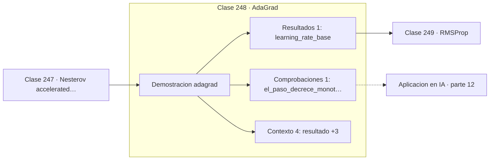

# 248 — AdaGrad

> [⬅️ 247 Nesterov accelerated gradient](../247-nesterov-accelerated-gradient/README.md) · [📚 Parte 12](../README.md) · [🏠 Programa](../../../README.md) · [249 RMSProp ➡️](../249-rmsprop/README.md)

**Parte:** 12 — Optimización matemática y computacional · **Nivel:** `avanzado` · **Horas estimadas:** 4
**Motor:** `engines.part12` · **Demostración:** `adagrad` · **Clase 8 de 20** de la parte

---

## 🎯 Propósito

**AdaGrad da pasos grandes a coordenadas poco vistas, pero su acumulador nunca olvida.**

Función objetivo, convexidad, descenso de gradiente y su familia completa de optimizadores, métodos de segundo orden, restricciones, KKT y optimización evolutiva.

## ✅ Resultados de aprendizaje

Al terminar podrás:

1. Explicar **AdaGrad** con lenguaje cotidiano y con notación matemática.
2. Resolver un caso pequeño a mano y anticipar el orden de magnitud del resultado.
3. Ejecutar y modificar `lab.py`, que corre la demostración `adagrad`.
4. Interpretar las 6 salidas del laboratorio y decir qué comprueba cada una.
5. Detectar el error típico de esta parte: aplicar weight decay dentro del gradiente en adam (y no como adamw).

## 🧩 Fórmulas de la clase

```text
Gₖ = Gₖ₋₁ + ∇f(xₖ)²   (por coordenada)
xₖ₊₁ = xₖ − lr·∇f(xₖ) / (√Gₖ + ε)
el paso decrece monótonamente
```

## 🗺️ Ubicación en el programa



## 📖 Fundamentos

AdaGrad abandona la idea de un learning rate único para todas las coordenadas. Acumula
para cada una la suma de sus gradientes al cuadrado y divide el paso por su raíz. Las
coordenadas con gradientes históricamente grandes reciben pasos pequeños; las que apenas
se han movido reciben pasos grandes.

Esto resuelve un problema real en datos **dispersos**. En procesamiento de lenguaje, unas
pocas palabras aparecen constantemente y la mayoría casi nunca. Con learning rate único,
los embeddings de las palabras raras apenas se actualizan. AdaGrad les da pasos grandes
precisamente porque han acumulado poco, y por eso funcionó tan bien en su momento.

El defecto es estructural y no tiene arreglo dentro del método: el acumulador es una suma
de términos no negativos y por tanto **solo crece**. El paso efectivo decrece
monótonamente hacia cero, y en entrenamientos largos el aprendizaje se detiene aunque el
modelo esté lejos del óptimo. No es un problema de ajuste; es una consecuencia de la
fórmula.

El diagnóstico de ese defecto llevó directamente a RMSProp, que sustituye la suma por una
media móvil exponencial y por tanto **olvida** el pasado lejano. AdaGrad conserva interés
histórico y sigue siendo razonable en problemas convexos dispersos con horizontes cortos.

## 🧮 Ejemplo trabajado

Evolución del tamaño de paso a lo largo de las iteraciones.

```text
lr base = 0,5

iteración    tamaño de paso efectivo
     1            0,7071
    50            0,1004
   100            0,0710
   200            0,0502

El paso cae como 1/√k y no vuelve a subir nunca.

Resultado sobre x² + 20y²:
  x final = (−0,0 ; 2,2e-07)     f final = 1e-12

Aquí converge porque el problema es fácil y corto.
En un entrenamiento de 100 000 pasos, el paso efectivo
caería a menos del 1 % del inicial.
```

## 🔬 Qué ejecuta el laboratorio

`adagrad` — AdaGrad adapta el paso por coordenada, pero se apaga.

| Grupo | Salidas |
|---|---|
| 🔢 Resultados numéricos (1) | `learning_rate_base` |
| ✅ Comprobaciones de invariante (1) | `el_paso_decrece_monotonamente` |

Las claves booleanas no son adorno: si alguna fuera `False`, el resultado numérico
no sería fiable aunque el programa terminase sin error.

```bash
python classes/part-12-optimizacion-matematica-y-computacional/248-adagrad/lab.py
compmath run 248
```

> [!TIP]
> Antes de ejecutar, **escribe tu predicción**. Un laboratorio que confirma lo que
> esperabas enseña tanto como uno que te contradice, pero solo si la predicción
> existía antes del resultado.

## ⚠️ Errores conceptuales frecuentes

1. Usar AdaGrad en entrenamientos largos de redes profundas.
2. Aumentar el learning rate base para compensar el decaimiento, sin resolver la causa.
3. Omitir ε y provocar división por cero en coordenadas nunca actualizadas.

## 🚀 Dónde se usa de verdad

Modelos con datos dispersos, embeddings de vocabularios grandes, sistemas de recomendación
y problemas convexos con horizonte corto.

## 🤖 Conexión con IA

AdamW es el optimizador por defecto del entrenamiento moderno; entender su actualización explica el weight decay, el warmup y el gradient clipping.

## 📓 Notebooks

| Archivo | Para qué |
|---|---|
| [`notebook.ipynb`](notebook.ipynb) | recorrido guiado con la demostración ejecutada |
| [`notebook_student.ipynb`](notebook_student.ipynb) | versión con `TODO` para resolver |
| [`notebook_solution.ipynb`](notebook_solution.ipynb) | solución de referencia verificada |

## 📝 Evaluación

| Criterio | Peso |
|---|---:|
| Comprensión conceptual | 25 % |
| Resolución manual | 25 % |
| Implementación y verificación | 25 % |
| Interpretación y comunicación | 15 % |
| Conexión con aplicación real | 10 % |

Detalle y criterios de error crítico en [`assessment.md`](assessment.md).

## ❓ Preguntas de comprobación

1. ¿Cuál es la entrada, cuál la salida y qué unidades tienen?
2. ¿Qué operación domina el comportamiento del resultado?
3. ¿Qué caso extremo revelaría un error conceptual?
4. ¿Cómo verificarías el resultado por un método independiente?
5. ¿Dónde aparece esto en logística?

Si necesitas releer el código para responderlas, la clase todavía no está superada.

## 📥 Entregable

`notebook_student.ipynb` resuelto más un párrafo que explique el resultado **sin citar
código**: qué entra, qué sale, qué invariante se comprueba y qué pasaría en un caso límite.

## 🔗 Referencias

- [Duchi, J.; Hazan, E.; Singer, Y. *Adaptive subgradient methods*, JMLR, 2011](https://jmlr.org/papers/v12/duchi11a.html) — *uso:* obra de referencia consultada en «AdaGrad».
- [Goodfellow, I.; Bengio, Y.; Courville, A. *Deep Learning*, MIT Press, 2016, cap. 8](https://www.deeplearningbook.org/) — *uso:* obra de referencia consultada en «AdaGrad».

Bibliografía completa de la parte en [`../../../docs/BIBLIOGRAPHY.md`](../../../docs/BIBLIOGRAPHY.md) · localizador verificable de cada obra en [`sources/bibliography.json`](../../../sources/bibliography.json).

## 📂 Material de la clase

[`intuition.md`](intuition.md) · [`theory.md`](theory.md) · [`derivation.md`](derivation.md) · [`exercises.md`](exercises.md) · [`assessment.md`](assessment.md) · [`where-is-this-used.md`](where-is-this-used.md) · [`lesson.yaml`](lesson.yaml)

---

> [⬅️ 247 Nesterov accelerated gradient](../247-nesterov-accelerated-gradient/README.md) · [📚 Parte 12](../README.md) · [🏠 Programa](../../../README.md) · [249 RMSProp ➡️](../249-rmsprop/README.md)
