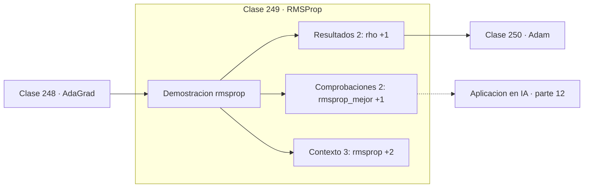

# 249 — RMSProp

> [⬅️ 248 AdaGrad](../248-adagrad/README.md) · [📚 Parte 12](../README.md) · [🏠 Programa](../../../README.md) · [250 Adam ➡️](../250-adam/README.md)

**Parte:** 12 — Optimización matemática y computacional · **Nivel:** `avanzado` · **Horas estimadas:** 4
**Motor:** `engines.part12` · **Demostración:** `rmsprop` · **Clase 9 de 20** de la parte

---

## 🎯 Propósito

**RMSProp sustituye la suma de AdaGrad por una media móvil, y el paso deja de apagarse.**

Función objetivo, convexidad, descenso de gradiente y su familia completa de optimizadores, métodos de segundo orden, restricciones, KKT y optimización evolutiva.

## ✅ Resultados de aprendizaje

Al terminar podrás:

1. Explicar **RMSProp** con lenguaje cotidiano y con notación matemática.
2. Resolver un caso pequeño a mano y anticipar el orden de magnitud del resultado.
3. Ejecutar y modificar `lab.py`, que corre la demostración `rmsprop`.
4. Interpretar las 7 salidas del laboratorio y decir qué comprueba cada una.
5. Detectar el error típico de esta parte: declarar convergencia por número de épocas y no por criterio numérico.

## 🧩 Fórmulas de la clase

```text
Eₖ = ρ·Eₖ₋₁ + (1−ρ)·∇f(xₖ)²
xₖ₊₁ = xₖ − lr·∇f(xₖ) / (√Eₖ + ε)
ρ = 0,9 equivale a recordar unos 10 pasos
```

## 🗺️ Ubicación en el programa



## 📖 Fundamentos

RMSProp aplica una corrección mínima a AdaGrad con consecuencias grandes: en vez de sumar
todos los gradientes al cuadrado, mantiene una **media móvil exponencial**. Los gradientes
antiguos se descuentan geométricamente y el acumulador puede bajar además de subir.

Eso resuelve el apagado. Si una coordenada tuvo gradientes grandes al principio y luego se
calmó, AdaGrad la mantiene penalizada para siempre mientras que RMSProp la libera. El
método se adapta al **régimen actual** del entrenamiento en vez de a toda su historia, que
es lo apropiado en problemas no estacionarios como el aprendizaje profundo.

El parámetro `ρ` fija la longitud de la memoria: con `ρ = 0,9` la ventana efectiva es de
unos 10 pasos, con `0,99` de unos 100. El valor por defecto funciona en la mayoría de los
casos y rara vez merece ajustarse. El `ε` en el denominador evita divisiones por cero y
típicamente vale `10⁻⁸`.

RMSProp tiene una peculiaridad histórica: **nunca se publicó como artículo**. Apareció en
una diapositiva del curso de Hinton en Coursera en 2012 y se citó así durante años. Su
combinación con momentum es lo que da Adam, que es la clase siguiente.

## 🧮 Ejemplo trabajado

RMSProp y AdaGrad con el mismo learning rate.

```text
ρ = 0,9      ε = 1e-8      mismo lr para ambos

RMSProp:
  x final = (0,02310943 ; 0,01786889)
  f final = 0,00692

AdaGrad con el mismo lr:
  x final = (−0,85543159 ; 1,78114968)
  f final = 64,18

AdaGrad se quedó atascado: su paso se apagó antes
de llegar al mínimo.

Diferencia única entre ambos:
  AdaGrad: G += g²             suma que solo crece
  RMSProp: E = ρE + (1−ρ)g²    media que puede bajar
```

## 🔬 Qué ejecuta el laboratorio

`rmsprop` — RMSProp: media móvil del gradiente al cuadrado.

| Grupo | Salidas |
|---|---|
| 🔢 Resultados numéricos (2) | `rho`, `epsilon` |
| ✅ Comprobaciones de invariante (2) | `rmsprop_mejor`, `el_paso_no_se_apaga` |

Las claves booleanas no son adorno: si alguna fuera `False`, el resultado numérico
no sería fiable aunque el programa terminase sin error.

```bash
python classes/part-12-optimizacion-matematica-y-computacional/249-rmsprop/lab.py
compmath run 249
```

> [!TIP]
> Antes de ejecutar, **escribe tu predicción**. Un laboratorio que confirma lo que
> esperabas enseña tanto como uno que te contradice, pero solo si la predicción
> existía antes del resultado.

## ⚠️ Errores conceptuales frecuentes

1. Ajustar ρ sin necesidad en vez de dejar el valor por defecto.
2. Omitir ε y provocar inestabilidad numérica.
3. Esperar que RMSProp resuelva un learning rate base mal elegido.

## 🚀 Dónde se usa de verdad

Entrenamiento de redes recurrentes, aprendizaje por refuerzo, objetivos no estacionarios y
componente de segundo momento en Adam.

## 🤖 Conexión con IA

AdamW es el optimizador por defecto del entrenamiento moderno; entender su actualización explica el weight decay, el warmup y el gradient clipping.

## 📓 Notebooks

| Archivo | Para qué |
|---|---|
| [`notebook.ipynb`](notebook.ipynb) | recorrido guiado con la demostración ejecutada |
| [`notebook_student.ipynb`](notebook_student.ipynb) | versión con `TODO` para resolver |
| [`notebook_solution.ipynb`](notebook_solution.ipynb) | solución de referencia verificada |

## 📝 Evaluación

| Criterio | Peso |
|---|---:|
| Comprensión conceptual | 25 % |
| Resolución manual | 25 % |
| Implementación y verificación | 25 % |
| Interpretación y comunicación | 15 % |
| Conexión con aplicación real | 10 % |

Detalle y criterios de error crítico en [`assessment.md`](assessment.md).

## ❓ Preguntas de comprobación

1. ¿Cuál es la entrada, cuál la salida y qué unidades tienen?
2. ¿Qué operación domina el comportamiento del resultado?
3. ¿Qué caso extremo revelaría un error conceptual?
4. ¿Cómo verificarías el resultado por un método independiente?
5. ¿Dónde aparece esto en logística?

Si necesitas releer el código para responderlas, la clase todavía no está superada.

## 📥 Entregable

`notebook_student.ipynb` resuelto más un párrafo que explique el resultado **sin citar
código**: qué entra, qué sale, qué invariante se comprueba y qué pasaría en un caso límite.

## 🔗 Referencias

- [Hinton, G. *Neural Networks for Machine Learning*, lecture 6e, Coursera, 2012](https://www.cs.toronto.edu/~tijmen/csc321/slides/lecture_slides_lec6.pdf) — *uso:* obra de referencia consultada en «RMSProp».
- [Goodfellow, I.; Bengio, Y.; Courville, A. *Deep Learning*, MIT Press, 2016, cap. 8](https://www.deeplearningbook.org/) — *uso:* obra de referencia consultada en «RMSProp».

Bibliografía completa de la parte en [`../../../docs/BIBLIOGRAPHY.md`](../../../docs/BIBLIOGRAPHY.md) · localizador verificable de cada obra en [`sources/bibliography.json`](../../../sources/bibliography.json).

## 📂 Material de la clase

[`intuition.md`](intuition.md) · [`theory.md`](theory.md) · [`derivation.md`](derivation.md) · [`exercises.md`](exercises.md) · [`assessment.md`](assessment.md) · [`where-is-this-used.md`](where-is-this-used.md) · [`lesson.yaml`](lesson.yaml)

---

> [⬅️ 248 AdaGrad](../248-adagrad/README.md) · [📚 Parte 12](../README.md) · [🏠 Programa](../../../README.md) · [250 Adam ➡️](../250-adam/README.md)
