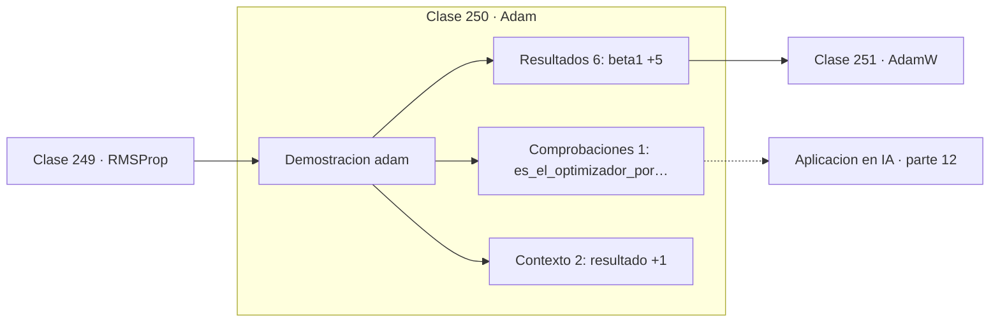

# 250 — Adam

> [⬅️ 249 RMSProp](../249-rmsprop/README.md) · [📚 Parte 12](../README.md) · [🏠 Programa](../../../README.md) · [251 AdamW ➡️](../251-adamw/README.md)

**Parte:** 12 — Optimización matemática y computacional · **Nivel:** `avanzado` · **Horas estimadas:** 4
**Motor:** `engines.part12` · **Demostración:** `adam` · **Clase 10 de 20** de la parte

---

## 🎯 Propósito

**Adam combina momentum y escalado adaptativo, y corrige el sesgo del arranque.**

Función objetivo, convexidad, descenso de gradiente y su familia completa de optimizadores, métodos de segundo orden, restricciones, KKT y optimización evolutiva.

## ✅ Resultados de aprendizaje

Al terminar podrás:

1. Explicar **Adam** con lenguaje cotidiano y con notación matemática.
2. Resolver un caso pequeño a mano y anticipar el orden de magnitud del resultado.
3. Ejecutar y modificar `lab.py`, que corre la demostración `adam`.
4. Interpretar las 9 salidas del laboratorio y decir qué comprueba cada una.
5. Detectar el error típico de esta parte: comparar optimizadores sin fijar semilla ni presupuesto de iteraciones.

## 🧩 Fórmulas de la clase

```text
mₖ = β₁·mₖ₋₁ + (1−β₁)·g;   vₖ = β₂·vₖ₋₁ + (1−β₂)·g²
m̂ = mₖ/(1−β₁ᵏ);   v̂ = vₖ/(1−β₂ᵏ)
xₖ₊₁ = xₖ − lr·m̂ / (√v̂ + ε)
```

## 🗺️ Ubicación en el programa



## 📖 Fundamentos

Adam junta las dos ideas que funcionaban por separado: el **primer momento** `m` es la
media móvil del gradiente, que es momentum, y el **segundo momento** `v` es la media móvil
del gradiente al cuadrado, que es RMSProp. La actualización divide uno por la raíz del
otro.

La aportación propia es la **corrección de sesgo**, y merece entenderse porque es la parte
que más se copia sin comprender. Ambos acumuladores se inicializan a cero, así que en los
primeros pasos están fuertemente sesgados hacia cero: con `β₂ = 0,999`, tras un paso `v`
vale solo el 0,1 % del valor correcto. Dividir por `1 − βᵏ` compensa exactamente ese
arranque, y sin esa corrección los primeros pasos serían enormes.

Los valores por defecto —`β₁ = 0,9`, `β₂ = 0,999`, `ε = 10⁻⁸`— funcionan sorprendentemente
bien en una variedad enorme de problemas, y esa robustez es la razón real de su dominio: se
puede empezar a entrenar sin ajustar nada. Es el optimizador por defecto del aprendizaje
profundo desde 2015.

No está libre de críticas. Hay problemas convexos donde Adam no converge, señalados por
Reddi y otros en 2018, lo que motivó AMSGrad. Y en visión por computador el SGD con
momentum bien ajustado suele generalizar mejor. Adam es el mejor punto de partida, no la
respuesta final.

## 🧮 Ejemplo trabajado

Adam sobre el problema de referencia y la corrección de sesgo.

```text
β₁ = 0,9    β₂ = 0,999    lr = 0,1    ε = 1e-8

resultado:
  x final = (−5,69e-05 ; −5,303e-05)
  f final = 5,95e-08

Por qué hace falta la corrección de sesgo:

  paso k    1 − β₂ᵏ      v subestima por factor
     1      0,001              1000×
    10      0,00995             100×
   100      0,0952               10×
  1000      0,632                1,6×

Sin corregir, los primeros pasos dividirían por una raíz
demasiado pequeña y el paso efectivo sería desmesurado.
```

## 🔬 Qué ejecuta el laboratorio

`adam` — Adam: momentum de primer y segundo orden con corrección de sesgo.

| Grupo | Salidas |
|---|---|
| 🔢 Resultados numéricos (6) | `beta1`, `beta2`, `lr`, `eps`, `paso_1_sin_corregir`, `factor_de_correccion_en_t=1` |
| ✅ Comprobaciones de invariante (1) | `es_el_optimizador_por_defecto` |

Las claves booleanas no son adorno: si alguna fuera `False`, el resultado numérico
no sería fiable aunque el programa terminase sin error.

```bash
python classes/part-12-optimizacion-matematica-y-computacional/250-adam/lab.py
compmath run 250
```

> [!TIP]
> Antes de ejecutar, **escribe tu predicción**. Un laboratorio que confirma lo que
> esperabas enseña tanto como uno que te contradice, pero solo si la predicción
> existía antes del resultado.

## ⚠️ Errores conceptuales frecuentes

1. Implementar Adam sin la corrección de sesgo.
2. Usar el weight decay como término L2 dentro del gradiente en vez de AdamW.
3. Suponer que Adam siempre generaliza mejor que SGD con momentum.

## 🚀 Dónde se usa de verdad

Entrenamiento por defecto de redes profundas, ajuste fino de modelos de lenguaje,
transformers y prácticamente todo el aprendizaje profundo actual.

## 🤖 Conexión con IA

AdamW es el optimizador por defecto del entrenamiento moderno; entender su actualización explica el weight decay, el warmup y el gradient clipping.

## 📓 Notebooks

| Archivo | Para qué |
|---|---|
| [`notebook.ipynb`](notebook.ipynb) | recorrido guiado con la demostración ejecutada |
| [`notebook_student.ipynb`](notebook_student.ipynb) | versión con `TODO` para resolver |
| [`notebook_solution.ipynb`](notebook_solution.ipynb) | solución de referencia verificada |

## 📝 Evaluación

| Criterio | Peso |
|---|---:|
| Comprensión conceptual | 25 % |
| Resolución manual | 25 % |
| Implementación y verificación | 25 % |
| Interpretación y comunicación | 15 % |
| Conexión con aplicación real | 10 % |

Detalle y criterios de error crítico en [`assessment.md`](assessment.md).

## ❓ Preguntas de comprobación

1. ¿Cuál es la entrada, cuál la salida y qué unidades tienen?
2. ¿Qué operación domina el comportamiento del resultado?
3. ¿Qué caso extremo revelaría un error conceptual?
4. ¿Cómo verificarías el resultado por un método independiente?
5. ¿Dónde aparece esto en logística?

Si necesitas releer el código para responderlas, la clase todavía no está superada.

## 📥 Entregable

`notebook_student.ipynb` resuelto más un párrafo que explique el resultado **sin citar
código**: qué entra, qué sale, qué invariante se comprueba y qué pasaría en un caso límite.

## 🔗 Referencias

- [Kingma, D.; Ba, J. *Adam: A Method for Stochastic Optimization*, ICLR, 2015](https://arxiv.org/abs/1412.6980) — *uso:* artículo de origen consultado en «Adam».
- [Reddi, S.; Kale, S.; Kumar, S. *On the convergence of Adam and beyond*, ICLR, 2018](https://arxiv.org/abs/1904.09237) — *uso:* artículo de origen consultado en «Adam».

Bibliografía completa de la parte en [`../../../docs/BIBLIOGRAPHY.md`](../../../docs/BIBLIOGRAPHY.md) · localizador verificable de cada obra en [`sources/bibliography.json`](../../../sources/bibliography.json).

## 📂 Material de la clase

[`intuition.md`](intuition.md) · [`theory.md`](theory.md) · [`derivation.md`](derivation.md) · [`exercises.md`](exercises.md) · [`assessment.md`](assessment.md) · [`where-is-this-used.md`](where-is-this-used.md) · [`lesson.yaml`](lesson.yaml)

---

> [⬅️ 249 RMSProp](../249-rmsprop/README.md) · [📚 Parte 12](../README.md) · [🏠 Programa](../../../README.md) · [251 AdamW ➡️](../251-adamw/README.md)
