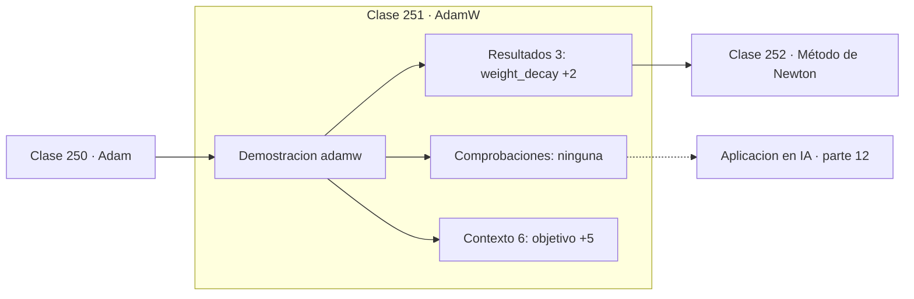

# 251 — AdamW

> [⬅️ 250 Adam](../250-adam/README.md) · [📚 Parte 12](../README.md) · [🏠 Programa](../../../README.md) · [252 Método de Newton ➡️](../252-metodo-de-newton/README.md)

**Parte:** 12 — Optimización matemática y computacional · **Nivel:** `avanzado` · **Horas estimadas:** 4
**Motor:** `engines.part12` · **Demostración:** `adamw` · **Clase 11 de 20** de la parte

---

## 🎯 Propósito

**En Adam, sumar L2 al gradiente no es lo mismo que decaer el peso: AdamW los separa.**

Función objetivo, convexidad, descenso de gradiente y su familia completa de optimizadores, métodos de segundo orden, restricciones, KKT y optimización evolutiva.

## ✅ Resultados de aprendizaje

Al terminar podrás:

1. Explicar **AdamW** con lenguaje cotidiano y con notación matemática.
2. Resolver un caso pequeño a mano y anticipar el orden de magnitud del resultado.
3. Ejecutar y modificar `lab.py`, que corre la demostración `adamw`.
4. Interpretar las 9 salidas del laboratorio y decir qué comprueba cada una.
5. Detectar el error típico de esta parte: aplicar weight decay dentro del gradiente en adam (y no como adamw).

## 🧩 Fórmulas de la clase

```text
Adam + L2:  g ← g + λ·w,  luego se divide por √v̂
AdamW:  xₖ₊₁ = xₖ − lr·m̂/(√v̂+ε) − lr·λ·xₖ
en SGD ambas formas coinciden; en Adam no
```

## 🗺️ Ubicación en el programa



## 📖 Fundamentos

En el descenso de gradiente clásico, añadir `λ‖w‖²` al objetivo y decaer los pesos
multiplicándolos por `(1 − lr·λ)` son operaciones **idénticas**. Esa equivalencia es tan
familiar que se dio por válida también en Adam durante años, y era falsa.

La razón es el escalado adaptativo. En Adam, el término `λ·w` que se suma al gradiente pasa
por la división entre `√v̂`, igual que el resto del gradiente. El resultado es que los
pesos con gradientes históricamente grandes reciben **menos** regularización, exactamente
al revés de lo que se pretendía. La intensidad de la regularización pasa a depender del
historial de gradientes de cada coordenada.

**AdamW** aplica el decaimiento directamente sobre el peso, fuera del mecanismo adaptativo.
Cada parámetro recibe la misma proporción de decaimiento independientemente de su
gradiente, que es lo que se quería desde el principio. El cambio en el código es de una
línea; el efecto en el rendimiento fue lo bastante grande como para convertirlo en el
estándar.

Hoy AdamW es el optimizador por defecto para transformers y modelos de lenguaje. La lección
metodológica va más allá del caso: una equivalencia válida en un algoritmo puede romperse
en otro, y trasladar intuiciones sin verificarlas cuesta caro. Este error concreto estuvo
en producción desde 2015 hasta 2019.

## 🧮 Ejemplo trabajado

Mismo objetivo y mismo weight decay, dos implementaciones.

```text
objetivo: (x−3)² + (y−4)²        óptimo sin regularizar: (3, 4)
weight decay λ = 0,05

Adam con L2 dentro del gradiente:
  solución = (2,926829 ; 3,902440)      norma = 4,87805

AdamW con decay desacoplado:
  solución = (2,918662 ; 3,830002)      norma = 4,80800

AdamW regulariza más y de forma uniforme.

La diferencia crece con la dispersión de los gradientes:
aquí es del 1,4 %, en un transformer real es suficiente
para cambiar la calidad del modelo de forma medible.
```

## 🔬 Qué ejecuta el laboratorio

`adamw` — AdamW desacopla el weight decay del gradiente adaptativo.

| Grupo | Salidas |
|---|---|
| 🔢 Resultados numéricos (3) | `weight_decay`, `norma_adam_L2`, `norma_adamw` |
| ✅ Comprobaciones de invariante (0) | — |

Las claves booleanas no son adorno: si alguna fuera `False`, el resultado numérico
no sería fiable aunque el programa terminase sin error.

```bash
python classes/part-12-optimizacion-matematica-y-computacional/251-adamw/lab.py
compmath run 251
```

> [!TIP]
> Antes de ejecutar, **escribe tu predicción**. Un laboratorio que confirma lo que
> esperabas enseña tanto como uno que te contradice, pero solo si la predicción
> existía antes del resultado.

## ⚠️ Errores conceptuales frecuentes

1. Usar el argumento weight_decay de Adam creyendo que equivale a AdamW.
2. Aplicar decaimiento a los parámetros de normalización y a los sesgos.
3. Trasladar equivalencias de SGD a optimizadores adaptativos sin comprobarlas.

## 🚀 Dónde se usa de verdad

Entrenamiento de transformers, ajuste fino de modelos de lenguaje, recetas de
regularización moderna y reproducción de resultados publicados.

## 🤖 Conexión con IA

AdamW es el optimizador por defecto del entrenamiento moderno; entender su actualización explica el weight decay, el warmup y el gradient clipping.

## 📓 Notebooks

| Archivo | Para qué |
|---|---|
| [`notebook.ipynb`](notebook.ipynb) | recorrido guiado con la demostración ejecutada |
| [`notebook_student.ipynb`](notebook_student.ipynb) | versión con `TODO` para resolver |
| [`notebook_solution.ipynb`](notebook_solution.ipynb) | solución de referencia verificada |

## 📝 Evaluación

| Criterio | Peso |
|---|---:|
| Comprensión conceptual | 25 % |
| Resolución manual | 25 % |
| Implementación y verificación | 25 % |
| Interpretación y comunicación | 15 % |
| Conexión con aplicación real | 10 % |

Detalle y criterios de error crítico en [`assessment.md`](assessment.md).

## ❓ Preguntas de comprobación

1. ¿Cuál es la entrada, cuál la salida y qué unidades tienen?
2. ¿Qué operación domina el comportamiento del resultado?
3. ¿Qué caso extremo revelaría un error conceptual?
4. ¿Cómo verificarías el resultado por un método independiente?
5. ¿Dónde aparece esto en logística?

Si necesitas releer el código para responderlas, la clase todavía no está superada.

## 📥 Entregable

`notebook_student.ipynb` resuelto más un párrafo que explique el resultado **sin citar
código**: qué entra, qué sale, qué invariante se comprueba y qué pasaría en un caso límite.

## 📚 Bibliografía de la clase

Esta clase enseña **Optimización**. Cada obra dice qué aporta aquí y cómo se comprobó su localizador:

- [Loshchilov, I.; Hutter, F. *Decoupled Weight Decay Regularization*, ICLR, 2019](https://arxiv.org/abs/1711.05101) — Optimización: el tema de esta clase · DOI `10.48550/arxiv.1711.05101` verificado en DataCite (2026-08-19).
- [Kingma, D.; Ba, J. *Adam: A Method for Stochastic Optimization*, ICLR, 2015](https://arxiv.org/abs/1412.6980) — Optimización: el tema de esta clase · DOI `10.48550/arxiv.1412.6980` verificado en DataCite (2026-08-19).

Bibliografía de todas las clases, con el porqué de cada obra, en [`docs/BIBLIOGRAPHY.md`](../../../docs/BIBLIOGRAPHY.md) · localizador y estado de cada obra en [`sources/bibliography.json`](../../../sources/bibliography.json).

## 📂 Material de la clase

[`intuition.md`](intuition.md) · [`theory.md`](theory.md) · [`derivation.md`](derivation.md) · [`exercises.md`](exercises.md) · [`assessment.md`](assessment.md) · [`where-is-this-used.md`](where-is-this-used.md) · [`lesson.yaml`](lesson.yaml)

---

> [⬅️ 250 Adam](../250-adam/README.md) · [📚 Parte 12](../README.md) · [🏠 Programa](../../../README.md) · [252 Método de Newton ➡️](../252-metodo-de-newton/README.md)
