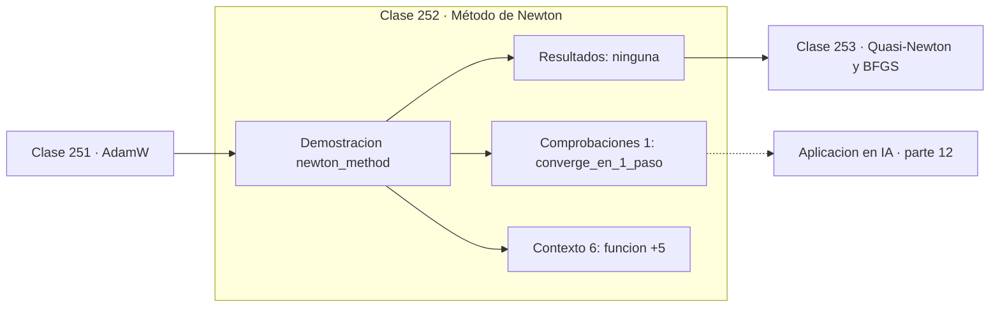

# 252 — Método de Newton

> [⬅️ 251 AdamW](../251-adamw/README.md) · [📚 Parte 12](../README.md) · [🏠 Programa](../../../README.md) · [253 Quasi-Newton y BFGS ➡️](../253-quasi-newton-y-bfgs/README.md)

**Parte:** 12 — Optimización matemática y computacional · **Nivel:** `avanzado` · **Horas estimadas:** 4
**Motor:** `engines.part12` · **Demostración:** `newton_method` · **Clase 12 de 20** de la parte

---

## 🎯 Propósito

**Newton resuelve una cuadrática en un solo paso, y por eso no escala.**

Función objetivo, convexidad, descenso de gradiente y su familia completa de optimizadores, métodos de segundo orden, restricciones, KKT y optimización evolutiva.

## ✅ Resultados de aprendizaje

Al terminar podrás:

1. Explicar **Método de Newton** con lenguaje cotidiano y con notación matemática.
2. Resolver un caso pequeño a mano y anticipar el orden de magnitud del resultado.
3. Ejecutar y modificar `lab.py`, que corre la demostración `newton_method`.
4. Interpretar las 7 salidas del laboratorio y decir qué comprueba cada una.
5. Detectar el error típico de esta parte: declarar convergencia por número de épocas y no por criterio numérico.

## 🧩 Fórmulas de la clase

```text
xₖ₊₁ = xₖ − H⁻¹·∇f(xₖ)
convergencia cuadrática cerca del óptimo
coste O(n³) por iteración, memoria O(n²)
```

## 🗺️ Ubicación en el programa



## 📖 Fundamentos

El método de Newton aplicado a optimización aproxima la función por su desarrollo de Taylor
de segundo orden y salta al mínimo de esa parábola. Usa por tanto la **curvatura**, no solo
la pendiente, y eso le permite elegir simultáneamente dirección y tamaño de paso sin
learning rate.

En una función cuadrática, la aproximación de segundo orden **es** la función, y Newton
alcanza el mínimo exacto en una única iteración desde cualquier punto de partida. En
funciones generales conserva convergencia cuadrática cerca del óptimo: el número de dígitos
correctos se duplica en cada paso, igual que en la búsqueda de raíces de la clase 223.

El obstáculo es el coste. El Hessiano tiene `n²` entradas e invertirlo cuesta `O(n³)`. Con
un modelo de mil millones de parámetros, el Hessiano tendría `10¹⁸` entradas: no cabe en
ninguna memoria existente. Por eso los métodos de segundo orden puros son inviables en
aprendizaje profundo, por muy atractiva que sea su tasa de convergencia.

Hay un segundo problema, cualitativo: si el Hessiano **no es definido positivo** —lo cual
ocurre en puntos de silla, abundantes en dimensión alta— la dirección de Newton puede
apuntar cuesta arriba. Las variantes prácticas añaden regularización al Hessiano o usan
regiones de confianza para evitarlo.

## 🧮 Ejemplo trabajado

Newton sobre una cuadrática: un paso y termina.

```text
f(x,y) = x² + 20y²        punto inicial (−2, 3)

Hessiano = [[2,  0],        H⁻¹ = [[0,5,   0   ],
            [0, 40]]                [0  ,  0,025]]

Paso 1:  x = (−2,3) − H⁻¹·(−4,120) = (0, 0)
  f = 0,0                                            ✓

Paso 2:  ya está en el óptimo, no se mueve.

Un paso frente a las 200 iteraciones del descenso.

Coste: invertir H es O(n³). Con n = 10⁹ el Hessiano
tendría 10¹⁸ entradas: imposible de almacenar.
```

## 🔬 Qué ejecuta el laboratorio

`newton_method` — Newton en optimización: usa curvatura, converge en un paso si es cuadrática.

| Grupo | Salidas |
|---|---|
| 🔢 Resultados numéricos (0) | — |
| ✅ Comprobaciones de invariante (1) | `converge_en_1_paso` |

Las claves booleanas no son adorno: si alguna fuera `False`, el resultado numérico
no sería fiable aunque el programa terminase sin error.

```bash
python classes/part-12-optimizacion-matematica-y-computacional/252-metodo-de-newton/lab.py
compmath run 252
```

> [!TIP]
> Antes de ejecutar, **escribe tu predicción**. Un laboratorio que confirma lo que
> esperabas enseña tanto como uno que te contradice, pero solo si la predicción
> existía antes del resultado.

## ⚠️ Errores conceptuales frecuentes

1. Aplicar Newton sin comprobar que el Hessiano es definido positivo.
2. Formar e invertir el Hessiano explícitamente en vez de resolver el sistema.
3. Considerarlo viable en modelos con millones de parámetros.

## 🚀 Dónde se usa de verdad

Optimización de pocos parámetros, ajuste de modelos estadísticos, IRLS en regresión
logística y base conceptual de los métodos cuasi-Newton.

## 🤖 Conexión con IA

AdamW es el optimizador por defecto del entrenamiento moderno; entender su actualización explica el weight decay, el warmup y el gradient clipping.

## 📓 Notebooks

| Archivo | Para qué |
|---|---|
| [`notebook.ipynb`](notebook.ipynb) | recorrido guiado con la demostración ejecutada |
| [`notebook_student.ipynb`](notebook_student.ipynb) | versión con `TODO` para resolver |
| [`notebook_solution.ipynb`](notebook_solution.ipynb) | solución de referencia verificada |

## 📝 Evaluación

| Criterio | Peso |
|---|---:|
| Comprensión conceptual | 25 % |
| Resolución manual | 25 % |
| Implementación y verificación | 25 % |
| Interpretación y comunicación | 15 % |
| Conexión con aplicación real | 10 % |

Detalle y criterios de error crítico en [`assessment.md`](assessment.md).

## ❓ Preguntas de comprobación

1. ¿Cuál es la entrada, cuál la salida y qué unidades tienen?
2. ¿Qué operación domina el comportamiento del resultado?
3. ¿Qué caso extremo revelaría un error conceptual?
4. ¿Cómo verificarías el resultado por un método independiente?
5. ¿Dónde aparece esto en logística?

Si necesitas releer el código para responderlas, la clase todavía no está superada.

## 📥 Entregable

`notebook_student.ipynb` resuelto más un párrafo que explique el resultado **sin citar
código**: qué entra, qué sale, qué invariante se comprueba y qué pasaría en un caso límite.

## 🔗 Referencias

- [Nocedal, J.; Wright, S. *Numerical Optimization*, 2ª ed., Springer, 2006, cap. 3](https://doi.org/10.1007/978-0-387-40065-5) — *uso:* desarrollo formal del tema en «Método de Newton».
- [Boyd, S.; Vandenberghe, L. *Convex Optimization*, Cambridge, 2004, cap. 9](https://web.stanford.edu/~boyd/cvxbook/) — *uso:* obra de referencia consultada en «Método de Newton».

Bibliografía completa de la parte en [`../../../docs/BIBLIOGRAPHY.md`](../../../docs/BIBLIOGRAPHY.md) · localizador verificable de cada obra en [`sources/bibliography.json`](../../../sources/bibliography.json).

## 📂 Material de la clase

[`intuition.md`](intuition.md) · [`theory.md`](theory.md) · [`derivation.md`](derivation.md) · [`exercises.md`](exercises.md) · [`assessment.md`](assessment.md) · [`where-is-this-used.md`](where-is-this-used.md) · [`lesson.yaml`](lesson.yaml)

---

> [⬅️ 251 AdamW](../251-adamw/README.md) · [📚 Parte 12](../README.md) · [🏠 Programa](../../../README.md) · [253 Quasi-Newton y BFGS ➡️](../253-quasi-newton-y-bfgs/README.md)
