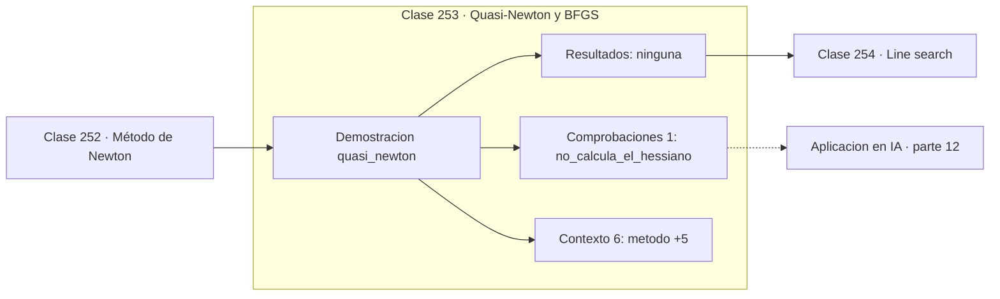

# 253 — Quasi-Newton y BFGS

> [⬅️ 252 Método de Newton](../252-metodo-de-newton/README.md) · [📚 Parte 12](../README.md) · [🏠 Programa](../../../README.md) · [254 Line search ➡️](../254-line-search/README.md)

**Parte:** 12 — Optimización matemática y computacional · **Nivel:** `avanzado` · **Horas estimadas:** 4
**Motor:** `engines.part12` · **Demostración:** `quasi_newton` · **Clase 13 de 20** de la parte

---

## 🎯 Propósito

**BFGS construye una aproximación del Hessiano inverso usando solo gradientes.**

Función objetivo, convexidad, descenso de gradiente y su familia completa de optimizadores, métodos de segundo orden, restricciones, KKT y optimización evolutiva.

## ✅ Resultados de aprendizaje

Al terminar podrás:

1. Explicar **Quasi-Newton y BFGS** con lenguaje cotidiano y con notación matemática.
2. Resolver un caso pequeño a mano y anticipar el orden de magnitud del resultado.
3. Ejecutar y modificar `lab.py`, que corre la demostración `quasi_newton`.
4. Interpretar las 7 salidas del laboratorio y decir qué comprueba cada una.
5. Detectar el error típico de esta parte: comparar optimizadores sin fijar semilla ni presupuesto de iteraciones.

## 🧩 Fórmulas de la clase

```text
sₖ = xₖ₊₁ − xₖ;   yₖ = ∇f(xₖ₊₁) − ∇f(xₖ)
condición secante: Bₖ₊₁·yₖ = sₖ
coste O(n²) frente al O(n³) de Newton
```

## 🗺️ Ubicación en el programa



## 📖 Fundamentos

Los métodos cuasi-Newton buscan la velocidad de Newton sin su coste. La idea es que la
diferencia entre dos gradientes consecutivos ya contiene información sobre la curvatura en
la dirección recorrida, y acumulando esa información a lo largo de las iteraciones se puede
construir una aproximación del Hessiano inverso.

La **condición secante** `B·y = s` es la formalización: la aproximación debe reproducir la
relación observada entre el desplazamiento y el cambio de gradiente. Es la generalización
multidimensional exacta del método de la secante de la clase 224, donde la derivada se
aproximaba con dos evaluaciones.

**BFGS** es la fórmula de actualización que mejor funciona en la práctica, y tiene la
propiedad valiosa de preservar la definición positiva de la aproximación, con lo que la
dirección resultante siempre es de descenso. El coste baja a `O(n²)` y no hace falta
calcular ninguna segunda derivada.

Para dimensiones grandes existe **L-BFGS**, que no almacena la matriz sino los últimos
`m` pares `(s, y)` —típicamente 10 o 20— y reconstruye el producto con el gradiente sobre
la marcha. Su coste es `O(mn)` y es el algoritmo de referencia para optimización suave a
gran escala fuera del aprendizaje profundo. En redes neuronales rinde menos porque el
gradiente estocástico rompe las hipótesis de suavidad que necesita.

## 🧮 Ejemplo trabajado

BFGS reconstruye el Hessiano inverso sin calcularlo.

```text
f(x,y) = x² + 20y²      BFGS con línea de retroceso

iter      f          |∇f|
  1   14,765625    30,2335
  5    1,3e-03      0,2189
 10    2,1e-09      9,1e-05

x final = (−0,0 ; −0,0)                              ✓

Aproximación construida:      Hessiano inverso real:
  [[0,501698  0,000276]         [[0,5    0   ]
   [0,000276  0,025045]]         [0     0,025]]

Coincide a tres decimales sin haber evaluado
ni una sola segunda derivada.
```

## 🔬 Qué ejecuta el laboratorio

`quasi_newton` — BFGS: aproxima el Hessiano inverso solo con gradientes.

| Grupo | Salidas |
|---|---|
| 🔢 Resultados numéricos (0) | — |
| ✅ Comprobaciones de invariante (1) | `no_calcula_el_hessiano` |

Las claves booleanas no son adorno: si alguna fuera `False`, el resultado numérico
no sería fiable aunque el programa terminase sin error.

```bash
python classes/part-12-optimizacion-matematica-y-computacional/253-quasi-newton-y-bfgs/lab.py
compmath run 253
```

> [!TIP]
> Antes de ejecutar, **escribe tu predicción**. Un laboratorio que confirma lo que
> esperabas enseña tanto como uno que te contradice, pero solo si la predicción
> existía antes del resultado.

## ⚠️ Errores conceptuales frecuentes

1. Usar BFGS con gradientes estocásticos ruidosos.
2. Almacenar la matriz completa cuando L-BFGS resolvería el problema.
3. Omitir la búsqueda de línea, necesaria para que la aproximación se mantenga válida.

## 🚀 Dónde se usa de verdad

Ajuste de modelos estadísticos, optimización en ingeniería, problemas inversos y
minimización de energía en química computacional.

## 🤖 Conexión con IA

AdamW es el optimizador por defecto del entrenamiento moderno; entender su actualización explica el weight decay, el warmup y el gradient clipping.

## 📓 Notebooks

| Archivo | Para qué |
|---|---|
| [`notebook.ipynb`](notebook.ipynb) | recorrido guiado con la demostración ejecutada |
| [`notebook_student.ipynb`](notebook_student.ipynb) | versión con `TODO` para resolver |
| [`notebook_solution.ipynb`](notebook_solution.ipynb) | solución de referencia verificada |

## 📝 Evaluación

| Criterio | Peso |
|---|---:|
| Comprensión conceptual | 25 % |
| Resolución manual | 25 % |
| Implementación y verificación | 25 % |
| Interpretación y comunicación | 15 % |
| Conexión con aplicación real | 10 % |

Detalle y criterios de error crítico en [`assessment.md`](assessment.md).

## ❓ Preguntas de comprobación

1. ¿Cuál es la entrada, cuál la salida y qué unidades tienen?
2. ¿Qué operación domina el comportamiento del resultado?
3. ¿Qué caso extremo revelaría un error conceptual?
4. ¿Cómo verificarías el resultado por un método independiente?
5. ¿Dónde aparece esto en logística?

Si necesitas releer el código para responderlas, la clase todavía no está superada.

## 📥 Entregable

`notebook_student.ipynb` resuelto más un párrafo que explique el resultado **sin citar
código**: qué entra, qué sale, qué invariante se comprueba y qué pasaría en un caso límite.

## 🔗 Referencias

- [Nocedal, J.; Wright, S. *Numerical Optimization*, 2ª ed., Springer, 2006, cap. 6](https://doi.org/10.1007/978-0-387-40065-5)
- [Liu, D.; Nocedal, J. *On the limited memory BFGS method*, Mathematical Programming, 1989](https://doi.org/10.1007/BF01589116)

Bibliografía completa de la parte en [`../../../docs/BIBLIOGRAPHY.md`](../../../docs/BIBLIOGRAPHY.md).

## 📂 Material de la clase

[`intuition.md`](intuition.md) · [`theory.md`](theory.md) · [`derivation.md`](derivation.md) · [`exercises.md`](exercises.md) · [`assessment.md`](assessment.md) · [`where-is-this-used.md`](where-is-this-used.md) · [`lesson.yaml`](lesson.yaml)

---

> [⬅️ 252 Método de Newton](../252-metodo-de-newton/README.md) · [📚 Parte 12](../README.md) · [🏠 Programa](../../../README.md) · [254 Line search ➡️](../254-line-search/README.md)
