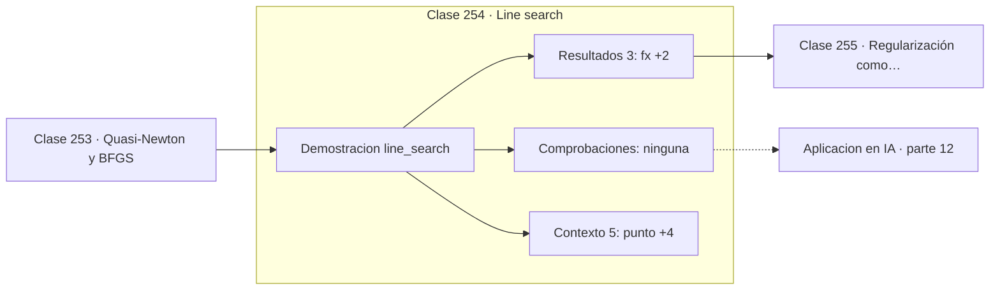

# 254 — Line search

> [⬅️ 253 Quasi-Newton y BFGS](../253-quasi-newton-y-bfgs/README.md) · [📚 Parte 12](../README.md) · [🏠 Programa](../../../README.md) · [255 Regularización como optimización ➡️](../255-regularizacion-como-optimizacion/README.md)

**Parte:** 12 — Optimización matemática y computacional · **Nivel:** `avanzado` · **Horas estimadas:** 4
**Motor:** `engines.part12` · **Demostración:** `line_search` · **Clase 14 de 20** de la parte

---

## 🎯 Propósito

**Armijo pide una reducción proporcional a lo que el gradiente prometía, no cualquier reducción.**

Función objetivo, convexidad, descenso de gradiente y su familia completa de optimizadores, métodos de segundo orden, restricciones, KKT y optimización evolutiva.

## ✅ Resultados de aprendizaje

Al terminar podrás:

1. Explicar **Line search** con lenguaje cotidiano y con notación matemática.
2. Resolver un caso pequeño a mano y anticipar el orden de magnitud del resultado.
3. Ejecutar y modificar `lab.py`, que corre la demostración `line_search`.
4. Interpretar las 8 salidas del laboratorio y decir qué comprueba cada una.
5. Detectar el error típico de esta parte: aplicar weight decay dentro del gradiente en adam (y no como adamw).

## 🧩 Fórmulas de la clase

```text
condición de Armijo: f(x + αd) ≤ f(x) + c₁·α·∇fᵀd
retroceso: empezar en α = 1 y multiplicar por 0,5 hasta cumplirla
c₁ típico: 10⁻⁴
```

## 🗺️ Ubicación en el programa



## 📖 Fundamentos

Elegir el tamaño de paso a mano es frágil: demasiado grande diverge, demasiado pequeño
malgasta iteraciones. La búsqueda de línea automatiza esa elección probando valores y
quedándose con uno que garantice progreso suficiente.

El criterio ingenuo —aceptar cualquier `α` que reduzca `f`— no basta. Se pueden construir
sucesiones de pasos que reducen la función cada vez y aun así no convergen al mínimo,
porque la reducción se hace arbitrariamente pequeña. Hace falta exigir un progreso
**proporcional** al prometido por el gradiente.

Esa exigencia es la **condición de Armijo**: la reducción debe ser al menos una fracción
`c₁` de la que predice la aproximación lineal. Con `c₁ = 10⁻⁴` la exigencia es muy laxa —se
pide capturar la diezmilésima parte del descenso prometido— y aun así basta para garantizar
convergencia.

La implementación estándar es el **retroceso**: empezar con `α = 1`, y mientras no se
cumpla Armijo multiplicar por 0,5. Termina en pocas iteraciones y solo requiere evaluar la
función. Las condiciones de Wolfe añaden una segunda desigualdad sobre la curvatura para
evitar pasos demasiado cortos, y son las que necesita BFGS para mantener válida su
aproximación.

## 🧮 Ejemplo trabajado

Retroceso desde un punto con gradiente muy desequilibrado.

```text
punto (−2, 3)      f = 184,0
dirección d = −∇f = (4, −120)      c₁ = 1e-4

α        f(x + αd)      ¿Armijo?
1,000    273 784,0         no
0,500     64 900,0         no
0,250     15 016,0         no
0,125      3 271,0         no
0,0625       634,0         no
0,03125      146,3         sí   ← aceptado

6 evaluaciones de f y ningún hiperparámetro que ajustar.

Sin línea de búsqueda, α = 1 habría multiplicado
la función por 1 488.
```

## 🔬 Qué ejecuta el laboratorio

`line_search` — Búsqueda de línea con la condición de Armijo.

| Grupo | Salidas |
|---|---|
| 🔢 Resultados numéricos (3) | `f(x)`, `c1`, `alpha_aceptado` |
| ✅ Comprobaciones de invariante (0) | — |

Las claves booleanas no son adorno: si alguna fuera `False`, el resultado numérico
no sería fiable aunque el programa terminase sin error.

```bash
python classes/part-12-optimizacion-matematica-y-computacional/254-line-search/lab.py
compmath run 254
```

> [!TIP]
> Antes de ejecutar, **escribe tu predicción**. Un laboratorio que confirma lo que
> esperabas enseña tanto como uno que te contradice, pero solo si la predicción
> existía antes del resultado.

## ⚠️ Errores conceptuales frecuentes

1. Aceptar cualquier α que reduzca f, sin condición de progreso suficiente.
2. Empezar el retroceso desde un α inicial demasiado pequeño.
3. Usar solo Armijo con BFGS, donde hacen falta las condiciones de Wolfe.

## 🚀 Dónde se usa de verdad

Métodos cuasi-Newton, optimización sin ajuste manual de paso, entrenamiento con paso
adaptativo y solvers de propósito general.

## 🤖 Conexión con IA

AdamW es el optimizador por defecto del entrenamiento moderno; entender su actualización explica el weight decay, el warmup y el gradient clipping.

## 📓 Notebooks

| Archivo | Para qué |
|---|---|
| [`notebook.ipynb`](notebook.ipynb) | recorrido guiado con la demostración ejecutada |
| [`notebook_student.ipynb`](notebook_student.ipynb) | versión con `TODO` para resolver |
| [`notebook_solution.ipynb`](notebook_solution.ipynb) | solución de referencia verificada |

## 📝 Evaluación

| Criterio | Peso |
|---|---:|
| Comprensión conceptual | 25 % |
| Resolución manual | 25 % |
| Implementación y verificación | 25 % |
| Interpretación y comunicación | 15 % |
| Conexión con aplicación real | 10 % |

Detalle y criterios de error crítico en [`assessment.md`](assessment.md).

## ❓ Preguntas de comprobación

1. ¿Cuál es la entrada, cuál la salida y qué unidades tienen?
2. ¿Qué operación domina el comportamiento del resultado?
3. ¿Qué caso extremo revelaría un error conceptual?
4. ¿Cómo verificarías el resultado por un método independiente?
5. ¿Dónde aparece esto en logística?

Si necesitas releer el código para responderlas, la clase todavía no está superada.

## 📥 Entregable

`notebook_student.ipynb` resuelto más un párrafo que explique el resultado **sin citar
código**: qué entra, qué sale, qué invariante se comprueba y qué pasaría en un caso límite.

## 🔗 Referencias

- [Nocedal, J.; Wright, S. *Numerical Optimization*, 2ª ed., Springer, 2006, cap. 3](https://doi.org/10.1007/978-0-387-40065-5) — *uso:* desarrollo formal del tema en «Line search».
- [Armijo, L. *Minimization of functions having Lipschitz continuous first partial derivatives*, 1966](https://doi.org/10.2140/pjm.1966.16.1) — *uso:* artículo de origen consultado en «Line search».

Bibliografía completa de la parte en [`../../../docs/BIBLIOGRAPHY.md`](../../../docs/BIBLIOGRAPHY.md) · localizador verificable de cada obra en [`sources/bibliography.json`](../../../sources/bibliography.json).

## 📂 Material de la clase

[`intuition.md`](intuition.md) · [`theory.md`](theory.md) · [`derivation.md`](derivation.md) · [`exercises.md`](exercises.md) · [`assessment.md`](assessment.md) · [`where-is-this-used.md`](where-is-this-used.md) · [`lesson.yaml`](lesson.yaml)

---

> [⬅️ 253 Quasi-Newton y BFGS](../253-quasi-newton-y-bfgs/README.md) · [📚 Parte 12](../README.md) · [🏠 Programa](../../../README.md) · [255 Regularización como optimización ➡️](../255-regularizacion-como-optimizacion/README.md)
