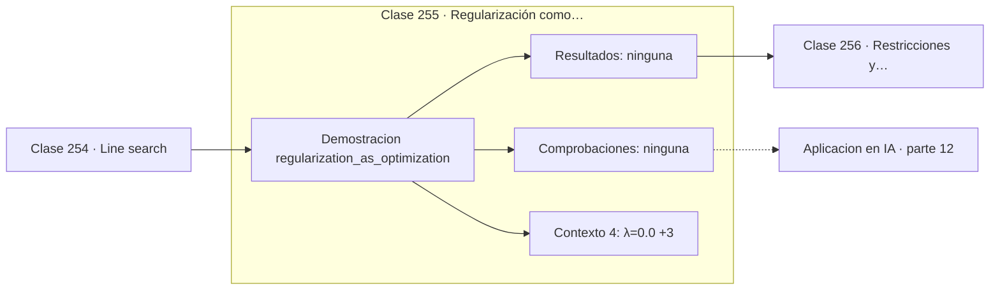

# 255 — Regularización como optimización

> [⬅️ 254 Line search](../254-line-search/README.md) · [📚 Parte 12](../README.md) · [🏠 Programa](../../../README.md) · [256 Restricciones y Lagrangianos ➡️](../256-restricciones-y-lagrangianos/README.md)

**Parte:** 12 — Optimización matemática y computacional · **Nivel:** `avanzado` · **Horas estimadas:** 4
**Motor:** `engines.part12` · **Demostración:** `regularization_as_optimization` · **Clase 15 de 20** de la parte

---

## 🎯 Propósito

**Regularizar es cambiar la función objetivo, no modificar el algoritmo.**

Función objetivo, convexidad, descenso de gradiente y su familia completa de optimizadores, métodos de segundo orden, restricciones, KKT y optimización evolutiva.

## ✅ Resultados de aprendizaje

Al terminar podrás:

1. Explicar **Regularización como optimización** con lenguaje cotidiano y con notación matemática.
2. Resolver un caso pequeño a mano y anticipar el orden de magnitud del resultado.
3. Ejecutar y modificar `lab.py`, que corre la demostración `regularization_as_optimization`.
4. Interpretar las 4 salidas del laboratorio y decir qué comprueba cada una.
5. Detectar el error típico de esta parte: declarar convergencia por número de épocas y no por criterio numérico.

## 🧩 Fórmulas de la clase

```text
objetivo regularizado: J(w) = L(w) + λ·R(w)
L2: R(w) = ‖w‖²  → encoge todos los pesos
L1: R(w) = ‖w‖₁  → anula coeficientes
```

## 🗺️ Ubicación en el programa



## 📖 Fundamentos

La regularización se presenta a menudo como un truco para evitar el sobreajuste, y esa
descripción oscurece lo que realmente es: **una modificación explícita de la función
objetivo**. Se está optimizando un problema distinto, con un término adicional que penaliza
la complejidad, y todo el análisis de optimización sigue aplicándose sin cambios.

El parámetro `λ` fija el precio de la complejidad. Con `λ = 0` se minimiza solo el error de
ajuste y los pesos crecen sin límite si eso ayuda. Con `λ` grande domina la penalización y
los pesos se encogen hacia cero a costa de un ajuste peor. Es una **frontera de Pareto**
entre dos objetivos en conflicto, y elegir `λ` es elegir un punto sobre ella.

La elección de norma cambia cualitativamente la solución. **L2** encoge todos los
coeficientes de forma proporcional pero no anula ninguno, porque su gradiente se hace
pequeño cerca de cero. **L1** tiene gradiente constante y empuja los coeficientes
exactamente a cero, produciendo soluciones **dispersas** que sirven como selección
automática de variables.

La conexión con la parte 10 es directa y merece recordarse: L2 equivale a un prior
gaussiano sobre los pesos y L1 a un prior de Laplace, y minimizar el objetivo regularizado
es exactamente la estimación MAP. Regularizar no es un truco de ingeniería sino la
formulación de una creencia previa.

## 🧮 Ejemplo trabajado

Mismo problema con tres valores de λ.

```text
  λ        pesos              MSE       ‖w‖₂
0,00   [1,010977 ; 9,927716]  0,0151    9,979
0,01   [1,634097 ; 5,663765]  0,2503    5,895
0,50   [1,618590 ; 0,480769]  1,8027    1,688

Al subir λ:
  la norma de w baja de 9,98 a 1,69
  el error de ajuste sube de 0,015 a 1,803

Es un intercambio explícito, no un efecto secundario.

El segundo peso, que valía 9,93 sin regularizar,
queda reducido a 0,48: el modelo decide que no
merece la pena pagarlo.
```

## 🔬 Qué ejecuta el laboratorio

`regularization_as_optimization` — Regularizar es cambiar el objetivo, no el algoritmo.

| Grupo | Salidas |
|---|---|
| 🔢 Resultados numéricos (0) | — |
| ✅ Comprobaciones de invariante (0) | — |

Las claves booleanas no son adorno: si alguna fuera `False`, el resultado numérico
no sería fiable aunque el programa terminase sin error.

```bash
python classes/part-12-optimizacion-matematica-y-computacional/255-regularizacion-como-optimizacion/lab.py
compmath run 255
```

> [!TIP]
> Antes de ejecutar, **escribe tu predicción**. Un laboratorio que confirma lo que
> esperabas enseña tanto como uno que te contradice, pero solo si la predicción
> existía antes del resultado.

## ⚠️ Errores conceptuales frecuentes

1. Tratar la regularización como un ajuste del algoritmo y no del objetivo.
2. Elegir λ sin validación, por costumbre.
3. Regularizar los sesgos y los parámetros de normalización junto con los pesos.

## 🚀 Dónde se usa de verdad

Ridge y Lasso, weight decay en redes, selección de variables, compressed sensing y control
del sobreajuste.

## 🤖 Conexión con IA

AdamW es el optimizador por defecto del entrenamiento moderno; entender su actualización explica el weight decay, el warmup y el gradient clipping.

## 📓 Notebooks

| Archivo | Para qué |
|---|---|
| [`notebook.ipynb`](notebook.ipynb) | recorrido guiado con la demostración ejecutada |
| [`notebook_student.ipynb`](notebook_student.ipynb) | versión con `TODO` para resolver |
| [`notebook_solution.ipynb`](notebook_solution.ipynb) | solución de referencia verificada |

## 📝 Evaluación

| Criterio | Peso |
|---|---:|
| Comprensión conceptual | 25 % |
| Resolución manual | 25 % |
| Implementación y verificación | 25 % |
| Interpretación y comunicación | 15 % |
| Conexión con aplicación real | 10 % |

Detalle y criterios de error crítico en [`assessment.md`](assessment.md).

## ❓ Preguntas de comprobación

1. ¿Cuál es la entrada, cuál la salida y qué unidades tienen?
2. ¿Qué operación domina el comportamiento del resultado?
3. ¿Qué caso extremo revelaría un error conceptual?
4. ¿Cómo verificarías el resultado por un método independiente?
5. ¿Dónde aparece esto en logística?

Si necesitas releer el código para responderlas, la clase todavía no está superada.

## 📥 Entregable

`notebook_student.ipynb` resuelto más un párrafo que explique el resultado **sin citar
código**: qué entra, qué sale, qué invariante se comprueba y qué pasaría en un caso límite.

## 🔗 Referencias

- [Hastie, T.; Tibshirani, R.; Friedman, J. *The Elements of Statistical Learning*, 2ª ed., Springer, 2009](https://hastie.su.domains/ElemStatLearn/) — *uso:* obra de referencia consultada en «Regularización como optimización».
- [Tibshirani, R. *Regression shrinkage and selection via the lasso*, JRSS-B, 1996](https://doi.org/10.1111/j.2517-6161.1996.tb02080.x) — *uso:* artículo de origen consultado en «Regularización como optimización».

Bibliografía completa de la parte en [`../../../docs/BIBLIOGRAPHY.md`](../../../docs/BIBLIOGRAPHY.md) · localizador verificable de cada obra en [`sources/bibliography.json`](../../../sources/bibliography.json).

## 📂 Material de la clase

[`intuition.md`](intuition.md) · [`theory.md`](theory.md) · [`derivation.md`](derivation.md) · [`exercises.md`](exercises.md) · [`assessment.md`](assessment.md) · [`where-is-this-used.md`](where-is-this-used.md) · [`lesson.yaml`](lesson.yaml)

---

> [⬅️ 254 Line search](../254-line-search/README.md) · [📚 Parte 12](../README.md) · [🏠 Programa](../../../README.md) · [256 Restricciones y Lagrangianos ➡️](../256-restricciones-y-lagrangianos/README.md)
