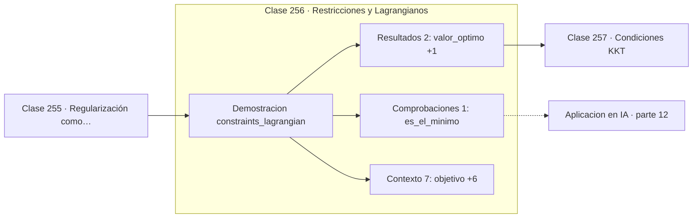

# 256 — Restricciones y Lagrangianos

> [⬅️ 255 Regularización como optimización](../255-regularizacion-como-optimizacion/README.md) · [📚 Parte 12](../README.md) · [🏠 Programa](../../../README.md) · [257 Condiciones KKT ➡️](../257-condiciones-kkt/README.md)

**Parte:** 12 — Optimización matemática y computacional · **Nivel:** `avanzado` · **Horas estimadas:** 4
**Motor:** `engines.part12` · **Demostración:** `constraints_lagrangian` · **Clase 16 de 20** de la parte

---

## 🎯 Propósito

**El multiplicador de Lagrange mide cuánto vale relajar la restricción una unidad.**

Función objetivo, convexidad, descenso de gradiente y su familia completa de optimizadores, métodos de segundo orden, restricciones, KKT y optimización evolutiva.

## ✅ Resultados de aprendizaje

Al terminar podrás:

1. Explicar **Restricciones y Lagrangianos** con lenguaje cotidiano y con notación matemática.
2. Resolver un caso pequeño a mano y anticipar el orden de magnitud del resultado.
3. Ejecutar y modificar `lab.py`, que corre la demostración `constraints_lagrangian`.
4. Interpretar las 10 salidas del laboratorio y decir qué comprueba cada una.
5. Detectar el error típico de esta parte: comparar optimizadores sin fijar semilla ni presupuesto de iteraciones.

## 🧩 Fórmulas de la clase

```text
L(x,λ) = f(x) − λ·(g(x) − c)
en el óptimo: ∇f = λ·∇g
λ = ∂f*/∂c  (precio sombra)
```

## 🗺️ Ubicación en el programa



## 📖 Fundamentos

Con una restricción de igualdad, el mínimo ya no está donde el gradiente se anula sino
donde el gradiente del objetivo es **paralelo** al de la restricción. La razón geométrica
es clara: si tuvieran una componente distinta, se podría avanzar a lo largo de la
restricción reduciendo el objetivo.

El **Lagrangiano** convierte esa condición en un sistema de ecuaciones. Se construye
restando la restricción multiplicada por una incógnita nueva `λ`, y se anulan todas las
derivadas parciales, incluida la de `λ`, que reproduce la restricción original. El problema
restringido se transforma en uno irrestricto con una variable más.

El multiplicador tiene un significado económico preciso y muy útil: es el **precio sombra**
de la restricción, la derivada del óptimo respecto del nivel `c`. Si `λ = 3`, relajar la
restricción una unidad mejora el óptimo en 3 unidades. Eso convierte a `λ` en la respuesta
cuantitativa a «¿cuánto pagaría por más presupuesto?».

En aprendizaje automático el Lagrangiano aparece en la formulación dual de las SVM, en la
derivación de la distribución de máxima entropía —de donde sale softmax—, y en el
entrenamiento con restricciones de equidad o de presupuesto. La versión con desigualdades
es la clase siguiente.

## 🧮 Ejemplo trabajado

Punto de la recta x + y = 4 más cercano al origen.

```text
minimizar   f(x,y) = x² + y²
sujeto a    x + y = 4

L = x² + y² − λ(x + y − 4)

∂L/∂x = 2x − λ = 0    →   2x = λ
∂L/∂y = 2y − λ = 0    →   2y = λ
∂L/∂λ = x + y − 4 = 0

De las dos primeras: x = y.  Sustituyendo: 2x = 4, x = 2.

solución = (2, 2)      valor óptimo = 8,0
λ = 4

Interpretación de λ: si la restricción pasara a x+y = 5,
el óptimo subiría aproximadamente en 4 unidades.
```

## 🔬 Qué ejecuta el laboratorio

`constraints_lagrangian` — Restricción de igualdad resuelta con el Lagrangiano.

| Grupo | Salidas |
|---|---|
| 🔢 Resultados numéricos (2) | `valor_optimo`, `lambda` |
| ✅ Comprobaciones de invariante (1) | `es_el_minimo` |

Las claves booleanas no son adorno: si alguna fuera `False`, el resultado numérico
no sería fiable aunque el programa terminase sin error.

```bash
python classes/part-12-optimizacion-matematica-y-computacional/256-restricciones-y-lagrangianos/lab.py
compmath run 256
```

> [!TIP]
> Antes de ejecutar, **escribe tu predicción**. Un laboratorio que confirma lo que
> esperabas enseña tanto como uno que te contradice, pero solo si la predicción
> existía antes del resultado.

## ⚠️ Errores conceptuales frecuentes

1. Olvidar derivar respecto de λ y perder la restricción.
2. Confundir el signo del multiplicador según la convención adoptada.
3. Aplicar Lagrange directamente a restricciones de desigualdad.

## 🚀 Dónde se usa de verdad

SVM en su forma dual, distribución de máxima entropía, asignación óptima de recursos y
entrenamiento con restricciones.

## 🤖 Conexión con IA

AdamW es el optimizador por defecto del entrenamiento moderno; entender su actualización explica el weight decay, el warmup y el gradient clipping.

## 📓 Notebooks

| Archivo | Para qué |
|---|---|
| [`notebook.ipynb`](notebook.ipynb) | recorrido guiado con la demostración ejecutada |
| [`notebook_student.ipynb`](notebook_student.ipynb) | versión con `TODO` para resolver |
| [`notebook_solution.ipynb`](notebook_solution.ipynb) | solución de referencia verificada |

## 📝 Evaluación

| Criterio | Peso |
|---|---:|
| Comprensión conceptual | 25 % |
| Resolución manual | 25 % |
| Implementación y verificación | 25 % |
| Interpretación y comunicación | 15 % |
| Conexión con aplicación real | 10 % |

Detalle y criterios de error crítico en [`assessment.md`](assessment.md).

## ❓ Preguntas de comprobación

1. ¿Cuál es la entrada, cuál la salida y qué unidades tienen?
2. ¿Qué operación domina el comportamiento del resultado?
3. ¿Qué caso extremo revelaría un error conceptual?
4. ¿Cómo verificarías el resultado por un método independiente?
5. ¿Dónde aparece esto en logística?

Si necesitas releer el código para responderlas, la clase todavía no está superada.

## 📥 Entregable

`notebook_student.ipynb` resuelto más un párrafo que explique el resultado **sin citar
código**: qué entra, qué sale, qué invariante se comprueba y qué pasaría en un caso límite.

## 🔗 Referencias

- [Boyd, S.; Vandenberghe, L. *Convex Optimization*, Cambridge, 2004, cap. 5](https://web.stanford.edu/~boyd/cvxbook/)
- [Nocedal, J.; Wright, S. *Numerical Optimization*, 2ª ed., Springer, 2006, cap. 12](https://doi.org/10.1007/978-0-387-40065-5)

Bibliografía completa de la parte en [`../../../docs/BIBLIOGRAPHY.md`](../../../docs/BIBLIOGRAPHY.md).

## 📂 Material de la clase

[`intuition.md`](intuition.md) · [`theory.md`](theory.md) · [`derivation.md`](derivation.md) · [`exercises.md`](exercises.md) · [`assessment.md`](assessment.md) · [`where-is-this-used.md`](where-is-this-used.md) · [`lesson.yaml`](lesson.yaml)

---

> [⬅️ 255 Regularización como optimización](../255-regularizacion-como-optimizacion/README.md) · [📚 Parte 12](../README.md) · [🏠 Programa](../../../README.md) · [257 Condiciones KKT ➡️](../257-condiciones-kkt/README.md)
