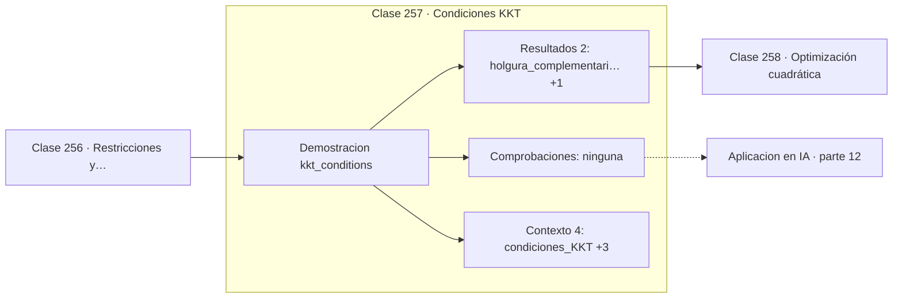

# 257 — Condiciones KKT

> [⬅️ 256 Restricciones y Lagrangianos](../256-restricciones-y-lagrangianos/README.md) · [📚 Parte 12](../README.md) · [🏠 Programa](../../../README.md) · [258 Optimización cuadrática ➡️](../258-optimizacion-cuadratica/README.md)

**Parte:** 12 — Optimización matemática y computacional · **Nivel:** `avanzado` · **Horas estimadas:** 4
**Motor:** `engines.part12` · **Demostración:** `kkt_conditions` · **Clase 17 de 20** de la parte

---

## 🎯 Propósito

**La holgura complementaria formaliza que una restricción inactiva no influye.**

Función objetivo, convexidad, descenso de gradiente y su familia completa de optimizadores, métodos de segundo orden, restricciones, KKT y optimización evolutiva.

## ✅ Resultados de aprendizaje

Al terminar podrás:

1. Explicar **Condiciones KKT** con lenguaje cotidiano y con notación matemática.
2. Resolver un caso pequeño a mano y anticipar el orden de magnitud del resultado.
3. Ejecutar y modificar `lab.py`, que corre la demostración `kkt_conditions`.
4. Interpretar las 6 salidas del laboratorio y decir qué comprueba cada una.
5. Detectar el error típico de esta parte: aplicar weight decay dentro del gradiente en adam (y no como adamw).

## 🧩 Fórmulas de la clase

```text
estacionariedad: ∇f + Σμᵢ·∇gᵢ = 0
factibilidad: gᵢ(x) ≤ 0;   no negatividad: μᵢ ≥ 0
holgura complementaria: μᵢ·gᵢ(x) = 0
```

## 🗺️ Ubicación en el programa



## 📖 Fundamentos

Las condiciones de Karush-Kuhn-Tucker extienden Lagrange a restricciones de desigualdad, y
son las condiciones necesarias de optimalidad que fundamentan toda la optimización con
restricciones. En problemas convexos con cualificación de restricciones son además
suficientes.

La novedad conceptual es que una desigualdad puede estar **activa** —el óptimo está justo
sobre la frontera— o **inactiva** —el óptimo cae en el interior y la restricción no
estorba—. La **holgura complementaria** `μᵢ·gᵢ(x) = 0` codifica exactamente esa
alternativa: o la restricción se cumple con igualdad, o su multiplicador es cero.

La lectura es directa e intuitiva: una restricción que no aprieta no tiene precio. Si el
presupuesto sobra, un euro más no vale nada; si está agotado, su precio sombra es positivo.
Esa dicotomía es lo que hace de KKT una herramienta de análisis y no solo de cálculo.

La condición de **no negatividad** de los multiplicadores es la que distingue las
desigualdades de las igualdades: la restricción solo puede empujar en un sentido. Cuando
todas las restricciones son de igualdad, KKT se reduce exactamente a Lagrange, y esa
reducción confirma que es la generalización correcta.

## 🧮 Ejemplo trabajado

La misma función con dos restricciones distintas.

```text
objetivo: minimizar (x − 3)²

Caso A — restricción activa:   x ≤ 1
  óptimo sin restricción: x = 3, no factible
  x* = 1                (sobre la frontera)
  gradiente del objetivo en x*: −4
  μ = 4 > 0
  holgura: μ·g(x*) = 4·(1−1) = 0                     ✓

Caso B — restricción inactiva: x ≤ 5
  óptimo sin restricción: x = 3, factible
  x* = 3                (en el interior)
  gradiente del objetivo en x*: 0
  μ = 0
  holgura: μ·g(x*) = 0·(3−5) = 0                     ✓

En ambos casos la holgura complementaria se cumple,
pero por motivos opuestos.
```

## 🔬 Qué ejecuta el laboratorio

`kkt_conditions` — KKT: restricciones de desigualdad activas e inactivas.

| Grupo | Salidas |
|---|---|
| 🔢 Resultados numéricos (2) | `holgura_complementaria_activo`, `holgura_complementaria_inactivo` |
| ✅ Comprobaciones de invariante (0) | — |

Las claves booleanas no son adorno: si alguna fuera `False`, el resultado numérico
no sería fiable aunque el programa terminase sin error.

```bash
python classes/part-12-optimizacion-matematica-y-computacional/257-condiciones-kkt/lab.py
compmath run 257
```

> [!TIP]
> Antes de ejecutar, **escribe tu predicción**. Un laboratorio que confirma lo que
> esperabas enseña tanto como uno que te contradice, pero solo si la predicción
> existía antes del resultado.

## ⚠️ Errores conceptuales frecuentes

1. Permitir multiplicadores negativos en restricciones de desigualdad.
2. Olvidar comprobar la holgura complementaria al validar una solución.
3. Aplicar KKT como condición suficiente en problemas no convexos.

## 🚀 Dónde se usa de verdad

SVM con margen blando, programación no lineal, optimización de carteras con límites y
diseño de ingeniería con especificaciones.

## 🤖 Conexión con IA

AdamW es el optimizador por defecto del entrenamiento moderno; entender su actualización explica el weight decay, el warmup y el gradient clipping.

## 📓 Notebooks

| Archivo | Para qué |
|---|---|
| [`notebook.ipynb`](notebook.ipynb) | recorrido guiado con la demostración ejecutada |
| [`notebook_student.ipynb`](notebook_student.ipynb) | versión con `TODO` para resolver |
| [`notebook_solution.ipynb`](notebook_solution.ipynb) | solución de referencia verificada |

## 📝 Evaluación

| Criterio | Peso |
|---|---:|
| Comprensión conceptual | 25 % |
| Resolución manual | 25 % |
| Implementación y verificación | 25 % |
| Interpretación y comunicación | 15 % |
| Conexión con aplicación real | 10 % |

Detalle y criterios de error crítico en [`assessment.md`](assessment.md).

## ❓ Preguntas de comprobación

1. ¿Cuál es la entrada, cuál la salida y qué unidades tienen?
2. ¿Qué operación domina el comportamiento del resultado?
3. ¿Qué caso extremo revelaría un error conceptual?
4. ¿Cómo verificarías el resultado por un método independiente?
5. ¿Dónde aparece esto en logística?

Si necesitas releer el código para responderlas, la clase todavía no está superada.

## 📥 Entregable

`notebook_student.ipynb` resuelto más un párrafo que explique el resultado **sin citar
código**: qué entra, qué sale, qué invariante se comprueba y qué pasaría en un caso límite.

## 🔗 Referencias

- [Boyd, S.; Vandenberghe, L. *Convex Optimization*, Cambridge, 2004, cap. 5](https://web.stanford.edu/~boyd/cvxbook/) — *uso:* obra de referencia consultada en «Condiciones KKT».
- [Karush, W.; Kuhn, H.; Tucker, A. *Nonlinear programming*, 1951](https://doi.org/10.1525/9780520411586-036) — *uso:* desarrollo formal del tema en «Condiciones KKT».

Bibliografía completa de la parte en [`../../../docs/BIBLIOGRAPHY.md`](../../../docs/BIBLIOGRAPHY.md) · localizador verificable de cada obra en [`sources/bibliography.json`](../../../sources/bibliography.json).

## 📂 Material de la clase

[`intuition.md`](intuition.md) · [`theory.md`](theory.md) · [`derivation.md`](derivation.md) · [`exercises.md`](exercises.md) · [`assessment.md`](assessment.md) · [`where-is-this-used.md`](where-is-this-used.md) · [`lesson.yaml`](lesson.yaml)

---

> [⬅️ 256 Restricciones y Lagrangianos](../256-restricciones-y-lagrangianos/README.md) · [📚 Parte 12](../README.md) · [🏠 Programa](../../../README.md) · [258 Optimización cuadrática ➡️](../258-optimizacion-cuadratica/README.md)
