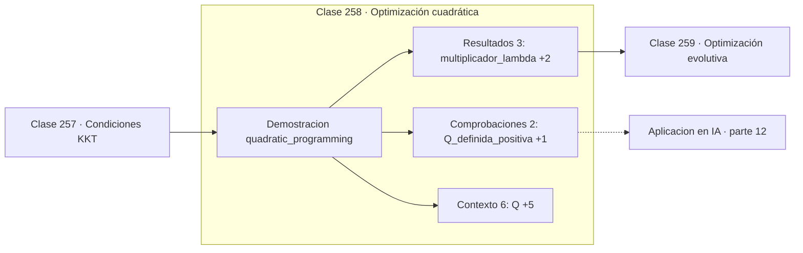

# 258 — Optimización cuadrática

> [⬅️ 257 Condiciones KKT](../257-condiciones-kkt/README.md) · [📚 Parte 12](../README.md) · [🏠 Programa](../../../README.md) · [259 Optimización evolutiva ➡️](../259-optimizacion-evolutiva/README.md)

**Parte:** 12 — Optimización matemática y computacional · **Nivel:** `avanzado` · **Horas estimadas:** 4
**Motor:** `engines.part12` · **Demostración:** `quadratic_programming` · **Clase 18 de 20** de la parte

---

## 🎯 Propósito

**Un programa cuadrático con Q definida positiva se resuelve por un solo sistema lineal.**

Función objetivo, convexidad, descenso de gradiente y su familia completa de optimizadores, métodos de segundo orden, restricciones, KKT y optimización evolutiva.

## ✅ Resultados de aprendizaje

Al terminar podrás:

1. Explicar **Optimización cuadrática** con lenguaje cotidiano y con notación matemática.
2. Resolver un caso pequeño a mano y anticipar el orden de magnitud del resultado.
3. Ejecutar y modificar `lab.py`, que corre la demostración `quadratic_programming`.
4. Interpretar las 11 salidas del laboratorio y decir qué comprueba cada una.
5. Detectar el error típico de esta parte: declarar convergencia por número de épocas y no por criterio numérico.

## 🧩 Fórmulas de la clase

```text
min (1/2)xᵀQx + cᵀx  sujeto a  Ax = b
sistema KKT: [[Q, Aᵀ], [A, 0]]·[x; λ] = [−c; b]
convexo si Q es semidefinida positiva
```

## 🗺️ Ubicación en el programa



## 📖 Fundamentos

La programación cuadrática es la clase de problemas con objetivo cuadrático y restricciones
lineales. Es la siguiente en complejidad después de la lineal, y sigue siendo tratable: si
`Q` es semidefinida positiva el problema es convexo y tiene solución global.

Con restricciones de **igualdad**, las condiciones KKT son lineales en las incógnitas, y el
problema entero se reduce a resolver un único sistema que agrupa variables y
multiplicadores. No hace falta iterar: se plantea el sistema aumentado y se resuelve con
los métodos de la parte 11.

Con restricciones de **desigualdad** aparece la dificultad combinatoria de decidir qué
restricciones están activas en el óptimo. Los algoritmos de conjunto activo prueban
combinaciones sistemáticamente; los de punto interior siguen una trayectoria por el
interior de la región factible y son los que mejor escalan.

Los programas cuadráticos aparecen en sitios importantes: la formulación dual de las **SVM**
es exactamente uno, la optimización de carteras de Markowitz es otro, y el control
predictivo por modelo resuelve uno en cada instante de muestreo. Reconocer que un problema
es un QP es reconocer que se puede resolver de forma fiable y rápida.

## 🧮 Ejemplo trabajado

QP de dos variables con una restricción de igualdad.

```text
minimizar  x² + y² − 2x − 5y
sujeto a   x + y = 3

Q = [[2, 0]      c = (−2, −5)      A = [1  1]     b = 3
     [0, 2]]

Q definida positiva → problema convexo                ✓

Sistema KKT:
  [[2  0  1]   [x]     [ 2]
   [0  2  1] · [y]  =  [ 5]
   [1  1  0]]  [λ]     [ 3]

solución: x = 1,25   y = 1,75   λ = −0,5

Comprobación: 1,25 + 1,75 = 3                         ✓
El óptimo sin restricción sería (1 ; 2,5), que suma 3,5:
la restricción sí aprieta.
```

## 🔬 Qué ejecuta el laboratorio

`quadratic_programming` — Programa cuadrático resuelto por su sistema KKT.

| Grupo | Salidas |
|---|---|
| 🔢 Resultados numéricos (3) | `multiplicador_lambda`, `restriccion_satisfecha`, `valor_objetivo` |
| ✅ Comprobaciones de invariante (2) | `Q_definida_positiva`, `problema_convexo` |

Las claves booleanas no son adorno: si alguna fuera `False`, el resultado numérico
no sería fiable aunque el programa terminase sin error.

```bash
python classes/part-12-optimizacion-matematica-y-computacional/258-optimizacion-cuadratica/lab.py
compmath run 258
```

> [!TIP]
> Antes de ejecutar, **escribe tu predicción**. Un laboratorio que confirma lo que
> esperabas enseña tanto como uno que te contradice, pero solo si la predicción
> existía antes del resultado.

## ⚠️ Errores conceptuales frecuentes

1. Aplicar la solución directa cuando hay restricciones de desigualdad.
2. No comprobar que Q es semidefinida positiva antes de suponer convexidad.
3. Formar el sistema KKT con los signos cambiados.

## 🚀 Dónde se usa de verdad

SVM, optimización de carteras, control predictivo por modelo, ajuste con restricciones y
problemas de mínimos cuadrados restringidos.

## 🤖 Conexión con IA

AdamW es el optimizador por defecto del entrenamiento moderno; entender su actualización explica el weight decay, el warmup y el gradient clipping.

## 📓 Notebooks

| Archivo | Para qué |
|---|---|
| [`notebook.ipynb`](notebook.ipynb) | recorrido guiado con la demostración ejecutada |
| [`notebook_student.ipynb`](notebook_student.ipynb) | versión con `TODO` para resolver |
| [`notebook_solution.ipynb`](notebook_solution.ipynb) | solución de referencia verificada |

## 📝 Evaluación

| Criterio | Peso |
|---|---:|
| Comprensión conceptual | 25 % |
| Resolución manual | 25 % |
| Implementación y verificación | 25 % |
| Interpretación y comunicación | 15 % |
| Conexión con aplicación real | 10 % |

Detalle y criterios de error crítico en [`assessment.md`](assessment.md).

## ❓ Preguntas de comprobación

1. ¿Cuál es la entrada, cuál la salida y qué unidades tienen?
2. ¿Qué operación domina el comportamiento del resultado?
3. ¿Qué caso extremo revelaría un error conceptual?
4. ¿Cómo verificarías el resultado por un método independiente?
5. ¿Dónde aparece esto en logística?

Si necesitas releer el código para responderlas, la clase todavía no está superada.

## 📥 Entregable

`notebook_student.ipynb` resuelto más un párrafo que explique el resultado **sin citar
código**: qué entra, qué sale, qué invariante se comprueba y qué pasaría en un caso límite.

## 🔗 Referencias

- [Nocedal, J.; Wright, S. *Numerical Optimization*, 2ª ed., Springer, 2006, cap. 16](https://doi.org/10.1007/978-0-387-40065-5) — *uso:* desarrollo formal del tema en «Optimización cuadrática».
- [Boyd, S.; Vandenberghe, L. *Convex Optimization*, Cambridge, 2004, cap. 4](https://web.stanford.edu/~boyd/cvxbook/) — *uso:* obra de referencia consultada en «Optimización cuadrática».

Bibliografía completa de la parte en [`../../../docs/BIBLIOGRAPHY.md`](../../../docs/BIBLIOGRAPHY.md) · localizador verificable de cada obra en [`sources/bibliography.json`](../../../sources/bibliography.json).

## 📂 Material de la clase

[`intuition.md`](intuition.md) · [`theory.md`](theory.md) · [`derivation.md`](derivation.md) · [`exercises.md`](exercises.md) · [`assessment.md`](assessment.md) · [`where-is-this-used.md`](where-is-this-used.md) · [`lesson.yaml`](lesson.yaml)

---

> [⬅️ 257 Condiciones KKT](../257-condiciones-kkt/README.md) · [📚 Parte 12](../README.md) · [🏠 Programa](../../../README.md) · [259 Optimización evolutiva ➡️](../259-optimizacion-evolutiva/README.md)
