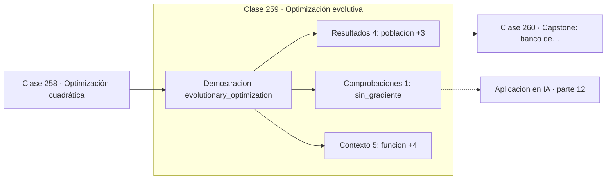

# 259 — Optimización evolutiva

> [⬅️ 258 Optimización cuadrática](../258-optimizacion-cuadratica/README.md) · [📚 Parte 12](../README.md) · [🏠 Programa](../../../README.md) · [260 Capstone: banco de optimizadores comparables ➡️](../260-capstone-banco-de-optimizadores-comparables/README.md)

**Parte:** 12 — Optimización matemática y computacional · **Nivel:** `avanzado` · **Horas estimadas:** 4
**Motor:** `engines.part12` · **Demostración:** `evolutionary_optimization` · **Clase 19 de 20** de la parte

---

## 🎯 Propósito

**Sin gradiente y sobre funciones con muchos mínimos, una población busca mejor que un punto.**

Función objetivo, convexidad, descenso de gradiente y su familia completa de optimizadores, métodos de segundo orden, restricciones, KKT y optimización evolutiva.

## ✅ Resultados de aprendizaje

Al terminar podrás:

1. Explicar **Optimización evolutiva** con lenguaje cotidiano y con notación matemática.
2. Resolver un caso pequeño a mano y anticipar el orden de magnitud del resultado.
3. Ejecutar y modificar `lab.py`, que corre la demostración `evolutionary_optimization`.
4. Interpretar las 10 salidas del laboratorio y decir qué comprueba cada una.
5. Detectar el error típico de esta parte: comparar optimizadores sin fijar semilla ni presupuesto de iteraciones.

## 🧩 Fórmulas de la clase

```text
población → selección → cruce → mutación → nueva población
elitismo: conservar los k mejores intactos
coste: sin gradiente, muchas evaluaciones de f
```

## 🗺️ Ubicación en el programa



## 📖 Fundamentos

Los algoritmos evolutivos mantienen una **población** de soluciones candidatas y la hacen
evolucionar por selección, recombinación y mutación. No necesitan gradiente ni continuidad,
solo poder evaluar la función objetivo, y eso los hace aplicables donde los métodos
basados en derivadas no llegan.

Su ventaja aparece en funciones **multimodales**, con muchos mínimos locales. La función de
Rastrigin, con su rejilla de mínimos, atrapa al descenso de gradiente en el primer valle
que encuentre. Una población dispersa explora simultáneamente muchas regiones y la
selección concentra el esfuerzo donde hay señal.

El **elitismo** es un detalle de implementación con efecto grande: conservar intactos los
mejores individuos garantiza que el óptimo encontrado no se pierda por azar en la siguiente
generación. Sin él, el algoritmo puede empeorar entre generaciones y la convergencia deja
de ser monótona.

El precio es el número de evaluaciones. Donde el descenso de gradiente necesita cientos,
un evolutivo necesita decenas de miles, porque cada generación evalúa la población entera.
La regla práctica es clara: **si hay gradiente fiable, usarlo**. Los evolutivos son para
cuando no lo hay —búsqueda de arquitecturas, hiperparámetros discretos, simuladores como
caja negra— o cuando la multimodalidad es severa.

## 🧮 Ejemplo trabajado

Algoritmo evolutivo sobre Rastrigin en dos dimensiones.

```text
función: Rastrigin 2D, mínimo global en (0,0) con f = 0
población 60, generaciones 120, elitismo 12

generación    mejor f
     1        2,468792
    20        0,183441
    60        0,004127
   120        0,000062

mejor solución: (0,001375 ; 0,005583)

Rastrigin tiene un mínimo local aproximadamente en cada
punto de coordenadas enteras. El descenso de gradiente
desde un punto aleatorio se queda en el más cercano.

Coste: 60 × 120 = 7 200 evaluaciones de f
para un problema de 2 variables.
```

## 🔬 Qué ejecuta el laboratorio

`evolutionary_optimization` — Optimización evolutiva: sin gradiente, sobre una función multimodal.

| Grupo | Salidas |
|---|---|
| 🔢 Resultados numéricos (4) | `poblacion`, `generaciones`, `elitismo`, `mejor_valor` |
| ✅ Comprobaciones de invariante (1) | `sin_gradiente` |

Las claves booleanas no son adorno: si alguna fuera `False`, el resultado numérico
no sería fiable aunque el programa terminase sin error.

```bash
python classes/part-12-optimizacion-matematica-y-computacional/259-optimizacion-evolutiva/lab.py
compmath run 259
```

> [!TIP]
> Antes de ejecutar, **escribe tu predicción**. Un laboratorio que confirma lo que
> esperabas enseña tanto como uno que te contradice, pero solo si la predicción
> existía antes del resultado.

## ⚠️ Errores conceptuales frecuentes

1. Usar un evolutivo donde hay gradiente disponible y fiable.
2. Prescindir del elitismo y perder el mejor individuo.
3. Comparar con métodos de gradiente sin igualar el número de evaluaciones.

## 🚀 Dónde se usa de verdad

Búsqueda de arquitecturas neuronales, ajuste de hiperparámetros discretos, diseño de
ingeniería con simuladores y optimización de funciones no derivables.

## 🤖 Conexión con IA

AdamW es el optimizador por defecto del entrenamiento moderno; entender su actualización explica el weight decay, el warmup y el gradient clipping.

## 📓 Notebooks

| Archivo | Para qué |
|---|---|
| [`notebook.ipynb`](notebook.ipynb) | recorrido guiado con la demostración ejecutada |
| [`notebook_student.ipynb`](notebook_student.ipynb) | versión con `TODO` para resolver |
| [`notebook_solution.ipynb`](notebook_solution.ipynb) | solución de referencia verificada |

## 📝 Evaluación

| Criterio | Peso |
|---|---:|
| Comprensión conceptual | 25 % |
| Resolución manual | 25 % |
| Implementación y verificación | 25 % |
| Interpretación y comunicación | 15 % |
| Conexión con aplicación real | 10 % |

Detalle y criterios de error crítico en [`assessment.md`](assessment.md).

## ❓ Preguntas de comprobación

1. ¿Cuál es la entrada, cuál la salida y qué unidades tienen?
2. ¿Qué operación domina el comportamiento del resultado?
3. ¿Qué caso extremo revelaría un error conceptual?
4. ¿Cómo verificarías el resultado por un método independiente?
5. ¿Dónde aparece esto en logística?

Si necesitas releer el código para responderlas, la clase todavía no está superada.

## 📥 Entregable

`notebook_student.ipynb` resuelto más un párrafo que explique el resultado **sin citar
código**: qué entra, qué sale, qué invariante se comprueba y qué pasaría en un caso límite.

## 📚 Bibliografía de la clase

Esta clase enseña **Optimización**. Cada obra dice qué aporta aquí y cómo se comprobó su localizador:

- [Eiben, A.; Smith, J. *Introduction to Evolutionary Computing*, 2ª ed., Springer, 2015](https://doi.org/10.1007/978-3-662-44874-8) — Optimización: el tema de esta clase · ISBN-13 `9783662448748` verificado en International ISBN Agency (2026-08-19).
- [Hansen, N.; Ostermeier, A. *Completely derandomized self-adaptation in evolution strategies*, 2001](https://doi.org/10.1162/106365601750190398) — Optimización: el tema de esta clase · DOI `10.1162/106365601750190398` verificado en Crossref (2026-08-19).

Bibliografía de todas las clases, con el porqué de cada obra, en [`docs/BIBLIOGRAPHY.md`](../../../docs/BIBLIOGRAPHY.md) · localizador y estado de cada obra en [`sources/bibliography.json`](../../../sources/bibliography.json).

## 📂 Material de la clase

[`intuition.md`](intuition.md) · [`theory.md`](theory.md) · [`derivation.md`](derivation.md) · [`exercises.md`](exercises.md) · [`assessment.md`](assessment.md) · [`where-is-this-used.md`](where-is-this-used.md) · [`lesson.yaml`](lesson.yaml)

---

> [⬅️ 258 Optimización cuadrática](../258-optimizacion-cuadratica/README.md) · [📚 Parte 12](../README.md) · [🏠 Programa](../../../README.md) · [260 Capstone: banco de optimizadores comparables ➡️](../260-capstone-banco-de-optimizadores-comparables/README.md)
