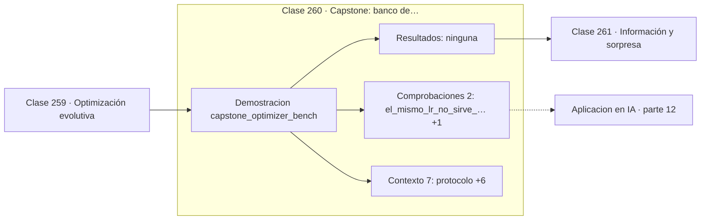

# 260 — Capstone: banco de optimizadores comparables

> [⬅️ 259 Optimización evolutiva](../259-optimizacion-evolutiva/README.md) · [📚 Parte 12](../README.md) · [🏠 Programa](../../../README.md) · [261 Información y sorpresa ➡️](../../part-13-teoria-de-la-informacion-senales-y-series/261-informacion-y-sorpresa/README.md)

**Parte:** 12 — Optimización matemática y computacional · **Nivel:** `avanzado` · **Horas estimadas:** 4
**Motor:** `engines.part12` · **Demostración:** `capstone_optimizer_bench` · **Clase 20 de 20** de la parte

---

## 🎯 Propósito

Función objetivo, convexidad, descenso de gradiente y su familia completa de optimizadores, métodos de segundo orden, restricciones, KKT y optimización evolutiva.

Esta clase concreta ese objetivo sobre **Capstone: banco de optimizadores comparables**: qué es, cómo se
calcula a mano, cómo se implementa sin ocultar el procedimiento y cómo se verifica
que el resultado es correcto y no solo plausible.

## ✅ Resultados de aprendizaje

Al terminar podrás:

1. Explicar **Capstone: banco de optimizadores comparables** con lenguaje cotidiano y con notación matemática.
2. Resolver un caso pequeño a mano y anticipar el orden de magnitud del resultado.
3. Ejecutar y modificar `lab.py`, que corre la demostración `capstone_optimizer_bench`.
4. Interpretar las 9 salidas del laboratorio y decir qué comprueba cada una.
5. Detectar el error típico de esta parte: aplicar weight decay dentro del gradiente en adam (y no como adamw).

## 🗺️ Ubicación en el programa



## 🧠 Idea rectora de la parte 12

> KKT generaliza Lagrange a restricciones de desigualdad.

## 🔬 Qué ejecuta el laboratorio

`capstone_optimizer_bench` — Capstone: banco comparable de optimizadores con presupuesto idéntico.

| Grupo | Salidas |
|---|---|
| 🔢 Resultados numéricos (0) | — |
| ✅ Comprobaciones de invariante (2) | `el_mismo_lr_no_sirve_para_ambos_problemas`, `ningun_optimizador_gana_siempre` |

Las claves booleanas no son adorno: si alguna fuera `False`, el resultado numérico
no sería fiable aunque el programa terminase sin error.

```bash
python classes/part-12-optimizacion-matematica-y-computacional/260-capstone-banco-de-optimizadores-comparables/lab.py
compmath run 260
```

> [!TIP]
> Antes de ejecutar, **escribe tu predicción**. Un laboratorio que confirma lo que
> esperabas enseña tanto como uno que te contradice, pero solo si la predicción
> existía antes del resultado.

## ⚠️ Errores frecuentes en esta parte

- Comparar optimizadores sin fijar semilla ni presupuesto de iteraciones.
- Aplicar weight decay dentro del gradiente en Adam (y no como AdamW).
- Declarar convergencia por número de épocas y no por criterio numérico.

## 🤖 Conexión con IA

AdamW es el optimizador por defecto del entrenamiento moderno; entender su actualización explica el weight decay, el warmup y el gradient clipping.

## 📓 Notebooks

| Archivo | Para qué |
|---|---|
| [`notebook.ipynb`](notebook.ipynb) | recorrido guiado con la demostración ejecutada |
| [`notebook_student.ipynb`](notebook_student.ipynb) | versión con `TODO` para resolver |
| [`notebook_solution.ipynb`](notebook_solution.ipynb) | solución de referencia verificada |

## 📝 Evaluación

| Criterio | Peso |
|---|---:|
| Comprensión conceptual | 25 % |
| Resolución manual | 25 % |
| Implementación y verificación | 25 % |
| Interpretación y comunicación | 15 % |
| Conexión con aplicación real | 10 % |

Detalle y criterios de error crítico en [`assessment.md`](assessment.md).

## ❓ Preguntas de comprobación

1. ¿Cuál es la entrada, cuál la salida y qué unidades tienen?
2. ¿Qué operación domina el comportamiento del resultado?
3. ¿Qué caso extremo revelaría un error conceptual?
4. ¿Cómo verificarías el resultado por un método independiente?
5. ¿Dónde aparece esto en logística?

Si necesitas releer el código para responderlas, la clase todavía no está superada.

## 📥 Entregable

`notebook_student.ipynb` resuelto más un párrafo que explique el resultado **sin citar
código**: qué entra, qué sale, qué invariante se comprueba y qué pasaría en un caso límite.

## 🔗 Referencias

- Boyd, S.; Vandenberghe, L. *Convex Optimization*. Cambridge, 2004.
- Nocedal, J.; Wright, S. *Numerical Optimization*. 2ª ed., Springer, 2006.
- Loshchilov, I.; Hutter, F. *Decoupled Weight Decay Regularization*. ICLR, 2019.

## 📂 Material de la clase

[`intuition.md`](intuition.md) · [`theory.md`](theory.md) · [`derivation.md`](derivation.md) · [`exercises.md`](exercises.md) · [`assessment.md`](assessment.md) · [`where-is-this-used.md`](where-is-this-used.md) · [`lesson.yaml`](lesson.yaml)

---

> [⬅️ 259 Optimización evolutiva](../259-optimizacion-evolutiva/README.md) · [📚 Parte 12](../README.md) · [🏠 Programa](../../../README.md) · [261 Información y sorpresa ➡️](../../part-13-teoria-de-la-informacion-senales-y-series/261-informacion-y-sorpresa/README.md)
