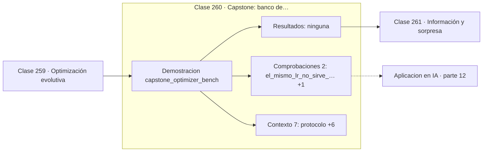

# 260 — Capstone: banco de optimizadores comparables

> [⬅️ 259 Optimización evolutiva](../259-optimizacion-evolutiva/README.md) · [📚 Parte 12](../README.md) · [🏠 Programa](../../../README.md) · [261 Información y sorpresa ➡️](../../part-13-teoria-de-la-informacion-senales-y-series/261-informacion-y-sorpresa/README.md)

**Parte:** 12 — Optimización matemática y computacional · **Nivel:** `avanzado` · **Horas estimadas:** 4
**Motor:** `engines.part12` · **Demostración:** `capstone_optimizer_bench` · **Clase 20 de 20** de la parte

---

## 🎯 Propósito

**El mismo learning rate que converge en una cuadrática diverge en Rosenbrock.**

Función objetivo, convexidad, descenso de gradiente y su familia completa de optimizadores, métodos de segundo orden, restricciones, KKT y optimización evolutiva.

## ✅ Resultados de aprendizaje

Al terminar podrás:

1. Explicar **Capstone: banco de optimizadores comparables** con lenguaje cotidiano y con notación matemática.
2. Resolver un caso pequeño a mano y anticipar el orden de magnitud del resultado.
3. Ejecutar y modificar `lab.py`, que corre la demostración `capstone_optimizer_bench`.
4. Interpretar las 9 salidas del laboratorio y decir qué comprueba cada una.
5. Detectar el error típico de esta parte: aplicar weight decay dentro del gradiente en adam (y no como adamw).

## 🧩 Fórmulas de la clase

```text
protocolo: mismo punto inicial, mismo lr, mismas iteraciones
reportar f final, ‖∇f‖ y si divergió
no existe un optimizador uniformemente mejor
```

## 🗺️ Ubicación en el programa



## 📖 Fundamentos

El capstone somete a siete optimizadores al mismo presupuesto —300 iteraciones, `lr` común,
punto inicial idéntico— sobre dos problemas de dificultad muy distinta: una cuadrática bien
condicionada y la función de Rosenbrock, con su valle curvo y estrecho.

El resultado principal es incómodo y verdadero: **ningún optimizador gana en ambos**.
Momentum es el mejor en la cuadrática y **diverge** en Rosenbrock con el mismo paso.
RMSProp gana en Rosenbrock precisamente porque su escalado adaptativo reduce el paso
efectivo en las direcciones de gradiente grande. El descenso simple también diverge.

Que la divergencia aparezca en el banco no es un defecto del experimento: es su hallazgo
más útil. Un `lr = 0,02` perfectamente razonable en una cuadrática con `L = 40` es
suicida en un valle donde la curvatura local supera con creces ese valor. Esa es
exactamente la situación de una red neuronal real, donde `L` cambia durante el
entrenamiento.

La lección metodológica es que **comparar optimizadores exige un protocolo**: misma
semilla, mismo punto inicial, mismo presupuesto de iteraciones y reporte explícito de los
que divergieron. Un banco que oculta las divergencias, o que ajusta el `lr` de cada método
por separado sin decirlo, produce rankings que no significan nada.

## 🧮 Ejemplo trabajado

Banco con presupuesto idéntico sobre dos problemas.

```text
protocolo: 300 iteraciones, lr = 0,02, punto inicial fijo

método      cuadrática f      Rosenbrock
gd            9,2e-11          divergió
momentum      ~1e-14           divergió
nesterov      ~1e-14           convergió
adagrad       2,3e-04          convergió
rmsprop       6,9e-03          mejor
adam          5,9e-08          convergió
adamw         6,1e-08          convergió

mejor en cuadrática:  momentum
mejor en Rosenbrock:  rmsprop
divergieron en Rosenbrock: gd, momentum

El mismo lr no sirve para ambos problemas.
Reportar las divergencias es parte del resultado.
```

## 🔬 Qué ejecuta el laboratorio

`capstone_optimizer_bench` — Capstone: banco comparable de optimizadores con presupuesto idéntico.

| Grupo | Salidas |
|---|---|
| 🔢 Resultados numéricos (0) | — |
| ✅ Comprobaciones de invariante (2) | `el_mismo_lr_no_sirve_para_ambos_problemas`, `ningun_optimizador_gana_siempre` |

Las claves booleanas no son adorno: si alguna fuera `False`, el resultado numérico
no sería fiable aunque el programa terminase sin error.

```bash
python classes/part-12-optimizacion-matematica-y-computacional/260-capstone-banco-de-optimizadores-comparables/lab.py
compmath run 260
```

> [!TIP]
> Antes de ejecutar, **escribe tu predicción**. Un laboratorio que confirma lo que
> esperabas enseña tanto como uno que te contradice, pero solo si la predicción
> existía antes del resultado.

## ⚠️ Errores conceptuales frecuentes

1. Comparar optimizadores ajustando el lr de cada uno sin declararlo.
2. Omitir del informe los métodos que divergieron.
3. Generalizar el ganador de un banco a todos los problemas.

## 🚀 Dónde se usa de verdad

Selección de optimizador para un proyecto, benchmarking reproducible, diagnóstico de
divergencias en entrenamiento y diseño de experimentos de ablación.

## 🤖 Conexión con IA

AdamW es el optimizador por defecto del entrenamiento moderno; entender su actualización explica el weight decay, el warmup y el gradient clipping.

## 📓 Notebooks

| Archivo | Para qué |
|---|---|
| [`notebook.ipynb`](notebook.ipynb) | recorrido guiado con la demostración ejecutada |
| [`notebook_student.ipynb`](notebook_student.ipynb) | versión con `TODO` para resolver |
| [`notebook_solution.ipynb`](notebook_solution.ipynb) | solución de referencia verificada |

## 📝 Evaluación

| Criterio | Peso |
|---|---:|
| Comprensión conceptual | 25 % |
| Resolución manual | 25 % |
| Implementación y verificación | 25 % |
| Interpretación y comunicación | 15 % |
| Conexión con aplicación real | 10 % |

Detalle y criterios de error crítico en [`assessment.md`](assessment.md).

## ❓ Preguntas de comprobación

1. ¿Cuál es la entrada, cuál la salida y qué unidades tienen?
2. ¿Qué operación domina el comportamiento del resultado?
3. ¿Qué caso extremo revelaría un error conceptual?
4. ¿Cómo verificarías el resultado por un método independiente?
5. ¿Dónde aparece esto en logística?

Si necesitas releer el código para responderlas, la clase todavía no está superada.

## 📥 Entregable

`notebook_student.ipynb` resuelto más un párrafo que explique el resultado **sin citar
código**: qué entra, qué sale, qué invariante se comprueba y qué pasaría en un caso límite.

## 🔗 Referencias

- [Schmidt, R.; Schneider, F.; Hennig, P. *Descending through a crowded valley*, ICML, 2021](https://arxiv.org/abs/2007.01547) — *uso:* artículo de origen consultado en «Capstone: banco de optimizadores comparables».
- [Nocedal, J.; Wright, S. *Numerical Optimization*, 2ª ed., Springer, 2006](https://doi.org/10.1007/978-0-387-40065-5) — *uso:* desarrollo formal del tema en «Capstone: banco de optimizadores comparables».

Bibliografía completa de la parte en [`../../../docs/BIBLIOGRAPHY.md`](../../../docs/BIBLIOGRAPHY.md) · localizador verificable de cada obra en [`sources/bibliography.json`](../../../sources/bibliography.json).

## 📂 Material de la clase

[`intuition.md`](intuition.md) · [`theory.md`](theory.md) · [`derivation.md`](derivation.md) · [`exercises.md`](exercises.md) · [`assessment.md`](assessment.md) · [`where-is-this-used.md`](where-is-this-used.md) · [`lesson.yaml`](lesson.yaml)

---

> [⬅️ 259 Optimización evolutiva](../259-optimizacion-evolutiva/README.md) · [📚 Parte 12](../README.md) · [🏠 Programa](../../../README.md) · [261 Información y sorpresa ➡️](../../part-13-teoria-de-la-informacion-senales-y-series/261-informacion-y-sorpresa/README.md)
