# ⚙️ Parte 12 — Optimización matemática y computacional

> [⬅️ Parte 11 — Métodos numéricos y computación científica](../part-11-metodos-numericos-y-computacion-cientifica/README.md) · [🏠 Programa](../../README.md) · [📇 Catálogo](../README.md) · [Parte 13 — Teoría de la información, señales y series ➡️](../part-13-teoria-de-la-informacion-senales-y-series/README.md)

**Nivel:** `avanzado` · **Clases:** 20 · **Horas estimadas:** 80 · **Motor:** [`part12.py`](../../src/computational_math/engines/part12.py)

---

## 🎯 De qué trata esta parte

Función objetivo, convexidad, descenso de gradiente y su familia completa de optimizadores, métodos de segundo orden, restricciones, KKT y optimización evolutiva.

## 🧠 Ideas centrales

- En un problema convexo todo mínimo local es global; fuera de él no hay garantía.
- El learning rate es el hiperparámetro que más veces explica una divergencia.
- Momentum promedia gradientes; Adam además normaliza por su escala.
- Regularizar es añadir un término al objetivo, no un truco de implementación.
- KKT generaliza Lagrange a restricciones de desigualdad.

## 🤖 Por qué importa en IA

> [!IMPORTANT]
> AdamW es el optimizador por defecto del entrenamiento moderno; entender su actualización explica el weight decay, el warmup y el gradient clipping.

## ⚠️ Errores frecuentes de esta parte

- Comparar optimizadores sin fijar semilla ni presupuesto de iteraciones.
- Aplicar weight decay dentro del gradiente en Adam (y no como AdamW).
- Declarar convergencia por número de épocas y no por criterio numérico.

## 🧭 Secuencia de la parte

```mermaid
flowchart LR
    subgraph B1["Bloque 1"]
        direction TB
        L241["241<br/>Problemas de<br/>optimización y función<br/>objetivo"]
        L242["242<br/>Convexidad"]
        L243["243<br/>Gradiente y direcciones<br/>de descenso"]
        L244["244<br/>Gradient descent"]
        L245["245<br/>Stochastic gradient<br/>descent"]
        L241 --> L242
        L242 --> L243
        L243 --> L244
        L244 --> L245
    end
    subgraph B2["Bloque 2"]
        direction TB
        L246["246<br/>Momentum"]
        L247["247<br/>Nesterov accelerated<br/>gradient"]
        L248["248<br/>AdaGrad"]
        L249["249<br/>RMSProp"]
        L250["250<br/>Adam"]
        L246 --> L247
        L247 --> L248
        L248 --> L249
        L249 --> L250
    end
    subgraph B3["Bloque 3"]
        direction TB
        L251["251<br/>AdamW"]
        L252["252<br/>Método de Newton"]
        L253["253<br/>Quasi-Newton y BFGS"]
        L254["254<br/>Line search"]
        L255["255<br/>Regularización como<br/>optimización"]
        L251 --> L252
        L252 --> L253
        L253 --> L254
        L254 --> L255
    end
    subgraph B4["Bloque 4"]
        direction TB
        L256["256<br/>Restricciones y<br/>Lagrangianos"]
        L257["257<br/>Condiciones KKT"]
        L258["258<br/>Optimización cuadrática"]
        L259["259<br/>Optimización evolutiva"]
        L260["260<br/>Capstone: banco de<br/>optimizadores<br/>comparables"]
        L256 --> L257
        L257 --> L258
        L258 --> L259
        L259 --> L260
    end
    L245 --> L246
    L250 --> L251
    L255 --> L256
```



## 📚 Las clases

| # | Clase | Demostración | Idea central |
|---|---|---|---|
| `241` | [Problemas de optimización y función objetivo](241-problemas-de-optimizacion-y-funcion-objetivo/README.md) | `objective_function` | Anatomía de un problema de optimización. |
| `242` | [Convexidad](242-convexidad/README.md) | `convexity` | Convexidad: la propiedad que convierte un mínimo local en global. |
| `243` | [Gradiente y direcciones de descenso](243-gradiente-y-direcciones-de-descenso/README.md) | `descent_directions` | Cualquier dirección con dᵀ∇f < 0 hace descender la función. |
| `244` | [Gradient descent](244-gradient-descent/README.md) | `gradient_descent` | Descenso de gradiente y el efecto del learning rate. |
| `245` | [Stochastic gradient descent](245-stochastic-gradient-descent/README.md) | `sgd` | SGD: gradiente ruidoso, progreso más barato. |
| `246` | [Momentum](246-momentum/README.md) | `momentum` | Momentum acumula velocidad y amortigua la oscilación. |
| `247` | [Nesterov accelerated gradient](247-nesterov-accelerated-gradient/README.md) | `nesterov` | NAG mira adelante antes de calcular el gradiente. |
| `248` | [AdaGrad](248-adagrad/README.md) | `adagrad` | AdaGrad adapta el paso por coordenada, pero se apaga. |
| `249` | [RMSProp](249-rmsprop/README.md) | `rmsprop` | RMSProp: media móvil del gradiente al cuadrado. |
| `250` | [Adam](250-adam/README.md) | `adam` | Adam: momentum de primer y segundo orden con corrección de sesgo. |
| `251` | [AdamW](251-adamw/README.md) | `adamw` | AdamW desacopla el weight decay del gradiente adaptativo. |
| `252` | [Método de Newton](252-metodo-de-newton/README.md) | `newton_method` | Newton en optimización: usa curvatura, converge en un paso si es cuadrática. |
| `253` | [Quasi-Newton y BFGS](253-quasi-newton-y-bfgs/README.md) | `quasi_newton` | BFGS: aproxima el Hessiano inverso solo con gradientes. |
| `254` | [Line search](254-line-search/README.md) | `line_search` | Búsqueda de línea con la condición de Armijo. |
| `255` | [Regularización como optimización](255-regularizacion-como-optimizacion/README.md) | `regularization_as_optimization` | Regularizar es cambiar el objetivo, no el algoritmo. |
| `256` | [Restricciones y Lagrangianos](256-restricciones-y-lagrangianos/README.md) | `constraints_lagrangian` | Restricción de igualdad resuelta con el Lagrangiano. |
| `257` | [Condiciones KKT](257-condiciones-kkt/README.md) | `kkt_conditions` | KKT: restricciones de desigualdad activas e inactivas. |
| `258` | [Optimización cuadrática](258-optimizacion-cuadratica/README.md) | `quadratic_programming` | Programa cuadrático resuelto por su sistema KKT. |
| `259` | [Optimización evolutiva](259-optimizacion-evolutiva/README.md) | `evolutionary_optimization` | Optimización evolutiva: sin gradiente, sobre una función multimodal. |
| `260` | [Capstone: banco de optimizadores comparables](260-capstone-banco-de-optimizadores-comparables/README.md) | `capstone_optimizer_bench` | Capstone: banco comparable de optimizadores con presupuesto idéntico. |

## 🧰 Stack de referencia

`math`, `numpy (opcional)`, `cvxpy (opcional)`

Los laboratorios se ejecutan con biblioteca estándar; estas herramientas aparecen
como contraste profesional, no como requisito.

## 🧪 Ejecutar toda la parte

```bash
compmath run --part 12
compmath catalog --part 12
```

## 📊 Evaluación de la parte

| Componente | Peso |
|---|---:|
| Clases y ejercicios | 40 % |
| Laboratorios y notebooks | 25 % |
| Explicación oral o escrita | 15 % |
| Capstone ([260](260-capstone-banco-de-optimizadores-comparables/README.md)) | 20 % |

## 📖 Bibliografía

- Boyd, S.; Vandenberghe, L. *Convex Optimization*. Cambridge, 2004.
- Nocedal, J.; Wright, S. *Numerical Optimization*. 2ª ed., Springer, 2006.
- Loshchilov, I.; Hutter, F. *Decoupled Weight Decay Regularization*. ICLR, 2019.

---

> [⬅️ Parte 11 — Métodos numéricos y computación científica](../part-11-metodos-numericos-y-computacion-cientifica/README.md) · [🏠 Programa](../../README.md) · [📇 Catálogo](../README.md) · [Parte 13 — Teoría de la información, señales y series ➡️](../part-13-teoria-de-la-informacion-senales-y-series/README.md)
