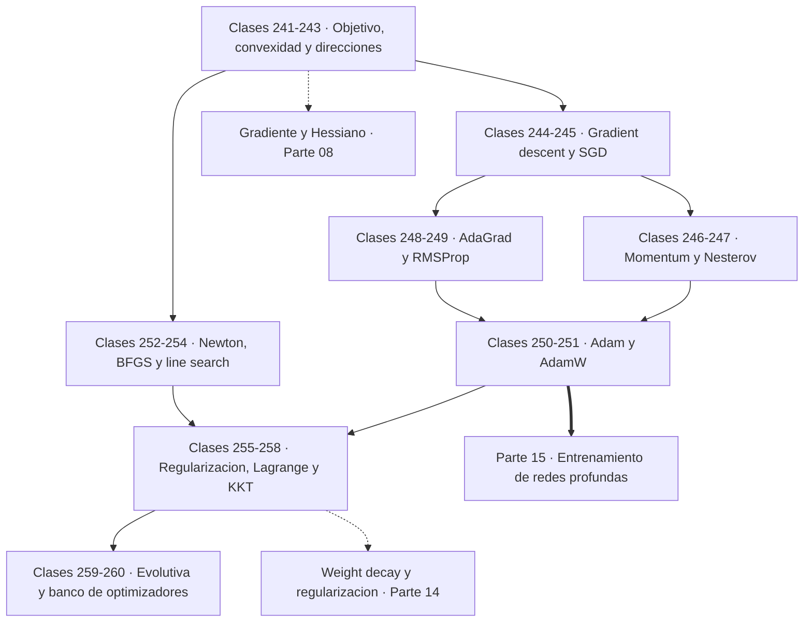

# ⚙️ Parte 12 — Optimización matemática y computacional

> [⬅️ Parte 11 — Métodos numéricos y computación científica](../part-11-metodos-numericos-y-computacion-cientifica/README.md) · [🏠 Programa](../../README.md) · [📇 Catálogo](../README.md) · [Parte 13 — Teoría de la información, señales y series ➡️](../part-13-teoria-de-la-informacion-senales-y-series/README.md)

**Nivel:** `avanzado` · **Clases:** 20 · **Horas estimadas:** 80 · **Motor:** [`part12.py`](../../src/computational_math/engines/part12.py)

---

## 🎯 De qué trata esta parte

Función objetivo, convexidad, descenso de gradiente y su familia completa de optimizadores, métodos de segundo orden, restricciones, KKT y optimización evolutiva.

Entrenar un modelo es resolver un problema de optimización. No es una analogía: es
literalmente lo que ocurre. Se define una función objetivo que mide el error, se calcula su
gradiente y se desciende. Todo lo demás —arquitecturas, regularización, planificación del
learning rate— son decisiones sobre ese problema. Esta parte trata la optimización como lo
que es: el motor de la inteligencia artificial moderna.

Las clases 241 a 243 fijan el vocabulario y el concepto que decide la dificultad del
problema. En un problema **convexo** todo mínimo local es global, y eso convierte la
optimización en una tarea con garantías. Fuera de la convexidad no hay ninguna: las redes
neuronales son masivamente no convexas y aun así se entrenan bien, un hecho que la teoría
todavía no explica del todo. Lo que sí se puede afirmar es que cualquier dirección con
`dᵀ∇f < 0` hace descender la función, y que el gradiente negativo es la más empinada
localmente, pero no siempre la mejor globalmente.

Las clases 244 a 251 recorren la familia completa de optimizadores de primer orden, en el
orden histórico en que se resolvieron sus problemas. Descenso de gradiente y su tensión con
el learning rate: demasiado pequeño no avanza, demasiado grande diverge, y el umbral es
`2/L` con `L` el mayor autovalor del Hessiano. SGD cambia exactitud por coste. Momentum
amortigua la oscilación en valles estrechos. Nesterov mira adelante antes de decidir.
AdaGrad adapta el paso por coordenada, pero su acumulador solo crece y el aprendizaje acaba
apagándose; RMSProp lo arregla con olvido exponencial; Adam combina ambos momentos con
corrección de sesgo; y AdamW corrige un error sutil de Adam que tardó años en detectarse:
el weight decay debe aplicarse **desacoplado** del gradiente adaptativo, no sumado a él.

Las clases 252 a 254 suben a segundo orden. Newton usa la curvatura y converge en un solo
paso en problemas cuadráticos, pero invertir el Hessiano cuesta `O(n³)` y es impensable con
millones de parámetros. BFGS aproxima el Hessiano inverso usando solo gradientes, y la
búsqueda de línea con la condición de Armijo elimina la necesidad de fijar el paso a mano.

Las clases 255 a 258 tratan las restricciones. Regularizar es **cambiar el objetivo**, no
añadir un truco: sumar `λ‖w‖²` es tan parte del problema como el término de error. Los
multiplicadores de Lagrange manejan igualdades, las condiciones KKT los generalizan a
desigualdades, y la holgura complementaria formaliza la intuición de que una restricción
inactiva no influye en la solución.

El cierre incorpora lo que no usa gradiente —optimización evolutiva sobre funciones
multimodales— y un banco comparativo con presupuesto idéntico. Ese capstone deja una lección
incómoda y verdadera: **el mismo learning rate que funciona en una cuadrática hace divergir
en Rosenbrock**, y comparar optimizadores sin fijar semilla, punto inicial y presupuesto de
iteraciones no compara nada.

## 🗺️ Mapa conceptual



## 🧠 Ideas centrales

- En un problema convexo todo mínimo local es global; fuera de él no hay garantía.
- El learning rate es el hiperparámetro que más veces explica una divergencia.
- Momentum promedia gradientes; Adam además normaliza por su escala.
- Regularizar es añadir un término al objetivo, no un truco de implementación.
- KKT generaliza Lagrange a restricciones de desigualdad.

## 🤖 Por qué importa en IA

> [!IMPORTANT]
> AdamW es el optimizador por defecto del entrenamiento moderno; entender su actualización explica el weight decay, el warmup y el gradient clipping.

## ⚠️ Errores frecuentes de esta parte

- Comparar optimizadores sin fijar semilla ni presupuesto de iteraciones.
- Aplicar weight decay dentro del gradiente en Adam (y no como AdamW).
- Declarar convergencia por número de épocas y no por criterio numérico.

## 🧭 Secuencia de la parte


## 📚 Las clases

| # | Clase | Demostración | Idea central |
|---|---|---|---|
| `241` | [Problemas de optimización y función objetivo](241-problemas-de-optimizacion-y-funcion-objetivo/README.md) | `objective_function` | Un problema de optimización se define por variables, objetivo, sentido y restricciones. |
| `242` | [Convexidad](242-convexidad/README.md) | `convexity` | La convexidad es la frontera entre optimizar con garantías y optimizar con esperanza. |
| `243` | [Gradiente y direcciones de descenso](243-gradiente-y-direcciones-de-descenso/README.md) | `descent_directions` | El gradiente negativo es la dirección más empinada, pero no la única que sirve. |
| `244` | [Gradient descent](244-gradient-descent/README.md) | `gradient_descent` | El learning rate tiene un umbral duro: por encima de 2/L el descenso diverge. |
| `245` | [Stochastic gradient descent](245-stochastic-gradient-descent/README.md) | `sgd` | SGD cambia exactitud del gradiente por número de actualizaciones, y suele salir ganando. |
| `246` | [Momentum](246-momentum/README.md) | `momentum` | Momentum promedia gradientes: el zigzag se cancela y la componente útil se acumula. |
| `247` | [Nesterov accelerated gradient](247-nesterov-accelerated-gradient/README.md) | `nesterov` | Nesterov calcula el gradiente donde va a estar, no donde está. |
| `248` | [AdaGrad](248-adagrad/README.md) | `adagrad` | AdaGrad da pasos grandes a coordenadas poco vistas, pero su acumulador nunca olvida. |
| `249` | [RMSProp](249-rmsprop/README.md) | `rmsprop` | RMSProp sustituye la suma de AdaGrad por una media móvil, y el paso deja de apagarse. |
| `250` | [Adam](250-adam/README.md) | `adam` | Adam combina momentum y escalado adaptativo, y corrige el sesgo del arranque. |
| `251` | [AdamW](251-adamw/README.md) | `adamw` | En Adam, sumar L2 al gradiente no es lo mismo que decaer el peso: AdamW los separa. |
| `252` | [Método de Newton](252-metodo-de-newton/README.md) | `newton_method` | Newton resuelve una cuadrática en un solo paso, y por eso no escala. |
| `253` | [Quasi-Newton y BFGS](253-quasi-newton-y-bfgs/README.md) | `quasi_newton` | BFGS construye una aproximación del Hessiano inverso usando solo gradientes. |
| `254` | [Line search](254-line-search/README.md) | `line_search` | Armijo pide una reducción proporcional a lo que el gradiente prometía, no cualquier reducción. |
| `255` | [Regularización como optimización](255-regularizacion-como-optimizacion/README.md) | `regularization_as_optimization` | Regularizar es cambiar la función objetivo, no modificar el algoritmo. |
| `256` | [Restricciones y Lagrangianos](256-restricciones-y-lagrangianos/README.md) | `constraints_lagrangian` | El multiplicador de Lagrange mide cuánto vale relajar la restricción una unidad. |
| `257` | [Condiciones KKT](257-condiciones-kkt/README.md) | `kkt_conditions` | La holgura complementaria formaliza que una restricción inactiva no influye. |
| `258` | [Optimización cuadrática](258-optimizacion-cuadratica/README.md) | `quadratic_programming` | Un programa cuadrático con Q definida positiva se resuelve por un solo sistema lineal. |
| `259` | [Optimización evolutiva](259-optimizacion-evolutiva/README.md) | `evolutionary_optimization` | Sin gradiente y sobre funciones con muchos mínimos, una población busca mejor que un punto. |
| `260` | [Capstone: banco de optimizadores comparables](260-capstone-banco-de-optimizadores-comparables/README.md) | `capstone_optimizer_bench` | El mismo learning rate que converge en una cuadrática diverge en Rosenbrock. |

## 📖 Glosario de la parte (33 términos)

Definiciones precisas en [`GLOSARIO.md`](GLOSARIO.md).

## 🧰 Stack de referencia

`math`, `numpy (opcional)`, `cvxpy (opcional)`

Los laboratorios se ejecutan con biblioteca estándar; estas herramientas aparecen
como contraste profesional, no como requisito.

## 🧪 Ejecutar toda la parte

```bash
compmath run --part 12
compmath catalog --part 12
```

## 📊 Evaluación de la parte

| Componente | Peso |
|---|---:|
| Clases y ejercicios | 40 % |
| Laboratorios y notebooks | 25 % |
| Explicación oral o escrita | 15 % |
| Capstone ([260](260-capstone-banco-de-optimizadores-comparables/README.md)) | 20 % |

## 📖 Bibliografía

Obras de referencia de la parte:

- Boyd, S.; Vandenberghe, L. *Convex Optimization*. Cambridge, 2004.
- Nocedal, J.; Wright, S. *Numerical Optimization*. 2ª ed., Springer, 2006.
- Loshchilov, I.; Hutter, F. *Decoupled Weight Decay Regularization*. ICLR, 2019.

Las 20 clases de esta parte citan 23 obras distintas. Cuál sostiene cada clase, y por qué, en [`docs/BIBLIOGRAPHY.md`](../../docs/BIBLIOGRAPHY.md#parte-12-optimizacion-matematica-y-computacional).

---

> [⬅️ Parte 11 — Métodos numéricos y computación científica](../part-11-metodos-numericos-y-computacion-cientifica/README.md) · [🏠 Programa](../../README.md) · [📇 Catálogo](../README.md) · [Parte 13 — Teoría de la información, señales y series ➡️](../part-13-teoria-de-la-informacion-senales-y-series/README.md)
