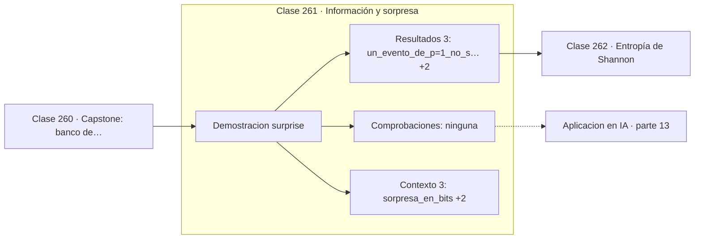

# 261 — Información y sorpresa

> [⬅️ 260 Capstone: banco de optimizadores comparables](../../part-12-optimizacion-matematica-y-computacional/260-capstone-banco-de-optimizadores-comparables/README.md) · [📚 Parte 13](../README.md) · [🏠 Programa](../../../README.md) · [262 Entropía de Shannon ➡️](../262-entropia-de-shannon/README.md)

**Parte:** 13 — Teoría de la información, señales y series · **Nivel:** `avanzado` · **Horas estimadas:** 4
**Motor:** `engines.part13` · **Demostración:** `surprise` · **Clase 1 de 20** de la parte

---

## 🎯 Propósito

**La información de un evento es su sorpresa, y el logaritmo la hace aditiva.**

Entropía, entropía cruzada, divergencias, información mutua, codificación, muestreo, convolución, Fourier, FFT, filtros y series temporales.

## ✅ Resultados de aprendizaje

Al terminar podrás:

1. Explicar **Información y sorpresa** con lenguaje cotidiano y con notación matemática.
2. Resolver un caso pequeño a mano y anticipar el orden de magnitud del resultado.
3. Ejecutar y modificar `lab.py`, que corre la demostración `surprise`.
4. Interpretar las 6 salidas del laboratorio y decir qué comprueba cada una.
5. Detectar el error típico de esta parte: calcular log(0) sin epsilon de estabilidad.

## 🧩 Fórmulas de la clase

```text
I(x) = −log₂ p(x)   en bits
p = 1  ⟹  I = 0;   p → 0  ⟹  I → ∞
eventos independientes: I(x,y) = I(x) + I(y)
```

## 🗺️ Ubicación en el programa



## 📖 Fundamentos

Antes de definir entropía hay que definir cuánta información aporta un solo evento. La
respuesta de Shannon es que la información es **sorpresa**: enterarse de algo que ya se
daba por seguro no aporta nada, y enterarse de algo improbable aporta mucho.

La función que cumple eso es `−log p`. Vale cero cuando `p = 1` y tiende a infinito cuando
`p` tiende a cero, con la forma correcta. Y no es una elección arbitraria: es la **única**
función continua que satisface la propiedad de aditividad, salvo un factor de escala.

La **aditividad** es la exigencia clave. Si dos eventos son independientes, la información
de observar ambos debe ser la suma de las informaciones individuales. Como las
probabilidades se multiplican y los logaritmos convierten productos en sumas, el logaritmo
es la única vía. Es la misma razón por la que se trabaja con log-verosimilitud.

La **base** del logaritmo fija la unidad. Con base 2 la información se mide en **bits**, y
un bit es exactamente la información de un lanzamiento de moneda justa. Con logaritmo
natural se mide en **nats**, y es lo habitual en aprendizaje automático porque su derivada
es más limpia. Comparar entropías calculadas en bases distintas sin convertir es un error
frecuente: el factor es 1,4427.

## 🧮 Ejemplo trabajado

Sorpresa de cuatro eventos con probabilidades muy distintas.

```text
evento          p          I = −log₂ p
casi seguro    0,99          0,0145 bits
frecuente      0,50          1,0000 bits
raro           0,01          6,6439 bits
rarísimo       0,001         9,9658 bits

Un evento de p = 1 aporta exactamente 0 bits.

Aditividad: dos lanzamientos independientes de moneda
  I(cara, cara) = −log₂(0,25) = 2,0 bits
  I(cara) + I(cara) = 1,0 + 1,0 = 2,0 bits            ✓

Conversión de unidades:
  1 nat = 1,4427 bits        1 bit = 0,6931 nats
```

## 🔬 Qué ejecuta el laboratorio

`surprise` — La sorpresa de un evento es -log de su probabilidad.

| Grupo | Salidas |
|---|---|
| 🔢 Resultados numéricos (3) | `un_evento_de_p=1_no_sorprende`, `aditiva_para_independientes`, `suma_de_sorpresas` |
| ✅ Comprobaciones de invariante (0) | — |

Las claves booleanas no son adorno: si alguna fuera `False`, el resultado numérico
no sería fiable aunque el programa terminase sin error.

```bash
python classes/part-13-teoria-de-la-informacion-senales-y-series/261-informacion-y-sorpresa/lab.py
compmath run 261
```

> [!TIP]
> Antes de ejecutar, **escribe tu predicción**. Un laboratorio que confirma lo que
> esperabas enseña tanto como uno que te contradice, pero solo si la predicción
> existía antes del resultado.

## ⚠️ Errores conceptuales frecuentes

1. Comparar informaciones calculadas en bases logarítmicas distintas.
2. Calcular −log p con p = 0 sin epsilon de estabilidad.
3. Confundir información con utilidad o relevancia del evento.

## 🚀 Dónde se usa de verdad

Diseño de códigos, medida de sorpresa de un modelo ante datos nuevos, detección de
anomalías y cuantificación de la incertidumbre de una predicción.

## 🤖 Conexión con IA

La función de pérdida de casi todo clasificador es entropía cruzada; el VAE optimiza un ELBO con un término KL; las CNN son convoluciones aprendidas.

## 📓 Notebooks

| Archivo | Para qué |
|---|---|
| [`notebook.ipynb`](notebook.ipynb) | recorrido guiado con la demostración ejecutada |
| [`notebook_student.ipynb`](notebook_student.ipynb) | versión con `TODO` para resolver |
| [`notebook_solution.ipynb`](notebook_solution.ipynb) | solución de referencia verificada |

## 📝 Evaluación

| Criterio | Peso |
|---|---:|
| Comprensión conceptual | 25 % |
| Resolución manual | 25 % |
| Implementación y verificación | 25 % |
| Interpretación y comunicación | 15 % |
| Conexión con aplicación real | 10 % |

Detalle y criterios de error crítico en [`assessment.md`](assessment.md).

## ❓ Preguntas de comprobación

1. ¿Cuál es la entrada, cuál la salida y qué unidades tienen?
2. ¿Qué operación domina el comportamiento del resultado?
3. ¿Qué caso extremo revelaría un error conceptual?
4. ¿Cómo verificarías el resultado por un método independiente?
5. ¿Dónde aparece esto en compresión?

Si necesitas releer el código para responderlas, la clase todavía no está superada.

## 📥 Entregable

`notebook_student.ipynb` resuelto más un párrafo que explique el resultado **sin citar
código**: qué entra, qué sale, qué invariante se comprueba y qué pasaría en un caso límite.

## 📚 Bibliografía de la clase

Esta clase enseña **Teoría de la información · Procesamiento de señales · Series temporales**. Cada obra dice qué aporta aquí y cómo se comprobó su localizador:

- [Shannon, C. *A Mathematical Theory of Communication*, Bell System Technical Journal, 1948](https://doi.org/10.1002/j.1538-7305.1948.tb01338.x) — Teoría de la información: el tema de esta clase · DOI `10.1002/j.1538-7305.1948.tb01338.x` verificado en Crossref (2026-08-19).
- [MacKay, D. *Information Theory, Inference, and Learning Algorithms*, Cambridge, 2003](https://www.inference.org.uk/mackay/itila/) — Teoría de la información: el tema de esta clase · URL de la fuente primaria comprobada en www.inference.org.uk (2026-08-19).

Bibliografía de todas las clases, con el porqué de cada obra, en [`docs/BIBLIOGRAPHY.md`](../../../docs/BIBLIOGRAPHY.md) · localizador y estado de cada obra en [`sources/bibliography.json`](../../../sources/bibliography.json).

## 📂 Material de la clase

[`intuition.md`](intuition.md) · [`theory.md`](theory.md) · [`derivation.md`](derivation.md) · [`exercises.md`](exercises.md) · [`assessment.md`](assessment.md) · [`where-is-this-used.md`](where-is-this-used.md) · [`lesson.yaml`](lesson.yaml)

---

> [⬅️ 260 Capstone: banco de optimizadores comparables](../../part-12-optimizacion-matematica-y-computacional/260-capstone-banco-de-optimizadores-comparables/README.md) · [📚 Parte 13](../README.md) · [🏠 Programa](../../../README.md) · [262 Entropía de Shannon ➡️](../262-entropia-de-shannon/README.md)
