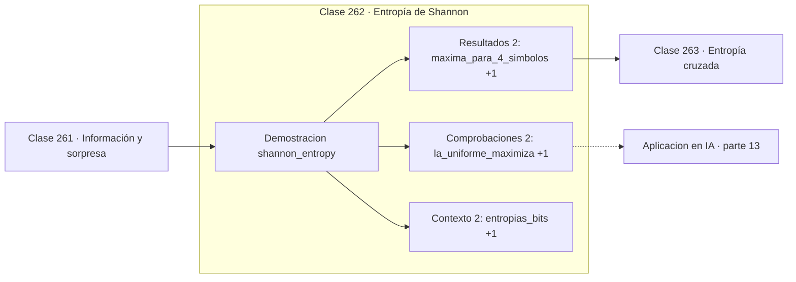

# 262 — Entropía de Shannon

> [⬅️ 261 Información y sorpresa](../261-informacion-y-sorpresa/README.md) · [📚 Parte 13](../README.md) · [🏠 Programa](../../../README.md) · [263 Entropía cruzada ➡️](../263-entropia-cruzada/README.md)

**Parte:** 13 — Teoría de la información, señales y series · **Nivel:** `avanzado` · **Horas estimadas:** 4
**Motor:** `engines.part13` · **Demostración:** `shannon_entropy` · **Clase 2 de 20** de la parte

---

## 🎯 Propósito

**La entropía es el número mínimo de bits por símbolo que cualquier compresor puede lograr.**

Entropía, entropía cruzada, divergencias, información mutua, codificación, muestreo, convolución, Fourier, FFT, filtros y series temporales.

## ✅ Resultados de aprendizaje

Al terminar podrás:

1. Explicar **Entropía de Shannon** con lenguaje cotidiano y con notación matemática.
2. Resolver un caso pequeño a mano y anticipar el orden de magnitud del resultado.
3. Ejecutar y modificar `lab.py`, que corre la demostración `shannon_entropy`.
4. Interpretar las 6 salidas del laboratorio y decir qué comprueba cada una.
5. Detectar el error típico de esta parte: comparar entropías calculadas en bases logarítmicas distintas.

## 🧩 Fórmulas de la clase

```text
H(p) = −Σ p(x)·log₂ p(x)
0 ≤ H(p) ≤ log₂ n
H = 0 si es determinista;  H = log₂ n si es uniforme
```

## 🗺️ Ubicación en el programa



## 📖 Fundamentos

La entropía es la sorpresa **esperada**: la media de `−log p` ponderada por las propias
probabilidades. Mide la incertidumbre media de una fuente antes de observar su salida, y
es el concepto central de toda la teoría.

Su interpretación operativa es la que le da fuerza. El **teorema de codificación de
fuente** de Shannon dice que ningún código sin pérdida puede usar menos de `H` bits por
símbolo en promedio, y que existen códigos que se acercan arbitrariamente a ese límite. No
es una cota heurística: es una imposibilidad demostrada.

Los dos extremos son informativos. Una fuente **determinista** tiene entropía cero: no hace
falta transmitir nada porque el receptor ya sabe qué viene. Una fuente **uniforme** sobre
`n` símbolos tiene entropía `log₂ n`, la máxima posible: no hay estructura que explotar y
no se puede comprimir por debajo de la codificación de longitud fija.

Toda compresión vive entre esos extremos, y explota que las distribuciones reales no son
uniformes. En aprendizaje automático la entropía aparece además como medida de
incertidumbre de una predicción: una salida softmax casi uniforme tiene entropía alta y el
modelo está dudando, lo que sirve como señal para aprendizaje activo o para rechazar la
predicción.

## 🧮 Ejemplo trabajado

Entropía de cuatro distribuciones sobre el mismo alfabeto.

```text
distribución                        H (bits)
uniforme sobre 4 símbolos            2,0000    ← máxima
sesgada [0,7 ; 0,15 ; 0,1 ; 0,05]    1,2568
moneda justa (2 símbolos)            1,0000
determinista                         0,0000    ← mínima

Máximo teórico para 4 símbolos: log₂ 4 = 2,0     ✓

La misma uniforme en nats: ln 4 = 1,3863 nats
Conversión: 1,3863 × 1,4427 = 2,0 bits           ✓

Lectura: la fuente sesgada necesita 1,26 bits por símbolo
en el mejor código posible, frente a los 2 de la uniforme.
```

## 🔬 Qué ejecuta el laboratorio

`shannon_entropy` — La entropía es la sorpresa esperada y el límite de compresión.

| Grupo | Salidas |
|---|---|
| 🔢 Resultados numéricos (2) | `maxima_para_4_simbolos`, `entropia_en_nats_uniforme` |
| ✅ Comprobaciones de invariante (2) | `la_uniforme_maximiza`, `la_determinista_es_0` |

Las claves booleanas no son adorno: si alguna fuera `False`, el resultado numérico
no sería fiable aunque el programa terminase sin error.

```bash
python classes/part-13-teoria-de-la-informacion-senales-y-series/262-entropia-de-shannon/lab.py
compmath run 262
```

> [!TIP]
> Antes de ejecutar, **escribe tu predicción**. Un laboratorio que confirma lo que
> esperabas enseña tanto como uno que te contradice, pero solo si la predicción
> existía antes del resultado.

## ⚠️ Errores conceptuales frecuentes

1. Interpretar la entropía como cantidad de datos y no como bits por símbolo.
2. Comparar entropías de alfabetos de tamaños distintos sin normalizar.
3. Olvidar que el límite de Shannon supone símbolos independientes.

## 🚀 Dónde se usa de verdad

Compresión de datos, medida de incertidumbre en predicciones, criterio de división en
árboles de decisión y aprendizaje activo.

## 🤖 Conexión con IA

La función de pérdida de casi todo clasificador es entropía cruzada; el VAE optimiza un ELBO con un término KL; las CNN son convoluciones aprendidas.

## 📓 Notebooks

| Archivo | Para qué |
|---|---|
| [`notebook.ipynb`](notebook.ipynb) | recorrido guiado con la demostración ejecutada |
| [`notebook_student.ipynb`](notebook_student.ipynb) | versión con `TODO` para resolver |
| [`notebook_solution.ipynb`](notebook_solution.ipynb) | solución de referencia verificada |

## 📝 Evaluación

| Criterio | Peso |
|---|---:|
| Comprensión conceptual | 25 % |
| Resolución manual | 25 % |
| Implementación y verificación | 25 % |
| Interpretación y comunicación | 15 % |
| Conexión con aplicación real | 10 % |

Detalle y criterios de error crítico en [`assessment.md`](assessment.md).

## ❓ Preguntas de comprobación

1. ¿Cuál es la entrada, cuál la salida y qué unidades tienen?
2. ¿Qué operación domina el comportamiento del resultado?
3. ¿Qué caso extremo revelaría un error conceptual?
4. ¿Cómo verificarías el resultado por un método independiente?
5. ¿Dónde aparece esto en compresión?

Si necesitas releer el código para responderlas, la clase todavía no está superada.

## 📥 Entregable

`notebook_student.ipynb` resuelto más un párrafo que explique el resultado **sin citar
código**: qué entra, qué sale, qué invariante se comprueba y qué pasaría en un caso límite.

## 🔗 Referencias

- [Cover, T.; Thomas, J. *Elements of Information Theory*, 2ª ed., Wiley, 2006, cap. 2](https://doi.org/10.1002/047174882X) — *uso:* artículo de origen consultado en «Entropía de Shannon».
- [Shannon, C. *A Mathematical Theory of Communication*, 1948](https://doi.org/10.1002/j.1538-7305.1948.tb01338.x) — *uso:* artículo de origen consultado en «Entropía de Shannon».

Bibliografía completa de la parte en [`../../../docs/BIBLIOGRAPHY.md`](../../../docs/BIBLIOGRAPHY.md) · localizador verificable de cada obra en [`sources/bibliography.json`](../../../sources/bibliography.json).

## 📂 Material de la clase

[`intuition.md`](intuition.md) · [`theory.md`](theory.md) · [`derivation.md`](derivation.md) · [`exercises.md`](exercises.md) · [`assessment.md`](assessment.md) · [`where-is-this-used.md`](where-is-this-used.md) · [`lesson.yaml`](lesson.yaml)

---

> [⬅️ 261 Información y sorpresa](../261-informacion-y-sorpresa/README.md) · [📚 Parte 13](../README.md) · [🏠 Programa](../../../README.md) · [263 Entropía cruzada ➡️](../263-entropia-cruzada/README.md)
