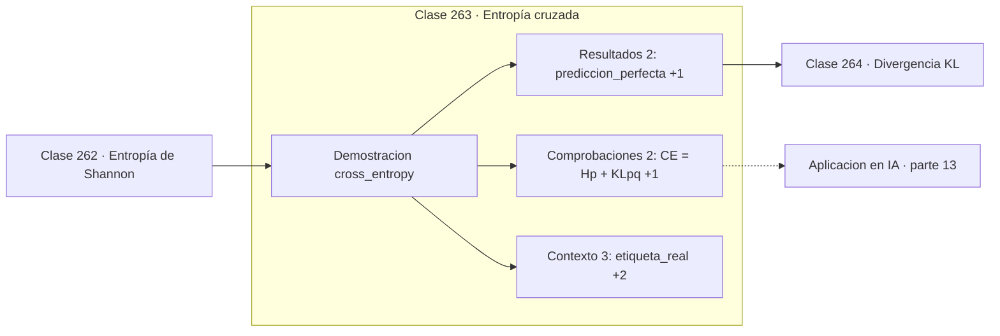

# 263 — Entropía cruzada

> [⬅️ 262 Entropía de Shannon](../262-entropia-de-shannon/README.md) · [📚 Parte 13](../README.md) · [🏠 Programa](../../../README.md) · [264 Divergencia KL ➡️](../264-divergencia-kl/README.md)

**Parte:** 13 — Teoría de la información, señales y series · **Nivel:** `avanzado` · **Horas estimadas:** 4
**Motor:** `engines.part13` · **Demostración:** `cross_entropy` · **Clase 3 de 20** de la parte

---

## 🎯 Propósito

**Minimizar entropía cruzada es exactamente maximizar la verosimilitud.**

Entropía, entropía cruzada, divergencias, información mutua, codificación, muestreo, convolución, Fourier, FFT, filtros y series temporales.

## ✅ Resultados de aprendizaje

Al terminar podrás:

1. Explicar **Entropía cruzada** con lenguaje cotidiano y con notación matemática.
2. Resolver un caso pequeño a mano y anticipar el orden de magnitud del resultado.
3. Ejecutar y modificar `lab.py`, que corre la demostración `cross_entropy`.
4. Interpretar las 7 salidas del laboratorio y decir qué comprueba cada una.
5. Detectar el error típico de esta parte: muestrear por debajo de nyquist y culpar al modelo del ruido resultante.

## 🧩 Fórmulas de la clase

```text
H(p,q) = −Σ p(x)·log q(x)
H(p,q) = H(p) + KL(p‖q) ≥ H(p)
con p one-hot: H(p,q) = −log q(clase correcta)
```

## 🗺️ Ubicación en el programa



## 📖 Fundamentos

La entropía cruzada mide el coste medio de codificar mensajes que vienen de `p` usando un
código diseñado para `q`. Si `q = p` el coste es el óptimo `H(p)`; si `q` se aleja, el
coste sube. Nunca puede bajar del óptimo, y esa desigualdad es la que garantiza que
minimizarla lleve en la dirección correcta.

Su descomposición `H(p,q) = H(p) + KL(p‖q)` es la clave para entender qué se está
optimizando. La entropía `H(p)` es una propiedad de los datos y no depende del modelo, así
que **minimizar entropía cruzada es minimizar la divergencia KL** entre la distribución
real y la predicha. Son el mismo problema.

En clasificación, la distribución real es one-hot —toda la masa en la clase correcta— y la
fórmula colapsa a `−log q(clase correcta)`. La pérdida solo depende de la probabilidad
asignada a la respuesta correcta, y crece sin límite cuando esa probabilidad tiende a cero.
De ahí que un modelo muy seguro y equivocado reciba un castigo enorme.

La consecuencia teórica es que la pérdida de casi todo clasificador **no se elige**: se
deduce. Suponer un modelo categórico y maximizar verosimilitud da entropía cruzada; suponer
ruido gaussiano da error cuadrático medio. Y la consecuencia práctica es el epsilon: sin él
un `log(0)` produce infinito y destruye el entrenamiento en un paso.

## 🧮 Ejemplo trabajado

Pérdida de tres predicciones ante la misma etiqueta real.

```text
etiqueta real: [1, 0, 0]        H(p) = 0

predicción              pérdida
[0,90 ; 0,05 ; 0,05]    0,105361     muy buena
[0,50 ; 0,30 ; 0,20]    0,693147     mediocre
[0,05 ; 0,60 ; 0,35]    2,995732     mala y segura

predicción perfecta [1,0,0]: pérdida = 0,0

Como H(p) = 0, aquí la entropía cruzada ES la KL.

Sin epsilon:
  predicción 0,0 para la clase correcta → log(0) = −∞
  el gradiente se vuelve NaN y el entrenamiento muere.
```

## 🔬 Qué ejecuta el laboratorio

`cross_entropy` — Entropía cruzada: el coste de codificar p con un código para q.

| Grupo | Salidas |
|---|---|
| 🔢 Resultados numéricos (2) | `prediccion_perfecta`, `H(p)` |
| ✅ Comprobaciones de invariante (2) | `CE = H(p) + KL(p||q)`, `es_la_perdida_de_todo_clasificador` |

Las claves booleanas no son adorno: si alguna fuera `False`, el resultado numérico
no sería fiable aunque el programa terminase sin error.

```bash
python classes/part-13-teoria-de-la-informacion-senales-y-series/263-entropia-cruzada/lab.py
compmath run 263
```

> [!TIP]
> Antes de ejecutar, **escribe tu predicción**. Un laboratorio que confirma lo que
> esperabas enseña tanto como uno que te contradice, pero solo si la predicción
> existía antes del resultado.

## ⚠️ Errores conceptuales frecuentes

1. Calcular log(0) sin epsilon de estabilidad.
2. Aplicar entropía cruzada a salidas que no suman 1.
3. Duplicar el softmax cuando la función de pérdida ya lo incluye.

## 🚀 Dónde se usa de verdad

Pérdida de clasificación en cualquier red, modelos de lenguaje, calibración de
probabilidades y evaluación de modelos probabilísticos.

## 🤖 Conexión con IA

La función de pérdida de casi todo clasificador es entropía cruzada; el VAE optimiza un ELBO con un término KL; las CNN son convoluciones aprendidas.

## 📓 Notebooks

| Archivo | Para qué |
|---|---|
| [`notebook.ipynb`](notebook.ipynb) | recorrido guiado con la demostración ejecutada |
| [`notebook_student.ipynb`](notebook_student.ipynb) | versión con `TODO` para resolver |
| [`notebook_solution.ipynb`](notebook_solution.ipynb) | solución de referencia verificada |

## 📝 Evaluación

| Criterio | Peso |
|---|---:|
| Comprensión conceptual | 25 % |
| Resolución manual | 25 % |
| Implementación y verificación | 25 % |
| Interpretación y comunicación | 15 % |
| Conexión con aplicación real | 10 % |

Detalle y criterios de error crítico en [`assessment.md`](assessment.md).

## ❓ Preguntas de comprobación

1. ¿Cuál es la entrada, cuál la salida y qué unidades tienen?
2. ¿Qué operación domina el comportamiento del resultado?
3. ¿Qué caso extremo revelaría un error conceptual?
4. ¿Cómo verificarías el resultado por un método independiente?
5. ¿Dónde aparece esto en compresión?

Si necesitas releer el código para responderlas, la clase todavía no está superada.

## 📥 Entregable

`notebook_student.ipynb` resuelto más un párrafo que explique el resultado **sin citar
código**: qué entra, qué sale, qué invariante se comprueba y qué pasaría en un caso límite.

## 📚 Bibliografía de la clase

Esta clase enseña **Teoría de la información · Procesamiento de señales · Series temporales**. Cada obra dice qué aporta aquí y cómo se comprobó su localizador:

- [Goodfellow, I.; Bengio, Y.; Courville, A. *Deep Learning*, MIT Press, 2016, cap. 3](https://www.deeplearningbook.org/) — Deep learning y Machine learning: conexión declarada de esta parte · ISBN-13 `9780262337373` verificado en International ISBN Agency (2026-08-19).
- [Cover, T.; Thomas, J. *Elements of Information Theory*, 2ª ed., Wiley, 2006](https://doi.org/10.1002/047174882X) — Teoría de la información: el tema de esta clase · DOI `10.1002/047174882x` verificado en Crossref (2026-08-19).

Bibliografía de todas las clases, con el porqué de cada obra, en [`docs/BIBLIOGRAPHY.md`](../../../docs/BIBLIOGRAPHY.md) · localizador y estado de cada obra en [`sources/bibliography.json`](../../../sources/bibliography.json).

## 📂 Material de la clase

[`intuition.md`](intuition.md) · [`theory.md`](theory.md) · [`derivation.md`](derivation.md) · [`exercises.md`](exercises.md) · [`assessment.md`](assessment.md) · [`where-is-this-used.md`](where-is-this-used.md) · [`lesson.yaml`](lesson.yaml)

---

> [⬅️ 262 Entropía de Shannon](../262-entropia-de-shannon/README.md) · [📚 Parte 13](../README.md) · [🏠 Programa](../../../README.md) · [264 Divergencia KL ➡️](../264-divergencia-kl/README.md)
