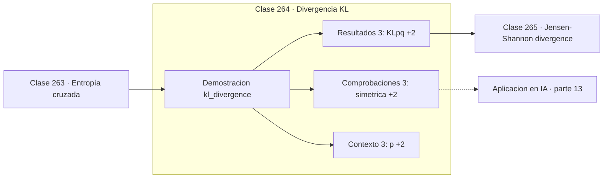

# 264 — Divergencia KL

> [⬅️ 263 Entropía cruzada](../263-entropia-cruzada/README.md) · [📚 Parte 13](../README.md) · [🏠 Programa](../../../README.md) · [265 Jensen-Shannon divergence ➡️](../265-jensen-shannon-divergence/README.md)

**Parte:** 13 — Teoría de la información, señales y series · **Nivel:** `avanzado` · **Horas estimadas:** 4
**Motor:** `engines.part13` · **Demostración:** `kl_divergence` · **Clase 4 de 20** de la parte

---

## 🎯 Propósito

**KL no es simétrica, y cada dirección castiga un error distinto.**

Entropía, entropía cruzada, divergencias, información mutua, codificación, muestreo, convolución, Fourier, FFT, filtros y series temporales.

## ✅ Resultados de aprendizaje

Al terminar podrás:

1. Explicar **Divergencia KL** con lenguaje cotidiano y con notación matemática.
2. Resolver un caso pequeño a mano y anticipar el orden de magnitud del resultado.
3. Ejecutar y modificar `lab.py`, que corre la demostración `kl_divergence`.
4. Interpretar las 9 salidas del laboratorio y decir qué comprueba cada una.
5. Detectar el error típico de esta parte: calcular log(0) sin epsilon de estabilidad.

## 🧩 Fórmulas de la clase

```text
KL(p‖q) = Σ p·log(p/q) ≥ 0
KL(p‖q) = 0 ⟺ p = q
KL(p‖q) ≠ KL(q‖p);  no cumple la desigualdad triangular
```

## 🗺️ Ubicación en el programa



## 📖 Fundamentos

La divergencia de Kullback-Leibler mide cuánta información se pierde al usar `q` en lugar
de `p`. Es el exceso de entropía cruzada sobre la entropía: los bits desperdiciados por
usar el código equivocado. Es no negativa y vale cero solo si las distribuciones coinciden.

Pese a llamarse divergencia y comportarse en parte como una distancia, **no lo es**. Le
fallan dos propiedades: no es simétrica y no cumple la desigualdad triangular. Escribir
«la distancia KL» es un error de vocabulario que arrastra errores de razonamiento.

La asimetría no es un defecto: es información. `KL(p‖q)` penaliza mucho que `q` asigne casi
cero donde `p` tiene masa, así que fuerza a `q` a **cubrir** todo el soporte de `p`. Al
revés, `KL(q‖p)` penaliza que `q` ponga masa donde `p` no la tiene, y produce soluciones
que se **concentran** en un modo. Se conocen como comportamiento de cobertura y de
búsqueda de modo.

Esa diferencia tiene consecuencias visibles. La inferencia variacional minimiza
`KL(q‖p)` y por eso los VAE tienden a producir muestras borrosas concentradas en el modo
dominante. Elegir la dirección de la KL no es un detalle técnico: determina el
comportamiento cualitativo del modelo resultante.

## 🧮 Ejemplo trabajado

Las dos direcciones sobre las mismas distribuciones.

```text
p = [0,5 ; 0,3 ; 0,2]
q = [0,3 ; 0,4 ; 0,3]

KL(p‖q) = 0,08801517
KL(q‖p) = 0,08346467

No coinciden → no es simétrica                       ✓
KL(p‖p) = 0,0                                        ✓

Asimetría extrema: si q asignara 0,001 donde p tiene 0,5,
  KL(p‖q) se dispara      (castiga no cubrir)
  KL(q‖p) apenas cambia   (no le importa)

Por eso KL(p‖q) fuerza cobertura y KL(q‖p) busca modo.
```

## 🔬 Qué ejecuta el laboratorio

`kl_divergence` — KL: no simétrica y no es una distancia.

| Grupo | Salidas |
|---|---|
| 🔢 Resultados numéricos (3) | `KL(p||q)`, `KL(q||p)`, `KL(p||p)` |
| ✅ Comprobaciones de invariante (3) | `simetrica`, `siempre_no_negativa`, `no_cumple_desigualdad_triangular` |

Las claves booleanas no son adorno: si alguna fuera `False`, el resultado numérico
no sería fiable aunque el programa terminase sin error.

```bash
python classes/part-13-teoria-de-la-informacion-senales-y-series/264-divergencia-kl/lab.py
compmath run 264
```

> [!TIP]
> Antes de ejecutar, **escribe tu predicción**. Un laboratorio que confirma lo que
> esperabas enseña tanto como uno que te contradice, pero solo si la predicción
> existía antes del resultado.

## ⚠️ Errores conceptuales frecuentes

1. Llamarla distancia y aplicarle propiedades métricas.
2. Elegir la dirección de la KL sin pensar en qué error se quiere penalizar.
3. Calcularla con q nula en algún punto donde p es positiva.

## 🚀 Dónde se usa de verdad

Regularización de VAE, inferencia variacional, destilación de conocimiento, detección de
desplazamiento de distribución y PPO en aprendizaje por refuerzo.

## 🤖 Conexión con IA

La función de pérdida de casi todo clasificador es entropía cruzada; el VAE optimiza un ELBO con un término KL; las CNN son convoluciones aprendidas.

## 📓 Notebooks

| Archivo | Para qué |
|---|---|
| [`notebook.ipynb`](notebook.ipynb) | recorrido guiado con la demostración ejecutada |
| [`notebook_student.ipynb`](notebook_student.ipynb) | versión con `TODO` para resolver |
| [`notebook_solution.ipynb`](notebook_solution.ipynb) | solución de referencia verificada |

## 📝 Evaluación

| Criterio | Peso |
|---|---:|
| Comprensión conceptual | 25 % |
| Resolución manual | 25 % |
| Implementación y verificación | 25 % |
| Interpretación y comunicación | 15 % |
| Conexión con aplicación real | 10 % |

Detalle y criterios de error crítico en [`assessment.md`](assessment.md).

## ❓ Preguntas de comprobación

1. ¿Cuál es la entrada, cuál la salida y qué unidades tienen?
2. ¿Qué operación domina el comportamiento del resultado?
3. ¿Qué caso extremo revelaría un error conceptual?
4. ¿Cómo verificarías el resultado por un método independiente?
5. ¿Dónde aparece esto en compresión?

Si necesitas releer el código para responderlas, la clase todavía no está superada.

## 📥 Entregable

`notebook_student.ipynb` resuelto más un párrafo que explique el resultado **sin citar
código**: qué entra, qué sale, qué invariante se comprueba y qué pasaría en un caso límite.

## 🔗 Referencias

- [Kullback, S.; Leibler, R. *On information and sufficiency*, Annals of Mathematical Statistics, 1951](https://doi.org/10.1214/aoms/1177729694) — *uso:* artículo de origen consultado en «Divergencia KL».
- [MacKay, D. *Information Theory, Inference, and Learning Algorithms*, Cambridge, 2003](https://www.inference.org.uk/mackay/itila/) — *uso:* obra de referencia consultada en «Divergencia KL».

Bibliografía completa de la parte en [`../../../docs/BIBLIOGRAPHY.md`](../../../docs/BIBLIOGRAPHY.md) · localizador verificable de cada obra en [`sources/bibliography.json`](../../../sources/bibliography.json).

## 📂 Material de la clase

[`intuition.md`](intuition.md) · [`theory.md`](theory.md) · [`derivation.md`](derivation.md) · [`exercises.md`](exercises.md) · [`assessment.md`](assessment.md) · [`where-is-this-used.md`](where-is-this-used.md) · [`lesson.yaml`](lesson.yaml)

---

> [⬅️ 263 Entropía cruzada](../263-entropia-cruzada/README.md) · [📚 Parte 13](../README.md) · [🏠 Programa](../../../README.md) · [265 Jensen-Shannon divergence ➡️](../265-jensen-shannon-divergence/README.md)
