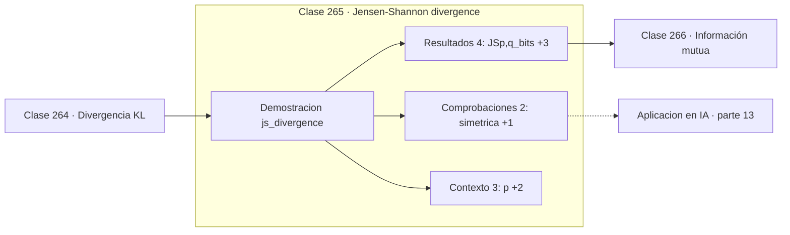

# 265 — Jensen-Shannon divergence

> [⬅️ 264 Divergencia KL](../264-divergencia-kl/README.md) · [📚 Parte 13](../README.md) · [🏠 Programa](../../../README.md) · [266 Información mutua ➡️](../266-informacion-mutua/README.md)

**Parte:** 13 — Teoría de la información, señales y series · **Nivel:** `avanzado` · **Horas estimadas:** 4
**Motor:** `engines.part13` · **Demostración:** `js_divergence` · **Clase 5 de 20** de la parte

---

## 🎯 Propósito

**Jensen-Shannon simetriza la KL midiendo ambas contra la mezcla.**

Entropía, entropía cruzada, divergencias, información mutua, codificación, muestreo, convolución, Fourier, FFT, filtros y series temporales.

## ✅ Resultados de aprendizaje

Al terminar podrás:

1. Explicar **Jensen-Shannon divergence** con lenguaje cotidiano y con notación matemática.
2. Resolver un caso pequeño a mano y anticipar el orden de magnitud del resultado.
3. Ejecutar y modificar `lab.py`, que corre la demostración `js_divergence`.
4. Interpretar las 9 salidas del laboratorio y decir qué comprueba cada una.
5. Detectar el error típico de esta parte: comparar entropías calculadas en bases logarítmicas distintas.

## 🧩 Fórmulas de la clase

```text
M = (p + q)/2
JS(p,q) = ½·KL(p‖M) + ½·KL(q‖M)
0 ≤ JS ≤ 1 bit;  √JS es una métrica
```

## 🗺️ Ubicación en el programa



## 📖 Fundamentos

La divergencia de Jensen-Shannon arregla los dos defectos de la KL con una idea simple:
construir la mezcla de ambas distribuciones y medir la divergencia de cada una a esa
mezcla, promediando. El resultado es simétrico por construcción.

Además está **acotada**: nunca supera 1 bit, sea cual sea el par de distribuciones. La KL
puede ser infinita cuando `q` asigna cero donde `p` no lo hace; JS no tiene ese problema
porque la mezcla siempre cubre el soporte de ambas. Eso la hace numéricamente mucho más
estable como medida de comparación.

Y su raíz cuadrada **sí es una métrica**: cumple simetría, desigualdad triangular y se
anula solo en la identidad. Eso permite usarla como distancia genuina para agrupar,
indexar o comparar distribuciones, cosa que con KL no es legítima.

Su papel histórico en aprendizaje automático es notable: el artículo original de las GAN
demostró que el discriminador óptimo hace que el generador minimice la divergencia JS
entre la distribución real y la generada. Que esa divergencia sature cuando los soportes no
se solapan es parte de la explicación de la inestabilidad de las GAN, y la razón de que
WGAN cambiara a la distancia de Wasserstein.

## 🧮 Ejemplo trabajado

JS sobre el mismo par que la clase anterior.

```text
p = [0,5 ; 0,3 ; 0,2]
q = [0,3 ; 0,4 ; 0,3]

mezcla M = [0,4 ; 0,35 ; 0,25]

JS(p,q) = 0,0306589 bits
JS(q,p) = 0,0306589 bits
simétrica                                            ✓

Comparación con KL:
  KL(p‖q) = 0,0880      KL(q‖p) = 0,0835
  JS      = 0,0307      menor y única

Cota: JS ≤ 1 bit siempre.
Para distribuciones con soportes disjuntos, JS = 1 exacto,
mientras que KL sería infinita.
```

## 🔬 Qué ejecuta el laboratorio

`js_divergence` — Jensen-Shannon: simétrica y acotada.

| Grupo | Salidas |
|---|---|
| 🔢 Resultados numéricos (4) | `JS(p,q)_bits`, `JS(q,p)_bits`, `distribuciones_disjuntas`, `cota_superior_en_bits` |
| ✅ Comprobaciones de invariante (2) | `simetrica`, `sqrt(JS)_es_una_metrica` |

Las claves booleanas no son adorno: si alguna fuera `False`, el resultado numérico
no sería fiable aunque el programa terminase sin error.

```bash
python classes/part-13-teoria-de-la-informacion-senales-y-series/265-jensen-shannon-divergence/lab.py
compmath run 265
```

> [!TIP]
> Antes de ejecutar, **escribe tu predicción**. Un laboratorio que confirma lo que
> esperabas enseña tanto como uno que te contradice, pero solo si la predicción
> existía antes del resultado.

## ⚠️ Errores conceptuales frecuentes

1. Usar JS donde la asimetría de KL era justamente lo que se quería.
2. Confundir JS con su raíz cuadrada al hablar de métrica.
3. Olvidar que JS satura cuando los soportes no se solapan.

## 🚀 Dónde se usa de verdad

Análisis de GAN, comparación de distribuciones de datos, agrupamiento de documentos y
medida de similitud entre modelos.

## 🤖 Conexión con IA

La función de pérdida de casi todo clasificador es entropía cruzada; el VAE optimiza un ELBO con un término KL; las CNN son convoluciones aprendidas.

## 📓 Notebooks

| Archivo | Para qué |
|---|---|
| [`notebook.ipynb`](notebook.ipynb) | recorrido guiado con la demostración ejecutada |
| [`notebook_student.ipynb`](notebook_student.ipynb) | versión con `TODO` para resolver |
| [`notebook_solution.ipynb`](notebook_solution.ipynb) | solución de referencia verificada |

## 📝 Evaluación

| Criterio | Peso |
|---|---:|
| Comprensión conceptual | 25 % |
| Resolución manual | 25 % |
| Implementación y verificación | 25 % |
| Interpretación y comunicación | 15 % |
| Conexión con aplicación real | 10 % |

Detalle y criterios de error crítico en [`assessment.md`](assessment.md).

## ❓ Preguntas de comprobación

1. ¿Cuál es la entrada, cuál la salida y qué unidades tienen?
2. ¿Qué operación domina el comportamiento del resultado?
3. ¿Qué caso extremo revelaría un error conceptual?
4. ¿Cómo verificarías el resultado por un método independiente?
5. ¿Dónde aparece esto en compresión?

Si necesitas releer el código para responderlas, la clase todavía no está superada.

## 📥 Entregable

`notebook_student.ipynb` resuelto más un párrafo que explique el resultado **sin citar
código**: qué entra, qué sale, qué invariante se comprueba y qué pasaría en un caso límite.

## 🔗 Referencias

- [Lin, J. *Divergence measures based on the Shannon entropy*, IEEE Trans. Information Theory, 1991](https://doi.org/10.1109/18.61115) — *uso:* artículo de origen consultado en «Jensen-Shannon divergence».
- [Goodfellow, I. et al. *Generative Adversarial Networks*, NeurIPS, 2014](https://arxiv.org/abs/1406.2661) — *uso:* artículo de origen consultado en «Jensen-Shannon divergence».

Bibliografía completa de la parte en [`../../../docs/BIBLIOGRAPHY.md`](../../../docs/BIBLIOGRAPHY.md) · localizador verificable de cada obra en [`sources/bibliography.json`](../../../sources/bibliography.json).

## 📂 Material de la clase

[`intuition.md`](intuition.md) · [`theory.md`](theory.md) · [`derivation.md`](derivation.md) · [`exercises.md`](exercises.md) · [`assessment.md`](assessment.md) · [`where-is-this-used.md`](where-is-this-used.md) · [`lesson.yaml`](lesson.yaml)

---

> [⬅️ 264 Divergencia KL](../264-divergencia-kl/README.md) · [📚 Parte 13](../README.md) · [🏠 Programa](../../../README.md) · [266 Información mutua ➡️](../266-informacion-mutua/README.md)
