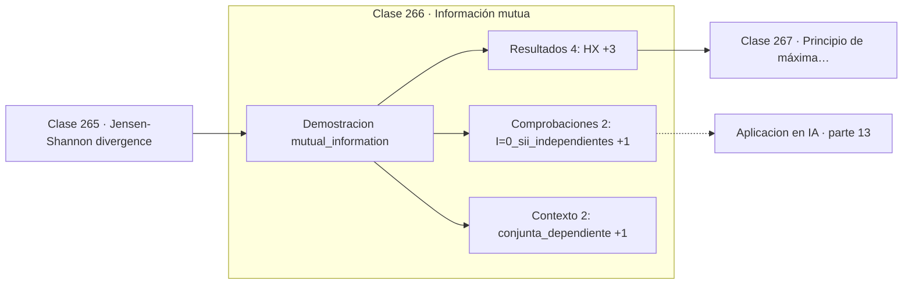

# 266 — Información mutua

> [⬅️ 265 Jensen-Shannon divergence](../265-jensen-shannon-divergence/README.md) · [📚 Parte 13](../README.md) · [🏠 Programa](../../../README.md) · [267 Principio de máxima entropía ➡️](../267-principio-de-maxima-entropia/README.md)

**Parte:** 13 — Teoría de la información, señales y series · **Nivel:** `avanzado` · **Horas estimadas:** 4
**Motor:** `engines.part13` · **Demostración:** `mutual_information` · **Clase 6 de 20** de la parte

---

## 🎯 Propósito

**La información mutua vale cero solo si hay independencia, y detecta lo que la correlación no ve.**

Entropía, entropía cruzada, divergencias, información mutua, codificación, muestreo, convolución, Fourier, FFT, filtros y series temporales.

## ✅ Resultados de aprendizaje

Al terminar podrás:

1. Explicar **Información mutua** con lenguaje cotidiano y con notación matemática.
2. Resolver un caso pequeño a mano y anticipar el orden de magnitud del resultado.
3. Ejecutar y modificar `lab.py`, que corre la demostración `mutual_information`.
4. Interpretar las 8 salidas del laboratorio y decir qué comprueba cada una.
5. Detectar el error típico de esta parte: muestrear por debajo de nyquist y culpar al modelo del ruido resultante.

## 🧩 Fórmulas de la clase

```text
I(X;Y) = H(X) − H(X|Y) = H(Y) − H(Y|X)
I(X;Y) = KL(p(x,y) ‖ p(x)·p(y))
I(X;Y) = 0  ⟺  X ⫫ Y
```

## 🗺️ Ubicación en el programa



## 📖 Fundamentos

La información mutua mide cuánto se reduce la incertidumbre sobre una variable al conocer
la otra. Es simétrica —saber `Y` informa sobre `X` tanto como al revés— y se expresa como
la diferencia entre la entropía y la entropía condicional.

Su lectura más profunda es la tercera fórmula: es la **divergencia KL entre la
distribución conjunta y el producto de las marginales**. Como la KL vale cero solo si las
distribuciones coinciden, y coincidir con el producto de marginales es la definición de
independencia, la información mutua es **cero si y solo si las variables son
independientes**.

Esa equivalencia es lo que la hace superior a la correlación como medida de dependencia. La
correlación de la clase 191 solo detecta relaciones lineales, y vale cero para una
dependencia cuadrática perfecta. La información mutua detecta **cualquier** dependencia,
lineal o no, monótona o no.

El precio es la estimación. Con variables discretas y datos suficientes se calcula
directamente contando; con variables continuas hay que estimar densidades, y eso es difícil
en dimensión alta. Los estimadores neuronales como MINE son un área activa, precisamente
porque la información mutua aparece en el objetivo del aprendizaje autosupervisado
contrastivo.

## 🧮 Ejemplo trabajado

Dos conjuntas con las mismas marginales y dependencia distinta.

```text
Caso dependiente:
  p(0,0)=0,4   p(0,1)=0,1
  p(1,0)=0,1   p(1,1)=0,4

  H(X) = 1,0 bits      H(Y) = 1,0 bits
  I(X;Y) = 0,278072 bits

Caso independiente (mismas marginales):
  p(x,y) = p(x)·p(y) = 0,25 en las cuatro celdas
  I(X;Y) = 0,0                                       ✓

Ventaja sobre la correlación:
  con Y = X² y X simétrica, corr = 0 pero I > 0.
  La información mutua ve la dependencia; la correlación no.
```

## 🔬 Qué ejecuta el laboratorio

`mutual_information` — Información mutua: cuánto reduce Y la incertidumbre de X.

| Grupo | Salidas |
|---|---|
| 🔢 Resultados numéricos (4) | `H(X)`, `H(Y)`, `I(X;Y)`, `I_en_el_caso_independiente` |
| ✅ Comprobaciones de invariante (2) | `I=0_sii_independientes`, `I(X;Y)=H(X)-H(X|Y)` |

Las claves booleanas no son adorno: si alguna fuera `False`, el resultado numérico
no sería fiable aunque el programa terminase sin error.

```bash
python classes/part-13-teoria-de-la-informacion-senales-y-series/266-informacion-mutua/lab.py
compmath run 266
```

> [!TIP]
> Antes de ejecutar, **escribe tu predicción**. Un laboratorio que confirma lo que
> esperabas enseña tanto como uno que te contradice, pero solo si la predicción
> existía antes del resultado.

## ⚠️ Errores conceptuales frecuentes

1. Estimarla en variables continuas sin cuidar la discretización.
2. Interpretarla como medida de causalidad.
3. Compararla entre problemas con alfabetos de tamaños distintos sin normalizar.

## 🚀 Dónde se usa de verdad

Selección de características, aprendizaje autosupervisado contrastivo, análisis del cuello
de botella de información y registro de imágenes médicas.

## 🤖 Conexión con IA

La función de pérdida de casi todo clasificador es entropía cruzada; el VAE optimiza un ELBO con un término KL; las CNN son convoluciones aprendidas.

## 📓 Notebooks

| Archivo | Para qué |
|---|---|
| [`notebook.ipynb`](notebook.ipynb) | recorrido guiado con la demostración ejecutada |
| [`notebook_student.ipynb`](notebook_student.ipynb) | versión con `TODO` para resolver |
| [`notebook_solution.ipynb`](notebook_solution.ipynb) | solución de referencia verificada |

## 📝 Evaluación

| Criterio | Peso |
|---|---:|
| Comprensión conceptual | 25 % |
| Resolución manual | 25 % |
| Implementación y verificación | 25 % |
| Interpretación y comunicación | 15 % |
| Conexión con aplicación real | 10 % |

Detalle y criterios de error crítico en [`assessment.md`](assessment.md).

## ❓ Preguntas de comprobación

1. ¿Cuál es la entrada, cuál la salida y qué unidades tienen?
2. ¿Qué operación domina el comportamiento del resultado?
3. ¿Qué caso extremo revelaría un error conceptual?
4. ¿Cómo verificarías el resultado por un método independiente?
5. ¿Dónde aparece esto en compresión?

Si necesitas releer el código para responderlas, la clase todavía no está superada.

## 📥 Entregable

`notebook_student.ipynb` resuelto más un párrafo que explique el resultado **sin citar
código**: qué entra, qué sale, qué invariante se comprueba y qué pasaría en un caso límite.

## 🔗 Referencias

- [Cover, T.; Thomas, J. *Elements of Information Theory*, 2ª ed., Wiley, 2006, cap. 2](https://doi.org/10.1002/047174882X) — *uso:* artículo de origen consultado en «Información mutua».
- [Belghazi, M. et al. *MINE: Mutual Information Neural Estimation*, ICML, 2018](https://arxiv.org/abs/1801.04062) — *uso:* artículo de origen consultado en «Información mutua».

Bibliografía completa de la parte en [`../../../docs/BIBLIOGRAPHY.md`](../../../docs/BIBLIOGRAPHY.md) · localizador verificable de cada obra en [`sources/bibliography.json`](../../../sources/bibliography.json).

## 📂 Material de la clase

[`intuition.md`](intuition.md) · [`theory.md`](theory.md) · [`derivation.md`](derivation.md) · [`exercises.md`](exercises.md) · [`assessment.md`](assessment.md) · [`where-is-this-used.md`](where-is-this-used.md) · [`lesson.yaml`](lesson.yaml)

---

> [⬅️ 265 Jensen-Shannon divergence](../265-jensen-shannon-divergence/README.md) · [📚 Parte 13](../README.md) · [🏠 Programa](../../../README.md) · [267 Principio de máxima entropía ➡️](../267-principio-de-maxima-entropia/README.md)
