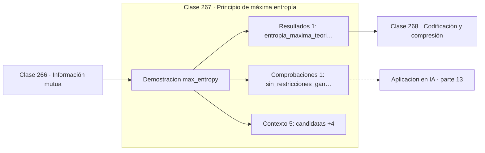

# 267 — Principio de máxima entropía

> [⬅️ 266 Información mutua](../266-informacion-mutua/README.md) · [📚 Parte 13](../README.md) · [🏠 Programa](../../../README.md) · [268 Codificación y compresión ➡️](../268-codificacion-y-compresion/README.md)

**Parte:** 13 — Teoría de la información, señales y series · **Nivel:** `avanzado` · **Horas estimadas:** 4
**Motor:** `engines.part13` · **Demostración:** `max_entropy` · **Clase 7 de 20** de la parte

---

## 🎯 Propósito

**Entre todas las distribuciones compatibles con lo que se sabe, elegir la que menos añade.**

Entropía, entropía cruzada, divergencias, información mutua, codificación, muestreo, convolución, Fourier, FFT, filtros y series temporales.

## ✅ Resultados de aprendizaje

Al terminar podrás:

1. Explicar **Principio de máxima entropía** con lenguaje cotidiano y con notación matemática.
2. Resolver un caso pequeño a mano y anticipar el orden de magnitud del resultado.
3. Ejecutar y modificar `lab.py`, que corre la demostración `max_entropy`.
4. Interpretar las 7 salidas del laboratorio y decir qué comprueba cada una.
5. Detectar el error típico de esta parte: calcular log(0) sin epsilon de estabilidad.

## 🧩 Fórmulas de la clase

```text
maximizar H(p) sujeto a las restricciones conocidas
sin restricciones ⟹ uniforme
media y varianza fijadas ⟹ normal
```

## 🗺️ Ubicación en el programa



## 📖 Fundamentos

El principio de máxima entropía responde a una pregunta de modelado: si solo se conocen
algunas propiedades de una distribución, ¿cuál elegir entre todas las compatibles? La
respuesta es la de **máxima entropía**, porque es la que menos supuestos añade a lo que
realmente se sabe.

Cualquier otra elección introduce estructura que los datos no respaldan. Elegir una
distribución de entropía menor equivale a afirmar que se sabe más de lo que se sabe, y esa
información inventada puede sesgar todas las conclusiones posteriores. Es el principio de
honestidad epistémica traducido a matemáticas.

Las soluciones bajo distintas restricciones son notablemente reconocibles, y no por
casualidad. Sin restricciones sale la **uniforme**. Fijando media y varianza sale la
**normal**. Fijando solo la media en el semieje positivo sale la **exponencial**. Las
distribuciones «naturales» de la estadística son las de máxima entropía bajo las
restricciones más simples.

El resultado más relevante para la inteligencia artificial es que la distribución de máxima
entropía sujeta a restricciones lineales tiene forma exponencial, y de ahí sale
**softmax**. La capa de salida de todo clasificador es la distribución de máxima entropía
compatible con los logits. Softmax no es una normalización conveniente: es la respuesta a
un problema de optimización con restricciones.

## 🧮 Ejemplo trabajado

Tres distribuciones sobre un dado y sus entropías.

```text
candidata               H (bits)     media
uniforme                 2,584963     3,5
sesgada al 6             2,160964     4,5
casi determinista        0,xxx        1,3

Máximo teórico para 6 símbolos: log₂ 6 = 2,584963      ✓

Sin restricciones, gana la uniforme.

Si se supiera que la media es 4,5, la uniforme dejaría de
ser admisible y la de máxima entropía sería una exponencial
truncada, no la sesgada arbitraria.

Con media y varianza fijadas sobre la recta real:
  la distribución de máxima entropía es la normal.
```

## 🔬 Qué ejecuta el laboratorio

`max_entropy` — Principio de máxima entropía: la distribución menos comprometida.

| Grupo | Salidas |
|---|---|
| 🔢 Resultados numéricos (1) | `entropia_maxima_teorica` |
| ✅ Comprobaciones de invariante (1) | `sin_restricciones_gana_la_uniforme` |

Las claves booleanas no son adorno: si alguna fuera `False`, el resultado numérico
no sería fiable aunque el programa terminase sin error.

```bash
python classes/part-13-teoria-de-la-informacion-senales-y-series/267-principio-de-maxima-entropia/lab.py
compmath run 267
```

> [!TIP]
> Antes de ejecutar, **escribe tu predicción**. Un laboratorio que confirma lo que
> esperabas enseña tanto como uno que te contradice, pero solo si la predicción
> existía antes del resultado.

## ⚠️ Errores conceptuales frecuentes

1. Elegir una distribución cómoda en vez de la de máxima entropía compatible.
2. Imponer restricciones que los datos no respaldan.
3. Confundir máxima entropía con ausencia total de supuestos.

## 🚀 Dónde se usa de verdad

Justificación de softmax, modelos de máxima entropía en procesamiento de lenguaje,
elección de priores no informativos y física estadística.

## 🤖 Conexión con IA

La función de pérdida de casi todo clasificador es entropía cruzada; el VAE optimiza un ELBO con un término KL; las CNN son convoluciones aprendidas.

## 📓 Notebooks

| Archivo | Para qué |
|---|---|
| [`notebook.ipynb`](notebook.ipynb) | recorrido guiado con la demostración ejecutada |
| [`notebook_student.ipynb`](notebook_student.ipynb) | versión con `TODO` para resolver |
| [`notebook_solution.ipynb`](notebook_solution.ipynb) | solución de referencia verificada |

## 📝 Evaluación

| Criterio | Peso |
|---|---:|
| Comprensión conceptual | 25 % |
| Resolución manual | 25 % |
| Implementación y verificación | 25 % |
| Interpretación y comunicación | 15 % |
| Conexión con aplicación real | 10 % |

Detalle y criterios de error crítico en [`assessment.md`](assessment.md).

## ❓ Preguntas de comprobación

1. ¿Cuál es la entrada, cuál la salida y qué unidades tienen?
2. ¿Qué operación domina el comportamiento del resultado?
3. ¿Qué caso extremo revelaría un error conceptual?
4. ¿Cómo verificarías el resultado por un método independiente?
5. ¿Dónde aparece esto en compresión?

Si necesitas releer el código para responderlas, la clase todavía no está superada.

## 📥 Entregable

`notebook_student.ipynb` resuelto más un párrafo que explique el resultado **sin citar
código**: qué entra, qué sale, qué invariante se comprueba y qué pasaría en un caso límite.

## 🔗 Referencias

- [Jaynes, E. T. *Information theory and statistical mechanics*, Physical Review, 1957](https://doi.org/10.1103/PhysRev.106.620) — *uso:* artículo de origen consultado en «Principio de máxima entropía».
- [Cover, T.; Thomas, J. *Elements of Information Theory*, 2ª ed., Wiley, 2006, cap. 12](https://doi.org/10.1002/047174882X) — *uso:* artículo de origen consultado en «Principio de máxima entropía».

Bibliografía completa de la parte en [`../../../docs/BIBLIOGRAPHY.md`](../../../docs/BIBLIOGRAPHY.md) · localizador verificable de cada obra en [`sources/bibliography.json`](../../../sources/bibliography.json).

## 📂 Material de la clase

[`intuition.md`](intuition.md) · [`theory.md`](theory.md) · [`derivation.md`](derivation.md) · [`exercises.md`](exercises.md) · [`assessment.md`](assessment.md) · [`where-is-this-used.md`](where-is-this-used.md) · [`lesson.yaml`](lesson.yaml)

---

> [⬅️ 266 Información mutua](../266-informacion-mutua/README.md) · [📚 Parte 13](../README.md) · [🏠 Programa](../../../README.md) · [268 Codificación y compresión ➡️](../268-codificacion-y-compresion/README.md)
